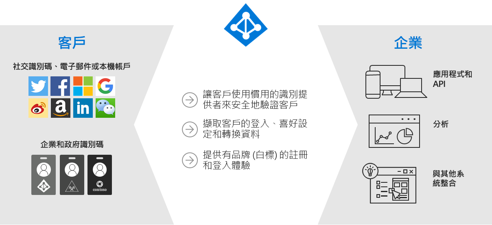
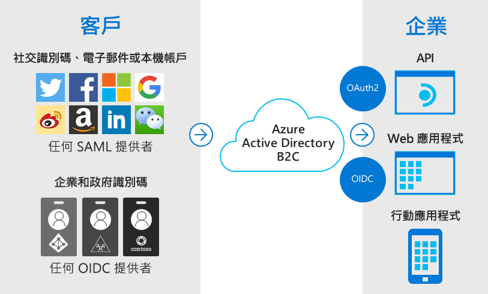
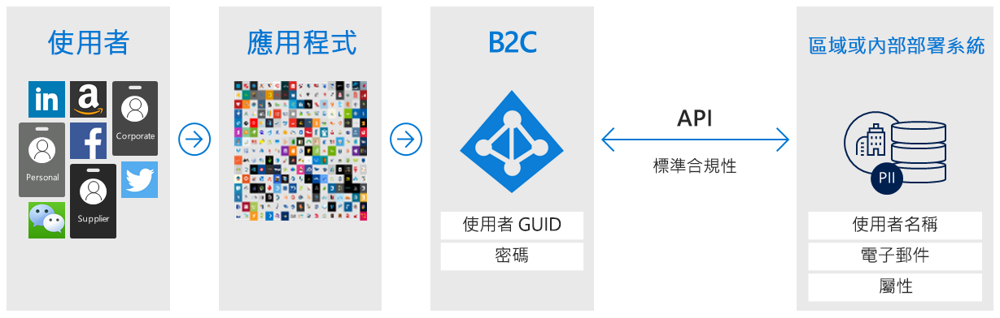
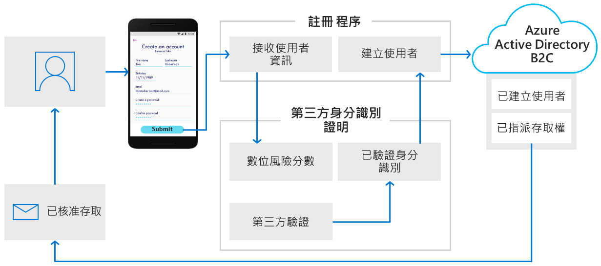
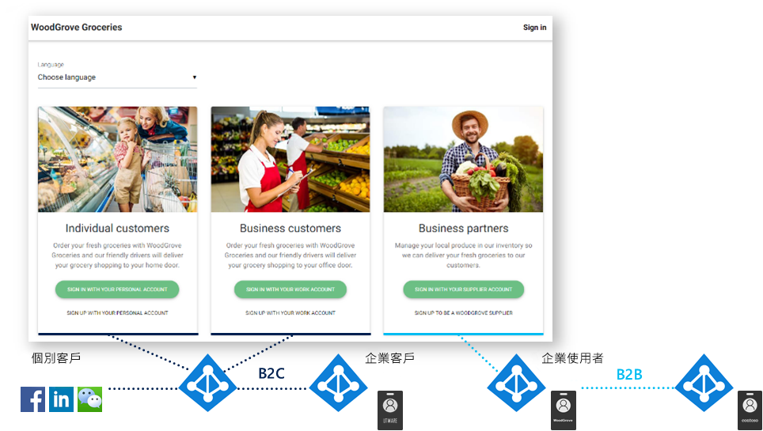

# 什麼是 Azure Active Directory B2C？

Azure Active Directory B2C 提供企業對客戶身分識別即服務。 您的客戶會使用其慣用的社交、企業或本機帳戶身分識別來取得應用程式和 API 的單一登入存取權。

Azure Active Directory B2C (Azure AD B2C) 是一種客戶身分識別存取管理 (CIAM) 解決方案，每天能夠支援數百萬名使用者和數十億次驗證。 它會負責驗證平台的規模調整和安全性，以及監控和自動處理威脅 (例如拒絕服務、密碼噴濺或暴力密碼破解攻擊)。

## 自訂品牌的身分識別解決方案

Azure AD B2C 是一種白標驗證解決方案。 您可以使用自己的品牌自訂整個使用者體驗，使其與您的 Web 和行動應用程式順暢地融合。

當使用者註冊、登入及修改其設定檔資訊時，自訂 Azure AD B2C 所顯示的每個頁面。 在使用者旅程圖中自訂 HTML、CSS 和 JavaScript，讓 Azure AD B2C 的外觀和操作體驗像是應用程式的原生部分。

## 以使用者提供的身分識別存取單一登入

Azure AD B2C 使用標準型驗證通訊協定，包括 OpenID Connect、OAuth 2.0 和 SAML。 它會與大多數現代化應用程式和商業現成軟體整合。

Azure AD B2C 可充當 Web 應用程式、行動應用程式和 API 的中央驗證授權單位，讓您為上述項目建置單一登入 (SSO) 解決方案。 集中收集使用者設定檔和喜好設定資訊，並擷取有關登入行為和註冊轉換的詳細分析。

## 與外部使用者存放區整合

Azure AD B2C 提供一個目錄，可為每個使用者保存 100 個自訂屬性。 不過，您也可以與外部系統整合。 例如，使用 Azure AD B2C 進行驗證，但將其委派給外部客戶關係管理 (CRM) 或客戶忠誠度資料庫，作為客戶資料的真實來源。

另一個外部使用者存放區案例是讓 Azure AD B2C 處理應用程式的驗證，但與儲存使用者設定檔或個人資料的外部系統整合。 例如，滿足資料落地需求，例如區域或內部部署資料儲存原則。

Azure AD B2C 可以在註冊或設定檔編輯期間，協助向使用者收集資訊，然後將該資料交給外部系統。 接著，在未來驗證期間，Azure AD B2C 可從外部系統擷取資料，並視需要將其包含在它傳送至您應用程式的驗證權杖回應中。

## 漸進式分析

另一個使用者旅程圖選項包含漸進式分析。 漸進式分析可讓客戶藉由收集最少量的資訊，快速完成其第一筆交易。 然後，在未來登入時，向客戶逐漸收集更多設定檔資料。

## 第三方身分識別驗證和證明

使用 Azure AD B2C 收集使用者資料，然後將其傳遞至第三方系統，以執行驗證、信任評分及核准建立使用者帳戶，進而促進身分識別驗證和證明。

這些只是您可將 Azure AD B2C 當作企業對客戶身分識別平台來執行的一些作業。 本概觀的下列各節將逐步引導您使用 Azure AD B2C 的示範應用程式。 您也可以直接移至更深入的 [Azure AD B2C 技術概觀](technical-overview.md)。

## 範例：WoodGrove Groceries

[WoodGrove Groceries][woodgrove] 是 Microsoft 所建立的即時 Web 應用程式，可示範數個 Azure AD B2C 功能。 接下來的幾節會回顧 Azure AD B2C 提供給 WoodGrove 網站的一些驗證選項。

### 商務概觀

WoodGrove 是一家線上雜貨店，專門銷售雜貨給個人消費者和企業客戶。 他們的企業客戶會代表其公司或他們所管理的企業購買雜貨。

### 登入選項

WoodGrove Groceries 會根據其客戶與商店之間的關係，提供數個登入選項：

* **個人**客戶可使用個人帳戶進行註冊或登入，例如使用社交識別提供者或電子郵件地址和密碼。
* **企業**客戶可以使用其企業認證進行註冊或登入。
* **合作夥伴**和供應商是將要銷售的產品提供給雜貨店的個人。 合作夥伴身分識別是由 [Azure Active Directory B2B](../active-directory/b2b/what-is-b2b.md) 提供。

### 驗證個人客戶

當客戶選取 [使用個人帳戶登入]  時，系統會將他們重新導向至 Azure AD B2C 所主控的自訂登入頁面。 您可在下圖中看到我們已自訂使用者介面 (UI)，其外觀和操作方式就像是 WoodGrove Groceries 網站。 WoodGrove 的客戶應該不知道驗證體驗是由 Azure AD B2C 所主控和保護。

WoodGrove 可讓客戶使用其 Google、Facebook 或 Microsoft 帳戶作為其身分識別提供者來註冊和登入。 或者，他們也可以使用其電子郵件地址和密碼來註冊，以建立所謂的「本機帳戶」  。

當客戶選取 [使用個人帳戶註冊]  ，然後選取 [立即註冊]  時，他們會看到自訂註冊頁面。

輸入電子郵件地址並選取 [傳送驗證碼]  之後，Azure AD B2C 就會將驗證碼傳送給他們。 輸入驗證碼後，選取 [驗證碼]  ，然後在表單上輸入其他資訊，還必須同意服務條款。

按一下 [建立]  按鈕會導致 Azure AD B2C 將使用者重新導向回到 WoodGrove Groceries 網站。 當它重新導向時，Azure AD B2C 會將 OpenID Connect 驗證權杖傳遞至 WoodGrove Web 應用程式。 使用者現在已登入並準備好開始，其顯示名稱會顯示在右上角以表示他們已登入。

### 驗證企業客戶

當客戶選取 [企業客戶]  下的其中一個選項時，WoodGrove Groceries 網站會叫用不同於個人客戶所用的 Azure AD B2C 原則。

此原則會向使用者顯示可使用其公司認證進行註冊和登入的選項。 在 WoodGrove 範例中，系統會提示使用者使用任何 Office 365 或 Azure AD 帳戶進行登入。 此原則會使用[多租用戶 Azure AD 應用程式](../active-directory/develop/howto-convert-app-to-be-multi-tenant.md)和 `/common` Azure AD 端點，讓 Azure AD B2C 與世界各地的任何 Office 365 客戶同盟。

### 驗證合作夥伴

[使用供應商帳戶登入]  連結會使用 Azure Active Directory B2B 的共同作業功能。 Azure AD B2B 是 Azure Active Directory 中用來管理合作夥伴身分識別的一系列功能。 這些身分識別可從 Azure Active Directory 同盟，以便存取受 Azure AD B2C 保護的應用程式。

在[什麼是 Azure Active Directory B2B 中的來賓使用者存取權？](../active-directory/b2b/what-is-b2b.md)中深入了解 Azure AD B2B。

<!-- UNCOMMENT WHEN REPO IS UPDATED WITH LATEST DEMO CODE
### Sample code

If you'd like to jump right into the code to see how the WoodGrove Groceries application is built, you can find the repository on GitHub:

[Azure-Samples/active-directory-external-identities-woodgrove-demo][woodgrove-repo] (GitHub)
-->

## 後續步驟

您現在已了解 Azure AD B2C 是什麼以及它可協助處理的一些案例，請進一步了解其功能和技術層面。

> [!div class="nextstepaction"]
> [Azure AD B2C 技術概觀 >](technical-overview.md)

<!-- LINKS - External -->
[woodgrove]: https://aka.ms/ciamdemo
[woodgrove-repo]: https://github.com/Azure-Samples/active-directory-external-identities-woodgrove-demo
