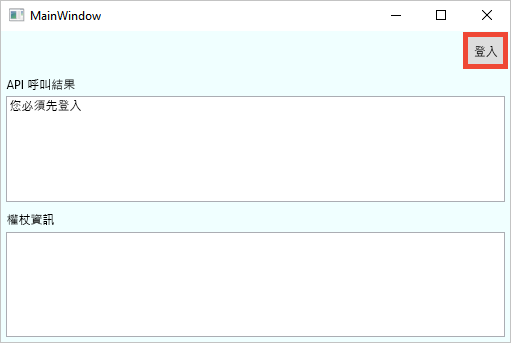
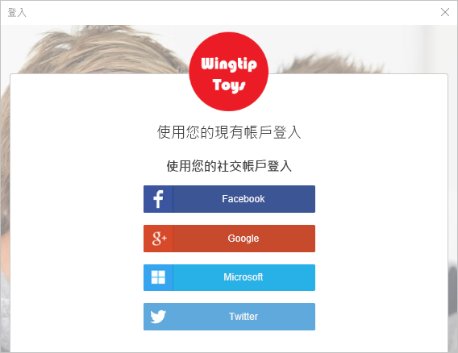
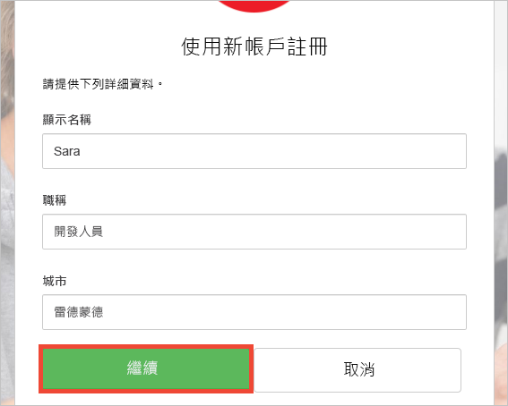
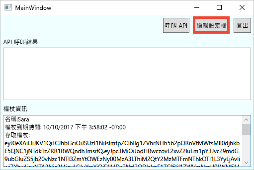
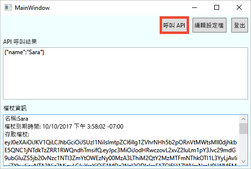

# <a name="quickstart-set-up-sign-in-for-a-desktop-app-using-azure-active-directory-b2c"></a>快速入門：設定使用 Azure Active Directory B2C 登入傳統型應用程式 

Azure Active Directory (Azure AD) B2C 提供雲端身分識別管理，使您的應用程式、企業和客戶受到保護。 Azure AD B2C 可讓您的應用程式使用開放式標準通訊協定，向社交帳戶和企業帳戶進行驗證。

本快速入門中，您會使用已啟用 Azure AD B2C 的範例 Windows Presentation Foundation (WPF) 桌面應用程式，透過社交識別提供者登入，並呼叫受 Azure AD B2C 保護的 Web API。

[!INCLUDE [quickstarts-free-trial-note](../../includes/quickstarts-free-trial-note.md)]

## <a name="prerequisites"></a>先決條件

* [Visual Studio 2017](https://www.visualstudio.com/downloads/)，其中包含 **ASP.NET 和 Web 部署**工作負載。 
* Facebook、Google、Microsoft 或 Twitter 社交帳戶。

## <a name="download-the-sample"></a>下載範例

[下載 zip 檔案](https://github.com/Azure-Samples/active-directory-b2c-dotnet-desktop/archive/master.zip)，或從 GitHub 複製範例 Web 應用程式。

```
git clone https://github.com/Azure-Samples/active-directory-b2c-dotnet-desktop.git
```

## <a name="run-the-app-in-visual-studio"></a>在 Visual Studio 中執行應用程式

在範例應用程式專案資料夾中，於 Visual Studio 中開啟 `active-directory-b2c-wpf.sln` 方案。

按 **F5** 鍵來進行應用程式偵錯。

## <a name="create-an-account"></a>建立帳戶

按一下 [登入]，以根據 Azure AD B2C 原則啟動「註冊或登入」工作流程。



此範例支援數個登入選項，包括使用社交識別提供者或使用電子郵件地址建立本機帳戶。 在本快速入門中，請使用 Facebook、Google、Microsoft 或 Twitter 的社交身分識別提供者帳戶。 

### <a name="sign-up-using-a-social-identity-provider"></a>使用社交識別提供者註冊

Azure AD B2C 會針對範例 Web 應用程式，呈現 Wingtip Toys 虛構品牌的自訂登入頁面。 

1. 若要使用社交識別提供者註冊，按一下您想要使用之識別提供者的按鈕。 

    

    您可使用您的社交帳戶認證進行驗證 (登入)，以及授權應用程式讀取您的社交帳戶資訊。 透過授與存取權，應用程式可以從社交帳戶擷取設定檔資訊，例如您的名稱與縣/市。 

2. 完成識別提供者的登入程序。 比方說，如果您選擇 Twitter，請輸入 Twitter 認證，然後按一下 [登入]。

    

    您的新帳戶設定檔詳細資料會預先填入來自您社交帳戶的資訊。 

3. 視需要修改詳細資料，然後按一下 [繼續]。 您輸入的值會用於您的 Azure AD B2C 使用者帳戶設定檔。

    

    您已成功建立使用識別提供者的新 Azure AD B2C 使用者帳戶。 登入之後，存取權杖會顯示在 [權杖資訊] 文字方塊。 存取 API 資源時，會使用存取權杖。

## <a name="edit-your-profile"></a>編輯您的設定檔

Azure Active Directory B2C 提供讓使用者更新其設定檔的功能。  範例 Web 應用程式會對工作流程使用 Azure AD B2C 編輯設定檔原則。 

1. 按一下 [編輯設定檔] 以編輯您建立的設定檔。

    

2. 選擇與您建立的帳戶相關聯的識別提供者。 例如，如果建立您的帳戶時使用 Twitter 作為識別提供者，請選擇 Twitter 以修改相關聯的設定檔詳細資料。

3. 變更您的 [顯示名稱] 或 [縣/市]，然後按一下 [繼續]。

    新的存取權杖會顯示在 [權杖資訊] 文字方塊。 如果您想要檢查對設定檔所作的變更，請將存取權杖複製並貼到權杖解碼器 https://jwt.ms。

## <a name="access-a-protected-web-api-resource"></a>存取受保護的 Web API 資源

按一下 [呼叫 API] 向 Azure AD B2C 保護的資源提出要求。 



此應用程式會在對受保護 Web API 資源的要求中包含 Azure AD 存取權杖。 Web API 會傳回存取權杖中所包含的顯示名稱。

您已成功使用 Azure AD B2C 使用者帳戶，對受 Azure AD B2C 保護的 Web API 提出授權呼叫。

## <a name="clean-up-resources"></a>清除資源

如果您想要嘗試其他 Azure AD B2C 快速入門或教學課程，可以使用 Azure AD B2C 租用戶。 不再需要時，您可以[刪除您的 Azure AD B2C 租用戶](active-directory-b2c-faqs.md#how-do-i-delete-my-azure-ad-b2c-tenant)。

## <a name="next-steps"></a>後續步驟

下一個步驟是建立您自己的 Azure AD B2C 租用戶，並設定使用您的租用戶來執行的範例。 

> [!div class="nextstepaction"]
> [在 Azure 入口網站中建立 Azure Active Directory B2C 租用戶](tutorial-create-tenant.md)
