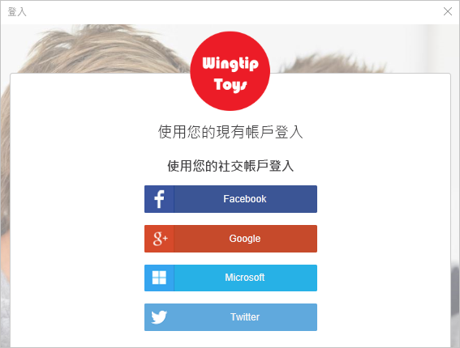

# <a name="quickstart-set-up-sign-in-for-a-single-page-app-using-azure-active-directory-b2c"></a>快速入門：設定使用 Azure Active Directory B2C 的單頁應用程式登入

Azure Active Directory (Azure AD) B2C 提供雲端身分識別管理，使您的應用程式、企業和客戶受到保護。 Azure AD B2C 可讓您的應用程式使用開放式標準通訊協定，向社交帳戶和企業帳戶進行驗證。 在本快速入門中，您會使用單頁應用程式透過社交識別提供者登入，並呼叫受 Azure AD B2C 保護的 Web API。

[!INCLUDE [quickstarts-free-trial-note](../../includes/quickstarts-free-trial-note.md)]

## <a name="prerequisites"></a>必要條件

- [Visual Studio 2017](https://www.visualstudio.com/downloads/)，其中包含 **ASP.NET 和 Web 部署**工作負載。
- 安裝 [Node.js](https://nodejs.org/en/download/)
- Facebook、Google、Microsoft 或 Twitter 社交帳戶。
- [下載 zip 檔案](https://github.com/Azure-Samples/active-directory-b2c-javascript-msal-singlepageapp/archive/master.zip)，或從 GitHub 複製範例 Web 應用程式。

    ```
    git clone https://github.com/Azure-Samples/active-directory-b2c-javascript-msal-singlepageapp.git
    ```

## <a name="run-the-application"></a>執行應用程式

1. 從 Node.js 命令提示字元執行下列命令，以啟動伺服器： 

    ```
    cd active-directory-b2c-javascript-msal-singlepageapp
    npm install && npm update
    node server.js
    ```

    Server.js 會輸出在 localhost 上接聽的連接埠號碼。

    ```
    Listening on port 6420...
    ```

2. 瀏覽至應用程式的 URL。 例如： `http://localhost:6420`。

## <a name="sign-in-using-your-account"></a>使用您的帳戶登入

1. 按一下 [登入] 以啟動工作流程。

    

    此範例支援數個登入選項，包括使用社交識別提供者或使用電子郵件地址建立本機帳戶。 在本快速入門中，請使用 Facebook、Google、Microsoft 或 Twitter 的社交身分識別提供者帳戶。 

2. Azure AD B2C 會針對範例 Web 應用程式，呈現 Wingtip Toys 虛構品牌的自訂登入頁面。 若要使用社交識別提供者註冊，按一下您想要使用之識別提供者的按鈕。

    

    您可使用您的社交帳戶認證進行驗證 (登入)，以及授權應用程式讀取您的社交帳戶資訊。 透過授與存取權，應用程式可以從社交帳戶擷取設定檔資訊，例如您的名稱與縣/市。 

3. 完成識別提供者的登入程序。

## <a name="access-a-protected-api-resource"></a>存取受保護的 API 資源

按一下 [呼叫 Web API]，使您的顯示名稱從 Web API 呼叫以 JSON 物件傳回。 


範例單頁應用程式會在對受保護 Web API 資源的要求中包含存取權杖。

## <a name="clean-up-resources"></a>清除資源

如果您想要嘗試其他 Azure AD B2C 快速入門或教學課程，可以使用 Azure AD B2C 租用戶。 不再需要時，您可以[刪除您的 Azure AD B2C 租用戶](active-directory-b2c-faqs.md#how-do-i-delete-my-azure-ad-b2c-tenant)。

## <a name="next-steps"></a>後續步驟

在本快速入門中，您使用了範例單頁應用程式，透過自訂登入頁面登入、透過社交識別提供者登入，建立 Azure AD B2C 帳戶，以及呼叫受 Azure AD B2C 保護的 Web API。 

開始建立您自己的 Azure AD B2C 租用戶。

> [!div class="nextstepaction"]
> [在 Azure 入口網站中建立 Azure Active Directory B2C 租用戶](tutorial-create-tenant.md)