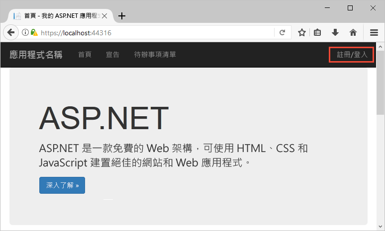
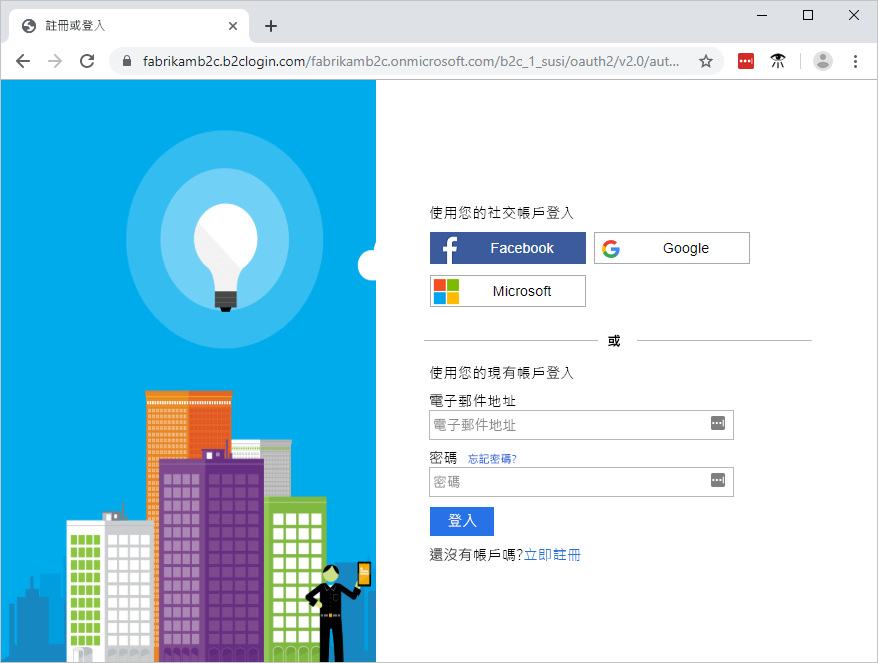
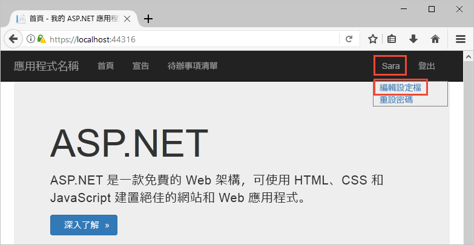
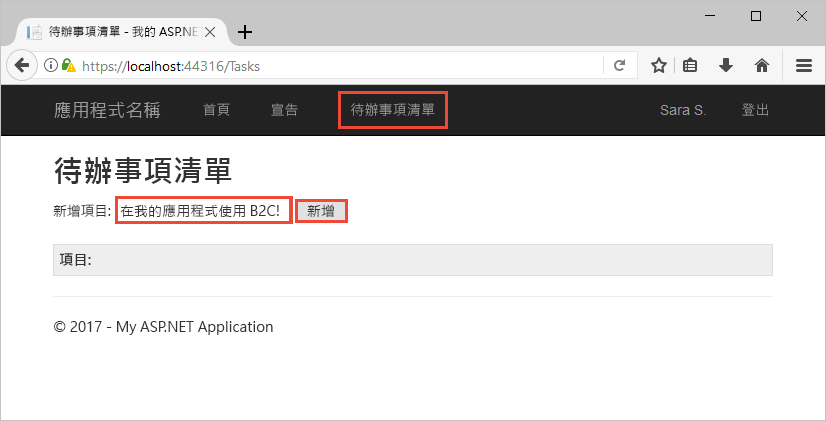

# <a name="quickstart-set-up-sign-in-for-an-aspnet-application-using-azure-active-directory-b2c"></a>快速入門：設定使用 Azure Active Directory B2C 登入 ASP.NET 應用程式

Azure Active Directory (Azure AD) B2C 提供雲端身分識別管理，使您的應用程式、企業和客戶受到保護。 Azure AD B2C 可讓您的應用程式使用開放式標準通訊協定，向社交帳戶和企業帳戶進行驗證。 在本快速入門中，您會使用 ASP.NET 應用程式透過社交識別提供者登入，並呼叫受 Azure AD B2C 保護的 Web API。

[!INCLUDE [quickstarts-free-trial-note](../../includes/quickstarts-free-trial-note.md)]

## <a name="prerequisites"></a>必要條件

- [Visual Studio 2017](https://www.visualstudio.com/downloads/)，其中包含 **ASP.NET 和 Web 部署**工作負載。 
- Facebook、Google、Microsoft 或 Twitter 社交帳戶。
- [下載 zip 檔案](https://github.com/Azure-Samples/active-directory-b2c-dotnet-webapp-and-webapi/archive/master.zip)，或從 GitHub 複製範例 Web 應用程式。

    ```
    git clone https://github.com/Azure-Samples/active-directory-b2c-dotnet-webapp-and-webapi.git
    ```

    範例解決方案中有兩個專案：

    - **TaskWebApp** - 建立和編輯工作清單的 Web 應用程式。 此 Web 應用程式會使用**註冊或登入**原則來註冊或登入使用者。
    - **TaskService** - 支援建立、讀取、更新和刪除工作清單功能的 Web API。 此 Web API 會受到 Azure AD B2C 的保護，且由 Web 應用程式呼叫。

## <a name="run-the-application-in-visual-studio"></a>在 Visual Studio 中執行應用程式

1. 在範例應用程式專案資料夾中，於 Visual Studio 中開啟 **B2C-WebAPI-DotNet.sln** 解決方案。
2. 在本快速入門中，您會同時執行 **TaskWebApp** 和 **TaskService** 專案。 在方案總管中以滑鼠右鍵按一下 **B2C-WebAPI-DotNet** 解決方案，然後選取 [設定啟始專案]。 
3. 選取 [多個啟始專案]，然後將兩個專案的 [動作] 變更為 [啟動]。 
4. 按一下 [確定]。
5. 按 **F5** 鍵可進行兩個應用程式的偵錯。 每個應用程式會在自己的瀏覽器索引標籤中開啟：

    - `https://localhost:44316/` - ASP.NET Web 應用程式。 在本快速入門中，您直接與此應用程式互動。
    - `https://localhost:44332/` - ASP.NET Web 應用程式呼叫的 Web API。

## <a name="sign-in-using-your-account"></a>使用您的帳戶登入

1. 按一下 ASP.NET Web 應用程式中的 [註冊/登入]，以啟動工作流程。

    

    此範例支援數個登入選項，包括使用社交識別提供者或使用電子郵件地址建立本機帳戶。 在本快速入門中，請使用 Facebook、Google、Microsoft 或 Twitter 的社交身分識別提供者帳戶。

2. Azure AD B2C 會針對範例 Web 應用程式，呈現 Wingtip Toys 虛構品牌的自訂登入頁面。 若要使用社交識別提供者註冊，按一下您想要使用之識別提供者的按鈕。

    

    您可使用您的社交帳戶認證進行驗證 (登入)，以及授權應用程式讀取您的社交帳戶資訊。 透過授與存取權，應用程式可以從社交帳戶擷取設定檔資訊，例如您的名稱與縣/市。 

3. 完成識別提供者的登入程序。

## <a name="edit-your-profile"></a>編輯您的設定檔

Azure Active Directory B2C 提供讓使用者更新其設定檔的功能。 範例 Web 應用程式會對工作流程使用 Azure AD B2C 編輯設定檔原則。 

1. 在應用程式功能表列中按一下您的設定檔名稱，然後選取 [編輯設定檔] 以編輯您建立的設定檔。

    

2. 變更您的 [顯示名稱] 或 [縣/市]，然後按一下 [繼續] 以更新設定檔。 

    變更會顯示在 Web 應用程式首頁的右上方。

## <a name="access-a-protected-api-resource"></a>存取受保護的 API 資源

1. 按一下 [待辦事項清單]，輸入並修改您的待辦事項清單項目。 

2. 在 [新項目] 文字方塊中輸入文字。 按一下 [新增] 以呼叫受 Azure AD B2C 保護的 Web API，而該 Web API 會新增待辦事項清單項目。

    

    ASP.NET Web 應用程式會在對受保護 Web API 資源的要求中包含 Azure AD 存取權杖，以要求對使用者的待辦事項清單項目執行作業。

您已成功使用 Azure AD B2C 使用者帳戶，對受 Azure AD B2C 保護的 Web API 提出授權呼叫。

## <a name="clean-up-resources"></a>清除資源

如果您想要嘗試其他 Azure AD B2C 快速入門或教學課程，可以使用 Azure AD B2C 租用戶。 不再需要時，您可以[刪除您的 Azure AD B2C 租用戶](active-directory-b2c-faqs.md#how-do-i-delete-my-azure-ad-b2c-tenant)。

## <a name="next-steps"></a>後續步驟

在本快速入門中，您使用了範例 ASP.NET 應用程式，透過自訂登入頁面登入、透過社交識別提供者登入，建立 Azure AD B2C 帳戶，以及呼叫受 Azure AD B2C 保護的 Web API。 

開始建立您自己的 Azure AD B2C 租用戶。

> [!div class="nextstepaction"]
> [在 Azure 入口網站中建立 Azure Active Directory B2C 租用戶](tutorial-create-tenant.md)