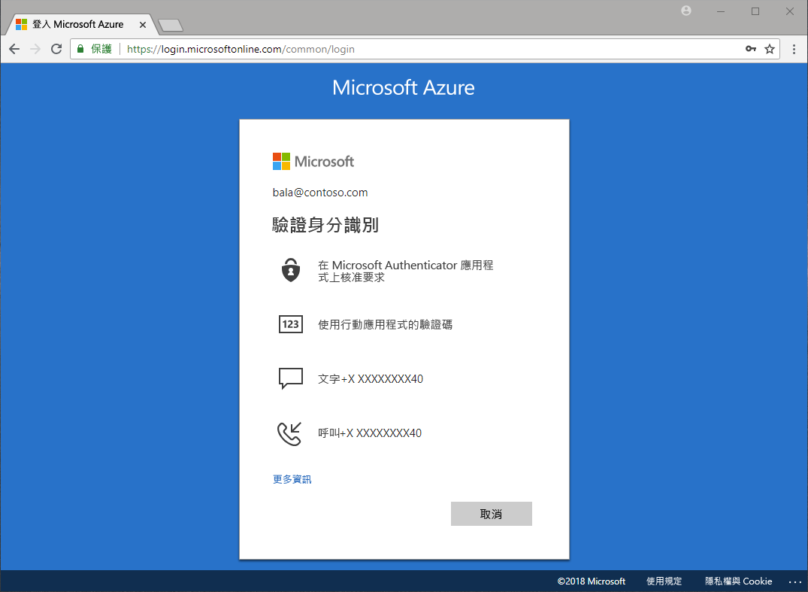

# 驗證有哪些可用的方法？

密碼遭竊和身分遭盜用的新聞報導時有所聞。 在密碼以外要求使用第二個因素，可立即強化組織的安全性。 Microsoft Azure Active Directory (Azure AD) 包含 Azure Multi-Factor Authentication (Azure MFA) 與 Azure AD 自助式密碼重設 (SSPR) 等功能，可協助系統管理員透過額外的驗證方法保護其組織和使用者。

當使用者需要存取敏感的應用程式、重設其密碼或啟用 Windows Hello 時，系統可能會要求他們提供額外的驗證，以證實其真實身分。

額外的驗證可能以下列驗證方法的形式執行：

* 在電子郵件或簡訊中提供的驗證碼
* 撥打電話
* 以電話傳送的通知或驗證碼
* 回答安全性問題

Azure MFA 和 Azure AD 自助式密碼重設可讓系統管理員使用 Azure AD 和 Azure 入口網站控制組態、原則、監視和報告，以保護其組織。

## 自助式密碼重設

自助式密碼重設可讓使用者在必要時重設其密碼，而不需要系統管理員介入。

> [!VIDEO https://www.youtube.com/embed/hc97Yx5PJiM]

自助密碼重設包括：

* **密碼變更：** 我知道自己的密碼，但想要變更為新密碼。
* **密碼重設：** 我無法登入，而想要使用一或多個已核准的驗證方法重設密碼。
* **解除帳戶鎖定：** 我因為帳戶遭到鎖定而無法登入，而想要使用一或多個已核准的驗證方法解除鎖定。

## Multi-Factor Authentication

Azure Multi-Factor Authentication (MFA) 是 Microsoft 的雙步驟驗證解決方案。 Azure MFA 可使用系統管理員核准的驗證方法，以利保護對資料與應用程式的存取，同時達到對簡單登入程序的需求。

## 後續步驟

下一個步驟是深入了解及設定自助式密碼重設和 Azure Multi-Factor Authentication。

若要開始使用自助式密碼重設，請參閱[啟用 SSPR 的快速入門文章](quickstart-sspr.md)。

在[運作方式：Azure AD 自助式密碼重設](concept-sspr-howitworks.md)一文中深入了解自助式密碼重設

在[運作方式：Azure Multi-Factor Authentication](concept-mfa-howitworks.md) 一文中深入了解 Azure Multi-factor Authentication