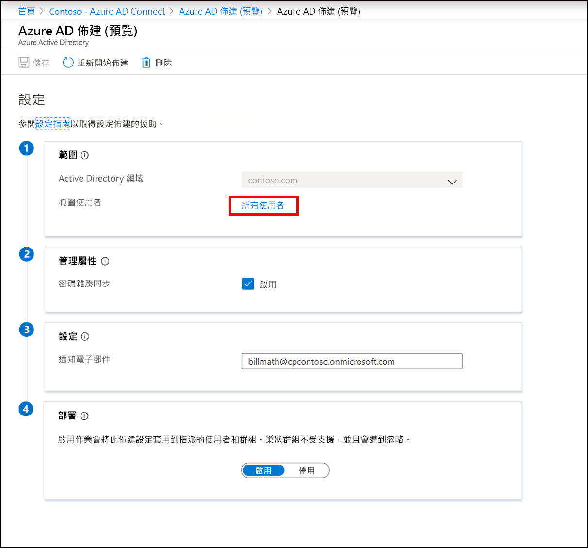

# Azure AD Connect 雲端布建新設定

安裝代理程式之後，您必須登入 Azure 入口網站並設定布建。  使用下列步驟來啟用代理程式。

## 設定布建
若要設定布建，請使用下列步驟：

1.  在 Azure AD 入口網站中，按一下  **Azure Active Directory**
2.  按一下  **Azure AD Connect**
3.  選取 **[管理布建（預覽）** ]

4.  按一下 [**新增**設定]。
5.  在 [設定] 畫面上，已預先填入內部部署網域
6. 輸入**通知電子郵件**。 當布建狀況不良時，將會通知這封電子郵件。  
8. 將選取器移至 [**啟用**]，然後按一下 [**儲存**]。

## 將布建限定于特定使用者和群組
如果您想要將代理程式限定為僅同步處理特定的使用者和群組，您可以執行此動作。 您可以使用內部部署 AD 群組或組織單位來進行範圍。 您無法在設定內設定群組和組織單位。 

1.  在 Azure AD 入口網站中，按一下  **Azure Active Directory**
2.  按一下  **Azure AD Connect**
3.  選取 **[管理布建（預覽）** ]
4.  在 [設定 **] 下，** 按一下您的設定。  

5.  在 [**設定**] 底下，選取 [**所有使用者**] 以變更設定規則的範圍。

6. 在右側，您可以藉由輸入群組的辨別名稱，然後按一下 [**新增**]，將範圍變更為僅包含安全性群組。

7. 或者，將它變更為只包含特定的 Ou。 按一下 [**完成**] 並**儲存**。

## 重新開機布建 
如果您不想等候下一個排程的執行，您可以使用 [重新開機布建] 按鈕來觸發布建執行。 
1.  在 Azure AD 入口網站中，按一下  **Azure Active Directory**
2.  按一下  **Azure AD Connect**
3.  選取 **[管理布建（預覽）** ]
4.  在 [設定 **] 下，** 按一下您的設定。  

5.  按一下頂端的 [**重新開機**布建]。

## 移除設定
如果您想要刪除設定，可以使用下列步驟來執行此動作。

1.  在 Azure AD 入口網站中，按一下  **Azure Active Directory**
2.  按一下  **Azure AD Connect**
3.  選取 **[管理布建（預覽）** ]
4.  在 [設定 **] 下，** 按一下您的設定。  

5.  按一下頂端的 [**刪除**]。

>[!IMPORTANT]
>在刪除設定之前不會確認，因此請確定這是您要在按一下 [**刪除**] 之前採取的動作。

## 後續步驟 

- [什麼是布建？](what-is-provisioning.md)
- [什麼是 Azure AD Connect 雲端布建？](what-is-cloud-provisioning.md)
