# 針對現有的同步 AD 樹系進行雲端佈建試驗 

本教學課程將逐步引導您針對已使用 Azure Active Directory (Azure AD) Connect 同步進行同步處理的測試 Active Directory 樹系，進行雲端佈建試驗。

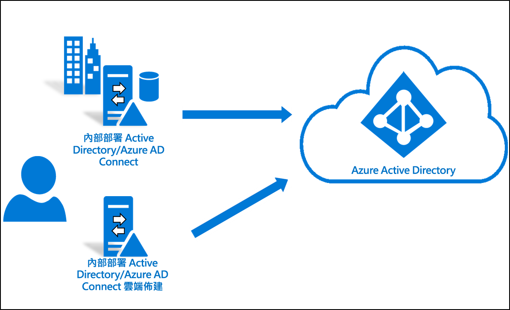

## 考量
嘗試進行本教學課程之前，請考量下列事項：
1. 確定您熟悉雲端佈建的基本概念。 
2. 確定您執行的是 Azure AD Connect 同步1.4.32.0 版或更新版本，並已依照文件指示設定同步處理規則。 試驗時，您將會從 Azure AD Connect 同步範圍中移除測試 OU 或群組。 若將物件移出範圍外，會導致這些物件從 Azure AD 中刪除。 針對使用者物件，Azure AD 中的物件會被虛刪除，且可以還原。 針對群組物件，Azure AD 中的物件會被實刪除，且無法還原。 Azure AD Connect 同步中已導入新的連結類型，可在試驗案例中防止刪除。 
3. 請確定試驗範圍中的物件已填入 ms-ds-consistencyGUID，使雲端佈建可確實比對物件。 

   > [!NOTE]
   > 根據預設，Azure AD Connect 同步不會為群組物件填入 ms-ds-consistencyGUID  。 請遵循[此部落格文章](https://blogs.technet.microsoft.com/markrenoden/2017/10/13/choosing-a-sourceanchor-for-groups-in-multi-forest-sync-with-aad-connect/)中所述的步驟，為群組物件填入 ms-ds-consistencyGUID  。

4. 這是進階案例。 請確實遵循本教學課程中記載的步驟。

## 必要條件
下列是完成此教學課程的必要條件
- 具有 Azure AD Connect 同步 1.4.32.0 版或更新版本的測試環境
- 在同步範圍內、並且可用於試驗的 OU 或群組。 建議您先從一小組物件開始。
- 執行 Windows Server 2012 R2 或更新版本、且將裝載佈建代理程式的伺服器。  此伺服器不可與 Azure AD Connect 伺服器相同。
- AAD Connect 同步的來源錨點應該是 objectGuid  或 ms-ds-consistencyGUID 

## 更新 Azure AD Connect

您至少應有 [Azure AD Connect](https://www.microsoft.com/download/details.aspx?id=47594) 1.4.32.0。 若要更新 Azure AD Connect 同步，請完成 [Azure AD Connect：升級至最新版本](../hybrid/how-to-upgrade-previous-version.md)中的步驟。  

## 停止排程器
Azure AD Connect 同步會使用排程器來同步處理您內部部署目錄中發生的變更。 若要修改和加入自訂規則，您可以停用排程器，如此，在您進行此作業時就不會執行同步處理。  請使用下列步驟：

1.  在執行 Azure AD Connect 同步的伺服器上，以系統管理權限開啟 PowerShell。
2.  執行 `Stop-ADSyncSyncCycle`。  按 Enter 鍵。
3.  執行 `Set-ADSyncScheduler -SyncCycleEnabled $false`。

>[!NOTE] 
>如果您執行自己的自訂排程器來進行 AAD Connect 同步，請停用排程器。 

## 建立自訂使用者輸入規則

 1. 從桌面的應用程式功能表中啟動同步化編輯器，如下所示： 
 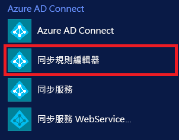 
 
 2. 在下拉式清單中，針對 [方向] 選取 [輸入]  ，然後按一下 [新增規則]  。
 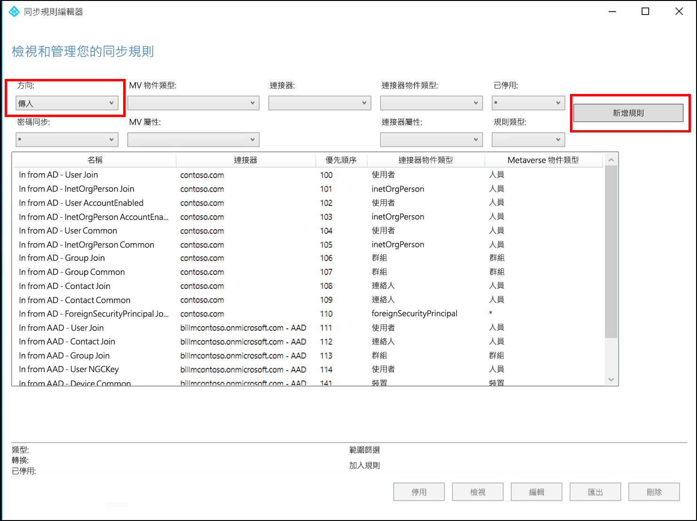 
 
 3. 在 [描述]  頁面上輸入下列項目，然後按 [下一步]  ：

    **名稱：** 為規則指定有意義的名稱 
    **說明：** 新增有意義的描述  
    **連線系統：** 選擇您要為其撰寫自訂同步處理規則的 AD 連接器 
    **連線系統物件類型：** 使用者 
    **Metaverse 物件類型：** 個人 
    **連結類型：** Join 
    **優先順序：** 提供在系統中是唯一的值 
    **標籤︰** 將此選項保留空白 
    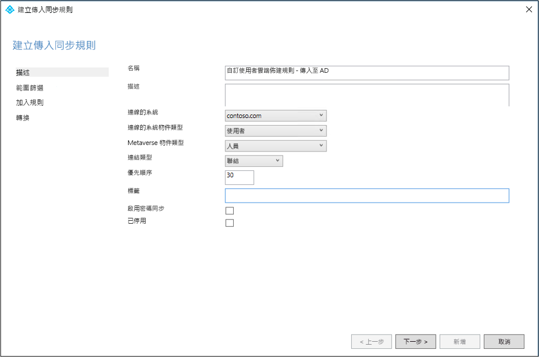 
 
 4. 在 [範圍篩選]  頁面上，輸入要作為試驗基礎的 OU 或安全性群組。  若要篩選 OU，請新增辨別名稱的 OU 部分。 此規則會套用到位於該 OU 中的所有使用者。  因此，如果 DN 的結尾為 "OU=CPUsers,DC=contoso,DC=com，您就會新增此篩選。  然後按 [下一步]  。 

    |規則|屬性|運算子|值|
    |-----|----|----|-----|
    |設定 OU 的範圍|DN|ENDSWITH|OU 的辨別名稱。|
    |設定群組的範圍||ISMEMBEROF|安全性群組的辨別名稱。|

    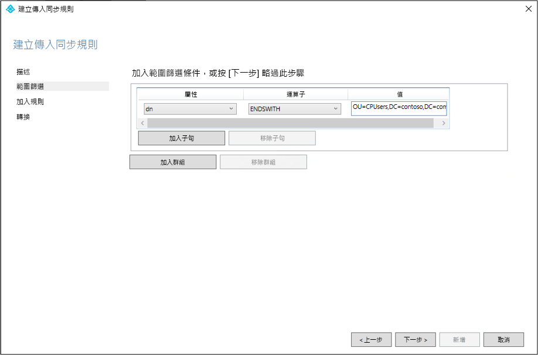 
 
 5. 在 [聯結規則]  頁面上，按 [下一步]  。
 6. 在 [轉換]  頁面上，將常數 transformation: flow True 新增至 cloudNoFlow 屬性。 按一下 [新增]  。
 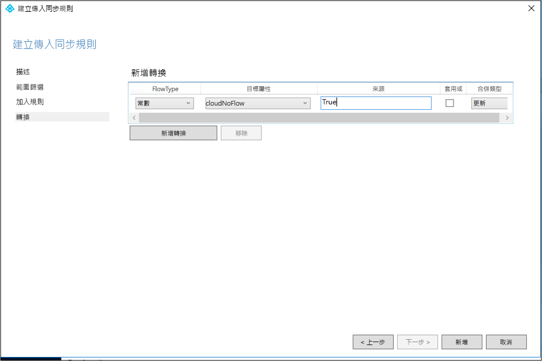 

所有物件類型 (使用者、群組和連絡人) 都必須遵循相同的步驟。 針對每個設定的 AD Connector / AD 樹系重複步驟。 

## 建立自訂使用者輸出規則

 1. 在下拉式清單中，針對 [方向] 選取 [輸出]  ，然後按一下 [新增規則]  。
 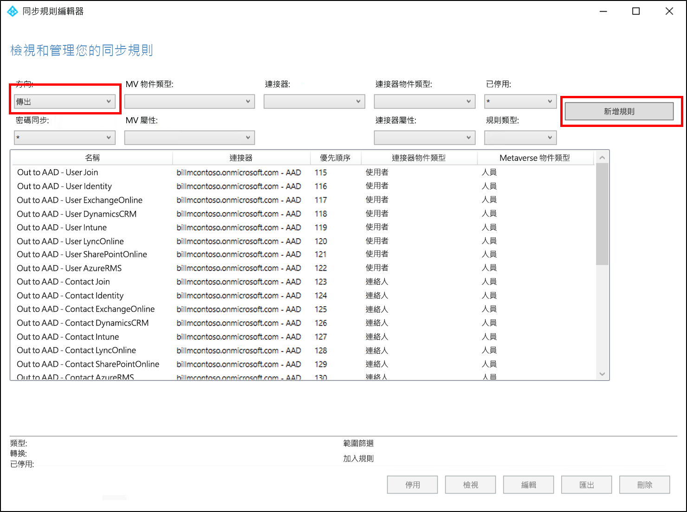 
 
 2. 在 [描述]  頁面上輸入下列項目，然後按 [下一步]  ：

    **名稱：** 為規則指定有意義的名稱 
    **說明：** 新增有意義的描述  
    **連線系統：** 選擇您要為其撰寫自訂同步處理規則的 AAD 連接器 
    **連線系統物件類型：** 使用者 
    **Metaverse 物件類型：** 個人 
    **連結類型：** JoinNoFlow 
    **優先順序：** 提供在系統中是唯一的值 
    **標籤︰** 將此選項保留空白 
    
    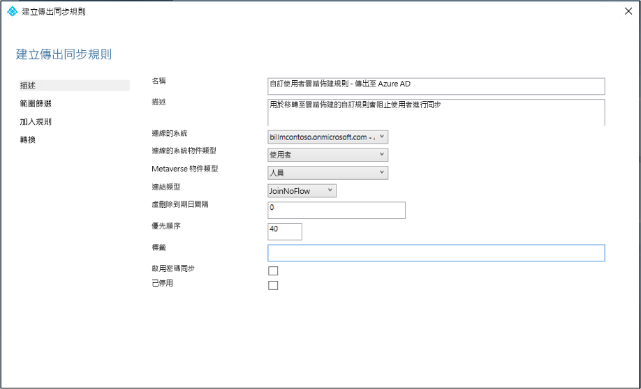 
 
 3. 在 [範圍篩選]  頁面上，選擇 [cloudNoFlow]  等於 [True]  。 然後按 [下一步]  。
 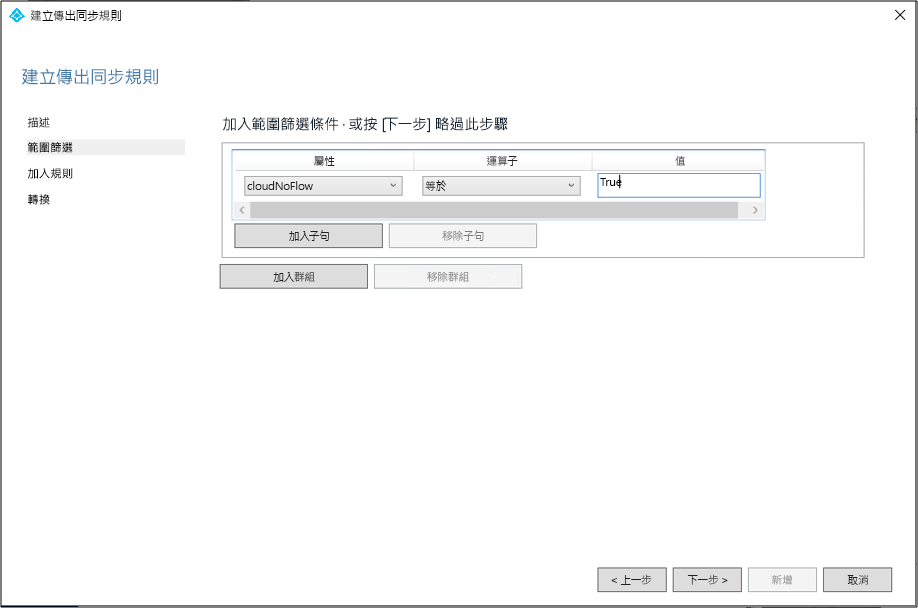 
 
 4. 在 [聯結規則]  頁面上，按 [下一步]  。
 5. 在 [轉換]  頁面上，按一下 [新增]  。

所有物件類型 (使用者、群組和連絡人) 都必須遵循相同的步驟。

## 安裝 Azure AD Connect 佈建代理程式
1. 以企業系統管理員權限登入您將使用的伺服器。  如果您使用[基本 AD 和 Azure 環境](tutorial-basic-ad-azure.md)教學課程，則會是 CP1。
2. [在此](https://go.microsoft.com/fwlink/?linkid=2109037)下載 Azure AD Connect 雲端佈建代理程式。
3. 執行 Azure AD Connect 雲端佈建 (AADConnectProvisioningAgent.Installer)
3. 在啟動顯示畫面上**接受**授權條款，然後按一下 [安裝]  。 
 

4. 此作業完成後，就會啟動組態精靈。  以 Azure AD 全域管理員帳戶登入。
5. 在 [連線 Active Directory]  畫面上，按一下 [新增目錄]  ，然後以您的 Active Directory 系統管理員帳戶登入。  此作業將會新增您的內部部署目錄。  按 [下一步]  。 
 

6. 在 [設定完成]  畫面上，按一下 [確認]  。  此作業將會註冊並重新啟動代理程式。 
 

7. 此作業完成後，您應該會看到「您已成功通過驗證」  的通知。  您可以按一下 [結束]  。 
 
8. 如果您仍看到初始啟動顯示畫面，請按一下 [關閉]  。1. 以企業系統管理員權限登入您將使用的伺服器。
2. [在此](https://go.microsoft.com/fwlink/?linkid=2109037)下載 Azure AD Connect 雲端佈建代理程式。
3. 執行 Azure AD Connect 雲端佈建 (AADConnectProvisioningAgent.Installer)
3. 在啟動顯示畫面上**接受**授權條款，然後按一下 [安裝]  。 
 

4. 此作業完成後，就會啟動組態精靈。  以 Azure AD 全域管理員帳戶登入。
5. 在 [連線 Active Directory]  畫面上，按一下 [新增目錄]  ，然後以您的 Active Directory 系統管理員帳戶登入。  此作業將會新增您的內部部署目錄。  按 [下一步]  。 
 

6. 在 [設定完成]  畫面上，按一下 [確認]  。  此作業將會註冊並重新啟動代理程式。 
 

7. 此作業完成後，您應該會看到「您已成功通過驗證」  的通知。  您可以按一下 [結束]  。 
 
8. 如果您仍看到初始啟動顯示畫面，請按一下 [關閉]  。

## 驗證代理程式安裝
代理程式驗證可在 Azure 入口網站中以及執行代理程式的本機伺服器上進行。

### Azure 入口網站代理程式驗證
若要確認 Azure 可看到代理程式，請遵循下列步驟：

1. 登入 Azure 入口網站。
2. 在左側選取 [Azure Active Directory]  ，按一下 [Azure AD Connect]  ，然後在中央選取 [管理佈建 (預覽)]  。 
 

3.  在 [Azure AD 佈建 (預覽)]  畫面上，按一下 [檢閱所有代理程式]  。
 
 
4. 在 [內部部署佈建代理程式]  畫面上，您會看到已安裝的代理程式。  確認相關代理程式位於該處，且已標示為 [停用]  。  依預設會停用代理程式  

### 在本機伺服器上
若要確認代理程式正在執行中，請遵循下列步驟：

1.  以系統管理員帳戶登入伺服器
2.  瀏覽至 [服務] 或移至 [開始]/[執行]/[services.msc]，以開啟 [服務]  。
3.  在 [服務]  底下，確定 **Microsoft Azure AD Connect 代理程式更新程式**和 **Microsoft Azure AD Connect 佈建代理程式**皆位於該處，且狀態為 [執行中]  。

## 設定 Azure AD Connect 雲端佈建
使用下列步驟來設定佈建：

 1. 登入 Azure AD 入口網站。
 2. 按一下 [Azure Active Directory] 
 3. 按一下 [Azure AD Connect] 
 4. 選取 [管理佈建 (預覽)]  
  
 5.  按一下 [新增組態]  
  
 6.  在組態畫面上輸入 [通知電子郵件]  ，將選取器移至 [啟用]  ，然後按一下 [儲存]  。
  
 7. 在 [設定]  底下選取 [所有使用者]  ，以變更組態規則的範圍。
  
 8. 在右側變更範圍，以包含您剛剛建立的特定 OU "OU=CPUsers,DC=contoso,DC=com"。
 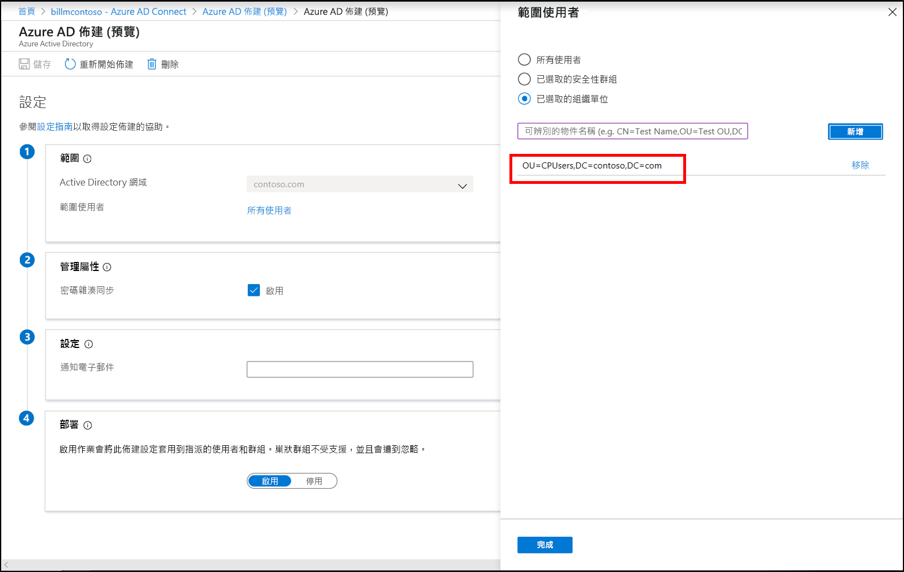 
 9.  按一下 [完成]  ，然後按 [儲存]  。
 10. 範圍此時應會設定為一個組織單位。 
 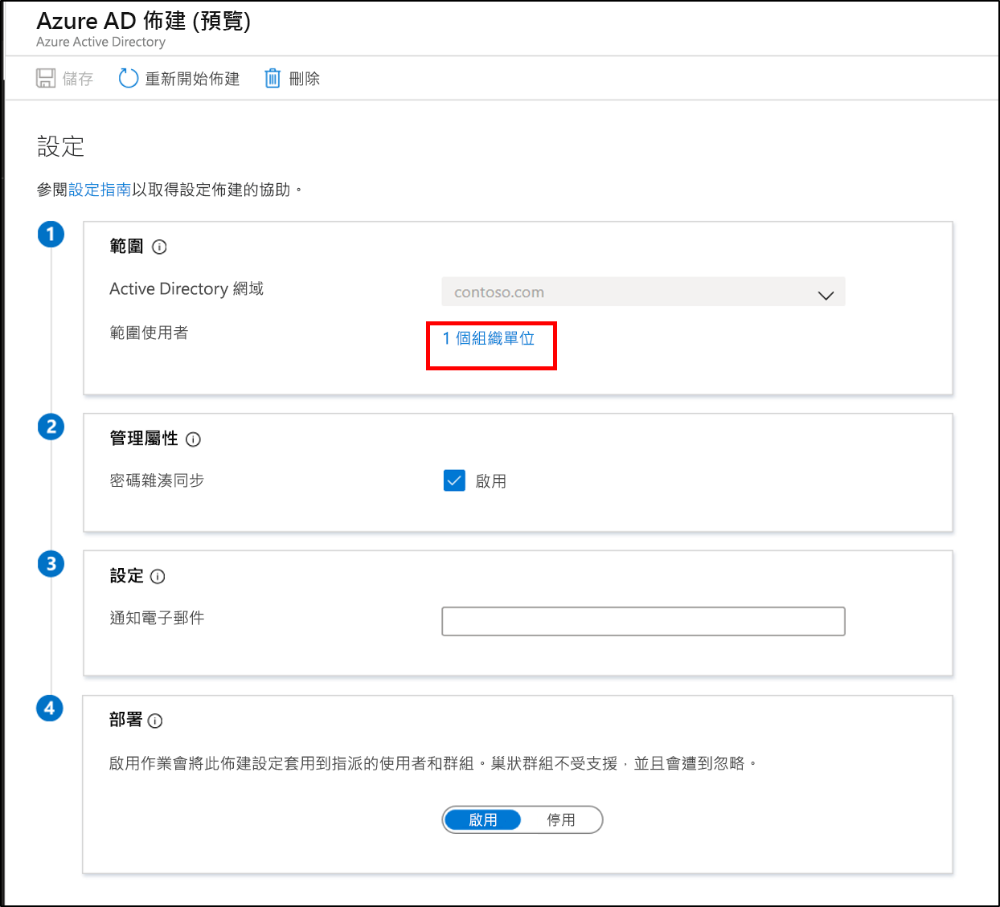 
 

## 確認雲端佈建已佈建使用者
現在，您將確認內部部署目錄中的使用者已同步，而且已存在於外部 Azure AD 租用戶中。  這可能需要花幾個小時才能完成。  若要確認雲端佈建已佈建使用者，請遵循下列步驟：

1. 瀏覽至 [Azure 入口網站](https://portal.azure.com)並使用具有 Azure 訂用帳戶的帳戶登入。
2. 選取左邊的 [Azure Active Directory] 
3. 按一下 [Azure AD Connect] 
4. 按一下 [管理佈建 (預覽)] 
5. 按一下 [記錄]  按鈕
6. 搜尋使用者名稱，以確認雲端佈建已佈建使用者

此外，您可以確認 Azure AD 中是否有使用者和群組存在。

## 啟動排程器
Azure AD Connect 同步會使用排程器來同步處理您內部部署目錄中發生的變更。 現在您已修改規則，可以重新啟動排程器。  請使用下列步驟：

1.  在執行 Azure AD Connect 同步的伺服器上，以系統管理權限開啟 PowerShell
2.  執行 `Set-ADSyncScheduler -SyncCycleEnabled $true`。
3.  執行 `Start-ADSyncSyncCycle`。  按 Enter 鍵。  

>[!NOTE] 
>如果您要執行自己的自訂排程器來進行 AAD Connect 同步，請啟用排程器。 

## 發生錯誤
如果試驗未如預期運作，您可以依照下列步驟返回 Azure AD Connect 同步設定：
1.  在 Azure 入口網站中停用佈建設定。 
2.  使用「同步處理規則編輯器」工具，停用為「雲端佈建」建立的所有自訂同步處理規則。 停用應該會導致所有連接器上的完整同步處理。

## 設定 Azure AD Connect 同步以排除試驗 OU
當您確認試驗 OU 中的使用者可成功地由雲端佈建管理之後，您可以重新設定 Azure AD Connect，以排除先前建立的試驗 OU。  雲端佈建代理程式之後將會處理這些使用者的同步。  使用下列步驟來設定 Azure AD Connect 的範圍。

 1. 在執行 Azure AD Connect 的伺服器上，按兩下 [Azure AD Connect] 圖示。
 2. 按一下 [設定] 
 3. 選取 [自訂同步處理選項]  ，然後按 [下一步]。
 4. 登入 Azure AD，然後按 [下一步]  。
 5. 在 [連線您的目錄]  畫面上，按 [下一步]  。
 6. 在 [網域和 OU 篩選]  畫面上，選取 [同步所選取的網域及 OU]  。
 7. 展開您的網域，然後**取消選取** **CPUsers** OU。  按 [下一步]  。
scope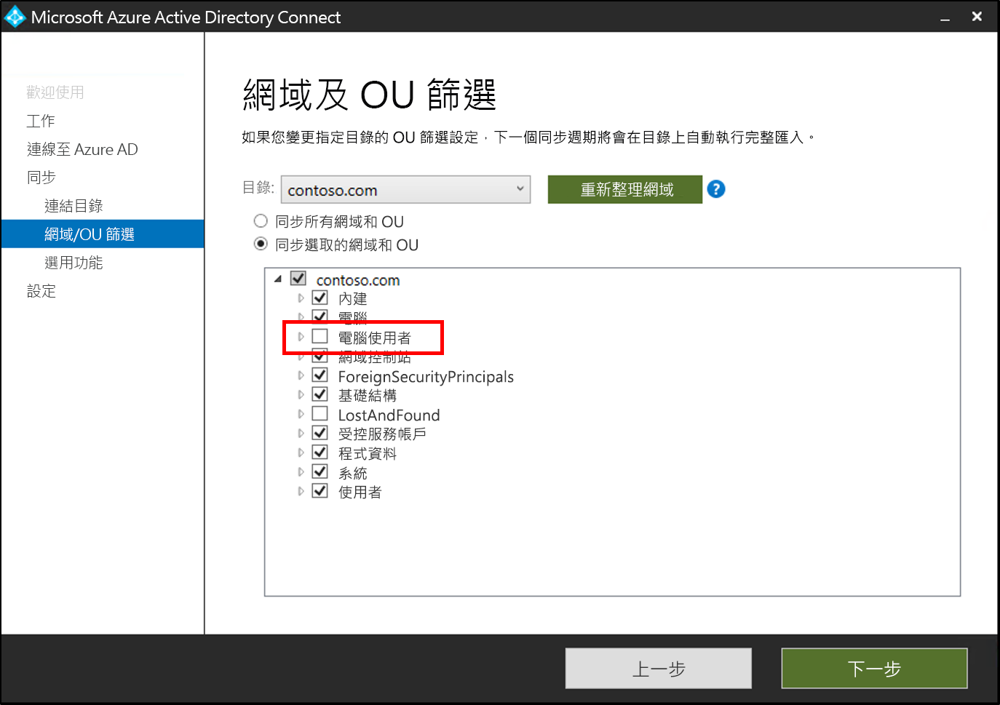 
 9. 在 [選用功能]  畫面上，按 [下一步]  。
 10. 在 [已可設定]  畫面上，按一下 [設定]  。
 11. 完成後，按一下 [結束]  。 

## 後續步驟 

- [什麼是佈建？](what-is-provisioning.md)
- [什麼是 Azure AD Connect 雲端佈建？](what-is-cloud-provisioning.md)

