# 教學課程：整合單一樹系與單一 Azure AD 租使用者

本教學課程將逐步引導您使用 Azure Active Directory （Azure AD） Connect 雲端布建來建立混合式身分識別環境。

您可以使用您在本教學課程中建立的環境進行測試，或讓您更熟悉雲端布建。

## 必要條件
### 於 Azure Active Directory 管理中心

1. 在 Azure AD 租用戶上建立僅限雲端的全域管理員帳戶。 如此一來，如果您的內部部署服務失敗或無法使用，您便可以管理租用戶組態。 了解如何[新增僅限雲端管理員帳戶](../active-directory-users-create-azure-portal.md)。 這是確保您不會遭租用戶封鎖的關鍵步驟。
2. 將一或多個[自訂網域名稱](../active-directory-domains-add-azure-portal.md)新增至 Azure AD 租用戶。 您的使用者可以使用其中一個網域名稱登入。

### 在內部部署環境中

1. 識別執行 Windows Server 2012 R2 或更新版本的已加入網域主機伺服器，最少 4 GB RAM 和 .NET 4.7.1 + 執行時間 

2. 如果您的伺服器和 Azure AD 之間有防火牆，請設定下列項目：
   - 請確定代理程式可以透過下列埠對 Azure AD 提出*輸出*要求：

     | 連接埠號碼 | 使用方式 |
     | --- | --- |
     | **80** | 驗證 SSL 憑證時下載憑證撤銷清單 (CRL) |
     | **443** | 處理所有與服務之間的輸出通訊 |
     | **8080** (選擇性) | 如果埠443無法使用，代理程式會每隔10分鐘透過埠8080報告其狀態。 此狀態會顯示在 Azure 入口網站上。 |
     
     如果您的防火牆會根據原始使用者強制執行規則，請開啟這些連接埠，讓來自以網路服務形式執行之 Windows 服務的流量得以通行。
   - 如果您的防火牆或 proxy 允許您指定安全尾碼，請將連接新增至 **\*msappproxy.net**和 **\*. servicebus.windows.net**。 如果不允許建立，請允許存取每週更新的 [Azure 資料中心 IP 範圍](https://www.microsoft.com/download/details.aspx?id=41653)。
   - 您的代理程式需要存取**login.windows.net**和**login.microsoftonline.com** ，才能進行初始註冊。 因此也請針對這些 URL 開啟您的防火牆。
   - 針對憑證驗證，請解除封鎖下列 Url： **mscrl.microsoft.com:80**、 **crl.microsoft.com:80**、 **ocsp.msocsp.com:80**和**www\.microsoft.com:80**。 由於這些 URL 會用於其他 Microsoft 產品的憑證驗證，因此您可能已將這些 URL 解除封鎖。

## 安裝 Azure AD Connect 布建代理程式
1. 登入已加入網域的伺服器。  如果您使用的是[基本 AD 和 Azure 環境](tutorial-basic-ad-azure.md)教學課程，則會是 DC1。
2. 使用僅限雲端的全域系統管理員認證來登入 Azure 入口網站。
3. 在左側，選取 [ **Azure Active Directory**]，按一下 [ **Azure AD Connect**]，然後在中央選取 [管理布建 **（預覽）** ]。

   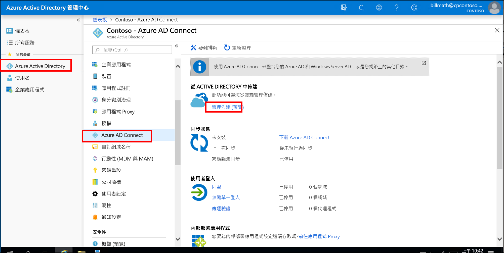

4. 按一下 [**下載代理程式**]。
5. 執行 Azure AD Connect 布建代理程式。
6. 在啟動顯示畫面上，**接受**授權條款，然後按一下 [**安裝**]。

   

7. 此作業完成後，就會啟動設定 wizard。  使用您的 Azure AD 全域管理員帳戶登入。  請注意，如果您已啟用 IE 增強式安全性，這將會封鎖登入。  如果是這種情況，請關閉安裝，停用伺服器管理員中的 [IE 增強式安全性]，然後按一下 [ **AAD Connect 布建代理程式]** 以重新開機安裝。
8. 在 [連線**Active Directory]** 畫面上，按一下 [**新增目錄**]，然後使用您的 Active Directory 網域系統管理員帳戶登入。  注意：網域系統管理員帳戶不應該有密碼變更需求。 如果密碼過期或變更，您必須使用新的認證重新設定代理程式。 此作業將會新增您的內部部署目錄。  按一下 [下一步]。

   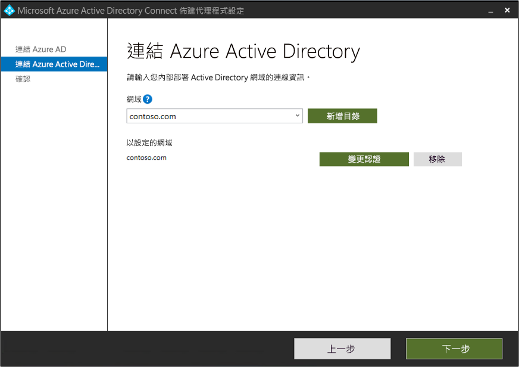

9. 在 [設定**完成**] 畫面上，按一下 [**確認**]。  此作業將會註冊並重新啟動代理程式。

   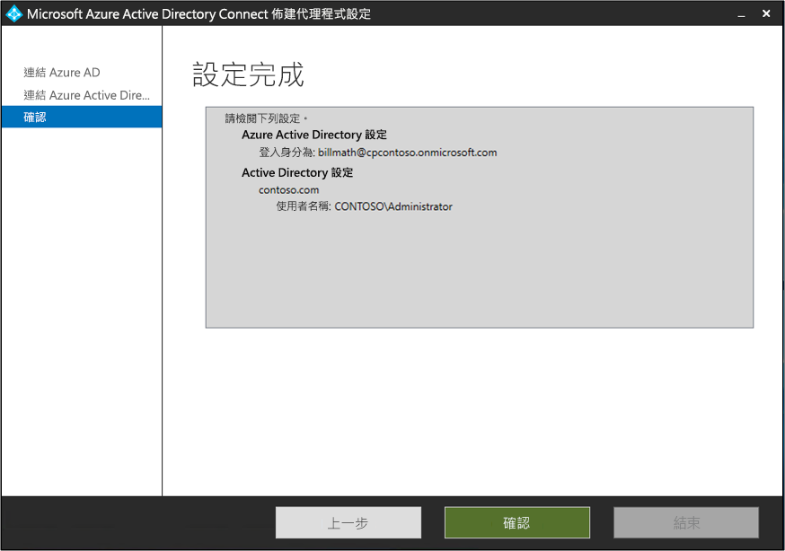

10. 此作業完成後，您應該會看到通知：已**成功驗證您的代理程式設定。**  您**可以按一下 [** 結束]。 
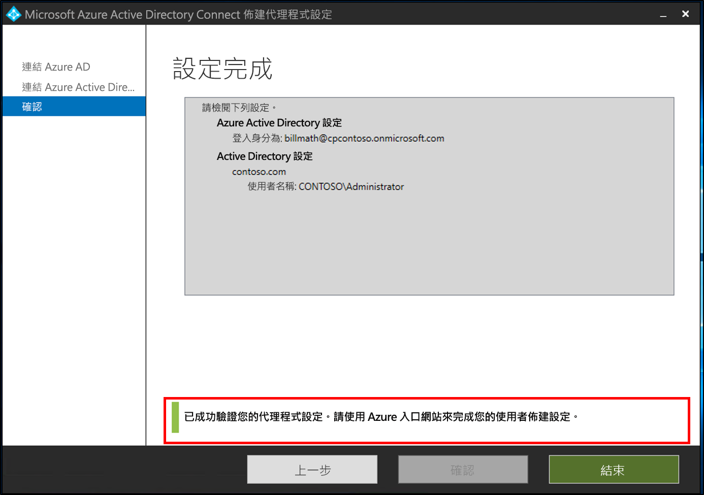 
11. 如果您仍然看到初始啟動顯示畫面，請按一下 [**關閉**]。

## 驗證代理程式安裝
代理程式驗證會在 Azure 入口網站以及執行代理程式的本機伺服器上進行。

### Azure 入口網站代理程式驗證
若要確認 Azure 正在查看代理程式，請遵循下列步驟：

1. 登入 Azure 入口網站。
2. 在左側選取 [ **Azure Active Directory**]，按一下 [ **Azure AD Connect** ]，然後在中央選取 [管理布建 **（預覽）** ]。 
 

3.  在 [ **Azure AD 布建（預覽）** ] 畫面上，按一下 [**審查所有代理**程式]。
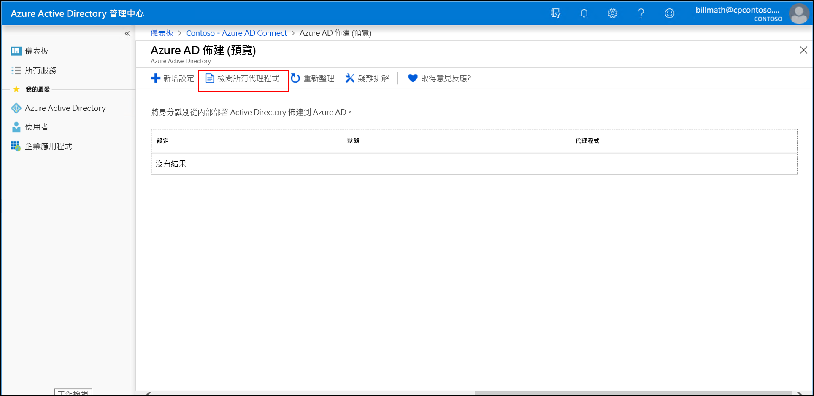 
 
4. 在 [**內部部署布建代理**程式] 畫面上，您會看到已安裝的代理程式。  確認有問題的代理程式存在，而且**已標示為使用中。**
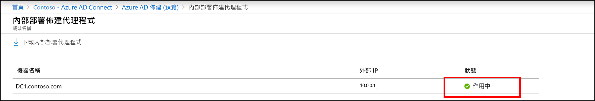 

### 在本機伺服器上
若要確認代理程式是否正在執行，請遵循下列步驟：

1.  使用系統管理員帳戶登入伺服器
2.  藉由流覽至該**服務**或移至 [開始]/[執行中]/[services.msc] 來開啟它們。
3.  在 [**服務**] 下，確定**Microsoft Azure AD 連線代理程式更新**程式，並**Microsoft Azure AD connect 布建代理程式**已存在，且狀態為 [**正在**執行]。
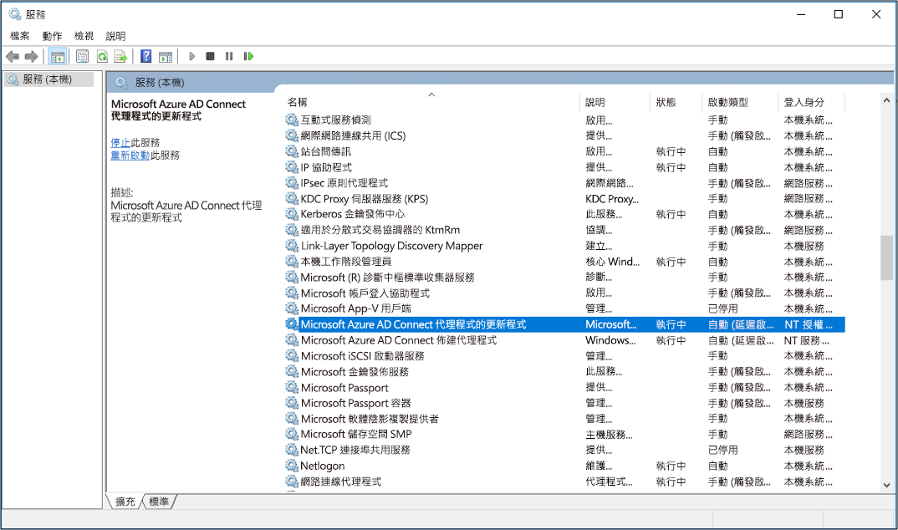

## 設定 Azure AD Connect 雲端布建
 使用下列步驟來設定布建

1.  登入 Azure AD 入口網站。
2.  按一下  **Azure Active Directory**
3.  按一下  **Azure AD Connect**
4.  選取 **[管理布建（預覽）** ]

5.  按一下 [**新增**設定
] 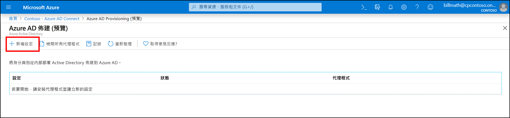
7.  在 [設定] 畫面上，輸入**通知電子郵件**，將選取器移至 [**啟用**]，然後按一下 [**儲存**]。
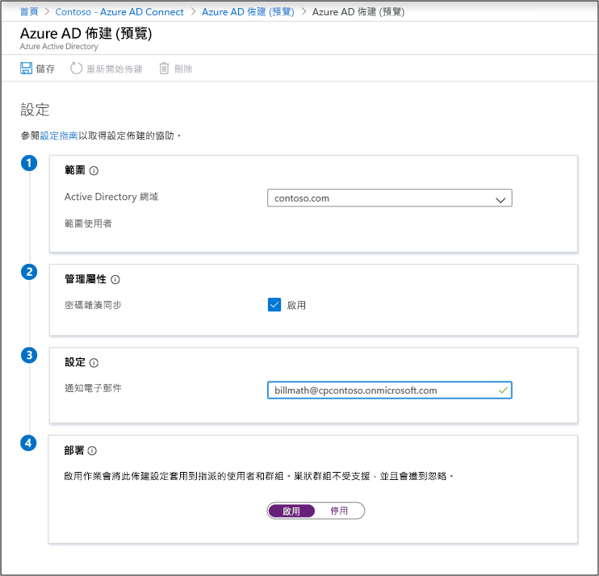
1.  設定狀態現在應該是 [**狀況良好**]。
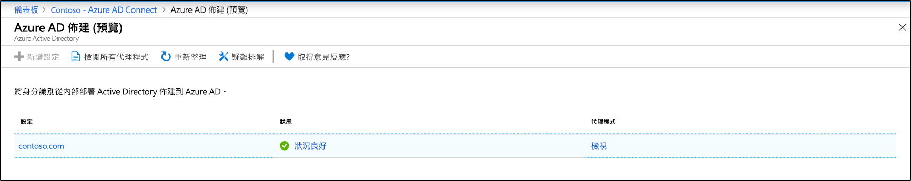

## 確認已建立使用者且已進行同步
您現在會確認已同步處理內部部署目錄中的使用者，且現在存在於我們的 Azure AD 租使用者中。  這可能需要花幾個小時才能完成。  若要確認使用者是否已同步，請執行下列動作。

1. 瀏覽至 [Azure 入口網站](https://portal.azure.com)並使用具有 Azure 訂用帳戶的帳戶登入。
2. 選取左邊的 [Azure Active Directory]
3. 在 [管理] 底下選取 [使用者]。
4. 確認您在我們的租用戶中看到新使用者 
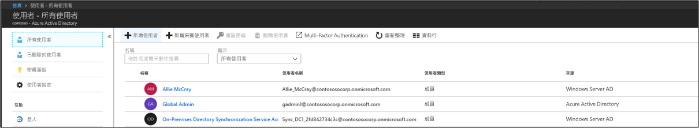 

## 使用我們其中一個使用者來測試登入

1. 瀏覽至 [https://myapps.microsoft.com](https://myapps.microsoft.com)
2. 使用我們在新租用戶中建立的使用者來登入。  您必須使用下列格式登入：(user@domain.onmicrosoft.com)。 透過該使用者在內部部署用來登入的密碼登入。 
   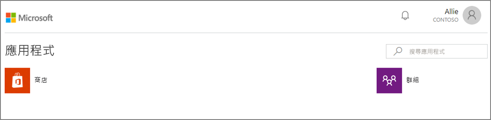 

您現在已成功設定混合式身分識別環境，可用來測試及熟悉 Azure 的功能。

## 後續步驟 

- [什麼是布建？](what-is-provisioning.md)
- [什麼是 Azure AD Connect 雲端布建？](what-is-cloud-provisioning.md)
