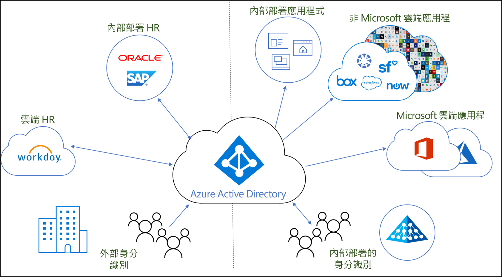
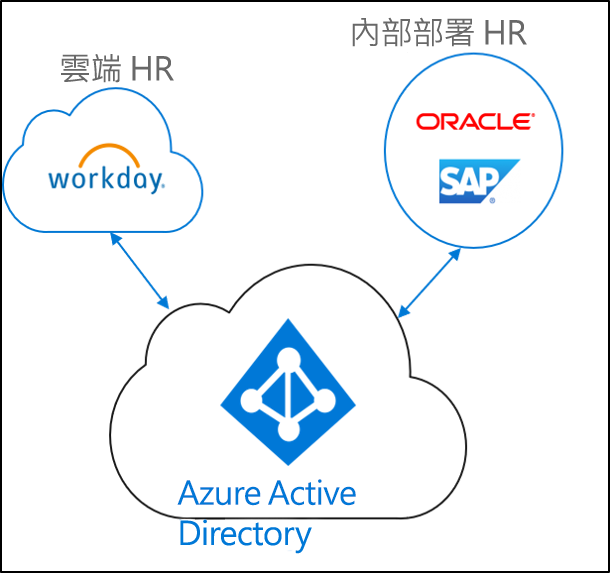
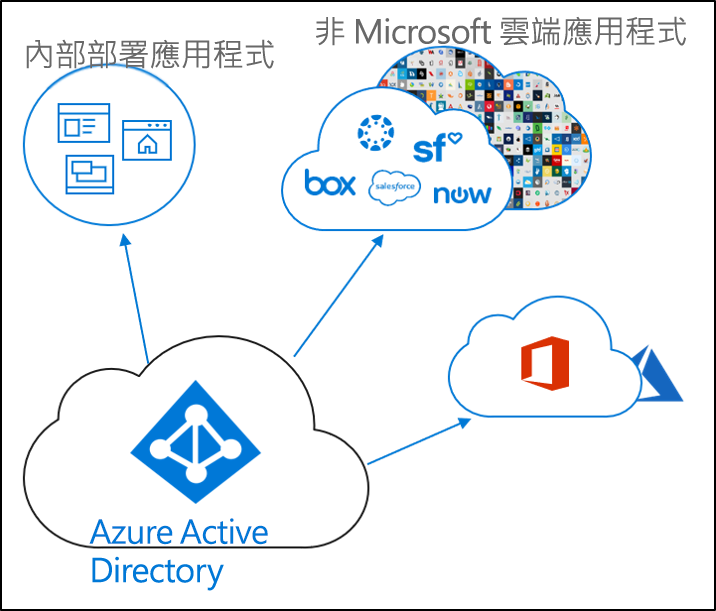
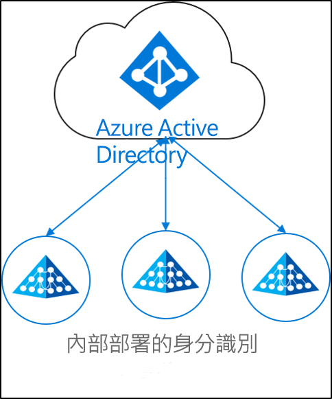

# 什麼是身分識別保護？

現今的企業和公司混合使用內部部署和雲端應用程式的情形越來越多。  使用者需要在內部部署環境和雲端存取應用程式。 他們在這些不同的應用程式 (內部部署和雲端) 間，需要有單一身分識別。

佈建是根據特定條件建立物件，並將物件保持在最新狀態，在物件不再符合條件時加以刪除的程序。 例如，當新的使用者加入您的組織時，該使用者會進入 HR 系統中。  此時，佈建可在雲端、Active Directory 以及使用者需要存取的不同應用程式中建立對應的使用者帳戶。  這可讓使用者展開工作，並在一開始就能存取所需的應用程式和系統。 

就 Azure Active Directory 而言，佈建可細分為下列主要案例。  

- **[HR 驅動的佈建](#hr-driven-provisioning)**  
- **[應用程式佈建](#app-provisioning)**  
- **[目錄佈建](#directory-provisioning)** 

## HR 驅動的佈建

從 HR 佈建到雲端時，必須根據 HR 系統中的資訊建立物件 (使用者、角色、群組等)。  

最常見的案例是，當新的員工加入您的公司時，就會進入 HR 系統中。  在此情況下，他們就會佈建到雲端。  此案例中為 Azure AD。  從 HR 執行的佈建可能涵蓋下列案例。 

- **雇用新員工** - 將新員工新增至雲端 HR 時，系統會在 Active Directory、Azure Active Directory、Office 365 (選擇性) 和 Azure AD 支援的其他 SaaS 應用程式中自動建立使用者帳戶，並將電子郵件地址回寫至雲端 HR。
- **員工屬性和設定檔更新** - 在雲端 HR 中更新員工記錄時 (例如姓名、職稱或經理)，系統會在 Active Directory、Azure Active Directory、Office 365 (選擇性) 和 Azure AD 支援的其他 SaaS 應用程式中自動更新其使用者帳戶。
- **員工離職** - 在雲端 HR 中將員工設定為離職時，系統會在 Active Directory、Azure Active Directory、Office 365 (選擇性) 和 Azure AD 支援的其他 SaaS 應用程式中自動停用其使用者帳戶。
- **重新雇用員工** - 在雲端 HR 中重新雇用員工時，系統會自動重新啟用其舊帳戶或將其重新佈建 (取決於您的喜好設定) 至 Active Directory、Azure Active Directory、Office 365 (選擇性) 和 Azure AD 支援的其他 SaaS 應用程式。

## 應用程式佈建

應用程式佈建牽涉到在使用者需要存取的應用程式中佈建使用者和角色。  

最常見的案例是，當 Azure AD 中的使用者佈建到 O365 或 Salesforce 時。

## 目錄佈建

內部部署佈建牽涉到從內部部署來源 (例如 Active Directory) 佈建到 Azure AD。  

最常見的案例是，當 Active Directory (AD) 中的使用者佈建到 Azure AD 時。

這項作業已由 Azure AD Connect 同步、Azure AD Connect 雲端佈建和 Microsoft Identity Manager 完成。 
 
## 後續步驟 

- [什麼是佈建？](what-is-provisioning.md)
- [什麼是 Azure AD Connect 雲端佈建？](what-is-cloud-provisioning.md)
