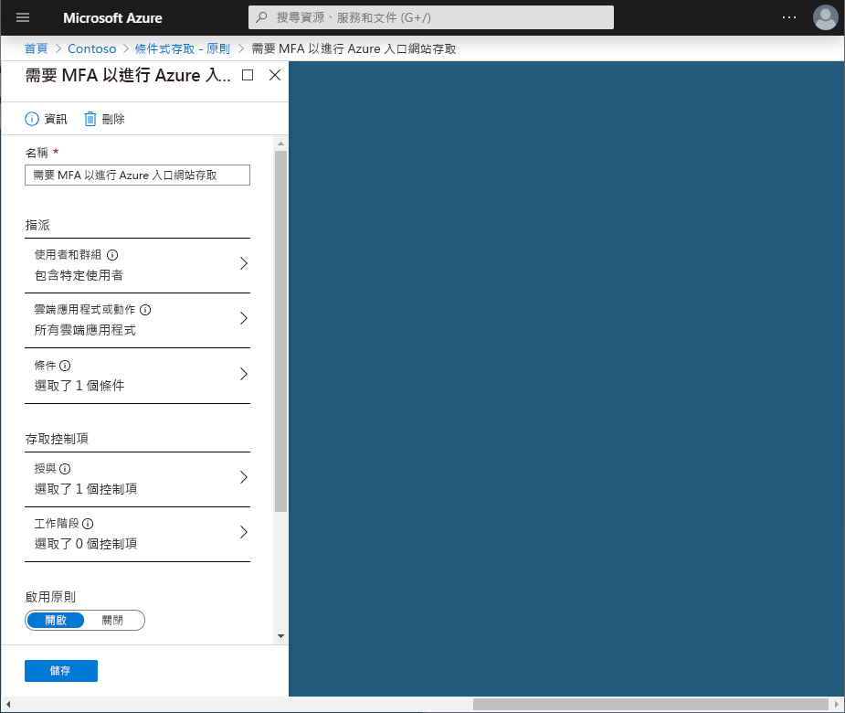

# 快速入門：透過 Azure Active Directory 條件式存取來要求特定應用程式必須使用 MFA 

為了簡化使用者的登入體驗，您可以讓他們透過使用者名稱和密碼登入您的雲端應用程式。 不過，在許多環境中應該至少有好幾種應用程式建議必須採用更為強式的帳戶驗證，例如多重要素驗證 (MFA)。 好比說，針對組織的電子郵件系統或 HR 應用程式的存取就可能需要這類驗證。 在 Azure Active Directory (Azure AD) 中，您可以使用條件式存取原則來完成上述目標。    

本快速入門示範如何針對環境中所選的雲端應用程式，將 [Azure AD 條件式存取原則](../active-directory-conditional-access-azure-portal.md)設為需要使用多重要素驗證。

如果您沒有 Azure 訂用帳戶，請在開始前建立 [免費帳戶](https://azure.microsoft.com/free/?WT.mc_id=A261C142F) 。

## 必要條件 

若要完成本快速入門中的案例，您需要：

- **Azure AD Premium 版的存取權** - Azure AD 條件式存取是 Azure AD Premium 中的功能。 

- **稱為 Isabella Simonsen 的測試帳戶** - 如果您不知道如何建立測試帳戶，請參閱[新增雲端式使用者](../fundamentals/add-users-azure-active-directory.md#add-a-new-user)。

## 測試您的登入

此步驟的目標是取得登入體驗的印象，而不需要條件式存取原則。

**若要初始化您的環境：**

1. 以 Isabella Simonsen 身分登入 Azure 入口網站。

2. 登出。

## 建立條件式存取原則 

本節說明如何建立必要的條件式存取原則。 本快速入門中的案例會使用：

- Azure 入口網站；作為必須使用 MFA 的雲端應用程式預留位置。 
- 您的範例使用者；用來測試條件式存取原則。  

為您的原則進行下列設定：

|設定 |值|
|---     | --- |
|使用者和群組 | Isabella Simonsen |
|雲端應用程式 | Microsoft Azure 管理 |
|授與存取權 | 需要多重要素驗證 |
 

 

**設定條件式存取原則：**

1. 以全域管理員、安全性系統管理員或條件式存取系統管理員的身分，登入 [Azure 入口網站](https://portal.azure.com)。

2. 在 Azure 入口網站的左側導覽列上，按一下 [Azure Active Directory]。 

    

3. 在 [Azure Active Directory] 頁面的 [管理] 區段中，按一下 [條件式存取]。

    
 
4. 在 [條件式存取] 頁面頂端的工具列中，按一下 [新增]。

    

5. 在 [新增] 頁面的 [名稱] 文字方塊中，鍵入「必須使用 MFA 才能存取 Azure 入口網站」。

    

6. 在 [指派] 區段中，按一下 [使用者和群組]。

    

7. 在 [使用者和群組] 頁面上，執行下列步驟︰

    

    a. 按一下 [選取使用者和群組]，然後選取 [群組設定]。

    b. 按一下 [選取] 。

    c. 在 [選取] 頁面上，選取 [Isabella Simonsen]，然後按一下 [選取]。

    d. 在 [使用者和群組] 頁面上，按一下 [完成]。

8. 按一下 [雲端應用程式]。

    

9. 在 [雲端應用程式] 頁面上，執行下列步驟︰

    

    a. 按一下 [選取應用程式]。

    b. 按一下 [選取] 。

    c. 在 [選取] 頁面中，選取 [Microsoft Azure 管理]，然後按一下 [選取]。

    d. 在 [雲端應用程式] 頁面上，按一下 [完成]。

10. 在 [存取控制] 區段中，按一下 [授與]。

    

11. 在 [授與] 頁面上，執行下列步驟︰

    

    a. 選取 [授與存取權]。

    a. 選取 [需要 Multi-Factor Authentication]。

    b. 按一下 [選取] 。

12. 在 [啟用原則] 區段中，按一下 [開啟]。

    

13. 按一下頁面底部的 [新增] 。

## 評估模擬的登入狀況

現在您已設定條件式存取原則，建議您查看它是否如預期般運作。 第一個步驟是使用條件式存取 What If 原則工具，模擬您測試使用者的登入情況。 該模擬可評估此登入對原則所造成的影響，並產生模擬報告。  

若要初始化 What If 原則評估工具，請設定下列項目：

- 將 **Isabella Simonsen** 設為使用者 
- 將 [Microsoft Azure 管理] 設為雲端應用程式

 按一下 [What If] 建立模擬報表，即會顯示：

- [會套用的原則] 下方顯示 [Require MFA for Azure portal access] \(必須使用 MFA 才能存取 Azure 入口網站\) 
- [需要多重要素驗證] 顯示為 [授與控制]。

**建立條件式存取原則：**

1. 在 [條件式存取 - 原則](https://portal.azure.com/#blade/Microsoft_AAD_IAM/ConditionalAccessBlade/Policies) 頁面頂端的功能表中，按一下 [What If]。  
 
    

2. 按一下 **使用者**，選取 **Isabella Simonsen**，然後按一下 **選取**。

    

2. 若要選取雲端應用程式，請執行下列步驟：

    

    a. 按一下 [雲端應用程式]。

    b. 在 [雲端應用程式] 頁面上，按一下 [選取應用程式]。

    c. 按一下 [選取] 。

    d. 在 [選取] 頁面中，選取 [Microsoft Azure 管理]，然後按一下 [選取]。

    e. 在 [雲端應用程式] 頁面上，按一下 [完成]。

3. 按一下 [What If]。

## 測試條件式存取原則

在上一節中，您已經學會如何評估模擬的登入狀況。 除了模擬，您也應該測試條件式存取原則，以確保它如預期般運作。 

若要測試原則，請再次使用 **Isabella Simonsen** 測試帳戶來嘗試登入 [Azure 入口網站](https://portal.azure.com)。 此時應該會顯示一個對話方塊，要求您設定帳戶以進行其他安全性驗證。

## 清除資源

當您不再需要測試使用者與條件式存取原則時，即可予以刪除：

- 如果您不知道如何刪除 Azure AD 使用者，請參閱[從 Azure AD 刪除使用者](../fundamentals/add-users-azure-active-directory.md#delete-a-user)。

- 若要刪除原則，請選取您的原則，然後按一下快速存取工具列的 [刪除]。

    

## 後續步驟

> [!div class="nextstepaction"]
> [需要接受使用條款](require-tou.md)
> [偵測到有工作階段風險時封鎖存取](app-sign-in-risk.md)
