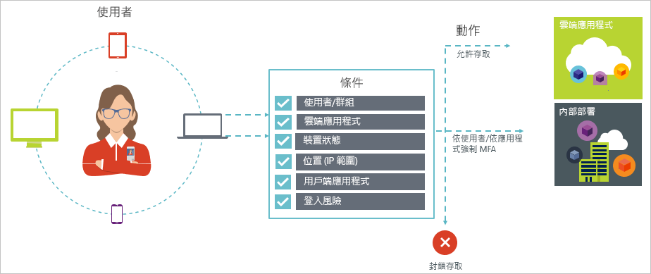

# 什麼是 Azure Active Directory 中的條件式存取？

安全性是使用雲端之組織的首要考量。 就管理雲端資源而言，雲端安全性的關鍵層面就是身分識別和存取。 在行動優先、雲端至上的世界中，使用者可以使用各種裝置和應用程式、從任何位置存取您組織的資源。 因此，只將焦點放在誰可以存取資源，已不再足夠。 為了掌控安全性與生產力之間的平衡，您在進行存取控制決策時，也必須考量資源存取方式因素。 有了 Azure Active Directory (Azure AD) 條件式存取，您就能夠因應這項需求。 條件式存取是 Azure Active Directory 的功能。 使用條件式存取，您便可以實作會根據條件存取雲端應用程式的自動化存取控制決定。 

完成第一個要素驗證之後，即會強制執行條件式存取原則。 換句話說，條件式存取不適合用來作為計數器衡量拒絕服務 (DoS) 攻擊之類的機制。  

本文提供您 Azure AD 中條件式存取的概念性概觀。

## 常見案例

在行動第一、雲端第一的世界中，Azure Active Directory 可讓您從任何地方單一登入至裝置、應用程式和服務。 隨著裝置 (包括 BYOD)、公司網路外部作業、第三方 SaaS 應用程式的激增，您面臨到兩個對立的目標︰

- 讓使用者隨時隨地都具有生產力
- 隨時保護公司資產

藉由使用條件式存取原則，您可以在所需的條件下套用正確的存取控制。 Azure AD 條件式存取可在您需要時提供多一層的安全性，並在不需要時也不妨礙您的使用者。 

以下是條件式存取能夠有所幫助的一些常見存取考量：

- **[登入風險](conditions.md#sign-in-risk)**：Azure AD Identity Protection 會偵測登入風險。 如果偵測到的登入風險指出有不良執行者，您要如何限制存取？ 當您想要取得登入使用者是合法使用者的更有力證據時，該怎麼辦？ 當您的懷疑強烈到甚至足以封鎖定使用者存取應用程式時，又該怎麼辦？  

- **[網路位置](location-condition.md)**：從任何位置都可以存取 Azure AD。 如果執行存取嘗試的來源網路位置不在您的 IT 部門控制下，該怎麼辦？ 針對來自公司網路的存取嘗試，使用使用者名稱與密碼的組合可能就足以作為身分識別證明。 如果針對從世界上其他非預期國家或地區起始的存取嘗試，您要求提供更強力的證明，該怎麼辦？ 當您甚至想要封鎖來自特定位置的存取嘗試時，又該怎麼辦？  

- **[裝置管理](conditions.md#device-platforms)**：在 Azure AD 中，使用者可以從種類廣泛的裝置 (包括行動裝置，還有個人裝置) 存取雲端應用程式。 如果您要求只有使用您 IT 部門所管理裝置的人才能嘗試存取，該怎麼辦？ 當您甚至想要封鎖特定裝置類型存取您環境中的雲端應用程式時，又該怎麼辦？ 

- **[用戶端應用程式](conditions.md#client-apps)**：現今，您可以使用各種不同的應用程式類型 (例如 Web 型應用程式、行動應用程式或傳統型應用程式) 來存取許多雲端應用程式。 如果存取嘗試是使用造成已知問題的用戶端應用程式類型來執行的，該怎麼辦？ 如果您要求必須使用 IT 部門所管理的裝置才能使用某些應用程式類型，又該怎麼辦？ 

這些問題和相關解答代表了 Azure AD 條件式存取的常見存取案例。 條件式存取是 Azure Active Directory 的功能，可讓您使用以原則為基礎的方法來處理存取案例。

  

> [!VIDEO https://www.youtube.com/embed/eLAYBwjCGoA]

## 條件式存取原則

條件式存取原則是使用了下列模式的存取案例定義：

**Then do this** 會指定您原則的回應。 請務必注意，條件式存取原則的目標不是要授與對雲端應用程式的存取權。 在 Azure AD 中，授與對雲端應用程式的存取權是使用者指派所要處理的主題。 藉由條件式存取原則，您將可以控制已獲授權的使用者 (已取得雲端應用程式存取權的使用者) 在特定的條件下如何存取雲端應用程式。 在您的回應中，您將強制額外的需求，例如多重要素驗證、受控裝置等。 在 Azure AD 條件式存取內容中，您原則所強制的需求稱為存取控制。 以最嚴格的限制形式來說，您的原則可以封鎖存取。 如需詳細資訊，請參閱 [Azure Active Directory 條件式存取中的存取控制](controls.md)。
     

**When this happens** 定義了觸發您原則的原因。 此原因是以一組已滿足的條件為特徵。 在 Azure AD 條件式存取中，有兩個指派條件扮演特殊的角色：

- **[使用者](conditions.md#users-and-groups)**：執行存取嘗試的使用者 (**執行者**)。 

- **[雲端應用程式](conditions.md#cloud-apps)**：存取嘗試的目標 (**目標**)。    

這兩個條件是條件式存取原則中的必要條件。 除了這兩個必要條件之外，您也可以納入說明存取嘗試執行方式的額外條件。 常見的範例包括使用您公司網路外的行動裝置或位置。 如需詳細資訊，請參閱 [Azure Active Directory 條件式存取中的條件](conditions.md)。   

條件與存取控制的組合即代表了條件式存取原則。 

藉由 Azure AD 條件式存取，您將可以控制已獲授權的使用者如何存取您的雲端應用程式。 條件式存取原則的目標是要在對雲端應用程式的存取嘗試上，實施以存取嘗試執行方式為基礎的額外存取控制。

使用以原則為基礎的方法來為您的雲端應用程式提供存取保護，可讓您使用本文簡述的結構來開始草擬您環境的原則需求，而無須擔心技術方面的實作。 

## Azure AD 條件式存取和同盟驗證

條件式存取原則可完美地與[同盟驗證](../../security/azure-ad-choose-authn.md#federated-authentication)搭配使用。 此支援包括所有支援的條件及控制項，以及可了解如何使用 [Azure AD 報告](../reports-monitoring/concept-sign-ins.md)將原則套用至作用中的使用者登入。

「使用 Azure AD 進行同盟驗證」表示受信任驗證服務會處理 Azure AD 的使用者驗證。 受信任的驗證服務可能是 Active Directory 同盟服務 (AD FS)，或任何其他同盟服務。 在此組態中，主要的使用者驗證會在服務上執行，而 Azure AD 會用來登入個別的應用程式。 需先套用 Azure AD 條件式存取，才能將存取權授與使用者要存取的應用程式。 

如果設定的條件式存取原則需要多重要素驗證，Azure AD 預設會使用 Azure MFA。 如果您使用同盟服務來進行 MFA，您可以在 [PowerShell](https://docs.microsoft.com/powershell/module/msonline/set-msoldomainfederationsettings) 中將 `-SupportsMFA` 設定為 `$true`，以在需要 MFA 時，將 Azure AD 重新導向至同盟服務。 此設定適用於支援 MFA 查問要求 (由 Azure AD 使用`wauth= http://schemas.microsoft.com/claims/multipleauthn` 所提出) 的同盟驗證服務。

當使用者登入同盟驗證服務之後，Azure AD 會處理其他原則需求，例如裝置合規性或核准的應用程式。

## 使用條件式存取的授權需求

使用條件式存取需要 Azure AD Premium 授權。 若要尋找適用於您需求的正確授權，請參閱[比較 Free、Basic 及 Premium 版本的正式運作功能](https://azure.microsoft.com/pricing/details/active-directory/)。

## 後續步驟

- 如果您想要深入了解：
    - 條件，請參閱 [Azure Active Directory 條件式存取中的條件](conditions.md)。

    - 存取控制，請參閱 [Azure Active Directory 條件式存取中的存取控制](controls.md)。

- 如果您想要取得設定條件式存取原則的某些經驗，請參閱[利用 Azure Active Directory 條件式存取來取得特定應用程式的 MFA](app-based-mfa.md)。

- 如果您想要具有建議原則的逐步部署計劃，請參閱[條件式存取部署計劃](https://aka.ms/conditionalaccessdeploymentplan)
