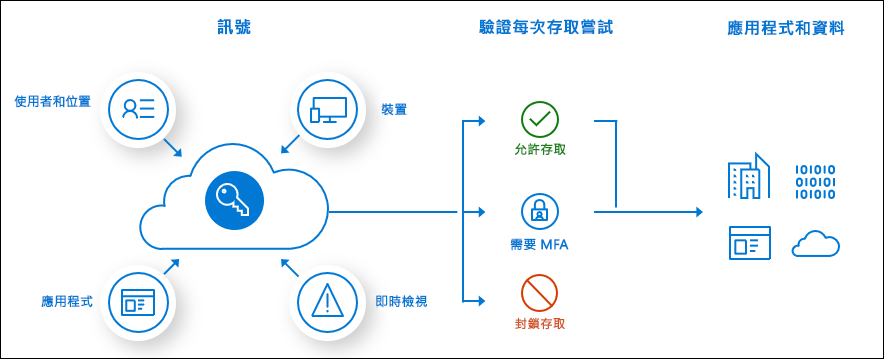

# 何謂條件式存取？

新式安全性的範圍現在已延伸到組織的網路之外，可包含使用者和裝置身分識別。 組織可以利用這些身分識別訊號作為其存取控制決策的一部分。 

條件式存取是 Azure Active Directory 用來將訊號結合在一起、進行決策及強制執行組織原則的工具。 條件式存取如何成為新身分識別導向控制平面的核心。

最簡單的條件式存取原則就是 if-then 陳述式，如果使用者想要存取資源，那麼他們就必須完成動作。 範例：薪資管理員想要存取薪資應用程式，而且必須執行多重要素驗證才能進行存取。

系統管理員面臨兩個主要目標：

- 讓使用者隨時隨地都具有生產力
- 保護組織的資產

藉由使用條件式存取原則，您可以在需要時套用正確的存取控制，以確保組織處於安全狀態，並在不需要時阻擋使用者的存取。

完成第一個要素驗證之後，即會強制執行條件式存取原則。 條件式存取不適合作為組織面對拒絕服務 (DoS) 攻擊之類情節的第一道防線，但是可以利用來自這些事件的訊號來決定存取權。

## 一般訊號

條件式存取在做出原則決策時可以考慮的常見訊號包括下列訊號：

- 使用者或群組成員資格
   - 原則能夠以特定使用者和群組為目標，讓系統管理員更精細地控制存取。
- IP 位置資訊
   - 組織可以建立信任的 IP 位址範圍，以便在做出原則決策時使用。 
   - 系統管理員可以指定整個國家/地區的 IP 範圍，以封鎖或允許來自其中的流量。
- 裝置
   - 在強制執行條件式存取原則時，可以使用具有特定平台裝置或其裝置以特定狀態標記的使用者。
- Application
   - 嘗試存取特定應用程式的使用者可以觸發不同的條件式存取原則。 
- 即時和計算的風險偵測
   - 訊號與 Azure AD Identity Protection 整合後，可讓條件式存取原則識別有風險的登入行為。 然後，原則就能強制使用者執行密碼變更或多重要素驗證，以降低其風險層級，或在系統管理員採取手動動作之前封鎖存取。
- Microsoft Cloud App Security (MCAS)
   - 即時監視和控制使用者應用程式的存取及工作階段，以提高雲端環境存取及其中所執行活動的可見度和控制權。

## 一般決策

- 封鎖存取
   - 最嚴格的決策
- 授與存取權
   - 最不嚴格的決策，仍然可以要求下列一個或多個選項：
      - 需要多重要素驗證
      - 裝置需要標記為符合規範
      - 需要已加入混合式 Azure AD 的裝置
      - 需要已核准的用戶端應用程式
      - 需要應用程式保護原則 (預覽)

## 一般會套用的原則

許多組織都有適用條件式存取原則的常見存取考量，例如：

- 針對具有系統管理角色的使用者，要求執行多重要素驗證
- Azure 管理工作需要多重要素驗證
- 封鎖嘗試使用舊版驗證通訊協定的使用者登入
- 需要適用於 Azure Multi-Factor Authentication 註冊的信任位置
- 封鎖或授與特定位置的存取權
- 封鎖有風險的登入行為
- 需要由組織管理的裝置來使用特定應用程式

## 授權需求

[!INCLUDE [Active Directory P1 license](../../../includes/active-directory-p1-license.md)]

擁有 [Microsoft 365 商務版授權](https://docs.microsoft.com/office365/servicedescriptions/microsoft-365-service-descriptions/microsoft-365-business-service-description)的客戶也有條件式存取功能的存取權。 

## 後續步驟

[逐步建置條件式存取原則](concept-conditional-access-policies.md)

若要了解如何在環境中實作條件式存取，請參閱[在 Azure Active Directory 中規劃條件式存取部署](plan-conditional-access.md)。

[了解 Identity Protection](../identity-protection/overview-v2.md)

[了解 Microsoft Cloud App Security](https://docs.microsoft.com/cloud-app-security/what-is-cloud-app-security)

[了解 Microsoft Intune](https://docs.microsoft.com/intune/index)