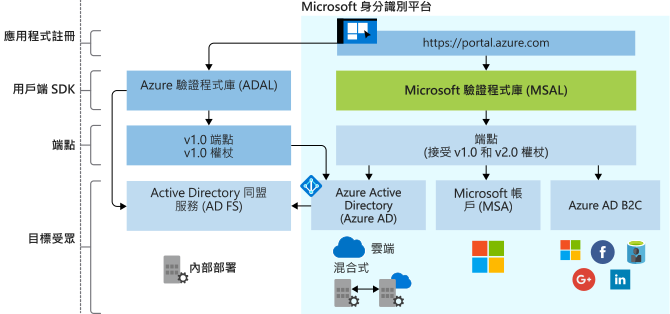

# Microsoft 身分識別平台的演化

Microsoft 身分識別平台是 Azure Active Directory (Azure AD) 開發人員平台的演化。 它可讓開發人員建置可登入使用者的應用程式，並取得權杖以呼叫 Microsoft Graph 等 API，或開發人員所建置的 API。 它是由驗證服務、開放原始碼程式庫、應用程式註冊與設定 (透過開發人員平台與應用程式 API)、完整開發人員文件、快速入門範例、程式碼範例、教學課程、操作說明指南與其他開發人員內容所組成。 Microsoft 身分識別平台支援業界標準通訊協定，例如 OAuth 2.0 與 OpenID Connect。

到目前為止，大部分的開發人員都曾藉由向 Azure AD v1.0 端點要求權杖 (使用 Azure AD 驗證程式庫 (ADAL)、用於應用程式註冊與設定的 Azure 入口網站，以及用於程式化應用程式設定的 Azure AD Graph API)，使用 Azure AD v1.0 平台來驗證公司與學校帳戶 (由 Azure AD 所佈建)。

您可以使用 Microsoft 身分識別平台 (v2.0) 觸及以下類型的使用者：

- 公司和學校帳戶 (Azure AD 佈建的帳戶)
- 個人帳戶 (例如 Outlook.com 或 Hotmail.com)
- 透過 Azure AD B2C 供應項目自攜其電子郵件或社交身分識別 (例如 LinkedIn、Facebook、Google) 的客戶

透過整合的 Microsoft 身分識別平台，您只需撰寫程式碼一次，即可對任何進入您應用程式的 Microsoft 身分識別進行驗證。 此外，也有受到完整支援的開放原始碼程式庫 (名為 Microsoft 驗證程式庫 (MSAL)) 可用於數個平台。 MSAL 是使用 Microsoft 安全開發週期 (SDL) 進行開發的，其用法很簡單，可為您的使用者提供絕佳的單一登入 (SSO) 體驗，並協助您達到高度的可靠性和效能。 在呼叫 API 時，您可以設定應用程式以利用累加式同意，讓您能夠等到應用程式在執行階段的使用情形能夠提供相關保證後，再針對較具侵入性的領域提出同意的要求。

您可以使用 Azure 入口網站來註冊及設定您的應用程式，並使用 Microsoft Graph API 進行程式化應用程式設定。

以您自己的步調更新應用程式。 使用 ADAL 程式庫建置的應用程式會繼續受到支援。 此外也支援混合式應用程式組合 (包含使用 ADAL 建置的應用程式和使用 MSAL 程式庫建置的應用程式)。 這表示使用最新 ADAL 和最新 MSAL 的應用程式，將透過這些程式庫之間的共用權杖快取在整個組合中提供 SSO。 從 ADAL 更新至 MSAL 的應用程式在升級後將維持使用者登入狀態。

## Microsoft 身分識別平台體驗

下圖顯示 Microsoft 身分識別體驗的高階概觀，包括應用程式註冊體驗、SDK、端點，以及支援的身分識別。

### 應用程式註冊體驗

Azure 入口網站 **[應用程式註冊](https://go.microsoft.com/fwlink/?linkid=2083908)** 體驗是一項入口網站體驗，可用來管理已與 Microsoft 身分識別平台整合的所有應用程式。 如果您過去都使用應用程式註冊入口網站，請開始改用 Azure 入口網站應用程式註冊體驗。

若要與 Azure AD B2C 整合 (在驗證社交或本機身分識別時)，您必須在 B2C 租用戶中註冊您的應用程式。 這項體驗也是 Azure 入口網站的一部分。

**Microsoft Graph 中的應用程式 API** 目前為預覽狀態。 使用此 API 可讓您以程式設計方式設定與 Microsoft 身分識別平台整合的應用程式，以驗證任何 Microsoft 身分識別。 不過，在此 API 開始正式運作前，您應使用 Azure AD Graph 1.6 API 和應用程式資訊清單。

### MSAL 程式庫

您可以使用 MSAL 程式庫建置可驗證所有 Microsoft 身分識別的應用程式。 .NET 和 JavaScript 中的 MSAL 程式庫已正式運作。 適用於 iOS 和 Android 的 MSAL 程式庫是預覽版本，適合在生產環境中使用。 我們對預覽階段的 MSAL 程式庫提供的生產層級支援，相當於我們對正式運作的 MSAL 和 ADAL 版本所提供的支援。

您也可以使用 MSAL 程式庫將您的應用程式與 Azure AD B2C 整合。

用來建置 Web 應用程式和 Web API 的伺服器端程式庫已正式運作：[ASP.NET](https://docs.microsoft.com/aspnet/overview) 和 [ASP.NET Core](https://docs.microsoft.com/aspnet/core/?view=aspnetcore-2.2)

### Microsoft 身分識別平台端點

Microsoft 身分識別平台 (v2.0) 端點現已通過 OIDC 認證。 它可與 Microsoft 驗證程式庫 (MSAL) 或任何其他符合標準的程式庫搭配運作。 它會根據業界標準實作人類可讀的範圍。

## 後續步驟

深入了解 v1.0 與 v2.0。

* [Microsoft 身分識別平台 (v2.0) 概觀](v2-overview.md)
* [開發人員適用的 Azure Active Directory (v1.0) 概觀](v1-overview.md)
