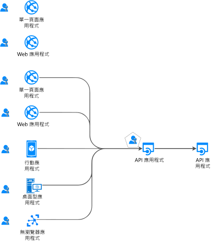
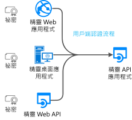

# 驗證流程和應用程式情節

Microsoft 身分識別平台 (v2.0) 端點支援各種新式應用程式架構的驗證，它們全都以產業標準通訊協定 [OAuth 2.0 或 OpenID Connect](active-directory-v2-protocols.md) 為基礎。  使用[驗證程式庫](reference-v2-libraries.md)，應用程式可對身分識別進行驗證並取得權杖，以存取受保護的 API。 此文章說明不同的驗證流程，以及使用這些驗證流程的應用程式情節。  此文章還提供[應用程式情節和支援的驗證流程](#scenarios-and-supported-authentication-flows)以及[應用程式情節和支援的平台及語言](#scenarios-and-supported-platforms-and-languages)的清單。

## 應用程式類別

您可以從數種應用程式類型取得權杖：Web 應用程式、行動裝置或傳統型應用程式、Web API 以及在沒有瀏覽器 (或 iOT) 之裝置上執行的應用程式。 應用程式可依下列方式分類：

- [受保護的資源與用戶端應用程式](#protected-resources-vs-client-applications)。 某些情節是關於保護資源 (Web 應用程式或 Web API)，而其他情節是關於取得安全性權杖來呼叫受保護的 Web API。
- [有使用者或沒有使用者](#with-users-or-without-users)。 某些情節牽涉到已登入的使用者，而其他情節則不牽涉到使用者 (精靈情節)。
- [單一頁面應用程式、公用用戶端應用程式和機密用戶端應用程式](#single-page-applications-public-client-applications-and-confidential-client-applications)。 以下是三種大型的應用程式類型類別。 用來操作它們的程式庫與物件將是不同的。
- [登入對象](v2-supported-account-types.md#certain-authentication-flows-dont-support-all-the-account-types)。 某些驗證流程無法供特定登入對象使用。 某些流程僅適用於公司或學校帳戶，有些可用於公司或學校帳戶與個人 Microsoft 帳戶。 允許的對象取決於驗證流程。
- [支援的 OAuth 2.0 流程](#scenarios-and-supported-authentication-flows)。  驗證流程是用來實作要求權杖的應用程式情節。  應用程式情節與驗證流程之間不會有一對一的對應。
- [支援的平台](#scenarios-and-supported-platforms-and-languages)。 並非所有應用程式情節都適用於每個平台。

### 受保護的資源與用戶端應用程式

驗證情節牽涉到兩個活動：

- 針對受保護的 Web API **取得安全性權杖**。 Microsoft 建議您使用[驗證程式庫](reference-v2-libraries.md#microsoft-supported-client-libraries)來取得權杖，特別是 Microsoft 驗證程式庫系列 (MSAL)
- **保護 Web API** (或 Web 應用程式)。 保護資源 (Web 應用程式或 Web API) 的挑戰之一，就是驗證安全性權杖。 Microsoft 在某些平台上提供[中介軟體程式庫](reference-v2-libraries.md#microsoft-supported-server-middleware-libraries)。

### 有使用者或沒有使用者

大部分的驗證情節會代表 (登入) **使用者**取得權杖。

不過也有一些情節 (精靈應用程式)，其中應用程式會代表其本身 (不含使用者) 取得權杖。

### 單一頁面應用程式、公用用戶端應用程式和機密用戶端應用程式

您可以從數種應用程式類型取得安全性權杖。 應用程式通常分成三種類別：

- **單一頁面應用程式** (SPA) 是 Web 應用程式的一種，其中權杖是從在瀏覽器中執行的應用程式 (以 JavaScript 或 Typescript 撰寫) 取得。 許多新式應用程式都有一個單頁應用程式前端，主要是以 JavaScript 撰寫。 通常會使用 Angular、React 或 Vue 等架構來撰寫應用程式。 MSAL.js 是唯一支援單一頁面應用程式的 Microsoft 驗證程式庫。

- **公用用戶端應用程式**一律會登入使用者。 這些應用程式包括：
  - 代表已登入使用者呼叫 Web API 的傳統型應用程式。
  - 行動裝置應用程式。
  - 第三類應用程式，在沒有瀏覽器的裝置上執行 (無瀏覽器應用程式，例如在 iOT 上執行)。

  它們是以名為 [PublicClientApplication](msal-client-applications.md) 的 MSAL 類別表示。

- **機密用戶端應用程式**
  - 呼叫 Web API 的 Web 應用程式
  - 呼叫 Web API 的 Web API
  - 精靈應用程式 (即使在 Linux 或 Windows 服務上作為主控台服務 (例如精靈) 實作也是如此)
 
  這些類型的應用程式使用 [ConfidentialClientApplication](msal-client-applications.md)

## 應用程式案例

Microsoft 身分識別平台端點支援各種應用程式架構的驗證：單一頁面應用程式、Web 應用程式、Web API、行動裝置與原生應用程式，以及精靈與伺服器端應用程式。  應用程式會使用各種驗證流程來登入使用者，並取得權杖以呼叫受保護的 API。

### 單一頁面應用程式

許多新式 Web 應用程式都會建置為以 JavaScript 或 SPA 架構 (例如 Angular、Vue.js 和 React.js) 撰寫的用戶端單頁應用程式。 這些應用程式會在網頁瀏覽器中執行，且具有與傳統伺服器端 Web 應用程式不同的驗證特性。 Microsoft 身分識別平台可讓單頁應用程式登入使用者，並取得權杖來存取後端服務或 Web API。

如需詳細資訊，請參閱[單頁應用程式](scenario-spa-overview.md)。

### 登入使用者的 Web 應用程式

若要**保護 Web 應用程式** (登入使用者)，您將會使用：

- 在 .NET 系列中，ASP.NET 或 ASP.NET Core 搭配 ASP.NET Open ID Connect 中介軟體使用。 實際上，保護資源牽涉到驗證安全性權杖，這是由[適用於 .NET 的 IdentityModel 延伸模組](https://github.com/AzureAD/azure-activedirectory-identitymodel-extensions-for-dotnet/wiki) \(英文\) 程式庫所完成，而非 MSAL 程式庫

- 如果您以 .Node.js 進行開發，您將會使用 Passport.js。

如需詳細資訊，請閱讀[登入使用者的 Web 應用程式](scenario-web-app-sign-user-overview.md)。

### 登入使用者並代表使用者呼叫 Web API 的 Web 應用程式

若要從 Web 應用程式代表使用者**呼叫 Web API**，請使用 MSAL `ConfidentialClientApplication`。 您將使用授權碼流程，將取得的權杖儲存在權杖快取中。 然後，控制器會在需要時以無訊息方式從快取中取得權杖。 MSAL 會視需要重新整理權杖。

如需詳細資訊，請閱讀 [Web 應用程式呼叫 Web API](scenario-web-app-call-api-overview.md)。

### 代表登入的使用者呼叫 Web API 的傳統型應用程式

若要從登入使用者的傳統型應用程式呼叫 Web API，請使用 MSAL 的 PublicClientApplication 的互動式權杖取得方法。 這些互動式方法可讓您控制登入 UI 的體驗。 為啟用此互動，MSAL 會利用網頁瀏覽器。

針對在加入 Windows 網域或加入 AAD 之電腦上執行的 Windows 裝載應用程式，還有另一種可能性。 這些應用程式可透過使用[整合式 Windows 驗證](https://aka.ms/msal-net-iwa)，以無訊息方式取得權杖。

在沒有瀏覽器的裝置上執行的應用程式，仍然可以代表使用者呼叫 API。 若要進行驗證，使用者必須登入具有網頁瀏覽器的其他裝置。 若要啟用此情節，您將必須使用[裝置程式碼流程](https://aka.ms/msal-net-device-code-flow) \(英文\)

最後，雖然不建議這樣做，但您可以在公用用戶端應用程式中使用[使用者名稱/密碼](https://aka.ms/msal-net-up)。 在某些情節中，仍然需要此流程 (例如 DevOps)，但請注意，使用它會對您的應用程式施加限制式。 例如，使用此流程的應用程式將無法登入需要執行多重要素驗證 (條件式存取) 的使用者。 這不會讓您的應用程式受益於單一登入。 以使用者名稱/密碼進行驗證違反了新式驗證的原則，僅供舊版的理由之用。

在傳統型應用程式中，如果您希望權杖快取是持續性的，則應該[自訂權杖快取序列化](https://aka.ms/msal-net-token-cache-serialization)。 您甚至可以透過實作[雙重權杖快取序列化](https://aka.ms/msal-net-dual-cache-serialization) \(英文\)，使用舊版驗證程式庫 (ADAL.NET 3.x 和 4.x) 啟用向後和向前相容的權杖快取。

如需詳細資訊，請閱讀[呼叫 Web API 的傳統型應用程式](scenario-desktop-overview.md)。

### 代表以互動方式登入的使用者呼叫 Web API 的行動裝置應用程式

類似傳統型應用程式，行動裝置應用程式將使用 MSAL 的 PublicClientApplication 互動式權杖取得方法，取得可呼叫 Web API 的權杖。

MSAL iOS 和 MSAL Android 預設會使用系統網頁瀏覽器。 不過，您也可以指示它使用內嵌的 Web View。 視行動平台而定，會有特例：(UWP、iOS、Android)。

某些情節 (涉及與裝置識別碼相關的條件式存取或要註冊的裝置) 要求您必須在裝置上安裝[代理程式](https://github.com/AzureAD/azure-activedirectory-library-for-dotnet/wiki/leveraging-brokers-on-Android-and-iOS) \(英文\)。 代理程式的範例包括 Microsoft 公司入口網站 (Android)、Microsoft Authenticator (Android 與 iOS)。 MSAL 現在能夠與代理程式互動。

> [!NOTE]
> 您的行動裝置應用程式 (使用 MSAL.iOS、MSAL.Android 或 MSAL.NET/Xamarin) 可以套用應用程式保護原則 (例如，防止使用者複製某些受保護的文字)。 這是[由 Intune 管理](https://docs.microsoft.com/intune/app-sdk)，並由 intune 辨識為受控應用程式。 [Intune SDK](https://docs.microsoft.com/intune/app-sdk-get-started) 獨立於 MSAL 程式庫之外，而且會自行與 AAD 交談。

如需詳細資訊，請閱讀[呼叫 Web API 的行動裝置應用程式](scenario-mobile-overview.md)。

### 受保護的 Web API

您可以使用 Microsoft 身分識別平台端點來保護 Web 服務，例如應用程式的 RESTful Web API。 使用存取權杖呼叫受保護的 Web API，以保護其資料及驗證傳入的要求。 Web API 的呼叫者會在 HTTP 要求的授權標頭尾部附加存取權杖。 如果您要保護 ASP.NET 或 ASP.NET Core Web API，則需要驗證存取權杖。 為此，您將使用 ASP.NET JWT 中介軟體。 實際上，驗證是由[適用於 .NET 的 IdentityModel 延伸模組](https://github.com/AzureAD/azure-activedirectory-identitymodel-extensions-for-dotnet/wiki)程式庫完成，而不是 MSAL.NET

如需詳細資訊，請參閱[受保護的 Web API](scenario-protected-web-api-overview.md)。

### 代表呼叫它的使用者呼叫另一個下游 Web API 的 Web API

此外，如果您希望 ASP.NET 或 ASP.NET Core 受保護的 Web API 代表使用者呼叫另一個 Web API，則應用程式需要透過使用 ConfidentialClientApplication 的方法 ([代表使用者](https://aka.ms/msal-net-on-behalf-of) \(英文\) 取得權杖) 取得下游 Web API 的權杖。 這也稱為服務對服務呼叫。
呼叫其他 Web API 的 Web API 還需要提供自訂快取序列化

  

如需詳細資訊，請閱讀[呼叫 Web API 的 Web API](scenario-web-api-call-api-overview.md)。

### 傳統型/服務或 Web 精靈應用程式在沒有使用者的情況下呼叫 Web API (以其自己的名稱)

應用程式如果具有長時間執行的程序，或其運作方式不需要使用者互動，就也需要一個存取受保護的 Web API 的方法。 這些應用程式可以使用應用程式的身分識別 (而非使用者委派的身分識別) 來驗證及取得權杖。 它們使用用戶端密碼或憑證來提供其身分識別。
您可以使用 MSAL 的 ConfidentialClientApplication 的[用戶端認證](https://aka.ms/msal-net-client-credentials)取得方法撰寫此類應用程式 (精靈應用程式)，以取得應用程式的權杖。 這些假設應用程式先前已使用 Azure AD 註冊密碼 (應用程式密碼或憑證或用戶端判斷提示)，然後再與此呼叫共用。

如需詳細資訊，請閱讀[呼叫 Web API 的精靈應用程式](scenario-daemon-overview.md)。

## 情節與支援的驗證流程

涉及取得權杖的案例也會對應至 [Microsoft 身分識別平台通訊協定](active-directory-v2-protocols.md)中所述的 OAuth 2.0 驗證流程

<table>
 <thead>
  <tr><th>案例</th> <th>詳細情節逐步解說</th> <th>OAuth 2.0 Flow/Grant</th> <th>對象</th></tr>
 </thead>
 <tbody>
  <tr>
   <td></td>
   <td><a href="scenario-spa-overview.md">單一頁面應用程式</a></td>
   <td><a href="v2-oauth2-implicit-grant-flow.md">隱含</a></td>
   <td>公司或學校帳戶與個人帳戶、B2C</td>
 </tr>

  <tr>
   <td></td>
   <td><a href="scenario-web-app-sign-user-overview.md">登入使用者的 Web 應用程式</a></td>
   <td><a href="v2-oauth2-auth-code-flow.md">授權碼</a></td>
   <td>公司或學校帳戶與個人帳戶、B2C</td>
 </tr>

  <tr>
   <td></td>
   <td><a href="scenario-web-app-call-api-overview.md">呼叫 Web API 的 Web 應用程式</a></td>
   <td><a href="v2-oauth2-auth-code-flow.md">授權碼</a></td>
   <td>公司或學校帳戶與個人帳戶、B2C</td>
 </tr>

  <tr>
   <td rowspan="3"></td>
   <td rowspan="4"><a href="scenario-desktop-overview.md">呼叫 Web API 的傳統型應用程式</a></td>
   <td>互動式 (具有 PKCE 的<a href="v2-oauth2-auth-code-flow.md">授權碼</a>)</td>
   <td>公司或學校帳戶與個人帳戶、B2C</td>
 </tr>

  <tr>
   <td>整合式 Windows 驗證</td>
   <td>公司或學校帳戶</td>
 </tr>

  <tr>
   <td><a href="v2-oauth-ropc.md">資源擁有者密碼</a></td>
   <td>公司或學校帳戶、B2C</td>
 </tr>

  <tr>
   <td></td>
   <td><a href="v2-oauth2-device-code.md">裝置程式碼</a></td>
   <td>公司或學校帳戶*</td>
 </tr>

 <tr>
   <td rowspan="2"></td>
   <td rowspan="2"><a href="scenario-mobile-overview.md">呼叫 Web API 的行動裝置應用程式</a></td>
   <td>互動式 (具有 PKCE 的<a href="v2-oauth2-auth-code-flow.md">授權碼</a>)</td>
   <td>公司或學校帳戶與個人帳戶、B2C</td>
 </tr>

  <tr>
   <td><a href="v2-oauth-ropc.md">資源擁有者密碼</a></td>
   <td>公司或學校帳戶、B2C</td>
 </tr>

  <tr>
   <td></td>
   <td><a href=scenario-daemon-overview.md">呼叫 Web API 的精靈應用程式</a></td>
   <td><a href="v2-oauth2-client-creds-grant-flow.md">用戶端認證</a></td>
   <td>僅限應用程式權限 (無使用者) 僅限 AAD 組織</td>
 </tr>

  <tr>
   <td></td>
   <td><a href=scenario-web-api-call-api-overview.md">呼叫 Web API 的 Web API</a></td>
   <td><a href="v2-oauth2-on-behalf-of-flow.md">代表</a></td>
   <td>公司或學校帳戶與個人帳戶</td>
 </tr>

 </tbody>
</table>

## 情節與支援的平台與語言

並非每個平台都可使用每種應用程式類型。 您也可以使用各種語言來建置應用程式。 Microsoft 驗證程式庫支援多種**平台** (JavaScript、.NET Framework、.NET Core、Windows 10/UWP、Xamarin.iOS、Xamarin.Android、原生 iOS、Mac OS、原生 Android、Java、Python)。 在下表中，針對 Windows，每次提及 .NET Core 時，.NET Framework 也可行 (會被省略以避免資料表雜亂)

|案例  | Windows | Linux | Mac | iOS | Android
|--|--|--|--|--|--|--|
| [單一頁面應用程式](scenario-spa-overview.md)   |  MSAL.js |  MSAL.js |  MSAL.js |  MSAL.js |  MSAL.js
| [登入使用者的 Web 應用程式](scenario-web-app-sign-user-overview.md)   |  ASP.NET Core |  ASP.NET Core |  ASP.NET Core
| [呼叫 Web API 的 Web 應用程式](scenario-web-app-call-api-overview.md)     |  ASP.NET Core + MSAL.NET   msal4j  Flask + MSAL Python|  ASP.NET Core + MSAL.NET  msal4j  Flask + MSAL Python|  ASP.NET Core + MSAL.NET  msal4j   Flask + MSAL Python
| [呼叫 Web API 的傳統型應用程式](scenario-desktop-overview.md)      | MSAL.NET  msal4j   MSAL Python| MSAL.NET msal4j  MSAL Python| MSAL.NET  msal4j  MSAL Python   MSAL.objc |
| [呼叫 Web API 的行動裝置應用程式](scenario-mobile-overview.md)    |  MSAL.NET  MSAL.NET | | |  MSAL.objc |  MSAL.Android
| [精靈應用程式](scenario-daemon-overview.md)    | MSAL.NET  msal4j  MSAL Python|  MSAL.NET  msal4j  MSAL Python| MSAL.NET  msal4j  MSAL Python
| [呼叫 Web API 的 Web API](scenario-web-api-call-api-overview.md)     |  ASP.NET Core + MSAL.NET  msal4j  MSAL Python|  ASP.NET Core + MSAL.NET  msal4j  MSAL Python|  ASP.NET Core + MSAL.NET  msal4j  MSAL Python

另請參閱 [Microsoft 支援的程式庫 (依 OS/語言)](reference-v2-libraries.md#microsoft-supported-libraries-by-os--language)

## 後續步驟
深入了解[驗證基本概念](authentication-scenarios.md)與[存取權杖](access-tokens.md)。
