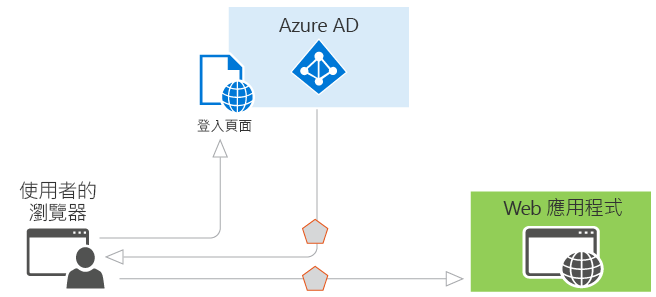
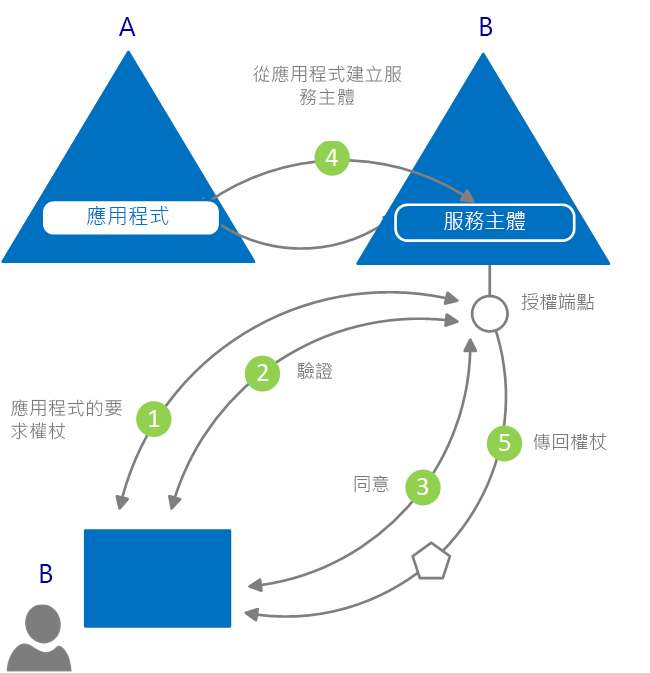

# 什麼是驗證？

*驗證*是向對象查問合法認證的動作，此動作可作為建立用於身分識別和存取控制之安全性主體的基礎。 更簡單來說，它是證明您確實是您本人的程序。 驗證 (Authentication) 有時會被簡稱為 AuthN。

*授權*是授與已驗證的安全性主體權限以執行某些工作的動作。 它會指定您可以存取哪些資料，以及可以將該資料用於哪些用途。 授權 (Authorization) 有時會被簡稱為 AuthZ。

Azure Active Directory (Azure AD) 可透過以服務的形式提供身分識別來簡化應用程式開發人員的驗證工作，並支援業界標準的通訊協定 (例如 OAuth 2.0 和 OpenID Connect)，以及適用於不同平台的開放原始碼程式庫，以協助您快速開始撰寫程式碼。

在 Azure AD 程式設計模型中有兩大使用案例︰

* 在 OAuth 2.0 授權授與流程期間：當資源擁有者授與授權給用戶端應用程式時，允許用戶端存取資源擁有者的資源。
* 在用戶端存取資源期間：和資源伺服器所實作的一樣，使用存取權杖所提供的宣告值來據以做出存取控制決定。

## Azure Active Directory 中的驗證基本概念

試想一下需要身分識別的最基本案例：網頁瀏覽器中的使用者需要向 Web 應用程式進行驗證。 下圖顯示此案例：

以下是您針對圖中所顯示的各種元件必須了解的相關事項：

* Azure AD 是身分識別提供者。 身分識別提供者負責驗證存在於組織目錄中之使用者和應用程式的身分識別，並在成功驗證那些使用者和應用程式時發出安全性權杖。
* 想要將驗證外包給 Azure AD 的應用程式，必須先在 Azure AD 中註冊。 Azure AD 會在目錄中註冊並唯一識別該應用程式。
* 開發人員可以使用開放原始碼 Azure AD 驗證程式庫，為您處理通訊協定的細節，以輕鬆完成驗證。 如需詳細資訊，請參閱 Azure AD [v2.0 驗證程式庫](reference-v2-libraries.md)和 [v1.0 驗證程式庫](active-directory-authentication-libraries.md)。
* 使用者通過驗證之後，應用程式必須驗證使用者的安全性權杖，以確定驗證成功。 您可以找到以各種不同語言和架構提供的快速入門、教學課程和程式碼範例，它們會說明應用程式必須執行哪些作業。
  * 若要快速建置應用程式並新增諸如取得權杖、重新整理權杖、將使用者登入、顯示部分使用者資訊等功能，請參閱文件的＜快速入門＞一節。
  * 若要取得適用於最常見驗證開發人員工作 (例如，取得存取權杖並使用它們呼叫 Microsoft Graph API 與其他 API、使用 OpenID Connect 搭配傳統網頁瀏覽器型應用程式實作「使用 Microsoft 登入」，以及其他工作) 的深入且以案例為基礎的程序，請參閱文件的＜教學課程＞一節。
  * 若要下載程式碼範例，請前往 [GitHub](https://github.com/Azure-Samples?q=active-directory) \(英文\)。
* 驗證程序的要求和回應流程是由您所使用的驗證通訊協定決定，例如 OAuth 2.0、OpenID Connect、WS-同盟或 SAML 2.0。 如需通訊協定的詳細資訊，請參閱文件＜概念＞底下的＜通訊協定＞一節。

在上述範例案例中，您可以依據這兩個角色區別應用程式：

* 需要安全存取資源的應用程式
* 扮演資源角色的應用程式

現在，您已具備基本概念的概觀，請繼續往下閱讀即可了解身分識別應用程式模型與 API、Azure AD 中佈建的運作方式，以及 Azure AD 所支援之常見案例的相關詳細資訊連結。

## 應用程式模型

Azure AD 會代表遵循特定模型的應用程式，此模型是為了滿足下列兩項主要功能而設計：

* **依據應用程式所支援的驗證通訊協定來識別該應用程式**：這涉及列舉所有識別碼、URL、祕密，以及於驗證時所需的相關資訊。 在這裡，Azure AD 會：

    * 保留在執行階段支援驗證所需的所有資料。
    * 保留用於決定應用程式可能需要存取哪些資源、是否應滿足特定要求，以及應在哪些情況下滿足的所有資料。
    * 提供用於在應用程式開發人員的租用戶中，以及針對任何其他 Azure AD 租用戶實作應用程式佈建的基礎結構。

* **在權杖要求期間處理使用者同意，並輔助跨租用戶的應用程式動態佈建**：在這裡，Azure AD 會：

    * 讓使用者與系統管理員能夠針對應用程式是否能代表他們存取資源，動態地授與或拒絕同意。
    * 授與管理員決定允許應用程式執行哪些作業、有哪些使用者可以使用特定應用程式，以及目錄資源之存取方式的最終決定權。

在 Azure AD 中，**應用程式物件**會將應用程式描述抽象實體。 開發人員會處理應用程式。 在部署期間，Azure AD 會使用指定的應用程式物件作為藍圖來建立**服務主體**，其代表目錄或租用戶內之應用程式的實體執行個體。 它是能定義應用程式在某個特定目標目錄中可執行哪些作業、誰可以使用該應用程式，以及該應用程式可存取哪些資源等的服務主體。 Azure AD 會透過**同意**從應用程式物件建立服務主體。

下圖顯示由同意驅動的簡化 Azure AD 佈建流程。

在這個佈建流程中：

|   |   |
|---|---|
| 1 | 來自 B 的使用者嘗試登入應用程式 |
| 2 | 系統會取得並驗證使用者認證 |
| 3 | 系統會提示使用者同意讓應用程式存取租用戶 B |
| 4 | Azure AD 會使用 A 中的應用程式物件作為藍圖，在 B 中建立服務主體 |
| 5 | 使用者會收到要求的權杖 |
|   |   |

您可以視需要針對其他租用戶 (C、D 等) 無數次地重複此程序。 目錄 A 會保留應用程式的藍圖 (應用程式物件)。 應用程式已取得同意之所有其他租用戶的使用者和系統管理員，都可以透過每個租用戶中相對應的服務主體物件，保留控制應用程式可執行哪些作業的能力。 如需詳細資訊，請參閱 [Azure AD 中的應用程式和服務主體物件](app-objects-and-service-principals.md)。

## Azure AD 安全性權杖中的宣告

Azure AD 所簽發的安全性權杖 (存取權杖和識別碼權杖) 包含宣告或已驗證主體的相關資訊聲明。 應用程式可使用宣告進行各種工作，包括：

* 驗證權杖
* 識別主體的目錄租用戶
* 顯示使用者資訊
* 判斷主體的授權

任何給定的安全性權杖中的宣告取決於權杖類型、用來驗證使用者的認證類型，以及應用程式組態。

下表提供由 Azure AD 發出的每一種宣告的簡短描述。 如需更詳細的資訊，請參閱由 Azure AD 發出的[存取權杖](access-tokens.md)和[識別碼權杖](id-tokens.md)。

| 宣告 | 說明 |
| --- | --- |
| 應用程式識別碼 | 識別使用權杖的應用程式。 |
| 觀眾 | 識別權杖針對的收件者資源。 |
| 應用程式驗證內容類別參考 | 指出如何驗證用戶端 (公用用戶端與機密用戶端的比較)。 |
| 驗證時刻 | 記錄驗證發生的日期和時間。 |
| 驗證方法 | 指出如何驗證權杖的主體 (密碼、憑證等)。 |
| 名字 | 提供 Azure AD 中設定的使用者名字。 |
| 群組 | 包含使用者所屬的 Azure AD 群組的物件識別碼。 |
| 身分識別提供者 | 記錄驗證權杖主體的身分識別提供者。 |
| 發出時間 | 記錄核發權杖的時間，通常用於權杖有效期限。 |
| 簽發者 | 識別發出權杖的 STS，以及 Azure AD 租用戶。 |
| 姓氏 | 提供 Azure AD 中設定的使用者姓氏。 |
| 名稱 | 提供人類看得懂的值，用以識別權杖的主體。 |
| 物件識別碼 | 包含主體在 Azure AD 中不可變的唯一識別碼。 |
| 角色 | 包含已授與使用者的 Azure AD 應用程式角色的易記名稱。 |
| 影響範圍 | 指出授與用戶端應用程式的權限。 |
| 主體 | 指出權杖判斷提示相關資訊的主體。 |
| 租用戶識別碼 | 包含發出權杖的目錄租用戶的不變唯一識別碼。 |
| 權杖存留期 | 定義權杖有效的時間間隔。 |
| 使用者主體名稱 | 包含主體的使用者主體名稱。 |
| 版本 | 包含權杖的版本號碼。 |

## 後續步驟

* 了解 [Azure Active Directory 中所支援的應用程式類型與案例](app-types.md)
