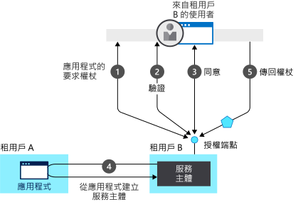

# 驗證基本概念

## 什麼是驗證

本文涵蓋許多您必須瞭解的驗證概念，以建立受保護的 web 應用程式、web Api 或呼叫受保護 Web Api 的應用程式。

**驗證**是證明您是誰所說的程式。 驗證 (Authentication) 有時會被簡稱為 AuthN。

**授權**是指授與已驗證的合作物件使用權限來執行某個作業的動作。 它會指定您可存取的資料，以及您可以對該資料執行的動作。 授權 (Authorization) 有時會被簡稱為 AuthZ。

應用程式不會建立每個應用程式來維護自己的使用者名稱和密碼資訊，而是在您需要跨多個應用程式新增或移除使用者時，產生高系統管理負擔，而應用程式可以將該責任委派給集中式身分識別提供者。

Azure Active Directory （Azure AD）是雲端中的集中式識別提供者。 將驗證和授權委派給它可啟用條件式存取原則，例如要求使用者位於特定位置、使用多重要素驗證，以及讓使用者登入一次，然後自動進行已登入所有共用相同集中式目錄的 web 應用程式。 這項功能稱為「單一登入」（SSO）。

集中式身分識別提供者對具有全球使用者且不一定要從商業網路登入的應用程式而言，更為重要。 Azure AD 會驗證使用者並提供存取權杖。 存取權杖是由授權伺服器所發出的安全性權杖。 其中包含使用者和權杖預定應用程式的相關資訊，可用於存取 Web Api 和其他受保護的資源。

Microsoft 身分識別平臺藉由提供身分識別即服務來簡化應用程式開發人員的驗證，並支援業界標準的通訊協定（例如 OAuth 2.0 和 OpenID Connect），以及適用于不同的開放原始碼程式庫可協助您快速開始撰寫程式碼的平臺。 它可讓開發人員建置應用程式以登入所有 Microsoft 身分識別、取得權杖以呼叫 Microsoft Graph、其他 Microsoft API 或開發人員所建置的 API。 如需詳細資訊，請參閱[Microsoft 身分識別平臺的演進](about-microsoft-identity-platform.md)。

### 租用戶

雲端身分識別提供者可服務許多組織。 為了讓不同組織的使用者分開，Azure AD 會分割成租使用者，每個組織有一個租使用者。

租使用者會追蹤使用者及其相關聯的應用程式。 Microsoft 身分識別平臺也支援使用個人 Microsoft 帳戶登入的使用者。

Azure AD 也提供 Azure Active Directory B2C，讓組織可以使用像是 Google 帳戶的社交身分識別，來登入使用者（通常是客戶）。 如需詳細資訊，請參閱[Azure Active Directory B2C 檔](https://docs.microsoft.com/azure/active-directory-b2c)。

### 安全性權杖

安全性權杖包含使用者和應用程式的相關資訊。 Azure AD 使用包含宣告的 JSon 型權杖（Jwt）。 宣告會提供一個實體到另一個實體的判斷提示。 應用程式可以使用宣告來執行各種工作，例如：

* 驗證權杖
* 識別主體的目錄租使用者
* 顯示使用者資訊
* 判斷主體的授權

宣告是由索引鍵/值組所組成，提供下列資訊：

- 產生權杖的安全性權杖伺服器。
- 產生權杖的日期。
- 主體，例如使用者（守護程式除外）。
- 物件，這是產生權杖的應用程式。
- 要求權杖的應用程式（用戶端）。 在 web 應用程式的案例中，這可能與物件相同。

如需更詳細的宣告資訊，請參閱[存取權杖](access-tokens.md)和[識別碼權杖](id-tokens.md)。

它是由已產生權杖的應用程式、登入使用者的 web 應用程式，或被呼叫的 Web API 來驗證權杖。 權杖是由安全性權杖伺服器（STS）使用私密金鑰來簽署。 STS 會發佈對應的公開金鑰。 若要驗證權杖，應用程式會使用 STS 公用金鑰來驗證簽章，以確認簽章是使用私密金鑰所建立。

權杖只在有限的時間內有效。 通常，STS 會提供一對權杖：存取應用程式或受保護資源的存取權杖，以及當存取權杖接近過期時用來重新整理存取權杖的重新整理權杖。 

存取權杖會傳遞至 Web API，做為 `Authenticate` 標頭中的持有人權杖。 應用程式可以為 STS 提供重新整理權杖，如果使用者存取應用程式時未撤銷，則會取得新的存取權杖和新的重新整理權杖。 這就是處理離開企業之人員案例的方式。 當 STS 收到重新整理權杖時，如果使用者不再獲得授權，就不會發出另一個有效的存取權杖。

## 應用程式模型

應用程式可以登入使用者本身，或將登入委派給身分識別提供者。 若要瞭解 Azure AD 支援的登入案例，請參閱[驗證流程和應用程式案例](authentication-flows-app-scenarios.md)。

若要讓識別提供者知道使用者具有特定應用程式的存取權，使用者和應用程式都必須向識別提供者註冊。 當您向 Azure AD 註冊應用程式時，您會提供應用程式的身分識別設定，讓它能夠與 Azure AD 整合。 註冊應用程式也可讓您：

- 在登入對話方塊中自訂應用程式的商標。 這很重要，因為這是使用者在您的應用程式中的第一個使用經驗。
- 決定您是否要讓使用者只在屬於您的組織時才登入。 這是單一租使用者應用程式。 或允許使用者使用任何工作或學校帳戶登入。 這是多租使用者應用程式。 您也可以允許個人 Microsoft 帳戶，或來自連結傳入、Google 等的社交帳戶。
- 要求範圍許可權。 例如，您可以要求「使用者讀取」範圍，以授與讀取登入使用者設定檔的許可權。
- 定義定義 Web API 存取權的範圍。 一般而言，當應用程式想要存取您的 API 時，它必須要求您所定義之範圍的許可權。
- 與證明應用程式身分識別 Azure AD 的 Azure AD 共用秘密。  這在應用程式是機密用戶端應用程式的情況下是相關的。 機密用戶端應用程式是可安全保存認證的應用程式。 他們需要信任的後端伺服器來儲存認證。

註冊之後，應用程式將會獲得一個 GUID，應用程式會在要求權杖時，與 Azure AD 共用。 如果應用程式是機密用戶端應用程式，它也會共用密碼或公開金鑰，視憑證或密碼是否使用而定。

Microsoft 身分識別平臺會使用可滿足兩個主要功能的模型來表示應用程式：

依照支援的驗證通訊協定識別應用程式，並提供驗證所需的所有識別碼、Url、秘密和相關資訊。
Microsoft 身分識別平臺：

* 保留在執行時間支援驗證所需的所有資料。
* 保留所有資料，以決定應用程式可能需要存取哪些資源，以及在何種情況下應滿足指定的要求。
* 提供基礎結構，以在應用程式開發人員的租使用者內和任何其他 Azure AD 租使用者中執行應用程式布建。

在權杖要求期間處理使用者同意，並協助跨租使用者同意動態布建應用程式。資源擁有者會授與授權給用戶端應用程式，以存取受保護的資源（在特定許可權底下）。代表資源擁有者。 Microsoft 身分識別平臺：

* 讓使用者與系統管理員能夠針對應用程式是否能代表他們存取資源，動態地授與或拒絕同意。
* 授與管理員決定允許應用程式執行哪些作業、有哪些使用者可以使用特定應用程式，以及目錄資源之存取方式的最終決定權。

在 Microsoft 身分識別平臺中，**應用程式物件**會將應用程式描述為抽象實體。 在部署期間，Microsoft 身分識別平臺會使用應用程式物件作為藍圖來建立**服務主體**，以代表目錄或租使用者內應用程式的實體實例。 服務主體會定義應用程式可以在特定的目標目錄中實際執行的動作、誰可以使用它、可存取的資源等。 Microsoft 身分識別平臺會透過**同意**從應用程式物件建立服務主體。

下圖顯示由同意驅動的簡化 Microsoft 身分識別平台佈建流程。 它會顯示兩個租使用者（A 和 B）。 租使用者 A 擁有應用程式。 租使用者 B 透過服務主體將應用程式具現化。  

在這個佈建流程中：

1. 租用戶 B 的使用者嘗試透過應用程式登入，授權端點會要求應用程式提供權杖。
1. 系統會取得並驗證使用者認證以進行驗證。
1. 系統會提示使用者提供同意，讓應用程式取得對租使用者 B 的存取權。
1. Microsoft 身分識別平臺會使用租使用者 A 中的應用程式物件作為藍圖，在租使用者 B 中建立服務主體。
1. 使用者會收到要求的權杖。

您可以為其他租使用者重複此程式。 租用戶 A 會保留應用程式的藍圖 (應用程式物件)。 應用程式被授與同意之所有其他租使用者的使用者和管理員，可以透過每個租使用者中對應的服務主體物件，持續控制允許應用程式執行的動作。 如需詳細資訊，請參閱 [Microsoft 身分識別平台中的應用程式和服務主體物件](app-objects-and-service-principals.md)。

## 使用 Azure AD 的 Web 應用程式登入流程

當使用者在瀏覽器中導覽至 web 應用程式時，將會發生下列情況：

- Web 應用程式會決定使用者是否經過驗證。
- 如果使用者未經過驗證，web 應用程式會委派給 Azure AD 以登入使用者。 該登入將與組織的原則相容，這可能表示要求使用者輸入其認證、使用多重要素驗證，或完全不使用密碼（例如使用 Windows Hello）。
- 系統會要求使用者同意用戶端應用程式所需的存取權。 這就是為什麼需要向 Azure AD 註冊用戶端應用程式，讓 Azure AD 可以傳遞代表使用者已同意存取的權杖。

當使用者成功通過驗證時：

- Azure AD 將權杖傳送至 web 應用程式。
- 儲存的 cookie 會與 Azure AD 的網域相關聯，其中包含瀏覽器 cookie jar 中的使用者身分識別。 下次應用程式使用瀏覽器流覽至 Azure AD 的授權端點時，瀏覽器會顯示 cookie，讓使用者不必再次登入。 這也是 SSO 的達成方式。 Cookie 是由 Azure AD 所產生，而且只能由 Azure AD 瞭解。
- 然後，web 應用程式會驗證權杖。 如果驗證成功，web 應用程式會顯示受保護的頁面，並將會話 cookie 儲存在瀏覽器的 cookie jar 中。 當使用者流覽至另一個頁面時，web 應用程式會知道使用者是根據會話 cookie 進行驗證。

下列順序圖表摘要說明此互動：

### Web 應用程式如何判斷使用者是否已通過驗證

Web 應用程式開發人員可以指出所有或只是特定頁面都需要驗證。 例如，在 ASP.NET/ASP.NET Core 中，這是藉由將 `[Authorize]` 屬性新增至控制器動作來完成。 

這個屬性會讓 ASP.NET 檢查會話 cookie 是否存在，其中包含使用者的身分識別。 如果 cookie 不存在，ASP.NET 會將驗證重新導向至指定的識別提供者。 如果 Azure AD 識別提供者，web 應用程式會將驗證重新導向至 https://login.microsoftonline.com ，這會顯示登入對話方塊。

### Web 應用程式如何委派登入 Azure AD 並取得權杖

使用者驗證會透過瀏覽器進行。 OpenID 通訊協定會使用標準的 HTTP 通訊協定訊息。
- Web 應用程式會將 HTTP 202 （重新導向）傳送至瀏覽器，以使用 Azure AD。
- 當使用者通過驗證時，Azure AD 會透過瀏覽器使用重新導向，將權杖傳送至 web 應用程式。
- 重新導向是由 web 應用程式以重新導向 URI 的形式提供。 此重新導向 URI 會向 Azure AD 應用程式物件註冊。 可能會有數個重新導向 Uri，因為應用程式可以部署在數個 Url 上。 因此，web 應用程式也需要指定要使用的重新導向 URi。
- Azure AD 確認 web 應用程式所傳送的重新導向 URI 是應用程式的其中一個已註冊的重新導向 uri。

## 使用 Azure AD 的桌面和行動應用程式登入流程

上述流程適用于桌上型電腦和行動應用程式，並稍微不同。

桌面和行動應用程式可以使用內嵌的 Web 控制項或系統瀏覽器來進行驗證。 下圖顯示桌面或行動應用程式如何使用 Microsoft 驗證程式庫（MSAL）來取得存取權杖和呼叫 web Api。

MSAL 會使用瀏覽器來取得權杖，並在 web 應用程式中將驗證委派給 Azure AD。

由於 Azure AD 會在瀏覽器中儲存與 web 應用程式相同的身分識別 cookie，因此，如果原生或行動應用程式使用系統瀏覽器，它會立即取得 SSO 與對應的 web 應用程式。

根據預設，MSAL 會使用系統瀏覽器，但 .NET Framework 桌面應用程式除外，其中使用內嵌控制項來提供更整合的使用者體驗。

## 後續步驟

請參閱[Microsoft 身分識別平臺開發人員詞彙](developer-glossary.md)，以熟悉常見的詞彙。
請參閱[驗證流程和應用程式案例](authentication-flows-app-scenarios.md)，以深入瞭解驗證 Microsoft 身分識別平臺所支援的使用者的其他案例。
請參閱[MSAL 程式庫](msal-overview.md)，以瞭解可協助您開發使用 microsoft 帳戶的應用程式、Azure AD 帳戶，以及 Azure AD B2C 使用者全都在單一、簡化的程式設計模型中的 microsoft 程式庫。
