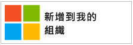
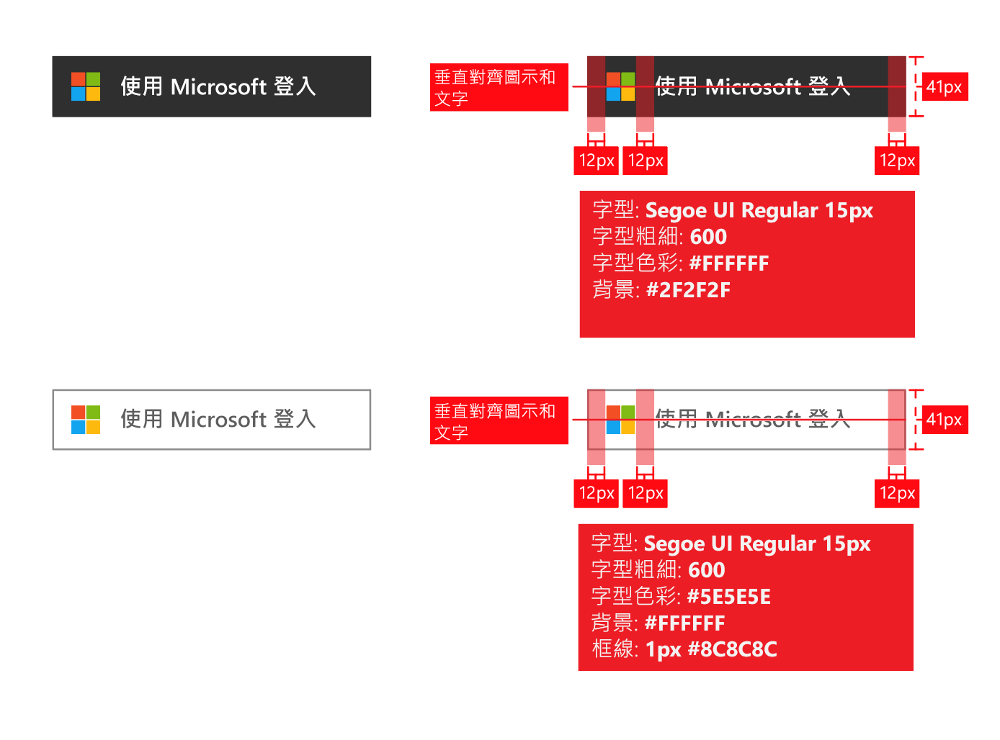

# 應用程式的商標指導方針

使用 Azure Active Directory (Azure AD) 開發應用程式時，您需要在客戶想使用其公司或學校帳戶 (在 Azure AD 中管理)，或使用其個人帳戶來註冊和登入您的應用程式時，為他們提供引導。

在本文中，您將：

- 了解由 Microsoft 管理的兩種使用者帳戶類型，以及如何在應用程式中參考 Azure AD 帳戶
- 了解如何在應用程式中加入並使用 Microsoft 標誌
- 下載官方**登入**或**使用 Microsoft 登入**影像，以在應用程式中使用
- 了解和品牌與導覽相關的可行與禁止事項

## 個人帳戶與 Microsoft 提供的工作或學校帳戶的比較

Microsoft 管理兩種類型的使用者帳戶：

- **個人帳戶** (之前稱為 Windows Live ID)。 這些帳戶代表 *個別* 使用者和 Microsoft 之間的關聯性，用於存取來自 Microsoft 的消費型裝置和服務。 這些帳戶主要供個人使用。
- **工作或學校帳戶。** 這些是使用 Azure Active Directory 的組織交由 Microsoft 代為管理的帳戶。 這些帳戶用來從 Microsoft 登入 Office 365 和其他商務服務。

Microsoft 工作或學校帳戶通常由其組織 (公司、 學校、政府機構) 指派給使用者 (員工、學生、聯邦員工)。 這些帳戶可直接在雲端 (在 Azure AD 平台) 中管理，或從內部部署目錄 (例如 Windows Server Active Directory) 同步處理到 Azure AD。 Microsoft 是工作或學校帳戶的 *保管者* ，但這些帳戶由組織擁有和控制。

## 在您的應用程式中提及 Azure AD 帳戶

Microsoft 不會在 Azure 或 Active Directory 品牌名稱上公開使用者，所以您也不應該如此。

- 當使用者登入之後，盡可能使用組織的名稱和標誌。 這比使用「您的組織」之類的通稱更好。
- 當使用者未登入時，將他們的帳戶稱為「工作或學校帳戶」，並使用 Microsoft 標誌來表達 Microsoft 會管理這些帳戶。 請勿使用「企業帳戶」、「商務帳戶」或「公司帳戶」之類的詞彙，這會造成使用者混淆。

## 使用者帳戶象形圖

在這些指導方針的較早版本中，我們建議使用「藍色徽章」象形圖。 根據使用者和開發人員的意見反應，我們現在建議改用 Microsoft 標誌。 Microsoft 標誌將有助於使用者了解，他們用於 Office 365 或其他 Microsoft 商務服務的帳戶，也可以重複用來登入您的應用程式。

## 使用 Azure AD 來註冊和登入

您的應用程式可能將註冊和登入劃分成不同的路徑，下列各節提供這兩個案例的視覺化導引。

**如果您的應用程式支援使用者註冊 (例如免費試用版或免費增值模式)**：您可以顯示 [登入] 按鈕，讓使用者利用其工作帳戶或個人帳戶來存取您的應用程式。 他們第一次存取您的應用程式時，Azure AD 會顯示同意提示。

**如果您的應用程式需要唯有系統管理員才能同意的權限，或應用程式需要組織授權**：請將系統管理員擷取與使用者登入分開。 **[取得此應用程式] 按鈕**會將系統管理員重新導向到登入，然後要求他們代表組織中的使用者來表示同意，這樣做的附加優點是可隱藏使用者同意您應用程式的提示。

## 取得應用程式的視覺化導引

[取得應用程式] 連結必須將使用者重新導向到 Azure AD 授與存取權 (授權) 頁面，讓組織的系統管理員可授權您的應用程式來存取由 Microsoft 代管的組織資料。 [整合應用程式與 Azure Active Directory](quickstart-v1-integrate-apps-with-azure-ad.md) 一文中詳細討論存取權的要求方式。

系統管理員同意您的應用程式之後，他們可以選擇將其新增至使用者的 Office 365 應用程式啟動器體驗 (可從非正式管道和 [https://portal.office.com/myapps](https://portal.office.com/myapps) 存取)。 如果您想要宣傳此功能，可以使用「將此應用程式加入至您的組織」之類的詞彙，並顯示類似下列範例的按鈕：

不過，我們建議您撰寫說明文字，而不要依賴按鈕。 例如︰

> *如果您已經使用 Office 365 或 Microsoft 的其他商務服務，您可以為 <your_app_name> 授與對您組織資料的存取權。* 這可讓使用者利用其現有的工作帳戶存取 <your_app_name>。

若要下載官方 Microsoft 標誌並在您的應用程式中使用，請以滑鼠右鍵按一下您要使用的標誌，然後將其儲存到您的電腦。

| 資產                                | PNG 格式 | SVG 格式 |
| ------------------------------------ | ---------- | ---------- |
| Microsoft 標誌  |  |  |

## 登入的視覺化導引

您的應用程式應該顯示登入按鈕，將使用者重新導向登入端點，此端點符合您用來與 Azure AD 整合的通訊協定。 下節提供該按鈕外觀的詳細資料。

### 象形圖和「使用 Microsoft 帳戶登入」

結合 Microsoft 標誌與「使用 Microsoft 帳戶登入」詞彙，才能在應用程式可能支援的其他身分識別提供者之中，彰顯 Azure AD 的獨特性。 如果沒有足夠的空間顯示「使用 Microsoft 帳戶登入」，可以縮短為「登入」。 您可以針對按鈕使用淡色或深色配置。

下圖顯示當您將資產與應用程式搭配使用時 Microsoft 建議使用的紅線。 紅線適用於「使用 Microsoft 登入」或較簡短的「登入」版本。

若要下載官方影像並在您的應用程式中使用，請以滑鼠右鍵按一下您要使用的影像，然後將其儲存到您的電腦。

| 資產                                | PNG 格式 | SVG 格式 |
| ------------------------------------ | ---------- | ---------- |
| 使用 Microsoft 登入 (深色佈景主題)  | ![[登入] 按鈕深色佈景主題 PNG](./media/howto-add-branding-in-azure-ad-apps/ms-symbollockup_signin_dark.png) | ![[使用 Microsoft 登入] 按鈕深色佈景主題 SVG](./media/howto-add-branding-in-azure-ad-apps/ms-symbollockup_signin_dark.svg) |
| 使用 Microsoft 登入 (淺色佈景主題) | ![[登入] 按鈕淺色佈景主題 PNG](./media/howto-add-branding-in-azure-ad-apps/ms-symbollockup_signin_light.png) | ![[使用 Microsoft 登入] 按鈕淺色佈景主題 SVG](./media/howto-add-branding-in-azure-ad-apps/ms-symbollockup_signin_light.svg) |
| 登入 (深色佈景主題)                 | ![[登入] 簡短按鈕深色佈景主題 PNG](./media/howto-add-branding-in-azure-ad-apps/ms-symbollockup_signin_dark_short.png) | ![[登入] 簡短按鈕深色佈景主題 SVG](./media/howto-add-branding-in-azure-ad-apps/ms-symbollockup_signin_dark_short.svg) |
| 登入 (淺色佈景主題)                | ![[登入] 簡短按鈕淺色佈景主題 PNG](./media/howto-add-branding-in-azure-ad-apps/ms-symbollockup_signin_light_short.png) | ![[登入] 簡短按鈕淺色佈景主題 SVG](./media/howto-add-branding-in-azure-ad-apps/ms-symbollockup_signin_light_short.svg) |

## 商標的建議與禁忌

**建議**將「工作或學校帳戶」與「使用 Microsoft 登入」按鈕結合使用，以提供更多說明協助使用者了解是否可使用它。 **禁止** 使用「企業帳戶」、「商務帳戶」或「公司帳戶」之類的其他詞彙。

**禁止**使用 "Office 365 ID" 或 "Azure ID"。 Office 365 也是 Microsoft 提供的消費型供應項目名稱，不會使用 Azure AD 進行驗證。

**禁止** 改變 Microsoft 標誌。

**禁止**在 Azure 或 Active Directory 品牌上公開使用者。 不過，對於開發人員、IT 專業人員和系統管理員，則可以使用這些詞彙。

## 導覽的建議與禁忌

**建議** 提供方法讓使用者登出並切換至另一個使用者帳戶。 雖然大部分的人只有一個 Microsoft/Facebook/Google/Twitter 個人帳戶，但往往與多個組織相關聯。 我們即將支援多重登入使用者。
