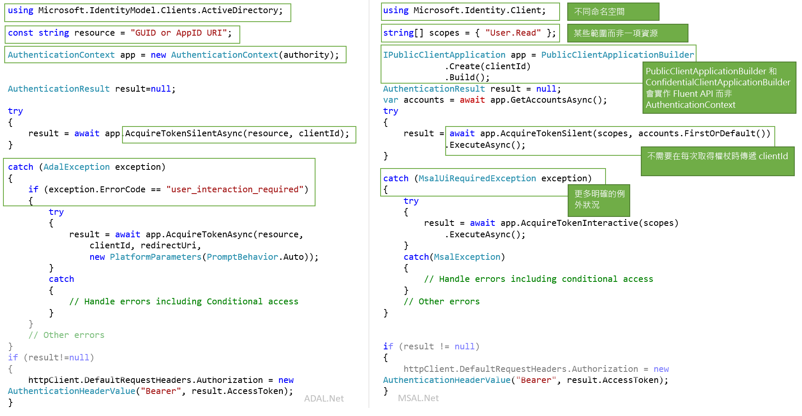

# <a name="migrating-applications-to-msalnet"></a>將應用程式遷移至 Azure

適用於 .NET 的 Microsoft 驗證程式庫 (MSAL.NET) 和適用於 .NET 的 Azure AD 驗證程式庫 (ADAL.NET) 都用來驗證 Azure AD 實體以及向 Azure AD 要求權杖。 到目前為止，大多數開發人員都已使用 Azure AD 驗證程式庫 (ADAL) 要求權杖，進而使用開發人員適用的 Azure AD 平台 (v1.0) 驗證 Azure AD 身分識別 (公司和學校帳戶)。 現在使用 MSAL.NET，您就可以透過 Microsoft 身分識別平台端點，驗證更廣泛的 Microsoft 身分識別 (Azure AD 身分識別和 Microsoft 帳戶，以及透過 Azure AD B2C 的社交和本機帳戶)。 

本文說明如何在適用於 .NET 的 Microsoft 驗證程式庫 (MSAL.NET) 和適用於 .NET 的 Azure AD 驗證程式庫 (ADAL.NET) 之間做選擇，並比較這兩個程式庫。  

## <a name="differences-between-adal-and-msal-apps"></a>ADAL 與 MSAL 應用程式之間的差異
在大部分情況下，您想使用 MSAL.NET 和 Microsoft 身分識別平台端點，也就是最新一代的 Microsoft 驗證程式庫。 使用 MSAL.NET 取得權杖，以供使用者利用 Azure AD (公司和學校帳戶)、Microsoft (個人) 帳戶 (MSA) 或 Azure AD B2C 登入您的應用程式。 

如果您已熟悉開發人員適用的 Azure AD (v1.0) 端點 (和 ADAL.NET)，您可以閱讀 [Microsoft 身分識別平台 (v2.0) 端點有何不同？](active-directory-v2-compare.md)。

不過，如果您的應用程式需要使用舊版的 [Active Directory 同盟服務 (ADFS)](/windows-server/identity/active-directory-federation-services) 登入使用者，您仍然需要使用 ADAL.NET。 如需詳細資訊，請參閱 [ADFS 支援](https://aka.ms/msal-net-adfs-support)。

下圖摘要說明 ADAL.NET 與 MSAL.NET 之間的一些差異：

### <a name="nuget-packages-and-namespaces"></a>NuGet 套件和命名空間

ADAL.NET 取用自 [Microsoft.IdentityModel.Clients.ActiveDirectory](https://www.nuget.org/packages/Microsoft.IdentityModel.Clients.ActiveDirectory) NuGet 套件。 要使用的命名空間為 `Microsoft.IdentityModel.Clients.ActiveDirectory`。

若要使用 MSAL.NET，您要新增 [Microsoft.Identity.Client](https://www.nuget.org/packages/Microsoft.Identity.Client) NuGet 套件，並使用 `Microsoft.Identity.Client` 命名空間。

### <a name="scopes-not-resources"></a>範圍，而非資源

ADAL.NET 可取得「資源」  的權杖，但 MSAL.NET 可取得「範圍」  的權杖。 有些 MSAL.NET AcquireToken 覆寫需要名為 scopes 的參數 (`IEnumerable<string> scopes`)。 此參數是簡單的字串清單，其宣告所需的權限和要求的資源。 知名的範圍是 [Microsoft Graph 範圍](/graph/permissions-reference)。

此外，也可以在 MSAL.NET 中存取 v1.0 資源。 請參閱 [v1.0 應用程式範圍](#scopes-for-a-web-api-accepting-v10-tokens)中的詳細資料。 

### <a name="core-classes"></a>核心類別

- ADAL.NET 使用 [AuthenticationContext](https://github.com/AzureAD/azure-activedirectory-library-for-dotnet/wiki/AuthenticationContext:-the-connection-to-Azure-AD) 作為您透過授權單位連線至 Security Token Service (STS) 或授權伺服器的表示法。 相反地，MSAL.NET 的設計是以[用戶端應用程式](https://github.com/AzureAD/microsoft-authentication-library-for-dotnet/wiki/Client-Applications)為主。 其提供兩個不同的類別：`PublicClientApplication` 和 `ConfidentialClientApplication`

- 取得權杖：ADAL.NET 和 MSAL.NET 具有相同的驗證呼叫 (ADAL.NET 適用的 `AcquireTokenAsync` 和 `AcquireTokenSilentAsync`，以及 MSAL.NET 適用的 `AcquireTokenInteractive` 和 `AcquireTokenSilent`)，但所需的參數不同。 其中一項差異就是在 MSAL.NET 中，您不必再於每次 AcquireTokenXX 呼叫中傳入應用程式的 `ClientID`。 建置 `IPublicClientApplication` 或 `IConfidentialClientApplication` 時，`ClientID` 確實只會設定一次。

### <a name="iaccount-not-iuser"></a>IAccount，而非 IUser

ADAL.NET 操作的使用者。 不過，不論使用者是一般人或軟體代理程式，都可以具有/擁有/負責 Microsoft 身分識別系統中的一或多個帳戶 (數個 Azure AD 帳戶、Azure AD B2C、Microsoft 個人帳戶)。 

MSAL.NET 2.x 現在可定義帳戶的概念 (透過 IAccount介面)。 這項重大變革提供了正確的語意：相同使用者在不同的 Azure AD 目錄中可有數個帳戶的這項事實。 此外，除了提供主帳戶資訊，MSAL.NET 還提供更理想的來賓案例資訊。

如需 IUser 與 IAccount 之間差異的詳細資訊，請參閱 [MSAL.NET 2.x](https://aka.ms/msal-net-2-released)。

### <a name="exceptions"></a>例外狀況

#### <a name="interaction-required-exceptions"></a>互動必要例外狀況

MSAL.NET 有更明確的例外狀況。 比方說，在 ADAL 中無訊息驗證失敗時，作業程序是攔截例外狀況並尋找 `user_interaction_required` 錯誤碼：

```csharp
catch(AdalException exception)
{
 if (exception.ErrorCode == “user_interaction_required”)
 {
  try
  {“try to authenticate interactively”}}
 }
}
```

請參閱使用 ADAL.NET [取得權杖的建議模式](https://github.com/AzureAD/azure-activedirectory-library-for-dotnet/wiki/AcquireTokenSilentAsync-using-a-cached-token#recommended-pattern-to-acquire-a-token)中的詳細資料。

使用 MSAL.NET 時，您會如 [AcquireTokenSilent](https://github.com/AzureAD/microsoft-authentication-library-for-dotnet/wiki/AcquireTokenSilentAsync-using-a-cached-token) 所述攔截 `MsalUiRequiredException`。

```csharp
catch(MsalUiRequiredException exception)
{
 try {“try to authenticate interactively”}
}
```

#### <a name="handling-claim-challenge-exceptions"></a>處理宣告挑戰例外狀況

在 ADAL.NET 中，宣告挑戰例外狀況會以下列方式處理：

- 如果資源需要更多來自使用者的宣告 (例如雙因素驗證)，則服務會擲回 `AdalClaimChallengeException` 例外狀況 (衍生自`AdalServiceException`)。 `Claims` 成員包含某些具有預期宣告的 JSON 片段。
- 還是在 ADAL.NET 中，接收此例外狀況的公用用戶端應用程式需要呼叫具有 claims 參數的 `AcquireTokenInteractive` 覆寫。 這個 `AcquireTokenInteractive` 覆寫甚至不會嘗試叫用快取，因為沒必要這麼做。 原因是快取中的權杖沒有正確的宣告 (否則就不會擲出 `AdalClaimChallengeException`)。 因此，不需要查看快取。 請注意，`ClaimChallengeException` 可以在進行 OBO 的 Web API 中接收，而 `AcquireTokenInteractive` 則需要在呼叫此 Web API 的公用用戶端應用程式中呼叫。
- 如需詳細資訊 (包括範例) 請參閱處理 [AdalClaimChallengeException](https://github.com/AzureAD/azure-activedirectory-library-for-dotnet/wiki/Exceptions-in-ADAL.NET#handling-adalclaimchallengeexception)

在 MSAL.NET 中，宣告挑戰例外狀況會以下列方式處理：

- `Claims` 會在 `MsalServiceException` 中呈現。
- `.WithClaim(claims)` 方法可套用至 `AcquireTokenInteractive` 產生器。 

### <a name="supported-grants"></a>支援的授與

MSAL.NET 和 v2.0 端點尚未支援所有的授與。 以下摘要說明 ADAL.NET 與 MSAL.NET 支援的授與比較。

#### <a name="public-client-applications"></a>公用用戶端應用程式

以下是 ADAL.NET 和 MSAL.NET 中針對傳統型和行動應用程式支援的授與：

授與 | ADAL.NET | MSAL.NET
----- |----- | -----
互動式 | [互動式驗證](https://github.com/AzureAD/azure-activedirectory-library-for-dotnet/wiki/Acquiring-tokens-interactively---Public-client-application-flows) | [在 MSAL.NET 中以互動方式取得權杖](https://github.com/AzureAD/microsoft-authentication-library-for-dotnet/wiki/Acquiring-tokens-interactively)
整合式 Windows 驗證 | [Windows (Kerberos) 上的整合式驗證](https://github.com/AzureAD/azure-activedirectory-library-for-dotnet/wiki/AcquireTokenSilentAsync-using-Integrated-authentication-on-Windows-(Kerberos)) | [整合式 Windows 驗證](msal-authentication-flows.md#integrated-windows-authentication)
使用者名稱/密碼 | [以使用者名稱和密碼取得權杖](https://github.com/AzureAD/azure-activedirectory-library-for-dotnet/wiki/Acquiring-tokens-with-username-and-password)| [使用者名稱密碼驗證](msal-authentication-flows.md#usernamepassword)
裝置程式碼流程 | [裝置 (不具網頁瀏覽器) 的裝置設定檔](https://github.com/AzureAD/azure-activedirectory-library-for-dotnet/wiki/Device-profile-for-devices-without-web-browsers) | [裝置程式碼流程](msal-authentication-flows.md#device-code)

#### <a name="confidential-client-applications"></a>機密用戶端應用程式

以下是 ADAL.NET 和 MSAL.NET 中針對 Web 應用程式、Web API 和精靈應用程式支援的授與：

應用程式類型 | 授與 | ADAL.NET | MSAL.NET
----- | ----- | ----- | -----
Web 應用程式、Web API、精靈 | 用戶端認證 | [ADAL.NET 中的用戶端認證流程](https://github.com/AzureAD/azure-activedirectory-library-for-dotnet/wiki/Client-credential-flows) | [MSAL.NET 中的用戶端認證流程](msal-authentication-flows.md#client-credentials)
Web API | 代表 | [使用 ADAL.NET 代表使用者進行服務對服務呼叫](https://github.com/AzureAD/azure-activedirectory-library-for-dotnet/wiki/Service-to-service-calls-on-behalf-of-the-user) | [在 MSAL.NET 中代表](msal-authentication-flows.md#on-behalf-of)
Web 應用程式 | 授權碼 | [在採用 ADAL.NET 的 Web 應用程式上取得包含授權碼的權杖](https://github.com/AzureAD/azure-activedirectory-library-for-dotnet/wiki/Acquiring-tokens-with-authorization-codes-on-web-apps) | [在採用 MSAL.NET 的 Web 應用程式上取得包含授權碼的權杖](msal-authentication-flows.md#authorization-code)

### <a name="cache-persistence"></a>快取持續性

ADAL.NET 可讓您使用 `BeforeAccess` 和 `BeforeWrite` 方法擴充 `TokenCache` 類別，以在沒有安全儲存體的平台 (.NET Framework 和 .NET Core) 上實作所需的持續性功能。 如需詳細資訊，請參閱 [ADAL.NET 中的權杖快取序列化](https://github.com/AzureAD/azure-activedirectory-library-for-dotnet/wiki/Token-cache-serialization)。

MSAL.NET 讓權杖快取成為密封類別，並移除其擴充功能。 因此，您的權杖快取持續性實作必須為協助程式類別的形式，其可與密封權杖快取進行互動。 [MSAL.NET 中的權杖快取序列化](https://github.com/AzureAD/microsoft-authentication-library-for-dotnet/wiki/token-cache-serialization)會說明此種互動。

## <a name="signification-of-the-common-authority"></a>常見授權單位的意義

在 v1.0 中，如果您使用 https://login.microsoftonline.com/common 授權單位，即可讓使用者使用任何 AAD 帳戶 (適用於任何組織) 登入。 請參閱 [ADAL.NET 中的授權單位驗證](https://github.com/AzureAD/azure-activedirectory-library-for-dotnet/wiki/AuthenticationContext:-the-connection-to-Azure-AD#authority-validation)

如果您在 v2.0 中使用 https://login.microsoftonline.com/common 授權單位，即可讓使用者使用任何 AAD 組織或 Microsoft 個人帳戶 (MSA) 登入。 在 MSAL.NET 中，如果您想要將登入限制為任何 AAD 帳戶 (與 ADAL.NET 相同的行為)，您需要使用 https://login.microsoftonline.com/organizations 。 如需詳細資訊，請參閱[公用用戶端應用程式](https://github.com/AzureAD/microsoft-authentication-library-for-dotnet/wiki/Client-Applications#publicclientapplication)中的 `authority` 參數。

## <a name="v10-and-v20-tokens"></a>v1.0 和 v2.0 權杖

權杖有兩個版本：
- v1.0 權杖
- v2.0 權杖 

v1.0 端點 (由 ADAL 使用) 只會發出 v1.0 權杖。

不過，v2.0 端點 (由 MSAL 使用) 會發出 Web API 接受的權杖版本。 Web API 的應用程式資訊清單屬性可讓開發人員選擇要接受哪個版本的權杖。 請參閱[應用程式資訊清單](reference-app-manifest.md)參考文件中的 `accessTokenAcceptedVersion`。

如需 v1.0 和 v2.0 權杖的詳細資訊，請參閱 [Azure Active Directory 存取權杖](access-tokens.md)。

## <a name="scopes-for-a-web-api-accepting-v10-tokens"></a>接受 v1.0 權杖的 Web API 範圍

OAuth2 權限是 v1.0 Web API (資源) 應用程式公開給用戶端應用程式的權限範圍。 這些權限範圍可能會在同意過程中授與用戶端應用程式。 請參閱 [Azure Active Directory 應用程式資訊清單](active-directory-application-manifest.md)中的 oauth2Permissions 相關章節。

### <a name="scopes-to-request-access-to-specific-oauth2-permissions-of-a-v10-application"></a>要求存取 v1.0 應用程式特定 OAuth2 權限的範圍

如果您想要取得 v1.0 應用程式特定範圍的權杖 (例如 AAD 圖形，也就是 https://graph.windows.net) )，則必須藉由串連該資源所需的資源識別碼與所需的 OAuth2 權限來建立 `scopes` 。

比方說，若要以使用者名稱存取應用程式識別碼 URI 為 `ResourceId` 的 v1.0 Web API，您可以使用：

```csharp
var scopes = new [] {  ResourceId+"/user_impersonation"};
```

如果您想使用 AAD 圖形 API (https://graph.windows.net/) 讀取和寫入 MSAL.NET Azure Active Directory，您會建立如下列程式碼片段中所示的範圍清單：

```csharp
ResourceId = "https://graph.windows.net/";
var scopes = new [] { ResourceId + “Directory.Read”, ResourceID + “Directory.Write”}
```

#### <a name="warning-should-you-have-one-or-two-slashes-in-the-scope-corresponding-to-a-v10-web-api"></a>警告：在對應至 v1.0 Web API 的範圍中應該要有一或兩個斜線

如果您想要寫入對應至 Azure Resource Manager API (https://management.core.windows.net/) 的範圍，則必須要求下列範圍 (請注意有兩個斜線) 

```csharp
var scopes = new[] {"https://management.core.windows.net//user_impersonation"};
var result = await app.AcquireTokenInteractive(scopes).ExecuteAsync();

// then call the API: https://management.azure.com/subscriptions?api-version=2016-09-01
```

這是因為 Resource Manager API 預期其對象宣告 (`aud`) 中有一個斜線，還有一個斜線用來分隔 API 名稱與範圍。

Azure AD 所用的邏輯如下所示：
- 若為具有 v1.0 存取權杖 (唯一可能) 的 ADAL (v1.0) 端點，則 aud=resource
- 若為要求資源存取權杖並接受 v2.0 權杖的 MSAL (v2.0 端點)，則 aud=resource.AppId
- 對於要求資源存取權杖並接受 v1.0 存取權杖 (上述案例) 的 MSAL (v2.0 端點)，Azure AD 會採用最後一個斜線之前的一切並以它作為資源識別碼，藉此剖析要求範圍中的所需對象。 因此，如果 https:\//database.windows.net 預期的對象為 "https://database.windows.net/ "，您必須要求 https:\/ /database.windows.net//.default 的範圍。 另請參閱問題 #[747](https://github.com/AzureAD/microsoft-authentication-library-for-dotnet/issues/747)：資源 url 的結尾斜線會被省略，進而導致 sql 驗證失敗 #747


### <a name="scopes-to-request-access-to-all-the-permissions-of-a-v10-application"></a>要求存取 v1.0 應用程式所有權限的範圍

比方說，如果您想要取得 v1.0 應用程式的所有靜態範圍權杖，則需要使用：

```csharp
ResourceId = "someAppIDURI";
var scopes = new [] {  ResourceId+"/.default"};
```

### <a name="scopes-to-request-in-the-case-of-client-credential-flow--daemon-app"></a>在用戶端認證流程 / 精靈應用程式案例中要求的範圍

在用戶端認證流程案例中，要傳遞的範圍也會是 `/.default`。 這會告知 Azure AD：系統管理員在應用程式註冊時同意的所有應用程式層級權限。

## <a name="adal-to-msal-migration"></a>MSAL 至 ADAL 的移轉

在 ADAL.NET v2.X 中，公開重新整理權杖，可讓您開發有關使用這些權杖的解決方案，其做法是快取這些權杖並使用 ADAL 2.x 所提供的 `AcquireTokenByRefreshToken` 方法。 其中有些解決方案會使用於下列案例：
* 長時間執行的服務，其執行的動作包括代表使用者重新整理儀表板，然而使用者不再連線。 
* Web 伺服陣列案例，可讓用戶端將 RT 帶至 Web 服務 (快取是在用戶端進行 (加密的 cookie)，而不是在伺服器端進行)

不過，這不適用於 MSAL.NET，因為基於安全性理由，我們不再建議以此方式使用重新整理權杖。 這會讓您難以遷移至 MSAL 3.x，因為 API 並未提供傳入先前所取得重新整理權杖的方法。 

幸運的是，MSAL.NET 現在有 API 可讓您將先前的重新整理權杖遷移至 `IConfidentialClientApplication`。 

```CSharp
/// <summary>
/// Acquires an access token from an existing refresh token and stores it and the refresh token into 
/// the application user token cache, where it will be available for further AcquireTokenSilent calls.
/// This method can be used in migration to MSAL from ADAL v2 and in various integration 
/// scenarios where you have a RefreshToken available. 
/// (see https://aka.ms/msal-net-migration-adal2-msal2)
/// </summary>
/// <param name="scopes">Scope to request from the token endpoint. 
/// Setting this to null or empty will request an access token, refresh token and ID token with default scopes</param>
/// <param name="refreshToken">The refresh token from ADAL 2.x</param>
IByRefreshToken.AcquireTokenByRefreshToken(IEnumerable<string> scopes, string refreshToken);
```
 
使用這個方法，您可提供先前所用的重新整理權杖，以及您所需的任何範圍 (資源)。 此重新整理權杖會換成新的重新整理權杖，並快取到您的應用程式中。  

由於這個方法主要用於非典型案例，若未先將它轉換為 `IByRefreshToken`，則無法使用 `IConfidentialClientApplication` 立即存取。

此程式碼片段顯示機密用戶端應用程式中的一些移轉程式碼。 `GetCachedRefreshTokenForSignedInUser` 會擷取由舊版應用程式存放於某個儲存體的重新整理權杖，而該權杖用來運用 ADAL 2.x。 `GetTokenCacheForSignedInUser` 會將已登入使用者的快取還原序列化 (因為機密用戶端應用程式的每位使用者都應該有一個快取)。

```csharp
TokenCache userCache = GetTokenCacheForSignedInUser();
string rt = GetCachedRefreshTokenForSignedInUser();

IConfidentialClientApplication app;
app = ConfidentialClientApplicationBuilder.Create(clientId)
 .WithAuthority(Authority)
 .WithRedirectUri(RedirectUri)
 .WithClientSecret(ClientSecret)
 .Build();
IByRefreshToken appRt = app as IByRefreshToken;
         
AuthenticationResult result = await appRt.AcquireTokenByRefreshToken(null, rt)
                                         .ExecuteAsync()
                                         .ConfigureAwait(false);
```

您會看見 AuthenticationResult 中傳回的存取權杖和識別碼權杖，而您新的重新整理權杖會存放在快取中。

您也可以將這個方法使用於您有重新整理權杖可用的各種整合案例。

## <a name="next-steps"></a>後續步驟

如需範圍詳細資訊，請參閱 [Microsoft 身分識別平台端點中的範圍、權限及同意](v2-permissions-and-consent.md)
