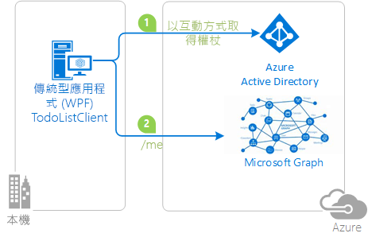

# <a name="token-cache-serialization-in-msalnet"></a>MSAL.NET 中的權杖快取序列化
在[取得權杖](msal-acquire-cache-tokens.md)後，該權杖會由 Microsoft 驗證程式庫 (MSAL) 快取。  應用程式程式碼應該先試著從快取中取得權杖，再用另一種方法取得權杖。  本文討論 MSAL.NET 中權杖快取的預設和自訂序列化。

本文適用於 MSAL.NET 3.x。 如果您對 MSAL.NET 2.x 有興趣，請參閱 [MSAL.NET 2.x 中的權杖快取序列化](https://github.com/AzureAD/microsoft-authentication-library-for-dotnet/wiki/Token-cache-serialization-2x)。

## <a name="default-serialization-for-mobile-platforms"></a>行動平台的預設序列化

在 MSAL.NET 中，預設會提供記憶體內部權杖快取。 對於使用者有安全的儲存體可以使用的平台，預設會提供序列化。 這適用於通用 Windows 平台 (UWP)、Xamarin.iOS 和 Xamarin.Android。

> [!Note]
> 當您將 Xamarin.Android 專案從 MSAL.NET 1.x 遷移至 MSAL.NET 3.x 時，您可以將 `android:allowBackup="false"` 新增到您的專案，以免當 Visual Studio 部署觸發本機儲存體還原時，無法取回舊的快取權杖。 請參閱[問題 #659](https://github.com/AzureAD/microsoft-authentication-library-for-dotnet/issues/659#issuecomment-436181938)。

## <a name="custom-serialization-for-windows-desktop-apps-and-web-appsweb-apis"></a>Windows 傳統型應用程式和 Web 應用程式/Web API 的自訂序列化

請記住，自訂序列化無法在行動平台 (UWP、Xamarin.iOS 和 Xamarin.Android) 上使用。 MSAL 已經為這些平台定義安全且高效能的序列化機制。 不過，.NET 傳統型和 .NET Core 應用程式具有不同的架構，而且 MSAL 無法實作一般用途的序列化機制。 例如，網站可選擇將權杖儲存在 Redis 快取中，或傳統型應用程式會將權杖儲存在已加密的檔案中。 所以序列化並不是立即可用的形式提供。 若要擁有 .NET 傳統型或 .NET Core 架構的永續性權杖快取應用程式，您需要自訂序列化。

下列類別和介面用於權杖快取序列化：

- `ITokenCache`，其定義一些事件來訂閱權杖快取序列化要求，以及定義一些方法來序列化或還原序列化各種格式的快取 (ADAL v3.0、MSAL 2.x 和 MSAL 3.x = ADAL v5.0)。
- `TokenCacheCallback` 是傳遞至事件的回呼，以便您處理序列化。 系統將會透過 `TokenCacheNotificationArgs` 類型的引數進行呼叫。
- `TokenCacheNotificationArgs` 只提供應用程式的 `ClientId` 和參考給可使用權杖的使用者。

  

> [!IMPORTANT]
> MSAL.NET 會為您建立權杖快取，並且在您呼叫應用程式的 `GetUserTokenCache` 和 `GetAppTokenCache` 方法時提供 `IToken` 快取。 您不應該自行實作介面。 當您實作自訂權杖快取序列化時，您的責任是：
> - 回應 `BeforeAccess` 和 `AfterAccess` 事件。 `BeforeAccess` 委派負責將快取還原序列化，而 `AfterAccess` 負責將快取序列化。
> - 其中有些事件會儲存或載入 Blob，其會透過事件引數傳遞到您想要的儲存體的。

視您要針對[公用用戶端應用程式](msal-client-applications.md) (傳統型) 或[機密用戶端應用程式](msal-client-applications.md)) (Web 應用程式 / Web API、精靈應用程式) 撰寫權杖快取序列化而定，策略有所不同。

### <a name="token-cache-for-a-public-client"></a>公用用戶端的權杖快取 

從 MSAL.NET v2.x 起，您有數個選項可將公用用戶端的權杖快取序列化。 您可以僅將快取序列化為 MSAL.NET 格式 (統一格式快取通用於 MSAL 和平台)。  您也可以支援 ADAL V3 的[舊版](https://github.com/AzureAD/azure-activedirectory-library-for-dotnet/wiki/Token-cache-serialization)權杖快取序列化。

下列範例會說明如何將權杖快取序列化自訂為在 ADAL.NET 3.x、ADAL.NET 5.x 和 MSAL.NET 之間共用單一登入狀態：[active-directory-dotnet-v1-to-v2](https://github.com/Azure-Samples/active-directory-dotnet-v1-to-v2)。

> [!Note]
> MSAL 2.x 不再支援 MSAL.NET 1.1.4-preview 權杖快取格式。 如果您有應用程式運用 MSAL.NET 1.x，您的使用者就必須重新登入。 或者，支援從 ADAL 4.x (和 3.x) 移轉。

#### <a name="simple-token-cache-serialization-msal-only"></a>簡單權杖快取序列化 (僅限 MSAL)

以下是適用於傳統型應用程式的自訂權杖快取序列化的單純實作範例。 在此，使用者權杖快取是位於與應用程式相同資料夾中的檔案。

建置應用程式之後，您可藉由呼叫 `TokenCacheHelper.EnableSerialization()` 方法並傳遞應用程式 `UserTokenCache` 來啟用序列化。

```csharp
app = PublicClientApplicationBuilder.Create(ClientId)
    .Build();
TokenCacheHelper.EnableSerialization(app.UserTokenCache);
```

`TokenCacheHelper` 協助程式類別會定義為：

```csharp
static class TokenCacheHelper
 {
  public static void EnableSerialization(ITokenCache tokenCache)
  {
   tokenCache.SetBeforeAccess(BeforeAccessNotification);
   tokenCache.SetAfterAccess(AfterAccessNotification);
  }

  /// <summary>
  /// Path to the token cache
  /// </summary>
  public static readonly string CacheFilePath = System.Reflection.Assembly.GetExecutingAssembly().Location + ".msalcache.bin3";

  private static readonly object FileLock = new object();


  private static void BeforeAccessNotification(TokenCacheNotificationArgs args)
  {
   lock (FileLock)
   {
    args.TokenCache.DeserializeMsalV3(File.Exists(CacheFilePath)
            ? ProtectedData.Unprotect(File.ReadAllBytes(CacheFilePath),
                                      null,
                                      DataProtectionScope.CurrentUser)
            : null);
   }
  }

  private static void AfterAccessNotification(TokenCacheNotificationArgs args)
  {
   // if the access operation resulted in a cache update
   if (args.HasStateChanged)
   {
    lock (FileLock)
    {
     // reflect changesgs in the persistent store
     File.WriteAllBytes(CacheFilePath,
                         ProtectedData.Protect(args.TokenCache.SerializeMsalV3(),
                                                 null,
                                                 DataProtectionScope.CurrentUser)
                         );
    }
   }
  }
 }
```

從 [Microsoft.Identity.Client.Extensions.Msal](https://github.com/AzureAD/microsoft-authentication-extensions-for-dotnet/tree/master/src/Microsoft.Identity.Client.Extensions.Msal) 開放原始碼程式庫，可取得適用於公用用戶端應用程式 (適用於在 Windows、Mac 和 Linux 上執行的傳統型應用程式) 的產品品質權杖快取檔案型序列化程式預覽。 您可以從下列 nuget 套件，將它包含在您的應用程式中：[Microsoft.Identity.Client.Extensions.Msal](https://www.nuget.org/packages/Microsoft.Identity.Client.Extensions.Msal/).

#### <a name="dual-token-cache-serialization-msal-unified-cache-and-adal-v3"></a>雙重權杖快取序列化 (MSAL 統一快取和 ADAL v3)

如果您想要使用統一快取格式 (通用於相同平台上的 ADAL.NET 4.x、MSAL.NET 2.x 及其他同一代或更舊的 MSAL) 實作權杖快取序列化，請查看下列程式碼：

```csharp
string appLocation = Path.GetDirectoryName(Assembly.GetEntryAssembly().Location;
string cacheFolder = Path.GetFullPath(appLocation) + @"..\..\..\..");
string adalV3cacheFileName = Path.Combine(cacheFolder, "cacheAdalV3.bin");
string unifiedCacheFileName = Path.Combine(cacheFolder, "unifiedCache.bin");

IPublicClientApplication app;
app = PublicClientApplicationBuilder.Create(clientId)
                                    .Build();
FilesBasedTokenCacheHelper.EnableSerialization(app.UserTokenCache,
                                               unifiedCacheFileName,
                                               adalV3cacheFileName);

```

協助程式類別這次定義為：

```csharp
using System;
using System.IO;
using System.Security.Cryptography;
using Microsoft.Identity.Client;

namespace CommonCacheMsalV3
{
 /// <summary>
 /// Simple persistent cache implementation of the dual cache serialization (ADAL V3 legacy
 /// and unified cache format) for a desktop applications (from MSAL 2.x)
 /// </summary>
 static class FilesBasedTokenCacheHelper
 {
  /// <summary>
  /// Get the user token cache
  /// </summary>
  /// <param name="adalV3CacheFileName">File name where the cache is serialized with the
  /// ADAL V3 token cache format. Can
  /// be <c>null</c> if you don't want to implement the legacy ADAL V3 token cache
  /// serialization in your MSAL 2.x+ application</param>
  /// <param name="unifiedCacheFileName">File name where the cache is serialized
  /// with the Unified cache format, common to
  /// ADAL V4 and MSAL V2 and above, and also across ADAL/MSAL on the same platform.
  ///  Should not be <c>null</c></param>
  /// <returns></returns>
  public static void EnableSerialization(ITokenCache cache, string unifiedCacheFileName, string adalV3CacheFileName)
  {
   usertokenCache = cache;
   UnifiedCacheFileName = unifiedCacheFileName;
   AdalV3CacheFileName = adalV3CacheFileName;

   usertokenCache.SetBeforeAccess(BeforeAccessNotification);
   usertokenCache.SetAfterAccess(AfterAccessNotification);
  }

  /// <summary>
  /// Token cache
  /// </summary>
  static ITokenCache usertokenCache;

  /// <summary>
  /// File path where the token cache is serialized with the unified cache format
  /// (ADAL.NET V4, MSAL.NET V3)
  /// </summary>
  public static string UnifiedCacheFileName { get; private set; }

  /// <summary>
  /// File path where the token cache is serialized with the legacy ADAL V3 format
  /// </summary>
  public static string AdalV3CacheFileName { get; private set; }

  private static readonly object FileLock = new object();

  public static void BeforeAccessNotification(TokenCacheNotificationArgs args)
  {
   lock (FileLock)
   {
    args.TokenCache.DeserializeAdalV3(ReadFromFileIfExists(AdalV3CacheFileName));
    try
    {
     args.TokenCache.DeserializeMsalV3(ReadFromFileIfExists(UnifiedCacheFileName));
    }
    catch(Exception ex)
    {
     // Compatibility with the MSAL v2 cache if you used one
     args.TokenCache.DeserializeMsalV2(ReadFromFileIfExists(UnifiedCacheFileName));
    }
   }
  }

  public static void AfterAccessNotification(TokenCacheNotificationArgs args)
  {
   // if the access operation resulted in a cache update
   if (args.HasStateChanged)
   {
    lock (FileLock)
    {
     WriteToFileIfNotNull(UnifiedCacheFileName, args.TokenCache.SerializeMsalV3());
     if (!string.IsNullOrWhiteSpace(AdalV3CacheFileName))
     {
      WriteToFileIfNotNull(AdalV3CacheFileName, args.TokenCache.SerializeAdalV3());
     }
    }
   }
  }

  /// <summary>
  /// Read the content of a file if it exists
  /// </summary>
  /// <param name="path">File path</param>
  /// <returns>Content of the file (in bytes)</returns>
  private static byte[] ReadFromFileIfExists(string path)
  {
   byte[] protectedBytes = (!string.IsNullOrEmpty(path) && File.Exists(path))
       ? File.ReadAllBytes(path) : null;
   byte[] unprotectedBytes = encrypt ?
       ((protectedBytes != null) ? ProtectedData.Unprotect(protectedBytes, null, DataProtectionScope.CurrentUser) : null)
       : protectedBytes;
   return unprotectedBytes;
  }

  /// <summary>
  /// Writes a blob of bytes to a file. If the blob is <c>null</c>, deletes the file
  /// </summary>
  /// <param name="path">path to the file to write</param>
  /// <param name="blob">Blob of bytes to write</param>
  private static void WriteToFileIfNotNull(string path, byte[] blob)
  {
   if (blob != null)
   {
    byte[] protectedBytes = encrypt
      ? ProtectedData.Protect(blob, null, DataProtectionScope.CurrentUser)
      : blob;
    File.WriteAllBytes(path, protectedBytes);
   }
   else
   {
    File.Delete(path);
   }
  }

  // Change if you want to test with an un-encrypted blob (this is a json format)
  private static bool encrypt = true;
 }
}
```

### <a name="token-cache-for-a-web-app-confidential-client-application"></a>Web 應用程式 (機密用戶端應用程式) 的權杖快取

在 Web 應用程式或 Web API 中，快取可以運用工作階段、Redis 快取或資料庫。

請務必記得，對於 Web 應用程式和 Web API，每個使用者 (每個帳戶) 都應該有一個權杖快取。 您需要將每個帳戶的權杖快取序列化。

在 [ASP.NET Core Web 應用程式教學課程](https://ms-identity-aspnetcore-webapp-tutorial)的階段 [2-2 權杖快取](https://github.com/Azure-Samples/active-directory-aspnetcore-webapp-openidconnect-v2/tree/master/2-WebApp-graph-user/2-2-TokenCache)中，可取得如何使用 Web 應用程式和 Web API 權杖快取的範例。 如需實作，請查看 [microsoft-authentication-extensions-for-dotnet](https://github.com/AzureAD/microsoft-authentication-extensions-for-dotnet) 程式庫中的下列資料夾 [TokenCacheProviders](https://github.com/AzureAD/microsoft-authentication-extensions-for-dotnet/tree/master/src/Microsoft.Identity.Client.Extensions.Web/TokenCacheProviders) (在 [Microsoft.Identity.Client.Extensions.Web](https://github.com/AzureAD/microsoft-authentication-extensions-for-dotnet/tree/master/src/Microsoft.Identity.Client.Extensions.Web) 資料夾中)。 

## <a name="next-steps"></a>後續步驟
下列範例會說明權杖快取序列化。

| 範例 | 平台 | 說明|
| ------ | -------- | ----------- |
|[active-directory-dotnet-desktop-msgraph-v2](https://github.com/azure-samples/active-directory-dotnet-desktop-msgraph-v2) | 桌上型 (WPF) | 呼叫 Microsoft Graph API 的 Windows 傳統型 .NET (WPF) 應用程式。 |
|[active-directory-dotnet-v1-to-v2](https://github.com/Azure-Samples/active-directory-dotnet-v1-to-v2) | 桌上型 (主控台) | 說明將 Azure AD v1.0 應用程式 (使用 ADAL.NET) 遷移至 Azure AD v2.0 應用程式的 Visual Studio 解決方案集，也稱為聚合式應用程式 (使用 MSAL.NET)，尤其適用於[權杖快取移轉](https://github.com/Azure-Samples/active-directory-dotnet-v1-to-v2/blob/master/TokenCacheMigration/README.md)|