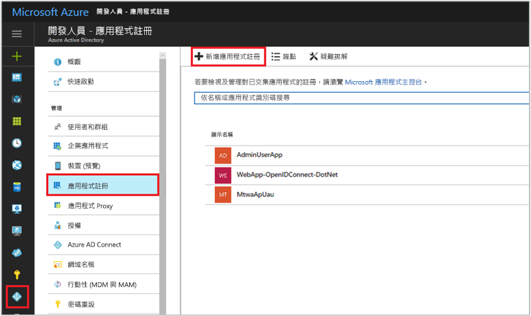
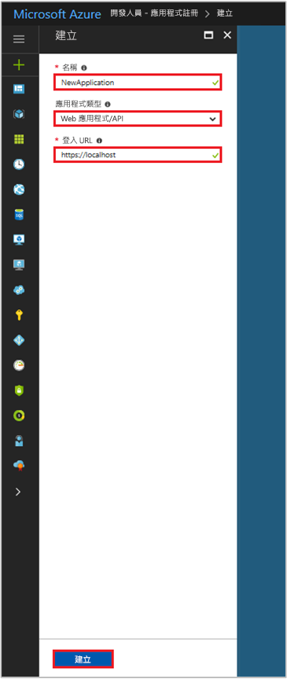

# 快速入門：向 Azure Active Directory v1.0 端點註冊應用程式

[!INCLUDE [active-directory-develop-applies-v1](../../../includes/active-directory-develop-applies-v1.md)]

企業開發人員和軟體即服務 (SaaS) 提供者可以開發可與 Azure Active Directory (Azure AD) 整合的商業雲端服務或企業營運應用程式，以提供安全的登入和授權給其服務。 若要整合應用程式或服務與 Azure AD，開發人員必須先向 Azure AD 註冊應用程式。

任何想要使用 Azure AD 功能的應用程式都必須先在 Azure AD 租用戶中註冊。 此登錄程序牽涉到提供 Azure AD 應用程式的相關詳細資料，例如其所在的 URL、要在使用者驗證之後傳送回應的 URL，以及會識別應用程式的 URI 等。

本快速入門會示範如何在 Azure AD 中新增及註冊應用程式。

## 必要條件

若要開始，請確定您有可用來註冊應用程式的 Azure AD 租用戶。 如果您還沒有租用戶， [了解如何取得租用戶](quickstart-create-new-tenant.md)。

## 使用 Azure 入口網站註冊新的應用程式

1. 登入 [Azure 入口網站](https://portal.azure.com)。
1. 如果您的帳戶可讓您存取多個帳戶，請在右上角選取您的帳戶，並將您的入口網站工作階段設定為所需的 Azure AD 租用戶。
1. 在左側導覽窗格中，選取 [Azure Active Directory] 服務。
1. 選取 [應用程式註冊]，然後選取 [新增應用程式註冊]。

    

1. 當 [建立] 頁面出現時，輸入您應用程式的註冊資訊： 

    - **名稱：** 輸入有意義的應用程式名稱
    - **應用程式類型：**
      - 針對在裝置本機上安裝的[用戶端應用程式](developer-glossary.md#client-application)選取 [原生]。 此設定適用於 OAuth 公用[原生用戶端](developer-glossary.md#native-client)。
      - 針對在安全伺服器上安裝的[用戶端應用程式](developer-glossary.md#client-application)和[資源/API 應用程式](developer-glossary.md#resource-server)選取 [Web 應用程式/API]。 此設定適用於 OAuth 機密 [Web 用戶端](developer-glossary.md#web-client)和公用[使用者代理程式型用戶端](developer-glossary.md#user-agent-based-client)。 相同的應用程式也可以公開用戶端和資源/API。
    - **登入 URL：** 在 [Web 應用程式/API] 應用程式中，提供您應用程式的基底 URL。 例如，`http://localhost:31544` 可能是在您的本機電腦上執行之 Web 應用程式的 URL。 使用者會使用此 URL 來登入 Web 用戶端應用程式。 
    - **重新導向 URI：** 在 [原生] 應用程式中，提供 URI 以供 Azure AD 用來傳回權杖回應。 輸入應用程式特定的值，例如 `http://MyFirstAADApp`

      

    如果您想要 Web 應用程式或原生應用程式的特定範例，請查看我們文件中的＜快速入門＞。

1. 完成後，請選取 [建立]。

    Azure AD 會將唯一的應用程式識別碼指派給您的應用程式，然後系統會帶您進入應用程式的主要註冊頁面。 根據您的應用程式是 Web 還是原生應用程式，系統會提供您不同選項以供您在應用程式中新增其他功能。

      > [!NOTE]
      > 根據預設，新註冊的 Web 應用程式會設定為**只**允許相同租用戶的使用者登入您的應用程式。

## 後續步驟

- 如需同意的概觀，請參閱 [Azure AD 同意架構](consent-framework.md)。
- 若要在應用程式註冊中啟用其他設定功能 (例如認證、權限、為其他租用戶的使用者啟用登入)，請參閱[在 Azure AD 中更新應用程式](quickstart-v1-update-azure-ad-app.md)。
- 若要深入了解代表已註冊應用程式的兩個 Azure AD 物件，以及它們之間的關聯性，請參閱[應用程式物件和服務主體物件](app-objects-and-service-principals.md)。
- 若要深入了解使用 Azure Active Directory 開發應用程式時應使用的商標指導方針，請參閱[應用程式的商標指導方針](howto-add-branding-in-azure-ad-apps.md)。
