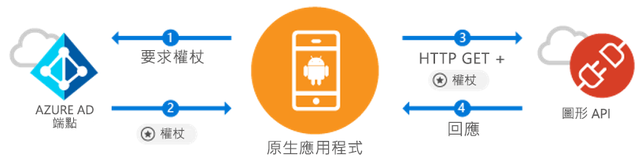

# <a name="quickstart-sign-in-users-and-call-the-microsoft-graph-api-from-an-android-app"></a>快速入門：從 Android 應用程式登入使用者並呼叫 Microsoft Graph API

[!INCLUDE [active-directory-develop-applies-v1-adal](../../../includes/active-directory-develop-applies-v1-adal.md)]

如果您正在開發 Android 應用程式，Microsoft 提供了簡單直接的 Azure Active Directory (Azure AD) 使用者登入方式。 Azure AD 讓您的應用程式可透過 Microsoft Graph 或是您自己的受保護 Web 應用程式開發介面 (API) 來存取使用者資料。

Azure AD 驗證程式庫 (ADAL) Android 程式庫可讓您的應用程式使用業界標準的 OAuth 2.0 和 OpenID Connect 來支援 [Microsoft Azure Active Directory 帳戶](https://azure.microsoft.com/services/active-directory/)，以開始使用 [Microsoft Azure 雲端](https://cloud.microsoft.com) & [Microsoft Graph API](https://graph.microsoft.io) \(英文\)。

在本快速入門中，您將了解如何：

* 取得 Microsoft Graph 的權杖
* 重新整理權杖
* 呼叫 Microsoft Graph
* 登出使用者

## <a name="prerequisites"></a>必要條件

首先，您需要 Azure AD 租用戶，供您建立使用者並登錄應用程式。 如果您還沒有租用戶， [了解如何取得租用戶](quickstart-create-new-tenant.md)。

## <a name="scenario-sign-in-users-and-call-the-microsoft-graph"></a>案例：登入使用者並呼叫 Microsoft Graph



您可以將此應用程式用於所有的 Azure AD 帳戶。 它同時支援單一租用戶和多租用戶案例 (會在後續步驟中討論)。 它也會向您示範如何建置應用程式以便與企業使用者連線，並透過 Microsoft Graph 存取其 Azure + O365 資料。 驗證流程期間，使用者必須登入並同意應用程式的權限，在某些情況下可能需要系統管理員同意應用程式。 此範例中的大部分邏輯會示範如何驗證使用者，並對 Microsoft Graph 進行基本呼叫。

## <a name="sample-code"></a>範例程式碼

您可以在 [GitHub](https://github.com/Azure-Samples/active-directory-android) 上找到完整的範例程式碼。

```Java
// Initialize your app with MSAL
AuthenticationContext mAuthContext = new AuthenticationContext(
        MainActivity.this, 
        AUTHORITY, 
        false);


// Perform authentication requests
mAuthContext.acquireToken(
    getActivity(), 
    RESOURCE_ID, 
    CLIENT_ID, 
    REDIRECT_URI,  
    PromptBehavior.Auto, 
    getAuthInteractiveCallback());

// ...

// Get tokens to call APIs like the Microsoft Graph
mAuthResult.getAccessToken()
```

## <a name="step-1-register-and-configure-your-app"></a>步驟 1：註冊並設定應用程式

您必須具有使用 [Azure 入口網站](https://portal.azure.com)向 Microsoft 註冊的原生用戶端應用程式。

1. 註冊應用程式
    - 瀏覽至 [Azure 入口網站](https://aad.portal.azure.com)。
    - 選取 [Azure Active Directory] > [應用程式註冊]。

2. 建立應用程式
    - 選取 [新增應用程式註冊]。
    - 在 [名稱] 欄位中輸入應用程式名稱。
    - 在 [應用程式類型] 中，選取 [原生]。
    - 在 [重新導向 URI]  中，輸入 `http://localhost`。

3. 設定 Microsoft Graph
    - 選取 [設定] > [必要權限]。
    - 選取 [新增]，在 [選取 API] 內選取 [Microsoft Graph]。
    - 選取 [登入與讀取使用者設定檔]，然後按下 [選取] 以儲存。
        - 此權限會對應至 `User.Read` 範圍。
    - (選擇性) 在 [必要權限] > [Windows Azure Active Directory] 內，移除選取的 [登入與讀取使用者設定檔] 權限。 這可避免使用者同意頁面將該權限列出兩次。

4. 恭喜！ 您的應用程式已成功設定完成。 在下一節中，您必須：
    - `Application ID`
    - `Redirect URI`

## <a name="step-2-get-the-sample-code"></a>步驟 2：取得範例程式碼

1. 複製程式碼。
    ```
    git clone https://github.com/Azure-Samples/active-directory-android
    ```
2. 在 Android Studio 中開啟範例。
    - 選取 [開啟現有 Android Studio 專案]。

## <a name="step-3-configure-your-code"></a>步驟 3：設定您的程式碼

您可以在 ***src/main/java/com/azuresamples/azuresampleapp/MainActivity.java*** 檔案中找到此程式碼範例的所有設定。

1. 使用 `ApplicationID` 取代常數 `CLIENT_ID`。
2. 使用您先前設定的 `Redirect URI` (`http://localhost`) 取代常數 `REDIRECT URI`。

## <a name="step-4-run-the-sample"></a>步驟 4：執行範例

1. 選取 [建置] > [清除專案]。
2. 選取 [執行] > [執行應用程式]。
3. 應用程式應會建置並顯示部分基本 UX。 當您按一下 `Call Graph API` 按鈕時，系統會提示您登入，並以無訊息方式使用新權杖呼叫 Microsoft Graph API。

## <a name="next-steps"></a>後續步驟

1. 如需程式庫機制及新案例與功能之設定方式的詳細資訊，請參閱 [ADAL Android Wiki](https://github.com/AzureAD/azure-activedirectory-library-for-android/wiki) \(英文\)。
2. 在原生情節中，應用程式會使用內嵌的網頁檢視功能，而不會離開應用程式。 `Redirect URI` 可隨意自訂。
3. 找到任何問題或有要求？ 您可以使用 `azure-active-directory` 標記在 Stackoverflow 上建立問題或貼文。

### <a name="cross-app-sso"></a>跨應用程式的 SSO

了解[如何使用 ADAL 啟用跨應用程式的 SSO](howto-v1-enable-sso-android.md)。

### <a name="auth-telemetry"></a>驗證遙測資料

ADAL 程式庫會公開驗證遙測資料，以協助應用程式開發人員了解其應用程式的行為，並建立更好的體驗。 如此可擷取登入成功的案例、活動中的使用者，以及其他多種有趣的見解分析資訊。 若要使用驗證遙測資料，應用程式開發人員需先建立遙測服務，用以彙總和儲存事件。

若要深入了解驗證遙測資造，請參閱 [ADAL Android 驗證遙測](https://github.com/AzureAD/azure-activedirectory-library-for-android/wiki/Telemetry) (英文)。