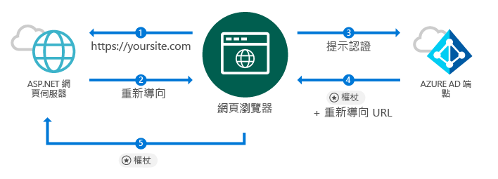
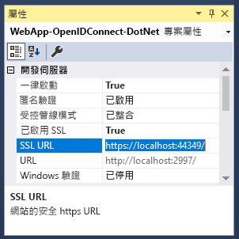
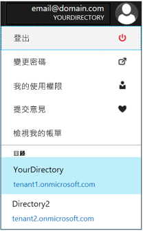

# <a name="quickstart-add-sign-in-with-microsoft-to-an-aspnet-web-app"></a>快速入門：將「使用 Microsoft 登入」新增至 ASP.NET Web 應用程式

[!INCLUDE [active-directory-develop-applies-v1](../../../includes/active-directory-develop-applies-v1.md)]

在本快速入門中，您將了解如何使用 OpenID Connect 透過搭配傳統網頁瀏覽器型應用程式的 ASP.NET MVC 解決方案實作「使用 Microsoft 登入」。 您將會了解如何在 ASP.NET 應用程式中啟用從公司和學校帳戶登入的功能。

完成本快速入門之後，您的應用程式將能接受已與 Azure Active Directory (Azure AD) 整合之組織的公司和學校帳戶進行登入。

> [!NOTE]
> 如果除了公司和學校帳戶之外，您也需要為個人帳戶啟用登入，則可以使用 [v2.0 端點](azure-ad-endpoint-comparison.md)。 如需詳細資訊，請參閱[這個適用於 v2.0 端點的 ASP.NET 教學課程](tutorial-v2-asp-webapp.md)，以及[這篇](active-directory-v2-limitations.md)說明 v2.0 端點目前限制的文章。

## <a name="prerequisites"></a>必要條件

開始之前，請先確定您符合以下先決條件：

* 已安裝 Visual Studio 2015 Update 3 或 Visual Studio 2017。 沒有嗎？ [免費下載 Visual Studio 2017](https://www.visualstudio.com/downloads/)

## <a name="scenario-sign-in-users-from-work-and-school-accounts-in-your-aspnet-app"></a>案例：在您的 ASP.NET 應用程式中從公司和學校帳戶登入使用者



在此案例中，瀏覽器會存取 ASP.NET 網站並要求使用者使用登入按鈕進行驗證。 在這個案例中，大部分轉譯網頁的工作會在伺服器端執行。

本快速入門會示範如何在 ASP.NET Web 應用程式上登入使用者，並從空白範本開始著手，並且包含新增登入按鈕等工作的步驟，以及每個控制器和方法，同時討論這些工作背後的概念。 或者，您也可以建立專案來登入 Azure AD 使用者 (公司和學校帳戶)，方法是使用 [Visual Studio Web 範本](https://docs.microsoft.com/aspnet/visual-studio/overview/2013/creating-web-projects-in-visual-studio#organizational-account-authentication-options) 並選取 [組織帳戶]，然後選取其中一個雲端選項；此選項會使用更豐富的範本，並具有額外的控制器、方法及檢視。

## <a name="libraries"></a>程式庫

本快速入門會使用下列套件：

| 程式庫 | 說明 |
|---|---|
| [Microsoft.Owin.Security.OpenIdConnect](https://www.nuget.org/packages/Microsoft.Owin.Security.OpenIdConnect/) | 可讓應用程式使用 OpenIdConnect 進行驗證的中介軟體 |
| [Microsoft.Owin.Security.Cookies](https://www.nuget.org/packages/Microsoft.Owin.Security.Cookies) |可讓應用程式使用 Cookie 維持使用者工作階段的中介軟體 |
| [Microsoft.Owin.Host.SystemWeb](https://www.nuget.org/packages/Microsoft.Owin.Host.SystemWeb) | 可讓 OWIN 型應用程式使用 ASP.NET 要求管線在 IIS 上執行 |
|  |  | 

## <a name="step-1-set-up-your-project"></a>步驟 1：設定專案

這些步驟說明如何使用 OpenID Connect 在 ASP.NET 專案上透過 OWIN 中介軟體安裝及設定驗證管線。

若要改為下載此範例的 Visual Studio 專案，請依照以下步驟進行：
1. [在 GitHub 上下載專案](https://github.com/AzureADQuickStarts/WebApp-OpenIdConnect-DotNet/archive/GuidedSetup.zip)。
1. 跳至[設定步驟](#configure-your-webconfig-and-register-an-application)，以在執行之前先設定程式碼範例。

## <a name="step-2-create-your-aspnet-project"></a>步驟 2：建立 ASP.NET 專案

1. 在 Visual Studio 中，前往 [檔案] > [新增] > [專案]。
2. 在 [Visual C#\Web] 底下，選取 [ASP.NET Web 應用程式 (.NET Framework)]。
3. 為您的應用程式命名並選取 [確定]。
4. 選取 [空白]，然後選取核取方塊來新增 **MVC** 參考。

## <a name="step-3-add-authentication-components"></a>步驟 3：新增驗證元件

1. 在 Visual Studio 中，前往 [工具] > [NuGet 套件管理員] > [套件管理員主控台]。
2. 在 [套件管理器主控台] 視窗中輸入下列內容以新增「OWIN 中介軟體 NuGet 套件」：

    ```powershell
    Install-Package Microsoft.Owin.Security.OpenIdConnect
    Install-Package Microsoft.Owin.Security.Cookies
    Install-Package Microsoft.Owin.Host.SystemWeb
    ```

<!--start-collapse-->
> ### <a name="about-these-packages"></a>關於這些套件
>上面的程式庫可透過 Cookie 型驗證，使用 OpenID Connect 啟用單一登入 (SSO)。 完成驗證並將代表使用者的權杖傳送至您的應用程式之後，OWIN 中介軟體就會建立工作階段 Cookie。 接著，瀏覽器會在後續要求中使用此 Cookie，因此使用者不需要重新驗證，也不需要進行任何額外的驗證。
<!--end-collapse-->

## <a name="step-4-configure-the-authentication-pipeline"></a>步驟 4：設定驗證管線

請依照這些步驟建立 OWIN 中介軟體*啟動類別*，以設定 OpenID Connect 驗證。 系統會自動執行此類別。

> [!TIP]
> 如果您專案的根資料夾中沒有 `Startup.cs` 檔案：<br/>
> 1. 以滑鼠右鍵按一下專案的根資料夾 > [新增] > [新增項目] > [OWIN 啟動類別]<br/>
> 2. 將它命名為 `Startup.cs`<br/>
>
>> 確定選取的類別是 OWIN 啟動類別，而非標準 C# 類別。 如果命名空間上方顯示 `[assembly: OwinStartup(typeof({NameSpace}.Startup))]`，請勾選以確認此項目。

建立 OWIN 中介軟體*啟動類別*：

1. 將 *OWIN* 和 *Microsoft.IdentityModel* 命名空間新增至 `Startup.cs`：

    [!code-csharp[main](../../../WebApp-OpenIDConnect-DotNet/WebApp-OpenIDConnect-DotNet\Startup.cs?name=AddedNameSpaces "Startup.cs")]

2. 以下列程式碼取代 Startup 類別：

    [!code-csharp[main](../../../WebApp-OpenIDConnect-DotNet/WebApp-OpenIDConnect-DotNet\Startup.cs?name=Startup "Startup.cs")]

<!--start-collapse-->
> [!NOTE]
> 您在 *OpenIDConnectAuthenticationOptions* 中提供的參數會作為供應用程式與 Azure AD 進行通訊的座標。 由於 OpenID Connect 中介軟體會使用 Cookie，因此您也必須設定 Cookie 驗證，如前述程式碼所示。 *ValidateIssuer* 值會告知 OpenIdConnect 不要針對某一特定組織限制存取。
<!--end-collapse-->

<!--end-setup-->

<!--start-use-->

## <a name="step-5-add-a-controller-to-handle-sign-in-and-sign-out-requests"></a>步驟 5：新增控制器以處理登入和登出要求

建立新的控制器來公開登入和登出方法。

1.  以滑鼠右鍵按一下 **Controllers** 資料夾，然後選取 [新增] > [控制器]。
2.  選取 [MVC (.NET 版本) 控制器 – 空白]。
3.  選取 [新增] 。
4.  將它命名為 `HomeController` 並選取 [新增]。
5.  將 **OWIN** 命名空間新增至類別：

    [!code-csharp[main](../../../WebApp-OpenIDConnect-DotNet/WebApp-OpenIDConnect-DotNet\Controllers\HomeController.cs?name=AddedNameSpaces "HomeController.cs")]

6. 新增下列方法，以透過經由程式碼起始驗證挑戰的方式，處理對控制器的登入和登出：

    [!code-csharp[main](../../../WebApp-OpenIDConnect-DotNet/WebApp-OpenIDConnect-DotNet\Controllers\HomeController.cs?name=SigInAndSignOut "HomeController.cs")]

## <a name="step-6-create-the-apps-home-page-to-sign-in-users-via-a-sign-in-button"></a>步驟 6：建立應用程式的首頁來透過登入按鈕將使用者登入

在 Visual Studio 中建立新的檢視來新增登入按鈕，並在驗證之後顯示使用者資訊：

1. 以滑鼠右鍵按一下 **Views\Home** 資料夾並選取 [新增檢視]。
1. 將它命名為 **Index**。
1. 在以下檔案中新增下列 HTML (包括登入按鈕)：

    [!code-html[main](../../../WebApp-OpenIDConnect-DotNet/WebApp-OpenIDConnect-DotNet/Views/Home/Index.cshtml "Index.cshtml")]

<!--start-collapse--> 此頁面會以 SVG 格式新增一個具有黑色背景的登入按鈕：<br/><br/> 如需更多登入按鈕，請前往[應用程式的商標指導方針](https://docs.microsoft.com/azure/active-directory/develop/howto-add-branding-guidelines-in-azure-ad-apps)。
<!--end-collapse-->

## <a name="step-7-display-users-claims-by-adding-a-controller"></a>步驟 7：新增控制器來顯示使用者的宣告

此控制器示範如何使用 `[Authorize]` 屬性來保護控制器。 此屬性會設定限制，只允許經過驗證的使用者存取控制器。 下列程式碼會利用屬性來顯示在登入過程中擷取的使用者宣告。

1. 以滑鼠右鍵按一下 **Controllers** 資料夾，然後選取 [新增] > [控制器]。
1. 選取 [MVC {版本} 控制器 – 空白]。
1. 選取 [新增] 。
1. 將它命名為 **ClaimsController**。
1. 以下列程式碼取代您控制器類別的程式碼 - 這會將 `[Authorize]` 屬性新增至類別：

    [!code-csharp[main](../../../WebApp-OpenIDConnect-DotNet/WebApp-OpenIDConnect-DotNet\Controllers\ClaimsController.cs?name=ClaimsController "ClaimsController.cs")]

<!--start-collapse-->
> [!NOTE]
> 因為使用了 `[Authorize]` 屬性，所以此控制器的所有方法都只能在使用者已通過驗證的情況下才能執行。 如果使用者未通過驗證而嘗試存取控制器，OWIN 就會起始驗證挑戰並強制使用者進行驗證。 上述程式碼會查看使用者的宣告集合，以尋找使用者權杖中所包含的特定屬性。 這些屬性包括使用者的完整名稱和使用者名稱，以及全域使用者識別元主體。 它也包含「租用戶識別碼」，這代表使用者所屬組織的識別碼。 
<!--end-collapse-->

## <a name="step-8-create-a-view-to-display-the-users-claims"></a>步驟 8：建立檢視來顯示使用者的宣告

在 Visual Studio 中，建立新的檢視以在網頁中顯示使用者的宣告：

1. 以滑鼠右鍵按一下 **Views\Claims** 資料夾，然後選取 [新增檢視]。
1. 將它命名為 **Index**。
1. 將下列 HTML 新增至檔案：

    [!code-html[main](../../../WebApp-OpenIDConnect-DotNet/WebApp-OpenIDConnect-DotNet/Views/Claims/Index.cshtml "Index.cshtml")]

<!--end-use-->

<!--start-configure-->

## <a name="step-9-configure-your-webconfig-and-register-an-application"></a>步驟 9：設定您的 *web.config* 並註冊應用程式

1. 在 Visual Studio 中，於 `web.config` (位於根資料夾中) 的 `configuration\appSettings` 區段底下新增下列內容：

    ```xml
    <add key="ClientId" value="Enter_the_Application_Id_here" />
    <add key="RedirectUrl" value="Enter_the_Redirect_Url_here" />
    <add key="Tenant" value="common" />
    <add key="Authority" value="https://login.microsoftonline.com/{0}" /> 
    ```
2. 在 [方案總管] 中，選取專案並查看 [屬性]<i></i> 視窗 (如果您沒有看到 [屬性] 視窗，請按 F4)
3. 將 [SSL 已啟用] 變更為 <code>True</code>
4. 將專案的 SSL URL 複製到剪貼簿：<br/><br/><br />
5. 在 <code>web.config</code> 中，以您專案的 SSL URL 取代 <code>Enter_the_Redirect_URL_here</code>。

### <a name="register-your-application-in-the-azure-portal-then-add-its-information-to-webconfig"></a>在「Azure 入口網站」中註冊您的應用程式，然後將其資訊新增至 *web.config*

1. 前往 [Microsoft Azure 入口網站 - 應用程式註冊](https://portal.azure.com/#blade/Microsoft_AAD_IAM/ActiveDirectoryMenuBlade/RegisteredApps)來註冊應用程式。
2. 選取 [新增應用程式註冊]。
3. 輸入應用程式的名稱。
4. 在 [登入 URL] 中貼上 Visual Studio 專案的 [SSL URL]。 系統也會將此 URL 自動新增至您在註冊之應用程式的 [回覆 URL] 清單中。
5. 選取 [建立] 以註冊應用程式。 此動作會帶您回到應用程式清單。
6. 現在，請搜尋和/或選取您剛才建立的應用程式以開啟其屬性。
7. 將 [應用程式識別碼] 底下的 GUID 複製到剪貼簿。
8. 返回 Visual Studio，然後在 `web.config` 中，以您剛才註冊之應用程式的應用程式識別碼取代 `Enter_the_Application_Id_here`。

> [!TIP]
> 如果您的帳戶已設定為可存取多個目錄，請確定您已針對要為其註冊應用程式的組織選取正確的目錄，方法是在 Azure 入口網站的右上角按一下您的帳戶名稱，然後確認所選取的目錄，如下所示：<br/>

## <a name="step-10-configure-sign-in-options"></a>步驟 10：設定登入選項

您可以將應用程式設定成只允許某個組織之 Azure AD 執行個體的成員使用者登入，或接受任何組織的成員使用者登入。 請依照下列其中一個選擇的指示進行操作：

### <a name="configure-your-application-to-allow-sign-ins-of-work-and-school-accounts-from-any-company-or-organization-multi-tenant"></a>將應用程式設定成允許任何公司或組織 (多租用戶) 的公司和學校帳戶登入

如果您想要接受已與 Azure AD 整合之任何公司或組織的公司和學校帳戶進行登入，請依照下列步驟進行操作。 這是「SaaS 應用程式」的常見案例：

1. 返回 [Microsoft Azure 入口網站 - 應用程式註冊](https://portal.azure.com/#blade/Microsoft_AAD_IAM/ActiveDirectoryMenuBlade/RegisteredApps)，然後找出您剛才註冊的應用程式。
2. 在 [所有設定] 底下，選取 [屬性]。
3. 將 [多重租用戶] 屬性變更為 [是]，然後選取 [儲存]。

如需有關此設定的詳細資訊及多租用戶應用程式的概念，請參閱[多租用戶概觀](howto-convert-app-to-be-multi-tenant.md)。

### <a name="restrict-users-from-only-one-organizations-active-directory-instance-to-sign-in-to-your-application-single-tenant"></a>註冊只來自一個組織之 Active Directory 執行個體的使用者以登入您的應用程式 (單一租用戶)

此選項為企業營運應用程式的常見案例。

如果您想要讓應用程式只接受特定 Azure AD 執行個體的成員帳戶進行登入 (包括該執行個體的*來賓帳戶*)，請遵循下列步驟：
1. 將 *web.config* 中的 `Tenant` 參數從 `Common` 取代為組織的租用戶名稱，例如 *contoso.onmicrosoft.com*。
1. 將您 [*OWIN 啟動類別*](#configure-the-authentication-pipeline) 中的 `ValidateIssuer` 引數變更為 `true`。

若要只允許一系列特定組織的成員使用者登入，請遵循下列步驟：
1. 將 `ValidateIssuer` 設定為 True。
1. 使用 `ValidIssuers` 參數來指定組織清單。

另一個選項是實作能使用 *IssuerValidator* 參數來驗證簽發者的自訂方法。 如需有關 `TokenValidationParameters` 的詳細資訊，請參閱[這篇 MSDN 文章](https://msdn.microsoft.com/library/system.identitymodel.tokens.tokenvalidationparameters.aspx "TokenValidationParameters MSDN 文章")。

<!--end-configure-->

<!--start-configure-arp-->
<!--
## Configure your ASP.NET Web App with the application's registration information

In this step, you will configure your project to use SSL, and then use the SSL URL to configure your application’s registration information. After this, add the application’ registration information to your solution via *web.config*.

1.  In Solution Explorer, select the project and look at the `Properties` window (if you don’t see a Properties window, press F4)
2.  Change `SSL Enabled` to `True`
3.  Copy the value from `SSL URL` above and paste it in the `Redirect URL` field on the top of this page, then click *Update*:<br/><br/><br />
4.  Add the following in `web.config` file located in root’s folder, under section `configuration\appSettings`:

```xml
<add key="ClientId" value="[Enter the application Id here]" />
<add key="RedirectUri" value="[Enter the Redirect URL here]" />
<add key="Tenant" value="common" />
<add key="Authority" value="https://login.microsoftonline.com/{0}" /> 
```
-->
<!--end-configure-arp-->
<!--start-test-->

## <a name="step-11-test-your-code"></a>步驟 11：測試您的程式碼

1. 按 **F5** 以在 Visual Studio 中執行您的專案。 瀏覽器隨即開啟並將您導向至 `http://localhost:{port}`，其中會顯示 [使用 Microsoft 帳戶登入] 按鈕。
1. 選取按鈕以登入。

### <a name="sign-in"></a>登入

當您準備好進行測試時，請使用公司帳戶 (Azure AD) 登入。

![[使用 Microsoft 帳戶登入] 瀏覽器視窗](./media/quickstart-v1-aspnet-webapp/aspnetbrowsersignin.png)

![[使用 Microsoft 帳戶登入] 瀏覽器視窗](./media/quickstart-v1-aspnet-webapp/aspnetbrowsersignin2.png)

#### <a name="expected-results"></a>預期的結果

登入之後，系統會將使用者重新導向至您網站的首頁，也就是您在「Microsoft 應用程式註冊入口網站」之應用程式註冊資訊中指定的 HTTPS URL。 此網頁現在會顯示「{使用者} 您好」 和一個登出連結，以及一個用於查看使用者宣告的連結 (這是之前所建立之「授權」控制器的連結)。

### <a name="see-users-claims"></a>查看使用者的宣告

選取超連結來查看使用者的宣告。 此動作會將您帶往只提供給已驗證使用者的控制器和檢視。

#### <a name="expected-results"></a>預期的結果

 您應該會看到一個表格，其中包含已登入使用者的基本屬性：

| 屬性 | 值 | 說明 |
|---|---|---|
| 名稱 | {使用者完整名稱} | 使用者的名字和姓氏 |
| 使用者名稱 | <span>user@domain.com</span> | 用來識別已登入使用者的使用者名稱 |
| 主體| {主體} |用來跨網站唯一識別使用者登入的字串 |
| 租用戶識別碼 | {Guid} | 唯一代表使用者 Azure AD 組織的 *guid* |

此外，您也會看到一個表格，其中包含驗證要求中所包括的所有使用者宣告。 如需識別碼權杖中所有宣告的清單及其說明，請參閱[識別碼權杖的宣告清單](https://docs.microsoft.com/azure/active-directory/develop/active-directory-token-and-claims)。

### <a name="optional-access-a-method-that-has-an-authorize-attribute"></a>(選擇性) 存取具有 *[Authorize]* 屬性的方法

在這個步驟中，您會以匿名使用者身分，進行「宣告」控制器存取測試：<br/>
選取連結以將使用者登出，並完成登出程序。<br/>
現在，在您的瀏覽器中輸入 http://localhost:{port}/claims，來存取以 `[Authorize]` 屬性保護的控制器

#### <a name="expected-results"></a>預期的結果

您應該會收到提示，要求您進行驗證以查看檢視。

## <a name="additional-information"></a>其他資訊

<!--start-collapse-->
### <a name="protect-your-entire-web-site"></a>保護您的整個網站

若要保護您的整個網站，請將 `AuthorizeAttribute` 新增至 `Global.asax` `Application_Start` 方法中的 `GlobalFilters`：

```csharp
GlobalFilters.Filters.Add(new AuthorizeAttribute());
```
<!--end-collapse-->

<div></div>
<br/>

<!--end-test-->

## <a name="next-steps"></a>後續步驟

您現在可以繼續探索其他案例。

> [!div class="nextstepaction"]
> [ASP.NET 教學課程](https://docs.microsoft.com/azure/active-directory/develop/tutorial-v2-asp-webapp)