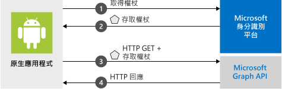

# <a name="quickstart-sign-in-users-and-call-the-microsoft-graph-api-from-an-android-app"></a>快速入門：從 Android 應用程式登入使用者並呼叫 Microsoft Graph API

[!INCLUDE [active-directory-develop-applies-v2-msal](../../../includes/active-directory-develop-applies-v2-msal.md)]

此快速入門包含示範 Android 應用程式如何登入個人或公司與學校帳戶、取得存取權杖，以及呼叫 Microsoft Graph API 的程式碼範例。



> [!NOTE]
> **先決條件**
> * Android Studio 
> * 必須有 Android 16+ 


> [!div renderon="docs"]
> ## <a name="register-and-download-your-quickstart-app"></a>註冊並下載快速入門應用程式
> 有兩個選項可用來啟動快速入門應用程式：
> * [快速] [選項 1：註冊和自動設定您的應用程式，然後下載程式碼範例](#option-1-register-and-auto-configure-your-app-and-then-download-your-code-sample)
> * [手動] [選項 2：註冊並手動設定您的應用程式和程式碼範例](#option-2-register-and-manually-configure-your-application-and-code-sample)
>
> ### <a name="option-1-register-and-auto-configure-your-app-and-then-download-your-code-sample"></a>選項 1：註冊和自動設定您的應用程式，然後下載程式碼範例
> #### <a name="step-1-register-your-application"></a>步驟 1：註冊您的應用程式
> 若要註冊您的應用程式，
> 1. 移至新的 [Azure 入口網站 - 應用程式註冊](https://portal.azure.com/#blade/Microsoft_AAD_RegisteredApps/applicationsListBlade/quickStartType/AndroidQuickstartPage/sourceType/docs)窗格。
> 1. 輸入應用程式的名稱，並選取 [註冊]  。
> 1. 依照指示按一下滑鼠，即可下載並自動設定新的應用程式。
>
> ### <a name="option-2-register-and-manually-configure-your-application-and-code-sample"></a>選項 2：註冊並手動設定您的應用程式和程式碼範例
>
> #### <a name="step-1-register-your-application"></a>步驟 1：註冊您的應用程式
> 若要手動註冊您的應用程式，並將應用程式註冊資訊新增到您的解決方案，請執行下列步驟：
>
> 1. 瀏覽至 Microsoft 身分識別平台，以取得開發人員的[應用程式註冊](https://aka.ms/MobileAppReg)頁面。
> 1. 選取 [新增註冊]  。
> 1. 當 [註冊應用程式]  頁面出現時，輸入您應用程式的註冊資訊：
>      - 在 [名稱]  區段中，輸入將對應用程式使用者顯示、且有意義的應用程式名稱，例如 `AndroidQuickstart`。
>      - 您可以略過此頁面上的其他組態。 
>      - 按 `Register` 按鈕。
> 1. 按一下新的應用程式 > 移至 `Authentication` > `Add Platform` > `Android`。    
>      - 輸入您 Android Studio 專案中的套件名稱。 
>      - 產生簽章雜湊。 請參閱入口網站以取得指示。
> 1. 選取 `Configure` 並儲存 ***MSAL 組態*** JSON，以供稍後使用。 

> [!div renderon="portal" class="sxs-lookup"]
> #### <a name="step-1-configure-your-application"></a>步驟 1：設定您的應用程式
> 若要讓此快速入門中的程式碼範例正確運作，您必須新增與 Auth 訊息代理程式相容的重導 URI。 
> > [!div renderon="portal" id="makechanges" class="nextstepaction"]
> > [為我進行這項變更]()
>
> > [!div id="appconfigured" class="alert alert-info"]
> >  您的應用程式已設定了這些屬性

#### <a name="step-2-download-the-project"></a>步驟 2：下載專案

* [下載程式碼範例](https://github.com/Azure-Samples/active-directory-android-native-v2/archive/master.zip)

#### <a name="step-3-configure-your-project"></a>步驟 3：設定您的專案

> [!div renderon="docs"]
> 如果您已選取上面的選項 1，則可以略過這些步驟。 

> [!div renderon="portal" class="sxs-lookup"]
> 1. 將專案解壓縮並在 Android Studio 中開啟。
> 1. 在 [app]   > [src]   > [main]   > [res]   > [raw]  中，開啟 **auth_config.json**。
> 1. 編輯 **auth_config.json** 並取代為 Azure 入口網站中的 JSON。 如果您想改為以手動方式變更：
>    ```javascript
>    {
>       "client_id" : "Enter_the_Application_Id_Here",
>       "authorization_user_agent" : "DEFAULT",
>       "redirect_uri" : "Enter_the_Redirect_Uri_Here",
>       "authorities" : [
>          {
>             "type": "AAD",
>             "audience": {
>                "type": "Enter_the_Audience_Info_Here",
>                "tenant_id": "Enter_the_Tenant_Info_Here"
>             }
>          }
>       ]
>    }
>    ```
> 
> 1. 在 [app]   > [manifests]  內部，開啟 **AndroidManifest.xml**。
> 1. 將下列活動貼到 **manifest\application** 節點： 
>    ```xml
>    <!--Intent filter to catch Microsoft's callback after Sign In-->
>    <activity
>        android:name="com.microsoft.identity.client.BrowserTabActivity">
>        <intent-filter>
>            <action android:name="android.intent.action.VIEW" />
>            <category android:name="android.intent.category.DEFAULT" />
>            <category android:name="android.intent.category.BROWSABLE" />
>            <data android:scheme="msauth"
>                android:host="Enter_the_Package_Name"
>                android:path="/Enter_the_Signature_Hash" />
>        </intent-filter>
>    </activity>
>    ```
> 1. 執行應用程式！ 

> [!div class="sxs-lookup" renderon="portal"]
> > [!NOTE]
> > 本快速入門支援 Enter_the_Supported_Account_Info_Here。

> [!div renderon="docs"]
> 1. 將專案解壓縮並在 Android Studio 中開啟。
> 1. 在 [app]   > [res]   > [raw]  內部，開啟 **auth_config.json**。
> 1. 編輯 **auth_config.json** 並取代為 Azure 入口網站中的 JSON。 如果您想改為以手動方式變更：
>    ```javascript
>    "client_id" : "ENTER_YOUR_APPLICATION_ID",
>    "redirect_uri": "ENTER_YOUR_REDIRECT_URI", 
>     ```
> 1. 在 [app]   > [manifests]  內部，開啟 **AndroidManifest.xml**。
> 1. 將下列活動新增到 **manifest\application** 節點。 這個程式碼片段會註冊一個 **BrowserTabActivity**，以允許 OS 在完成驗證之後繼續執行您的應用程式：
>    ```xml
>    <!--Intent filter to catch Microsoft's callback after Sign In-->
>    <activity
>        android:name="com.microsoft.identity.client.BrowserTabActivity">
>        <intent-filter>
>            <action android:name="android.intent.action.VIEW" />
>            <category android:name="android.intent.category.DEFAULT" />
>            <category android:name="android.intent.category.BROWSABLE" />
>            <data android:scheme="msauth"
>                android:host="Enter_the_Package_Name"
>                android:path="/Enter_the_Decoded_Signature_Hash" />
>        </intent-filter>
>    </activity>
>    ```
> 1. 將 `Enter_the_Package_Name` 和 `Enter_the_Signature_Hash` 取代為您在 Azure 入口網站中註冊的值。 
> 1. 執行應用程式！ 

## <a name="more-information"></a>相關資訊

閱讀下列各節，了解本快速入門的詳細資訊。

### <a name="getting-msal"></a>正在取得 MSAL

MSAL ([com.microsoft.identity.client](https://javadoc.io/doc/com.microsoft.identity.client/msal)) 這個程式庫是用來登入使用者並要求權杖，該權杖會用來存取受 Microsoft 身分識別平台保護的 API。 您可以使用 Gradle 3.0+ 安裝它，方法是在 [Gradle Scripts]   > [build.gradle (Module: app)]  中的 [相依性]  底下，新增以下內容：

```gradle  
implementation 'com.android.volley:volley:1.1.1'
implementation 'com.microsoft.identity.client:msal:0.3.+'
```

### <a name="msal-initialization"></a>MSAL 初始化

您可以透過加入下列程式碼來新增 MSAL 的參考：

```java
import com.microsoft.identity.client.*;
```

接著，使用下列程式碼將 MSAL 初始化：

```java
    sampleApp = new PublicClientApplication(
        this.getApplicationContext(),
        R.raw.auth_config);
```

> |其中： ||
> |---------|---------|
> |`R.raw.auth_config` | 此檔案包含應用程式的設定，其中包括應用程式/用戶端識別碼、登入對象、重導 URI，以及其他幾個自訂選項。 |

### <a name="requesting-tokens"></a>要求權杖

MSAL 有兩種取得權杖的方法：`acquireToken` 與 `acquireTokenSilentAsync`

#### <a name="acquiretoken-getting-a-token-interactively"></a>acquireToken：以互動方式取得權杖

某些情況需要使用者與 Microsoft 身分識別平台互動。 在這些情況下，終端使用者可能需要選取自己的帳戶、輸入認證，或同意應用程式要求的權限。 例如， 

* 使用者首次登入應用程式
* 如果使用者重設自己的密碼，就必須輸入自己的認證 
* 如果已撤銷同意 
* 如果您的應用程式明確要求同意。 
* 您的應用程式第一次要求存取資源時
* 需要 MFA 或其他條件式存取原則時

```java
sampleApp.acquireToken(this, SCOPES, getAuthInteractiveCallback());
```

> |其中：||
> |---------|---------|
> | `SCOPES` | 包含所要求的範圍 (即適用於 Microsoft Graph 的 `{ "user.read" }` 或適用於自訂 Web API 的 `{ "<Application ID URL>/scope" }` (例如，`api://<Application ID>/access_as_user`)) |
> | `getAuthInteractiveCallback` | 驗證之後當控制權回到應用程式時要執行的回呼 |

#### <a name="acquiretokensilent-getting-a-user-token-silently"></a>acquireTokenSilent：以無訊息方式取得使用者權杖

應用程式應該不需要使用者在每次要求權杖時都必須登入。 如果使用者已經登入，這個方法可允許應用程式以無訊息方式要求權杖。

```java
    sampleApp.getAccounts(new PublicClientApplication.AccountsLoadedCallback() {
        @Override
        public void onAccountsLoaded(final List<IAccount> accounts) {

            if (!accounts.isEmpty()) {
                sampleApp.acquireTokenSilentAsync(SCOPES, accounts.get(0), getAuthSilentCallback());
            } else {
                /* No accounts */
            }
        }
    });
```

> |其中：||
> |---------|---------|
> | `SCOPES` | 包含所要求的範圍 (即適用於 Microsoft Graph 的 `{ "user.read" }` 或適用於自訂 Web API 的 `{ "<Application ID URL>/scope" }` (例如，`api://<Application ID>/access_as_user`)) |
> | `getAccounts(...)` | 包含您想要以無訊息模式取得其權杖的帳戶 |
> | `getAuthSilentCallback()` | 驗證之後當控制權回到應用程式時要執行的回呼 |

## <a name="next-steps"></a>後續步驟

### <a name="learn-the-steps-to-create-the-application-used-in-this-quickstart"></a>了解建立本快速入門中所使用之應用程式的步驟

請試試看 Android 教學課程，以取得建置應用程式和新功能的完整逐步指南，且包括此快速入門的完整說明。

> [!div class="nextstepaction"]
> [呼叫 Graph API Android 教學課程](https://docs.microsoft.com/azure/active-directory/develop/guidedsetups/active-directory-android)

### <a name="msal-for-android-library-wiki"></a>適用於 Android 的 MSAL 程式庫的 Wiki

閱讀適用於 Android 的 MSAL 程式庫的詳細資訊：

> [!div class="nextstepaction"]
> [適用於 Android 的 MSAL 程式庫的 Wiki](https://github.com/AzureAD/microsoft-authentication-library-for-android/wiki)

[!INCLUDE [Help and support](../../../includes/active-directory-develop-help-support-include.md)]

協助我們改善 Microsoft 身分識別平台。 完成問卷調查簡短的兩個問題，告訴我們您的想法。

> [!div class="nextstepaction"]
> [Microsoft 身分識別平台問卷調查](https://forms.office.com/Pages/ResponsePage.aspx?id=v4j5cvGGr0GRqy180BHbRyKrNDMV_xBIiPGgSvnbQZdUQjFIUUFGUE1SMEVFTkdaVU5YT0EyOEtJVi4u)