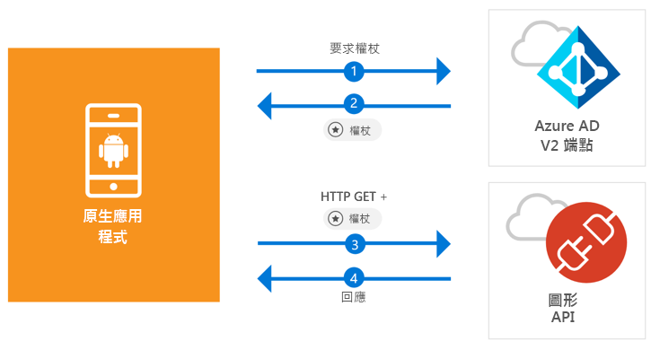

# <a name="quickstart-sign-in-users-and-call-the-microsoft-graph-api-from-an-android-app"></a>快速入門：從 Android 應用程式登入使用者並呼叫 Microsoft Graph API

[!INCLUDE [active-directory-develop-applies-v2-msal](../../../includes/active-directory-develop-applies-v2-msal.md)]

此快速入門包含示範 Android 應用程式如何登入個人或公司與學校帳戶、取得存取權杖，以及呼叫 Microsoft Graph API 的程式碼範例。



> [!NOTE]
> **先決條件**
> * Android Studio 3 或更新版本
> * 需要 Android SDK 21 或更新版本 (建議使用 SDK 27)

> [!div renderon="docs"]
> ## <a name="register-and-download"></a>註冊及下載
> ### <a name="register-and-configure-your-application-and-code-sample"></a>註冊並設定您的應用程式和程式碼範例
> #### <a name="step-1-register-your-application"></a>步驟 1：註冊您的應用程式
> 若要註冊您的應用程式並將應用程式註冊資訊新增到您的解決方案，請執行下列作業：
> 1. 前往 [Microsoft 應用程式註冊入口網站](https://apps.dev.microsoft.com/portal/register-app)註冊應用程式。
> 1. 在 [應用程式名稱] 方塊中，輸入應用程式的名稱。
> 1. 確認已清除 [引導式設定] 核取方塊，然後選取 [建立]。
> 1. 選取 [新增平台]，選取 [原生應用程式]，然後選取 [儲存]。

> [!div renderon="portal" class="sxs-lookup"]
> #### <a name="step-1-configure-your-application"></a>步驟 1：設定您的應用程式
> 若要讓此快速入門中的程式碼範例正確運作，您必須將回覆 URL 加入為 **msal{AppId}://auth** (其中 {AppId} 為您的應用程式的應用程式識別碼)。
> > [!div renderon="portal" id="makechanges" class="nextstepaction"]
> > [為我進行這項變更]()
>
> > [!div id="appconfigured" class="alert alert-info"]
> >  您的應用程式已設定了這些屬性

#### <a name="step-2-download-the-project"></a>步驟 2：下載專案

* [下載 Android Studio 專案](https://github.com/Azure-Samples/active-directory-android-native-v2/archive/master.zip)

#### <a name="step-3-configure-your-project"></a>步驟 3：設定您的專案

1. 將專案解壓縮並在 Android Studio 中開啟。
1. 在 [app] > [java] > **<i>{host}.{namespace}</i>** 之下，開啟 **MainActivity**。
1. 將開頭為 `final static String CLIENT_ID` 的那一行取代為：

    > [!div renderon="portal" class="sxs-lookup"]
    > ```java
    > final static String CLIENT_ID = "ENTER_THE_APPLICATION_ID_HERE";
    > ```

    > [!div renderon="docs"]
    > ```java
    > final static String CLIENT_ID = "<ENTER_THE_APPLICATION_ID_HERE>";
    > ```

1. 開啟：[app] > [manifests] > [AndroidManifest.xml]。
1. 將下列活動新增到 **manifest\application** 節點。 這個程式碼片段會註冊一個 **BrowserTabActivity**，以允許 OS 在完成驗證之後繼續執行您的應用程式：

    > [!div renderon="docs"]
    > ```xml
    > <!--Intent filter to capture System Browser calling back to our app after Sign In-->
    > <activity
    >     android:name="com.microsoft.identity.client.BrowserTabActivity">
    >     <intent-filter>
    >         <action android:name="android.intent.action.VIEW" />
    >         <category android:name="android.intent.category.DEFAULT" />
    >         <category android:name="android.intent.category.BROWSABLE" />
    > 
    >         <!--Add in your scheme/host from registered redirect URI-->
    >         <!--By default, the scheme should be similar to 'msal[appId]' -->
    >         <data android:scheme="msal<ENTER_THE_APPLICATION_ID_HERE>"
    >             android:host="auth" />
    >     </intent-filter>
    > </activity>
    > ```

    > [!div renderon="portal" class="sxs-lookup"]
    > ```xml
    > <!--Intent filter to capture System Browser calling back to our app after Sign In-->
    > <activity
    >     android:name="com.microsoft.identity.client.BrowserTabActivity">
    >     <intent-filter>
    >         <action android:name="android.intent.action.VIEW" />
    >         <category android:name="android.intent.category.DEFAULT" />
    >         <category android:name="android.intent.category.BROWSABLE" />
    > 
    >         <!--Add in your scheme/host from registered redirect URI-->
    >         <!--By default, the scheme should be similar to 'msal[appId]' -->
    >         <data android:scheme="msalENTER_THE_APPLICATION_ID_HERE"
    >             android:host="auth" />
    >     </intent-filter>
    > </activity>
    > ```

> [!div renderon="docs"]
> <span>6.</span>以您應用程式的「應用程式識別碼」取代 `<ENTER_THE_APPLICATION_ID_HERE>`。 如果需要尋找「應用程式識別碼」，請前往 [概觀] 頁面。

## <a name="more-information"></a>相關資訊

閱讀下列各節，了解本快速入門的詳細資訊。

### <a name="msal"></a>MSAL

MSAL ([com.microsoft.identity.client](http://javadoc.io/doc/com.microsoft.identity.client/msal)) 是一個程式庫，可用來登入使用者並要求用來存取受 Microsoft Azure Active Directory (Azure AD) 保護之 API 的權杖。 您可以使用 Gradle 安裝它，方法是將下列內容新增到 Gradle Scripts > build.gradle (Module: app) 中的 **Dependencies**下：

```gradle  
implementation 'com.android.volley:volley:1.1.1'
implementation 'com.microsoft.identity.client:msal:0.1.+'
```

### <a name="msal-initialization"></a>MSAL 初始化

您可以透過加入下列程式碼新增 MSAL 的參考：

```java
import com.microsoft.identity.client.*;
```

接著，使用下列程式碼將 MSAL 初始化：

```java
sampleApp = new PublicClientApplication(
        this.getApplicationContext(),
        CLIENT_ID);
```

> |其中： ||
> |---------|---------|
> |`CLIENT_ID` | 來自在 *portal.azure.com* 中註冊之應用程式的應用程式識別碼 |

### <a name="requesting-tokens"></a>要求權杖

MSAL 有兩種取得權杖的方法：`acquireToken` 與 `acquireTokenSilentAsync`

#### <a name="getting-a-user-token-interactively"></a>以互動方式取得使用者權杖

有些情況需要強制使用者與 Azure AD v2.0 端點互動，這會導致將環境切換至系統瀏覽器以驗證使用者的認證或要求使用者同意。 部分範例包括：

* 使用者第一次登入應用程式
* 當使用者因為密碼已過期而可能需要重新輸入其認證時
* 當您的應用程式要求的資源存取權，需要使用者同意時
* 當需要雙因素驗證時

```java
sampleApp.acquireToken(this, SCOPES, getAuthInteractiveCallback());
```

> |其中：||
> |---------|---------|
> | `SCOPES` | 包含所要求的範圍 (即適用於 Microsoft Graph 的 `{ "user.read" }` 或適用於自訂 Web API 的 `{ "<Application ID URL>/scope" }` (例如，`api://<Application ID>/access_as_user`)) |
> | `getAuthInteractiveCallback` | 驗證之後當控制權回到應用程式時要執行的回呼 |

#### <a name="getting-a-user-token-silently"></a>以無訊息方式取得使用者權杖

您不希望每次使用者需要存取資源時都要求使用者驗證其認證。 在大部分時間，您會希望權杖取得和更新作業不需要與使用者進行任何互動。 在初始 `acquireToken` 方法之後，您可以使用 `AcquireTokenSilentAsync` 方法取得權杖以存取受保護的資源：

```java
sampleApp.acquireToken(getActivity(), SCOPES, getAuthInteractiveCallback());
```

> |其中：||
> |---------|---------|
> | `SCOPES` | 包含所要求的範圍 (即適用於 Microsoft Graph 的 `{ "user.read" }` 或適用於自訂 Web API 的 `{ "<Application ID URL>/scope" }` (例如，`api://<Application ID>/access_as_user`)) |
> | `getAuthInteractiveCallback` | 驗證之後當控制權回到應用程式時要執行的回呼 |

## <a name="next-steps"></a>後續步驟

### <a name="learn-the-steps-to-create-the-application-used-in-this-quickstart"></a>了解建立此快速入門中所使用應用程式的步驟

請試試看 Android 教學課程，以取得建置應用程式和新功能的完整逐步指南，且包括此快速入門的完整說明。

> [!div class="nextstepaction"]
> [呼叫 Graph API Android 教學課程](https://docs.microsoft.com/azure/active-directory/develop/guidedsetups/active-directory-android)

### <a name="msal-for-android-library-wiki"></a>適用於 Android 的 MSAL 程式庫的 Wiki

閱讀適用於 Android 的 MSAL 程式庫的詳細資訊：

> [!div class="nextstepaction"]
> [適用於 Android 的 MSAL 程式庫的 Wiki](https://github.com/AzureAD/microsoft-authentication-library-for-android/wiki)

[!INCLUDE [Help and support](../../../includes/active-directory-develop-help-support-include.md)]