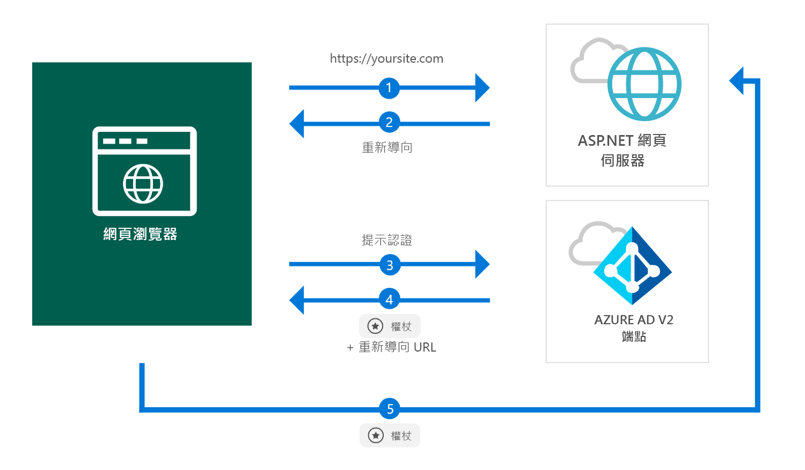

# <a name="quickstart-add-sign-in-with-microsoft-to-an-aspnet-web-app"></a>快速入門：將「使用 Microsoft 登入」新增至 ASP.NET Web 應用程式

[!INCLUDE [active-directory-develop-applies-v2](../../../includes/active-directory-develop-applies-v2.md)]

在本快速入門中，您將了解 ASP.NET Web 應用程式如何從任何 Azure Active Directory (Azure AD) 執行個體登入個人帳戶 (hotmail.com、outlook.com 等) 與公司和學校帳戶。



> [!div renderon="docs"]
> ## <a name="register-your-application-and-download-your-quickstart-app"></a>註冊您的應用程式並下載您的快速入門應用程式
>
> ### <a name="register-and-configure-your-application-and-code-sample"></a>註冊並設定您的應用程式和程式碼範例
> #### <a name="step-1-register-your-application"></a>步驟 1：註冊您的應用程式
> 
> 1. 移至 [Microsoft 應用程式註冊入口網站](https://apps.dev.microsoft.com/portal/register-app)。
> 1. 輸入應用程式的名稱，確定未選取 [引導式設定] 選項，然後按一下 [建立]。
> 1. 按一下 `Add Platform`，然後選取 `Web`。
> 1. 請確定已*選取* [允許隱含流程]。
> 1. 在 [重新導向 URL] 中，輸入 `https://localhost:44368/`。
> 1. 向下捲動至頁面底部，然後按一下 [儲存]。

> [!div class="sxs-lookup" renderon="portal"]
> #### <a name="step-1-configure-your-application-in-azure-portal"></a>步驟 1：在 Azure 入口網站中設定您的應用程式
> 若要讓本快速入門中的程式碼範例能正常運作，您需要新增 `https://localhost:44368/` 作為回覆 URL。
> > [!div renderon="portal" id="makechanges" class="nextstepaction"]
> > [為我進行此變更]()
>
> > [!div id="appconfigured" class="alert alert-info"]
> >  您的應用程式已設定了這個屬性

#### <a name="step-2-download-your-project"></a>步驟 2：下載您的專案

[下載 Visual Studio 2017 解決方案](https://github.com/AzureADQuickStarts/AppModelv2-WebApp-OpenIDConnect-DotNet/archive/master.zip)

#### <a name="step-3-configure-your-visual-studio-project"></a>步驟 3：設定您的 Visual Studio 專案

1. 將 ZIP 檔案解壓縮至根資料夾附近的本機資料夾 - 例如 **C:\Azure-Samples**
1. 在 Visual Studio 中開啟解決方案 (AppModelv2-WebApp-OpenIDConnect-DotNet.sln)
1. 編輯 **Web.config** 並以您剛剛所註冊之應用程式的應用程式識別碼取代 `Enter_the_Application_Id_here`：

    ```xml
    <add key="ClientId" value="Enter_the_Application_Id_here" />
    ```
    
> [!div class="sxs-lookup" renderon="portal"]
> [!IMPORTANT]
> 如果應用程式為*單一租用戶應用程式* (僅針對此目錄中的帳戶)，請在 **Web.config** 檔案中，找出 `Tenant` 的值，並以您的**租用戶識別碼**或**租用戶名稱** (例如，contoso.microsoft.com) 取代 `common`。 您可以在 [概觀] 頁面中取得租用戶名稱。

## <a name="more-information"></a>詳細資訊

本節會概述登入使用者所需的程式碼。 這可協助您了解程式碼運作方式、主要引數，以及如何將登入新增至現有的 ASP.NET 應用程式。

### <a name="owin-middleware-nuget-packages"></a>OWIN 中介軟體 NuGet 套件

您可以使用 OWIN 中介軟體套件在 ASP.NET 中搭配 OpenID Connect，設定具有以 Cookie 為基礎之驗證的驗證管線。 您可以在 Visual Studio 的 [套件管理員主控台] 中執行下列命令來安裝這些套件：

```powershell
Install-Package Microsoft.Owin.Security.OpenIdConnect
Install-Package Microsoft.Owin.Security.Cookies
Install-Package Microsoft.Owin.Host.SystemWeb
```

### <a name="owin-startup-class"></a>OWIN 啟動類別

OWIN 中介軟體會使用*啟動類別*，該類別會在主機處理序初始化時執行 (在本快速入門中為位於跟資料夾的 *startup.cs* 檔案)。 以下程式碼顯示本快速入門所使用的參數：

```csharp
public void Configuration(IAppBuilder app)
{
    app.SetDefaultSignInAsAuthenticationType(CookieAuthenticationDefaults.AuthenticationType);

    app.UseCookieAuthentication(new CookieAuthenticationOptions());
    app.UseOpenIdConnectAuthentication(
        new OpenIdConnectAuthenticationOptions
        {
            // Sets the ClientId, authority, RedirectUri as obtained from web.config
            ClientId = clientId,
            Authority = authority,
            RedirectUri = redirectUri,
            // PostLogoutRedirectUri is the page that users will be redirected to after sign-out. In this case, it is using the home page
            PostLogoutRedirectUri = redirectUri,
            Scope = OpenIdConnectScope.OpenIdProfile,
            // ResponseType is set to request the id_token - which contains basic information about the signed-in user
            ResponseType = OpenIdConnectResponseType.IdToken,
            // ValidateIssuer set to false to allow personal and work accounts from any organization to sign in to your application
            // To only allow users from a single organizations, set ValidateIssuer to true and 'tenant' setting in web.config to the tenant name
            // To allow users from only a list of specific organizations, set ValidateIssuer to true and use ValidIssuers parameter 
            TokenValidationParameters = new TokenValidationParameters()
            {
                ValidateIssuer = false
            },
            // OpenIdConnectAuthenticationNotifications configures OWIN to send notification of failed authentications to OnAuthenticationFailed method
            Notifications = new OpenIdConnectAuthenticationNotifications
            {
                AuthenticationFailed = OnAuthenticationFailed
            }
        }
    );
}
```

> |Where  |  |
> |---------|---------|
> | `ClientId`     | 來自註冊於 Azure 入口網站中之應用程式的應用程式識別碼 |
> | `Authority`    | 供使用者用於驗證的 STS 端點。 通常針對公用雲端為 https://login.microsoftonline.com/{tenant}/v2.0，其中 {tenant} 為您租用戶的名稱、您的租用戶識別碼，或 *common* 以參考一般端點 (用於多租用戶應用程式) |
> | `RedirectUri`  | 在使用者針對 Azure AD v2.0 端點完成驗證之後，會被送往的 URL |
> | `PostLogoutRedirectUri`     | 在使用者登出之後，會被送往的 URL |
> | `Scope`     | 所要求之範圍的清單 (以空格分隔) |
> | `ResponseType`     | 來自驗證的回應包含識別碼權杖的要求 |
> | `TokenValidationParameters`     | 用於權杖驗證的參數清單。 在此案例中，`ValidateIssuer` 是設為 `false`，以表示它可以接受來自任何個人或公司或學校帳戶類型的登入 |
> | `Notifications`     | 可在不同 *OpenIdConnect* 訊息上執行之委派的清單 |

### <a name="initiate-an-authentication-challenge"></a>起始驗證挑戰

您可在控制器中要求驗證挑戰，以強制使用者登入：

```csharp
public void SignIn()
{
    if (!Request.IsAuthenticated)
    {
        HttpContext.GetOwinContext().Authentication.Challenge(
            new AuthenticationProperties{ RedirectUri = "/" },
            OpenIdConnectAuthenticationDefaults.AuthenticationType);
    }
}
```

> [!TIP]
> 使用上述方法來要求驗證挑戰是選擇性的，而且通常適用於您想要讓已驗證和未驗證使用者都能存取檢視的情況。 或者，您可以透過下一節所描述的方法來保護控制器。

### <a name="protect-a-controller-or-a-controllers-method"></a>保護控制器或控制器的方法

您可以使用 `[Authorize]` 屬性來保護控制器或控制器動作。 此屬性會透過只允許已驗證的使用者存取控制器中的動作，來限制對控制器或動作的存取；這表示當*未驗證*的使用者嘗試存取具有 `[Authorize]` 屬性的其中一個動作或控制器時，系統將會自動執行驗證挑戰。

## <a name="next-steps"></a>後續步驟

嘗試 ASP.NET 教學課程，以取得建置應用程式和新功能的完整逐步指南，包括本快速入門的完整說明。

### <a name="learn-the-steps-to-create-the-application-used-in-this-quickstart"></a>了解建立本快速入門中所使用之應用程式的步驟

> [!div class="nextstepaction"]
> [登入教學課程](.\tutorial-v2-asp-webapp.md)

[!INCLUDE [Help and support](../../../includes/active-directory-develop-help-support-include.md)]