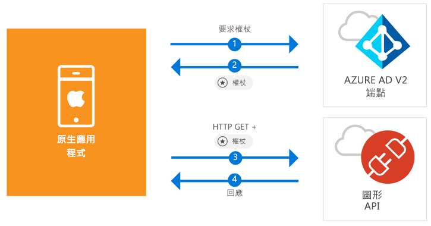

# <a name="quickstart-sign-in-users-and-call-the-microsoft-graph-api-from-an-ios-native-app"></a>快速入門：從 iOS 原生應用程式登入使用者及呼叫 Microsoft Graph API

[!INCLUDE [active-directory-develop-applies-v2-msal](../../../includes/active-directory-develop-applies-v2-msal.md)]

本快速入門包含示範原生 iOS 應用程式如何登入個人、公司與學校帳戶、取得存取權杖，以及呼叫 Microsoft Graph API 的程式碼範例。



> [!div renderon="docs"]
> ## <a name="register-and-download"></a>註冊及下載
> ### <a name="register-and-configure-your-application-and-code-sample"></a>註冊並設定您的應用程式和程式碼範例
> #### <a name="step-1-register-your-application"></a>步驟 1：註冊您的應用程式
> 若要註冊您的應用程式並將應用程式註冊資訊新增到您的解決方案，請執行下列作業：
> 1. 前往 [Microsoft 應用程式註冊入口網站](https://apps.dev.microsoft.com/portal/register-app)註冊應用程式。
> 1. 在 [應用程式名稱] 方塊中，輸入應用程式的名稱。
> 1. 確認已清除 [引導式設定] 核取方塊，然後選取 [建立]。
> 1. 選取 [新增平台]，選取 [原生應用程式]，然後選取 [儲存]。

> [!div renderon="portal" class="sxs-lookup"]
> #### <a name="step-1-configure-your-application"></a>步驟 1：設定您的應用程式
> 若要讓本快速入門中的程式碼範例能正確運作，您需要新增 `msal<AppId>://auth` 作為回覆 URL (其中 msal<AppId> 為此應用程式識別碼)。
> > [!div renderon="portal" id="makechanges" class="nextstepaction"]
> > [為我進行此變更]()
>
> > [!div id="appconfigured" class="alert alert-info"]
> >  您的應用程式已設定了這個屬性

#### <a name="step-2-download-your-web-server-or-project"></a>步驟 2：下載您的 Web 伺服器或專案

- [下載 XCode 專案](https://github.com/Azure-Samples/active-directory-ios-swift-native-v2/archive/master.zip)

#### <a name="step-3-configure-your-project"></a>步驟 3：設定您的專案

1. 將 ZIP 檔案解壓縮並在 XCode 中開啟專案。
1. 編輯 **ViewController.swift** 並將開頭為 'let kClientID' 的那一行取代為以下程式碼片段：

    > [!div renderon="portal" class="sxs-lookup"]
    > ```swift
    > let kClientID = "Enter_the_Application_Id_here"
    > ```

    > [!div renderon="docs"]
    > ```swift
    > let kClientID = "<ENTER_THE_APPLICATION_ID_HERE>"
    > ```   
1. 按住 Ctrl 並按一下 **Info.plist** 以開啟特色選單，然後選取 [開啟為] > [原始程式碼]。
1. 在 dict 根節點下方，新增下列程式碼：

    > [!div renderon="portal" class="sxs-lookup"]
    > ```xml
    > <key>CFBundleURLTypes</key>
    > <array>
    >     <dict>
    >         <key>CFBundleTypeRole</key>
    >         <string>Editor</string>
    >         <key>CFBundleURLName</key>
    >         <string>$(PRODUCT_BUNDLE_IDENTIFIER)</string>
    >         <key>CFBundleURLSchemes</key>
    >         <array>
    >             <string>msalEnter_the_Application_Id_here</string>
    >         </array>
    >     </dict>
    > </array>
    > ```

    > [!div renderon="docs"]
    > ```xml
    > <key>CFBundleURLTypes</key>
    > <array>
    >     <dict>
    >         <key>CFBundleTypeRole</key>
    >         <string>Editor</string>
    >         <key>CFBundleURLName</key>
    >         <string>$(PRODUCT_BUNDLE_IDENTIFIER)</string>
    >         <key>CFBundleURLSchemes</key>
    >         <array>
    >             <string>msal<ENTER_THE_APPLICATION_ID_HERE></string>
    >         </array>
    >     </dict>
    > </array>
    > ```
    
> [!div renderon="docs"]
> <span>5.</span>以您應用程式的 *應用程式識別碼*取代 `<ENTER_THE_APPLICATION_ID_HERE>`。 如果需要尋找*應用程式識別碼*，請前往 [概觀] 頁面。

## <a name="more-information"></a>相關資訊

請閱讀這些小節以深入了解本快速入門。

### <a name="msal"></a>MSAL

MSAL ([MSAL.framework](https://github.com/AzureAD/microsoft-authentication-library-for-objc) \(英文\)) 這個程式庫的用途為登入使用者，以及要求用來存取受 Microsoft Azure Active Directory 保護之 API 的權杖。 您可以使用下列程序將 MSAL 新增至您的應用程式：

```
$ vi Podfile
```
將下列加入此 Podfile：

```
 target 'QuickStart' do
   use_frameworks!
 pod 'MSAL'
 end
```

### <a name="msal-initialization"></a>MSAL 初始化

您可以透過加入下列程式碼來新增 MSAL 的參考：

```swift
import MSAL
```

接著，使用下列程式碼將 MSAL 初始化：

```swift
let authority = MSALAuthority(url: URL(string: kAuthority)!)
self.applicationContext = try MSALPublicClientApplication(clientId: kClientID, authority: authority)
```

> |其中： ||
> |---------|---------|
> | `clientId` | 來自在 *portal.azure.com* 中註冊之應用程式的應用程式識別碼 |
> | `authority` | Azure AD v2.0 端點。 在大部分情況下，這會是 *https<span/>://login.microsoftonline.com/common* |

### <a name="requesting-tokens"></a>要求權杖

MSAL 有兩種取得權杖的方法：`acquireToken` 與 `acquireTokenSilent`。

#### <a name="getting-an-access-token-interactively"></a>以互動方式取得存取權杖

有些情況需要強制使用者與 Azure Active Directory (Azure AD) v2.0 端點互動，這會導致系統將環境切換至系統瀏覽器，以驗證使用者的認證或要求同意。 部分範例包括：

* 使用者首次登入應用程式
* 使用者因為密碼已過期而可能需要重新輸入其認證時
* 您的應用程式要求存取的資源需要使用者同意時
* 需要雙因素驗證時

```swift
applicationContext.acquireToken(forScopes: self.kScopes) { (result, error) in /* Add your handling logic */}
```

> |其中：||
> |---------|---------|
> | `forScopes` | 包含所要求的範圍 (也就是 [ "user.read" ]` for Microsoft Graph or `[ "<Application ID URL>/scope" ]` for custom Web APIs (i.e. `api://<Application ID>/access_as_user`)) |

#### <a name="getting-an-access-token-silently"></a>以無訊息方式取得存取權杖

您不應該在每次使用者需要存取資源時都要求使用者驗證其認證。 在大部分情況下，您應該以不需要與使用者進行任何互動的方式處理權杖取得和更新作業。 在初始的 `acquireToken` 方法之後，您可以使用 `acquireTokenSilent` 方法來取得權杖以存取受保護的資源：

```swift
applicationContext.acquireTokenSilent(forScopes: self.kScopes, account: applicationContext.allAccounts().first) { (result, error) in /* Add your handling logic */}
```

> |其中： ||
> |---------|---------|
> | `forScopes` | 包含所要求的範圍 (即適用於 Microsoft Graph 的 `[ "user.read" ]` 或適用於自訂 Web API 的 `[ "<Application ID URL>/scope" ]` (也就是 `api://<Application ID>/access_as_user`)) |
> | `account` | 要求權杖的帳戶 (MSAL 支援在單一應用程式中使用多個帳戶)。 在本快速入門中，該值會指向快取中的第一個帳戶 (`applicationContext.allAccounts().first`)。 |

## <a name="next-steps"></a>後續步驟

嘗試 iOS 教學課程以取得建置應用程式與新功能的完整逐步指南，包括本快速入門的完整說明。

### <a name="learn-the-steps-to-create-the-application-used-in-this-quickstart"></a>了解建立本快速入門中所使用之應用程式的步驟

> [!div class="nextstepaction"]
> [呼叫 Graph API iOS 教學課程](https://docs.microsoft.com/azure/active-directory/develop/guidedsetups/active-directory-ios)

[!INCLUDE [Help and support](../../../includes/active-directory-develop-help-support-include.md)]
