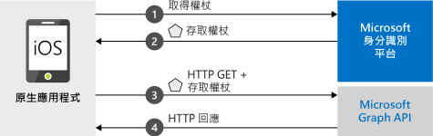

# <a name="quickstart-sign-in-users-and-call-the-microsoft-graph-api-from-an-ios-app"></a>快速入門：從 iOS 應用程式登入使用者並呼叫 Microsoft Graph API

[!INCLUDE [active-directory-develop-applies-v2-msal](../../../includes/active-directory-develop-applies-v2-msal.md)]

本快速入門包含示範原生 iOS 應用程式如何登入個人、公司與學校帳戶、取得存取權杖，以及呼叫 Microsoft Graph API 的程式碼範例。



> [!NOTE]
> **先決條件**
> * XCode 10+
> * iOS 10+ 

> [!div renderon="docs"]
> ## <a name="register-and-download-your-quickstart-app"></a>註冊並下載快速入門應用程式
> 有兩個選項可用來啟動快速入門應用程式：
> * [快速] [選項 1：註冊和自動設定您的應用程式，然後下載程式碼範例](#option-1-register-and-auto-configure-your-app-and-then-download-your-code-sample)
> * [手動] [選項 2：註冊並手動設定您的應用程式和程式碼範例](#option-2-register-and-manually-configure-your-application-and-code-sample)
>
> ### <a name="option-1-register-and-auto-configure-your-app-and-then-download-your-code-sample"></a>選項 1：註冊和自動設定您的應用程式，然後下載程式碼範例
> #### <a name="step-1-register-your-application"></a>步驟 1：註冊您的應用程式
> 若要註冊您的應用程式，
> 1. 移至新的 [Azure 入口網站 - 應用程式註冊](https://portal.azure.com/#blade/Microsoft_AAD_RegisteredApps/applicationsListBlade/quickStartType/IosQuickstartPage/sourceType/docs)窗格。
> 1. 輸入應用程式的名稱，並選取 [註冊]  。
> 1. 依照指示按一下滑鼠，即可下載並自動設定新的應用程式。
>
> ### <a name="option-2-register-and-manually-configure-your-application-and-code-sample"></a>選項 2：註冊並手動設定您的應用程式和程式碼範例
>
> #### <a name="step-1-register-your-application"></a>步驟 1：註冊您的應用程式
> 若要手動註冊您的應用程式，並將應用程式註冊資訊新增到您的解決方案，請執行下列步驟：
>
> 1. 瀏覽至 Microsoft 身分識別平台，以取得開發人員的[應用程式註冊](https://aka.ms/MobileAppReg)頁面。
> 1. 選取 [新增註冊]  。
> 1. 當 [註冊應用程式]  頁面出現時，輸入您應用程式的註冊資訊：
>      - 在 [名稱]  區段中，輸入當應用程式的使用者登入或同意使用您的應用程式時，將向使用者顯示且有意義的應用程式名稱，例如 `iOSQuickstart`。
>      - 略過此頁面上的其他設定。 
>      - 按 `Register` 按鈕。
> 1. 按一下新的應用程式 > 移至 `Authentication` > `Add Platform` > `iOS`。    
>      - 為您的應用程式輸入***套件組合識別碼***。 
> 1. 選取 `Configure` 並儲存 ***MSAL 設定***詳細資料，以供稍後使用。 

> [!div renderon="portal" class="sxs-lookup"]
>
> #### <a name="step-1-configure-your-application"></a>步驟 1：設定您的應用程式
> 若要讓此快速入門中的程式碼範例正確運作，您必須新增與 Auth 訊息代理程式相容的重導 URI。 
> > [!div renderon="portal" id="makechanges" class="nextstepaction"]
> > [為我進行這項變更]()
>
> > [!div id="appconfigured" class="alert alert-info"]
> >  您的應用程式已設定了這些屬性

#### <a name="step-2-download-your-web-server-or-project"></a>步驟 2：下載您的 Web 伺服器或專案

- [下載程式碼範例](https://github.com/Azure-Samples/active-directory-ios-swift-native-v2/archive/master.zip)

#### <a name="step-3-configure-your-project"></a>步驟 3：設定您的專案

> [!div renderon="docs"]
> 如果您已選取上面的選項 1，則可以略過這些步驟。 

> [!div renderon="portal" class="sxs-lookup"]
> 1. 將 ZIP 檔案解壓縮並在 XCode 中開啟專案。
> 1. 編輯 **ViewController.swift** 並將開頭為 'let kClientID' 的那一行取代為以下程式碼片段：
>    ```swift
>    let kClientID = "Enter_the_Application_Id_here"
>    let kAuthority = "https://login.microsoftonline.com/Enter_the_Tenant_Info_Here"
>    ``` 
> 1. 以滑鼠右鍵按一下 **Info.plist**，然後選取 [開啟為]   > [原始程式碼]  。
> 1. 在 dict 根節點下方，使用您的***套件組合識別碼***來取代：
>
>    ```xml
>    <key>CFBundleURLTypes</key>
>    <array>
>       <dict>
>          <key>CFBundleURLSchemes</key>
>          <array>
>             <string>msauth.Enter_the_Bundle_Id_Here</string>
>          </array>
>       </dict>
>    </array>
> 
>    ```
> 1. 建置並執行應用程式！ 

> [!div class="sxs-lookup" renderon="portal"]
> > [!NOTE]
> > 本快速入門支援 Enter_the_Supported_Account_Info_Here。

> [!div renderon="docs"]
>
> 1. 將 ZIP 檔案解壓縮並在 XCode 中開啟專案。
> 1. 編輯 **ViewController.swift**，並使用下列程式碼片段來取代開頭為 'let kClientID' 的那一行：
>
>    ```swift
>    let kClientID = "<ENTER_YOUR_APPLICATION/CLIENT_ID>"
> 
>    ```
> 1. 以滑鼠右鍵按一下 **Info.plist**，然後選取 [開啟為]   > [原始程式碼]  。
> 1. 在 dict 根節點下方，使用您的***套件組合識別碼***來取代：
>
>    ```xml
>    <key>CFBundleURLTypes</key>
>    <array>
>       <dict>
>          <key>CFBundleURLSchemes</key>
>          <array>
>             <string>msauth.<ENTER_YOUR_BUNDLE_ID></string>
>          </array>
>       </dict>
>    </array>
>
>    ```
> 1. 建置並執行應用程式！ 

## <a name="more-information"></a>相關資訊

請閱讀這些小節以深入了解本快速入門。

### <a name="getting-msal"></a>取得 MSAL

MSAL ([MSAL.framework](https://github.com/AzureAD/microsoft-authentication-library-for-objc) \(英文\)) 是用來登入使用者並要求權杖的程式庫，該權杖可用來存取受 Microsoft 身分識別平台保護的 API。 您可以使用下列程序將 MSAL 新增至您的應用程式：

```
$ vi Podfile

```
將下列內容新增至此 podfile (其中含有您的專案目標)：

```
use_frameworks!

target 'MSALiOS' do
   pod 'MSAL', '~> 0.4.0'
end

```

### <a name="msal-initialization"></a>MSAL 初始化

您可以透過加入下列程式碼來新增 MSAL 的參考：

```swift
import MSAL
```

接著，使用下列程式碼將 MSAL 初始化：

```swift
let authority = try MSALAADAuthority(url: URL(string: kAuthority)!)
            
let msalConfiguration = MSALPublicClientApplicationConfig(clientId: kClientID, redirectUri: nil, authority: authority)
self.applicationContext = try MSALPublicClientApplication(configuration: msalConfiguration)

```

> |其中： ||
> |---------|---------|
> | `clientId` | 來自在 *portal.azure.com* 中註冊之應用程式的應用程式識別碼 |
> | `authority` | Microsoft 身分識別平台端點。 在大部分情況下，這會是 *https<span/>://login.microsoftonline.com/common* |
> | `redirectUri` | 應用程式的重新導向 URI。 您可以傳遞 'nil' 來使用預設值或您自訂的重新導向 URI。 |

### <a name="additional-app-requirements"></a>其他應用程式需求  

您的應用程式在 `AppDelegate` 中也必須具有下列內容。 這讓 MSAL SDK 能夠在您執行驗證時，處理來自驗證訊息代理程式應用程式的權杖回應。

 ```swift
 func application(_ app: UIApplication, open url: URL, options: [UIApplication.OpenURLOptionsKey : Any] = [:]) -> Bool {
         guard let sourceApplication = options[UIApplication.OpenURLOptionsKey.sourceApplication] as? String else {
             return false
         }
         
         return MSALPublicClientApplication.handleMSALResponse(url, sourceApplication: sourceApplication)
     }

```

最後，您的應用程式在 ***Info.plist*** 中的 `CFBundleURLTypes` 旁邊必須有 `LSApplicationQueriesSchemes` 項目。 此範例會包含此項目。 

   ```xml 
   <key>LSApplicationQueriesSchemes</key>
   <array>
      <string>msauth</string>
      <string>msauthv2</string>
   </array>
   ```

### <a name="sign-in-users--request-tokens"></a>登入使用者與要求權杖

MSAL 有兩種取得權杖的方法：`acquireToken` 與 `acquireTokenSilent`。

#### <a name="acquiretoken-getting-a-token-interactively"></a>acquireToken：以互動方式取得權杖

某些情況需要使用者與 Microsoft 身分識別平台互動。 在這些情況下，終端使用者可能需要選取自己的帳戶、輸入認證，或同意您應用程式的權限。 例如， 

* 使用者首次登入應用程式
* 如果使用者重設自己的密碼，就必須輸入自己的認證 
* 您的應用程式第一次要求存取資源時
* 需要 MFA 或其他條件式存取原則時

```swift
let parameters = MSALInteractiveTokenParameters(scopes: kScopes)
applicationContext.acquireToken(with: parameters) { (result, error) in /* Add your handling logic */}
```

> |其中：||
> |---------|---------|
> | `scopes` | 包含所要求的範圍 (即適用於 Microsoft Graph 的 `[ "user.read" ]` 或適用於自訂 Web API 的 `[ "<Application ID URL>/scope" ]` (`api://<Application ID>/access_as_user`) |

#### <a name="acquiretokensilent-getting-an-access-token-silently"></a>acquireTokenSilent：以無訊息方式取得存取權杖

應用程式應該不需要使用者在每次要求權杖時都必須登入。 如果使用者已經登入，這個方法可允許應用程式以無訊息方式要求權杖。 

```swift
let parameters = MSALSilentTokenParameters(scopes: kScopes, account: applicationContext.allAccounts().first)
applicationContext.acquireTokenSilent(with: parameters) { (result, error) in /* Add your handling logic */}
```

> |其中： ||
> |---------|---------|
> | `scopes` | 包含所要求的範圍 (即適用於 Microsoft Graph 的 `[ "user.read" ]` 或適用於自訂 Web API 的 `[ "<Application ID URL>/scope" ]` (`api://<Application ID>/access_as_user`) |
> | `account` | 要求權杖的帳戶。 本快速入門為單一帳戶應用程式，如果您想要建置多帳戶的應用程式，您將必須定義邏輯來識別要針對權杖要求使用哪一個帳戶 `applicationContext.account(forHomeAccountId: self.homeAccountId)` |

## <a name="next-steps"></a>後續步驟

嘗試 iOS 教學課程以取得建置應用程式的完整逐步指南，包括本快速入門的完整說明。

### <a name="learn-the-steps-to-create-the-application-used-in-this-quickstart"></a>了解建立本快速入門中所使用之應用程式的步驟

> [!div class="nextstepaction"]
> [呼叫 Graph API iOS 教學課程](https://docs.microsoft.com/azure/active-directory/develop/guidedsetups/active-directory-ios)

[!INCLUDE [Help and support](../../../includes/active-directory-develop-help-support-include.md)]

協助我們改善 Microsoft 身分識別平台。 完成問卷調查簡短的兩個問題，告訴我們您的想法。

> [!div class="nextstepaction"]
> [Microsoft 身分識別平台問卷調查](https://forms.office.com/Pages/ResponsePage.aspx?id=v4j5cvGGr0GRqy180BHbRyKrNDMV_xBIiPGgSvnbQZdUQjFIUUFGUE1SMEVFTkdaVU5YT0EyOEtJVi4u)