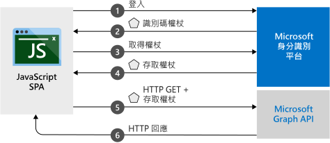

# <a name="quickstart-sign-in-users-and-acquire-an-access-token-from-a-javascript-single-page-application"></a>快速入門：登入使用者及從 JavaScript 單頁應用程式取得存取權杖

在本快速入門中，您會了解如何使用程式碼範例，該範例示範 JavaScript 單頁應用程式 (SPA) 如何讓使用者登入個人帳戶、公司帳戶和學校帳戶。 JavaScript SPA 也可以取得呼叫 Microsoft Graph API 或任何 Web API 的存取權杖。



## <a name="prerequisites"></a>必要條件

本快速入門需要下列設定：
* 為了搭配 Node.js 伺服器來執行專案，請下載並安裝 [Node.js](https://nodejs.org/en/download/) \(英文\)。
* 為了編輯專案檔，請下載並安裝 [Visual Studio Code](https://code.visualstudio.com/download) \(英文\)。
* 為了執行作為 Visual Studio 解決方案的專案，請下載並安裝 [Visual Studio 2019](https://visualstudio.microsoft.com/downloads/)。

> [!div renderon="docs"]
> ## <a name="register-and-download-your-quickstart-application"></a>註冊並下載快速入門應用程式
> 若要啟動您的快速入門應用程式，請使用下列其中一個選項。
>
> ### <a name="option-1-express-register-and-auto-configure-your-app-and-then-download-your-code-sample"></a>選項 1 (快速)：註冊和自動設定您的應用程式，然後下載程式碼範例
>
> 1. 使用公司或學校帳戶或個人 Microsoft 帳戶登入 [Azure 入口網站](https://portal.azure.com)。
> 1. 如果您的帳戶可讓您存取多個租用戶，請在右上方選取帳戶，然後將您的入口網站工作階段設定為想要使用的 Azure Active Directory (Azure AD) 租用戶。
> 1. 移至新的 [Azure 入口網站 - 應用程式註冊](https://portal.azure.com/#blade/Microsoft_AAD_RegisteredApps/ApplicationsListBlade/quickStartType/JavascriptSpaQuickstartPage/sourceType/docs)窗格。
> 1. 輸入應用程式的名稱，並選取 [註冊]  。
> 1. 依照指示來下載並自動設定新應用程式。
>
> ### <a name="option-2-manual-register-and-manually-configure-your-application-and-code-sample"></a>選項 2 (手動)：註冊並手動設定您的應用程式和程式碼範例
>
> #### <a name="step-1-register-your-application"></a>步驟 1：註冊您的應用程式
>
> 1. 使用公司或學校帳戶或個人 Microsoft 帳戶登入 [Azure 入口網站](https://portal.azure.com)。
>
> 1. 如果您的帳戶可讓您存取多個租用戶，請在右上方選取帳戶，然後將您的入口網站工作階段設定為想要使用的 Azure AD 租用戶。
> 1. 移至 Microsoft 身分識別平台，以取得開發人員的[應用程式註冊](https://go.microsoft.com/fwlink/?linkid=2083908)頁面。
> 1. 選取 [新增註冊]  。
> 1. [註冊應用程式]  頁面出現時，輸入您應用程式的名稱。
> 1. 在 [支援的帳戶類型]  底下，選取 [任何組織目錄中的帳戶及個人的 Microsoft 帳戶]  。
> 1. 在 [重新導向 URI]  區段底下的下拉式清單中，選取 [Web]  平台，然後將值設定為 `http://localhost:30662/`。
> 1. 選取 [註冊]  。 在應用程式 [概觀]  頁面上，記下 [應用程式 (用戶端) 識別碼]  值以供稍後使用。
> 1. 本快速入門需要啟用[隱含授與流程](v2-oauth2-implicit-grant-flow.md)。 在所註冊應用程式的左側窗格中，選取 [驗證]  。
> 1. 在 [進階設定]  區段的 [隱含授與]  底下，選取 [識別碼權杖]  和 [存取權杖]  核取方塊。 因為此應用程式必須將使用者登入並呼叫 API，所以識別碼權杖和存取權杖都是必要權杖。
> 1. 在頁面上方選取 [儲存]  。

> [!div class="sxs-lookup" renderon="portal"]
> #### <a name="step-1-configure-your-application-in-the-azure-portal"></a>步驟 1：在 Azure 入口網站中設定您的應用程式
> 若要讓此快速入門中的程式碼範例正常運作，您需要將重新導向 URI 新增為 `http://localhost:30662/`，並且啟用 [隱含授與]  。
> > [!div renderon="portal" id="makechanges" class="nextstepaction"]
> > [為我進行這些變更]()
>
> > [!div id="appconfigured" class="alert alert-info"]
> >  您的應用程式已設定了這些屬性。

#### <a name="step-2-download-the-project"></a>步驟 2：下載專案

選取適合您開發環境的選項：

* 若要使用 Node.js 搭配網頁伺服器來執行專案，請[下載核心專案檔](https://github.com/Azure-Samples/active-directory-javascript-graphapi-v2/archive/quickstart.zip)。 若要開啟檔案，請使用 [Visual Studio Code](https://code.visualstudio.com/) \(英文\) 等編輯器。

* (選擇性) 若要搭配 IIS 伺服器來執行專案，請[下載 Visual Studio 專案](https://github.com/Azure-Samples/active-directory-javascript-graphapi-v2/archive/vsquickstart.zip)。 將 zip 檔案解壓縮至本機資料夾 (例如 *C:\Azure-Samples*)。


#### <a name="step-3-configure-your-javascript-app"></a>步驟 3：設定您的 JavaScript 應用程式

> [!div renderon="docs"]
> 在 [JavaScriptSPA]  資料夾中，編輯 *index.html*，於 `msalConfig` 下設定 `clientID` 與 `authority` 值。

> [!div class="sxs-lookup" renderon="portal"]
> 在 [JavaScriptSPA]  資料夾中，編輯 *index.html*，並將 `msalConfig` 取代為下列程式碼：

```javascript
var msalConfig = {
    auth: {
        clientId: "Enter_the_Application_Id_here",
        authority: "https://login.microsoftonline.com/Enter_the_Tenant_info_here",
        redirectURI: "http://localhost:30662/"
    },
    cache: {
        cacheLocation: "localStorage",
        storeAuthStateInCookie: true
    }
};

```
> [!div renderon="portal"]
> > [!NOTE]
> > 本快速入門支援 Enter_the_Supported_Account_Info_Here。


> [!div renderon="docs"]
>
> 其中：
> - *\<Enter_the_Application_Id_here>* 是您所註冊應用程式的**應用程式 (用戶端) 識別碼**。
> - *\<Enter_the_Tenant_info_here>* 設定為下列其中一個選項：
>    - 如果您的應用程式支援「此組織目錄中的帳戶」  ，請將此值取代為 [租用戶識別碼]  或 [租用戶名稱]  \(例如 *contoso.microsoft.com*\)。
>    - 如果您的應用程式支援「任何組織目錄中的帳戶」  ，請將此值取代為 [組織]  。
>    - 如果您的應用程式支援「任何組織目錄中的帳戶及個人的 Microsoft 帳戶」  ，請將此值取代為 [通用]  。 若要將支援範圍限制為「僅限個人 Microsoft 帳戶」  ，請將此值取代為 [取用者]  。
>
> > [!TIP]
> > 若要尋找 [應用程式 (用戶端) 識別碼]  、[目錄 (租用戶) 識別碼]  和 [支援的帳戶類型]  的值，請在 Azure 入口網站中移至應用程式的 [概觀]  頁面。
>

#### <a name="step-4-run-the-project"></a>步驟 4：執行專案

* 如果您使用 [Node.js](https://nodejs.org/en/download/)：

    1. 若要啟動伺服器，請從專案目錄執行下列命令：

        ```batch
        npm install
        node server.js
        ```

    1. 開啟網頁瀏覽器，然後前往 `http://localhost:30662/`。
    1. 選取 [登入]  開始登入，然後呼叫 Microsoft Graph API。


* 如果您使用 [Visual Studio](https://visualstudio.microsoft.com/downloads/)，請選取專案解決方案並且選取 F5 來執行專案。

在瀏覽器載入應用程式之後，請選取 [登入]  。 第一次登入時，系統會提示您同意允許應用程式存取您的設定檔，並將您登入。 成功登入後，您的使用者設定檔資訊應該會顯示在頁面上。

## <a name="more-information"></a>詳細資訊

### <a name="msaljs"></a>msal.js

MSAL 程式庫會登入使用者並要求權杖，該權杖是用來存取受 Microsoft 身分識別平台保護的 API。 快速入門的 *index.html* 包含程式庫的參考：

```html
<script src="https://secure.aadcdn.microsoftonline-p.com/lib/1.0.0/js/msal.min.js"></script>
```
> [!TIP]
> 您可以使用 [MSAL.js 版本](https://github.com/AzureAD/microsoft-authentication-library-for-js/releases) \(英文\) 下的最新發行版本取代上述版本。


或者，如果您已安裝 Node.js，可以透過 Node.js 套件管理員 (npm) 下載最新版本：

```batch
npm install msal
```

### <a name="msal-initialization"></a>MSAL 初始化

快速入門程式碼也會示範如何初始化 MSAL 程式庫：

```javascript
var msalConfig = {
    auth: {
        clientId: "Enter_the_Application_Id_here",
        authority: "https://login.microsoftonline.com/Enter_the_Tenant_Info_Here",
        redirectURI: "http://localhost:30662/"
    },
    cache: {
        cacheLocation: "localStorage",
        storeAuthStateInCookie: true
    }
};

var myMSALObj = new Msal.UserAgentApplication(msalConfig);
```

> |Where  |  |
> |---------|---------|
> |`clientId`     | 註冊於 Azure 入口網站中之應用程式的應用程式識別碼。|
> |`authority`    | (選擇性) 支援帳戶類型的授權單位 URL，如設定一節先前所述。 預設授權單位是 `https://login.microsoftonline.com/common`。 |
> |`redirectURI`     | 應用程式註冊的已設定回覆/重新導向 URI。 在此案例中為 `http://localhost:30662/`。 |
> |`cacheLocation`  | (選擇性) 設定驗證狀態的瀏覽器儲存體。 預設值是 sessionStorage。   |
> |`storeAuthStateInCookie`  | (選擇性) 程式庫會在瀏覽器 Cookie 中儲存驗證流程的驗證所需驗證要求狀態。 此 Cookie 會針對 IE 和 Edge 瀏覽器設定，以減少特定[已知問題](https://github.com/AzureAD/microsoft-authentication-library-for-js/wiki/Known-issues-on-IE-and-Edge-Browser#issues) \(英文\)。 |

如需可用之可設定選項的詳細資訊，請參閱[將用戶端應用程式初始化](msal-js-initializing-client-applications.md) \(英文\)。

### <a name="sign-in-users"></a>登入使用者

下列程式碼片段顯示如何登入使用者：

```javascript
var requestObj = {
    scopes: ["user.read"]
};

myMSALObj.loginPopup(requestObj).then(function (loginResponse) {
    //Login Success callback code here
}).catch(function (error) {
    console.log(error);
});
```

> |Where  |  |
> |---------|---------|
> | `scopes`   | (選擇性) 包含在登入時針對使用者同意所要求的範圍。 例如，適用於 Microsoft Graph 的 `[ "user.read" ]` 或適用於自訂 Web API 的 `[ "<Application ID URL>/scope" ]` (也就是 `api://<Application ID>/access_as_user`)。 |

> [!TIP]
> 或者，您可能會想要使用 `loginRedirect` 方法，將目前頁面重新導向至登入頁面 (而非快顯視窗)。

### <a name="request-tokens"></a>要求權杖

MSAL 使用三個方法來取得權杖：`acquireTokenRedirect`、`acquireTokenPopup` 和 `acquireTokenSilent`

#### <a name="get-a-user-token-silently"></a>以無訊息方式取得使用者權杖

`acquireTokenSilent` 方法會處理權杖取得和更新作業，不需要與使用者進行任何互動。 在第一次執行 `loginRedirect` 或 `loginPopup` 方法之後，`acquireTokenSilent` 就會成為用來取得權杖的常用方法，以在後續呼叫中使用那些權杖存取受保護的資源。 以無訊息方式進行要求或更新權杖的呼叫。

```javascript
var requestObj = {
    scopes: ["user.read"]
};

myMSALObj.acquireTokenSilent(requestObj).then(function (tokenResponse) {
    // Callback code here
    console.log(tokenResponse.accessToken);
}).catch(function (error) {
    console.log(error);
});
```

> |Where  |  |
> |---------|---------|
> | `scopes`   | 包含要在 API 存取權杖中傳回的所要求範圍。 例如，適用於 Microsoft Graph 的 `[ "user.read" ]` 或適用於自訂 Web API 的 `[ "<Application ID URL>/scope" ]` (也就是 `api://<Application ID>/access_as_user`)。|

#### <a name="get-a-user-token-interactively"></a>以互動方式取得使用者權杖

在某些情況下，您可能必須強制使用者與 Microsoft 身分識別平台端點互動。 例如︰
* 使用者可能需要重新輸入其認證，因為密碼已過期。
* 您的應用程式要求其他資源範圍的存取權，需要使用者同意。
* 需要雙因素驗證。

大部分應用程式的一般建議模式是先呼叫 `acquireTokenSilent`，再捕捉例外狀況，然後呼叫 `acquireTokenPopup` (或 `acquireTokenRedirect`) 以啟動互動式要求。

呼叫 `acquireTokenPopup` 會導致登入快顯視窗。 (或 `acquireTokenRedirect` 會導致將使用者重新導向至 Microsoft 身分識別平台端點)。在該視窗中，使用者必須藉由確認其認證、同意必要的資源，或完成雙因素驗證來進行互動。

```javascript
var requestObj = {
    scopes: ["user.read"]
};

myMSALObj.acquireTokenPopup(requestObj).then(function (tokenResponse) {
    // Callback code here
    console.log(tokenResponse.accessToken);
}).catch(function (error) {
    console.log(error);
});
```

> [!NOTE]
> 此快速入門搭配 Microsoft Internet Explorer 使用 `loginRedirect` 和 `acquireTokenRedirect` 方法，因為 Internet Explorer 有處理快顯視窗的相關[已知問題](https://github.com/AzureAD/microsoft-authentication-library-for-js/wiki/Known-issues-on-IE-and-Edge-Browser#issues) \(英文\)。

## <a name="next-steps"></a>後續步驟

如需建置本快速入門應用程式的詳細逐步指南，請參閱：

> [!div class="nextstepaction"]
> [登入和呼叫 MS Graph 的教學課程](https://docs.microsoft.com/azure/active-directory/develop/guidedsetups/active-directory-javascriptspa)

若要瀏覽 MSAL 存放庫的文件、常見問題集、問題等等，請參閱：

> [!div class="nextstepaction"]
> [MSAL.js GitHub 存放庫](https://github.com/AzureAD/microsoft-authentication-library-for-js)

協助我們改善 Microsoft 身分識別平台。 完成問卷調查簡短的兩個問題，告訴我們您的想法。

> [!div class="nextstepaction"]
> [Microsoft 身分識別平台問卷調查](https://forms.office.com/Pages/ResponsePage.aspx?id=v4j5cvGGr0GRqy180BHbRyKrNDMV_xBIiPGgSvnbQZdUQjFIUUFGUE1SMEVFTkdaVU5YT0EyOEtJVi4u)
