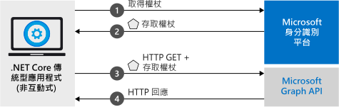

# <a name="quickstart-acquire-a-token-and-call-microsoft-graph-api-from-a-console-app-using-apps-identity"></a>快速入門：使用應用程式的身分識別來取得權杖並從主控台應用程式呼叫 Microsoft Graph API

在本快速入門中，您將了解如何撰寫 .NET Core 應用程式，以使用應用程式本身的身分識別取得存取權杖，然後呼叫 Microsoft Graph API 以顯示目錄中[使用者的清單](https://docs.microsoft.com/graph/api/user-list)。 此案例適用於無周邊的自動作業或 Windows 服務需要使用應用程式身分識別 (而非使用者的身分識別) 才能執行的情況。



## <a name="prerequisites"></a>必要條件

本快速入門需要 [.NET Core 2.2](https://www.microsoft.com/net/download/dotnet-core/2.2)。

> [!div renderon="docs"]
> ## <a name="register-and-download-your-quickstart-app"></a>註冊並下載快速入門應用程式

> [!div renderon="docs" class="sxs-lookup"]
>
> 有兩個選項可用來啟動快速入門應用程式：
> * [快速] [選項 1：註冊和自動設定您的應用程式，然後下載程式碼範例](#option-1-register-and-auto-configure-your-app-and-then-download-your-code-sample)
> * [手動] [選項 2：註冊並手動設定您的應用程式和程式碼範例](#option-2-register-and-manually-configure-your-application-and-code-sample)
>
> ### <a name="option-1-register-and-auto-configure-your-app-and-then-download-your-code-sample"></a>選項 1：註冊和自動設定您的應用程式，然後下載程式碼範例
>
> 1. 移至新的 [Azure 入口網站 - 應用程式註冊](https://portal.azure.com/?Microsoft_AAD_RegisteredApps=true#blade/Microsoft_AAD_RegisteredApps/applicationsListBlade/quickStartType/DotNetCoreDaemonQuickstartPage/sourceType/docs)窗格。
> 1. 輸入應用程式的名稱，並選取 [註冊]  。
> 1. 依照指示按一下滑鼠，即可下載並自動設定新的應用程式。
>
> ### <a name="option-2-register-and-manually-configure-your-application-and-code-sample"></a>選項 2：註冊並手動設定您的應用程式和程式碼範例

> [!div renderon="docs"]
> #### <a name="step-1-register-your-application"></a>步驟 1：註冊您的應用程式
> 若要手動註冊您的應用程式，並將應用程式註冊資訊新增到您的解決方案，請執行下列步驟：
>
> 1. 使用公司或學校帳戶或個人的 Microsoft 帳戶登入 [Azure 入口網站](https://portal.azure.com)。
> 1. 如果您的帳戶可讓您存取多個租用戶，請在右上角選取帳戶，然後將您的入口網站工作階段設定為想要的 Azure AD 租用戶。
> 1. 瀏覽至 Microsoft 身分識別平台，以取得開發人員的[應用程式註冊](https://go.microsoft.com/fwlink/?linkid=2083908)頁面。
> 1. 選取 [新增註冊]  。
> 1. 當 [註冊應用程式]  頁面出現時，輸入您應用程式的註冊資訊。 
> 1. 在 [名稱]  區段中，輸入將對應用程式使用者顯示、且有意義的應用程式名稱 (例如，`Daemon-console`)，然後選取 [註冊]  以建立應用程式。
> 1. 註冊之後，請選取 [憑證和祕密]  功能表。
> 1. 在 [用戶端密碼]  底下，選取 [+ 新增用戶端密碼]  。 為其提供名稱，然後選取 [新增]  。 將祕密複製到安全的位置。 程式碼會需要用到它。
> 1. 現在，選取 [API 權限]  功能表，選取 [+ 新增權限]  按鈕，選取 [Microsoft Graph]  。
> 1. 選取 [應用程式權限]  。
> 1. 在 [使用者]  節點底下，選取 [User.Read.All]  ，然後選取 [新增權限] 

> [!div class="sxs-lookup" renderon="portal"]
> ### <a name="download-and-configure-your-quickstart-app"></a>下載並設定您的快速入門應用程式
> 
> #### <a name="step-1-configure-your-application-in-azure-portal"></a>步驟 1：在 Azure 入口網站中設定您的應用程式
> 若要讓本快速入門中的程式碼範例能夠運作，您需要建立用戶端密碼，並新增 Graph API 的 **User.Read.All** 應用程式權限。
> > [!div renderon="portal" id="makechanges" class="nextstepaction"]
> > [為我進行這些變更]()
>
> > [!div id="appconfigured" class="alert alert-info"]
> >  您的應用程式已設定了這些屬性。

#### <a name="step-2-download-your-visual-studio-project"></a>步驟 2：下載您的 Visual Studio 專案

[下載 Visual Studio 專案](https://github.com/Azure-Samples/active-directory-dotnetcore-daemon-v2/archive/msal3x.zip)

#### <a name="step-3-configure-your-visual-studio-project"></a>步驟 3：設定您的 Visual Studio 專案

1. 將 Zip 檔案解壓縮至磁碟根目錄附近的本機資料夾，例如 **C:\Azure-Samples**。
1. 在 Visual Studio 中開啟解決方案 - **daemon-console.sln** (選擇性)。
1. 編輯 **appsettings.json**，並將欄位 `ClientId`、`Tenant` 和 `ClientSecret` 的值取代為下列值：

    ```json
    "Tenant": "Enter_the_Tenant_Id_Here",
    "ClientId": "Enter_the_Application_Id_Here",
    "ClientSecret": "Enter_the_Client_Secret_Here"
    ```
    > > [!div renderon="portal" id="certandsecretspage" class="sxs-lookup"]
    > > [產生新的用戶端密碼]()
    
    > [!div class="sxs-lookup" renderon="portal"]
    > > [!NOTE]
    > > 本快速入門支援 Enter_the_Supported_Account_Info_Here。
    
    > [!div renderon="docs"]
    >> 其中：
    >> * `Enter_the_Application_Id_Here` - 是您註冊的應用程式所具備的**應用程式 (用戶端) 識別碼**。
    >> * `Enter_the_Tenant_Id_Here` - 請將此值取代為 [租用戶識別碼]  或 [租用戶名稱]  (例如 contoso.microsoft.com)
    >> * `Enter_the_Client_Secret_Here` - 請將此值取代為步驟 1 所建立的用戶端密碼。

    > [!div renderon="docs"]
    > > [!TIP]
    > > 若要尋找 [應用程式 (用戶端) 識別碼]  、[目錄 (租用戶) 識別碼]  的值，請在 Azure 入口網站中移至應用程式的 [概觀]  頁面。 若要產生新的金鑰，請移至 [憑證和祕密]  頁面。
    
#### <a name="step-4-admin-consent"></a>步驟 4：系統管理員同意

如果您嘗試在此時執行應用程式，您將會收到「HTTP 403 - 禁止」  錯誤：`Insufficient privileges to complete the operation`。 這是因為任何「僅限應用程式權限」  都需要管理員同意，也就是目錄的全域管理員必須對應用程式表示同意。 請根據您的角色選取下列其中一個選項：

##### <a name="global-tenant-administrator"></a>全域租用戶管理員

> [!div renderon="docs"]
> 如果您是全域租用戶管理員，請移至 Azure 入口網站「應用程式註冊 (預覽)」中的 [API 權限]  頁面，然後選取 [代表 {租用戶名稱} 授與管理員同意]  (其中，{租用戶名稱} 是您的目錄名稱)。

> [!div renderon="portal" class="sxs-lookup"]
> 如果您是全域管理員，請移至 [API 權限]  頁面，選取 [代表 Enter_the_Tenant_Name_Here 授與管理員同意] 
> > [!div id="apipermissionspage"]
> > [移至 [API 權限] 頁面]()

##### <a name="standard-user"></a>標準使用者

如果您是租用戶的標準使用者，則需要請全域管理員針對應用程式授與管理員同意。 若要這樣做，請提供下列 URL 給管理員：

```url
https://login.microsoftonline.com/Enter_the_Tenant_Id_Here/adminconsent?client_id=Enter_the_Application_Id_Here
```

> [!div renderon="docs"]
>> 其中：
>> * `Enter_the_Tenant_Id_Here` - 請將此值取代為 [租用戶識別碼]  或 [租用戶名稱]  (例如 contoso.microsoft.com)
>> * `Enter_the_Application_Id_Here` - 是您註冊的應用程式所具備的**應用程式 (用戶端) 識別碼**。

> [!NOTE]
> 使用上述 URL 對應用程式授與同意之後，您可能會看到錯誤「AADSTS50011：  未針對應用程式註冊任何回覆地址」。 之所以發生此錯誤，是因為此應用程式和 URL 沒有重新導向 URI - 請忽略此錯誤。

#### <a name="step-5-run-the-application"></a>步驟 5：執行應用程式

如果您是使用 Visual Studio，請按 **F5** 來執行應用程式，否則請透過命令提示字元或主控台執行應用程式：

```console
cd {ProjectFolder}\daemon-console
dotnet run
```

> 其中：
> * {ProjectFolder}  是 ZIP 檔案解壓縮所在的資料夾。 範例 **C:\Azure-Samples\active-directory-dotnetcore-daemon-v2**

因此，您應該會在 Azure AD 目錄中看到使用者的清單。

> [!IMPORTANT]
> 此快速入門應用程式會使用用戶端密碼，將自己識別為機密用戶端。 由於用戶端密碼會以純文字形式新增至您的專案檔，因此，基於安全考量，在考慮將應用程式當作生產應用程式之前，建議您使用憑證，而非用戶端密碼。 如需有關如何使用憑證的詳細資訊，請從 GitHub 存放庫中參閱此範例的[這些指示](https://github.com/Azure-Samples/active-directory-dotnetcore-daemon-v2/#variation-daemon-application-using-client-credentials-with-certificates)。

## <a name="more-information"></a>詳細資訊

### <a name="msalnet"></a>MSAL.NET

MSAL ([Microsoft.Identity.Client](https://www.nuget.org/packages/Microsoft.Identity.Client)) 這個程式庫是用來登入使用者並要求權杖，該權杖會用來存取受 Microsoft 身分識別平台保護的 API。 如前所述，本快速入門會使用應用程式本身的身分識別 (而非委派的權限) 來要求權杖。 此案例所使用的驗證流程稱為[用戶端認證 OAuth 流程](v2-oauth2-client-creds-grant-flow.md)  。 如需如何搭配使用 MSAL.NET 與用戶端認證流程的詳細資訊，請參閱[這篇文章](https://aka.ms/msal-net-client-credentials)。

 您可以在 Visual Studio 的 [套件管理員主控台]  中，透過執行下列命令來安裝 MSAL.NET：

```powershell
Install-Package Microsoft.Identity.Client -Pre
```

或者，如果您是不使用 Visual Studio，您可以執行下列命令來將 MSAL 新增至您的專案：

```console
dotnet add package Microsoft.Identity.Client
```

### <a name="msal-initialization"></a>MSAL 初始化

您可以透過加入下列程式碼來新增 MSAL 的參考：

```csharp
using Microsoft.Identity.Client;
```

接著，使用下列程式碼將 MSAL 初始化：

```csharp
IConfidentialClientApplication app;
app = ConfidentialClientApplicationBuilder.Create(config.ClientId)
                                          .WithClientSecret(config.ClientSecret)
                                          .WithAuthority(new Uri(config.Authority))
                                          .Build();
);
```

> | 其中： ||
> |---------|---------|
> | `config.ClientSecret` | 在 Azure 入口網站中為應用程式建立的用戶端密碼。 |
> | `config.ClientId` | 是註冊於 Azure 入口網站中的應用程式所具備的**應用程式 (用戶端) 識別碼**。 您可以在 Azure 入口網站的應用程式 [概觀]  頁面中找到此值。 |
> | `config.Authority`    | (選擇性) 供使用者用於驗證的 STS 端點。 若為公用雲端，通常是 <https://login.microsoftonline.com/{tenant}>，其中 {tenant} 是租用戶的名稱或租用戶識別碼。|

如需詳細資訊，請參閱[下列項目的參考文件：`ConfidentialClientApplication`](https://docs.microsoft.com/dotnet/api/microsoft.identity.client.iconfidentialclientapplication?view=azure-dotnet)

### <a name="requesting-tokens"></a>要求權杖

若要使用應用程式的身分識別來要求權杖，請使用 `AcquireTokenForClient` 方法：

```csharp
result = await app.AcquireTokenForClient(scopes)
                  .ExecuteAsync();
```

> |其中：| |
> |---------|---------|
> | `scopes` | 包含所要求的範圍。 針對機密用戶端，這應該使用類似 `{Application ID URI}/.default` 的格式，以指出所要求的範圍是 Azure 入口網站中所設定應用程式物件中以靜態方式定義的範圍 (若為 Microsoft Graph，`{Application ID URI}` 會指向 `https://graph.microsoft.com`)。 若為自訂 Web API，`{Application ID URI}` 會定義在 Azure 入口網站「應用程式註冊 (預覽)」中的 [公開 API]  區段底下。 |

如需詳細資訊，請參閱[下列項目的參考文件：`AcquireTokenForClient`](https://docs.microsoft.com/dotnet/api/microsoft.identity.client.confidentialclientapplication.acquiretokenforclient?view=azure-dotnet#Microsoft_Identity_Client_ConfidentialClientApplication_AcquireTokenForClientAsync_System_Collections_Generic_IEnumerable_System_String__)

[!INCLUDE [Help and support](../../../includes/active-directory-develop-help-support-include.md)]

## <a name="next-steps"></a>後續步驟

> [!div class="nextstepaction"]
> [.NET Core 精靈範例](https://github.com/Azure-Samples/active-directory-dotnetcore-daemon-v2)

深入了解權限和同意：

> [!div class="nextstepaction"]
> [權限和同意](v2-permissions-and-consent.md)

若要深入了解此案例的驗證流程，請參閱 Oauth 2.0 用戶端認證流程：

> [!div class="nextstepaction"]
> [用戶端認證 Oauth 流程](v2-oauth2-client-creds-grant-flow.md)

> [!div class="nextstepaction"]
> [用戶端認證流程與 MSAL.NET](https://aka.ms/msal-net-client-credentials)

協助我們改善 Microsoft 身分識別平台。 完成問卷調查簡短的兩個問題，告訴我們您的想法。

> [!div class="nextstepaction"]
> [Microsoft 身分識別平台問卷調查](https://forms.office.com/Pages/ResponsePage.aspx?id=v4j5cvGGr0GRqy180BHbRyKrNDMV_xBIiPGgSvnbQZdUQjFIUUFGUE1SMEVFTkdaVU5YT0EyOEtJVi4u)