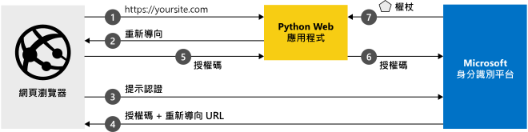

# <a name="quickstart-add-sign-in-with-microsoft-to-a-python-web-app"></a>快速入門：將「使用 Microsoft 登入」新增至 Python Web 應用程式

[!INCLUDE [active-directory-develop-applies-v2](../../../includes/active-directory-develop-applies-v2.md)]

在本快速入門中，您將了解如何整合 Python Web 應用程式與 Microsoft 身分識別平台。 您的應用程式會讓使用者登入、取得存取權杖來呼叫 Microsoft Graph API，以及對 Microsoft Graph API 提出要求。

完成本指南後，您的應用程式會接受使用個人Microsoft 帳戶 (包括 outlook.com、live.com 和其他帳戶)，以及採用 Azure Active Directory 的公司或組織所提供的公司或學校帳戶登入。



## <a name="prerequisites"></a>必要條件

若要執行此範例，您將需要：

- [Python 2.7+](https://www.python.org/downloads/release/python-2713) 或 [Python 3+](https://www.python.org/downloads/release/python-364/)
- [Flask](http://flask.pocoo.org/)、[Flask-Session](https://pythonhosted.org/Flask-Session/)、[requests](https://requests.kennethreitz.org//en/master/)
- [MSAL Python](https://github.com/AzureAD/microsoft-authentication-library-for-python)

> [!div renderon="docs"]
>
> ## <a name="register-and-download-your-quickstart-app"></a>註冊並下載快速入門應用程式
>
> 有兩個選項可用來啟動快速入門應用程式：快速 (選項 1) 和手動 (選項 2)
>
> ### <a name="option-1-register-and-auto-configure-your-app-and-then-download-your-code-sample"></a>選項 1：註冊和自動設定您的應用程式，然後下載程式碼範例
>
> 1. 移至 [Azure 入口網站 - 應用程式註冊](https://portal.azure.com/#blade/Microsoft_AAD_IAM/ActiveDirectoryMenuBlade/RegisteredApps)。
> 1. 選取 [新增註冊]  。
> 1. 輸入應用程式的名稱，並選取 [註冊]  。
> 1. 依照指示來下載並自動設定新應用程式。
>
> ### <a name="option-2-register-and-manually-configure-your-application-and-code-sample"></a>選項 2：註冊並手動設定您的應用程式和程式碼範例
>
> #### <a name="step-1-register-your-application"></a>步驟 1：註冊您的應用程式
>
> 若要手動註冊您的應用程式，並將應用程式註冊資訊新增到您的解決方案，請執行下列步驟：
>
> 1. 使用公司或學校帳戶或個人的 Microsoft 帳戶登入 [Azure 入口網站](https://portal.azure.com)。
> 1. 如果您的帳戶可讓您存取多個租用戶，請在右上角選取帳戶，然後將您的入口網站工作階段設定為想要的 Azure AD 租用戶。
> 1. 瀏覽至 Microsoft 身分識別平台，以取得開發人員的[應用程式註冊](https://go.microsoft.com/fwlink/?linkid=2083908)頁面。
> 1. 選取 [新增註冊]  。
> 1. 當 [註冊應用程式]  頁面出現時，輸入您應用程式的註冊資訊：
>      - 在 [名稱]  區段中，輸入將對應用程式使用者顯示、且有意義的應用程式名稱，例如 `python-webapp`。
>      - 在 [支援的帳戶類型]  底下，選取 [任何組織目錄中的帳戶及個人的 Microsoft 帳戶]  。
>      - 在 [重新導向 URI]  區段底下的下拉式清單中，選取 [Web]  平台，然後將值設定為 `http://localhost:5000/getAToken`。
>      - 選取 [註冊]  。 在應用程式 [概觀]  頁面上，記下 [應用程式 (用戶端) 識別碼]  值以供稍後使用。
> 1. 在左側功能表上，選擇 [憑證與祕密]  ，然後在 [用戶端密碼]  區段中，按一下 [新增用戶端密碼]  ：
>
>      - 輸入 (執行個體應用程式祕密的) 金鑰描述。
>      - 選取 [1 年]  作為 [金鑰持續時間]。
>      - 當您按一下 [新增]  時，金鑰值會隨即顯示。
>      - 複製金鑰的值。 稍後您將會用到此資訊。
>
> [!div class="sxs-lookup" renderon="portal"]
>
> #### <a name="step-1-configure-your-application-in-azure-portal"></a>步驟 1：在 Azure 入口網站中設定您的應用程式
>
> 若要讓本快速入門中的程式碼範例能正常運作，您需要：
>
> 1. 新增回覆 URL 作為 `http://localhost:5000/getAToken`。
> 1. 建立用戶端密碼。
>
> > [!div renderon="portal" id="makechanges" class="nextstepaction"]
> > [為我進行這項變更]()
> > [!div id="appconfigured" class="alert alert-info"]
> >  您的應用程式已設定了這個屬性

#### <a name="step-2-download-your-project"></a>步驟 2：下載您的專案

[下載程式碼範例](https://github.com/Azure-Samples/ms-identity-python-webapp/archive/master.zip)

#### <a name="step-3-configure-the-application"></a>步驟 3：設定應用程式

1. 將 ZIP 檔案解壓縮至根資料夾附近的本機資料夾 - 例如 **C:\Azure-Samples**
1. 如果您使用整合式開發環境，請在您慣用的 IDE 中開啟範例 (選用)。
1. 開啟 **app_config.py** 檔案，其位於根資料夾並取代為下列程式碼片段：

```python
CLIENT_SECRET = "Enter_the_Client_Secret_Here"
CLIENT_ID = "Enter_the_Application_Id_here"
```

> [!div renderon="docs"]
> 其中：
>
> - `Enter_the_Application_Id_here` - 是您註冊的應用程式所具備的應用程式識別碼。
> - `Enter_the_Client_Secret_Here` - 您在 [憑證與祕密]  中為您所註冊的應用程式建立的 [用戶端密碼]  。

#### <a name="step-4-run-the-code-sample"></a>步驟 4：執行程式碼範例

1. 您需要使用 pip 安裝 MSAL Python 程式庫、Flask 架構、Flask-Session，以進行伺服器端工作階段管理和要求，如下所示：

   ```Shell
   pip install -r requirements.txt
   ```

2. 從殼層或命令列執行 app.py：

   ```Shell
   python app.py
   ```

## <a name="next-steps"></a>後續步驟

深入了解可登入使用者而後呼叫 Web API 的 Web 應用程式：

> [!div class="nextstepaction"]
> [案例：可登入使用者的 Web 應用程式](scenario-web-app-sign-user-overview.md)

[!INCLUDE [Help and support](../../../includes/active-directory-develop-help-support-include.md)]
