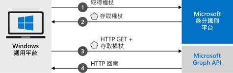

# <a name="quickstart-call-the-microsoft-graph-api-from-a-universal-windows-platform-uwp-application"></a>快速入門：自通用 Windows 平台 (UWP) 應用程式呼叫 Microsoft Graph API

此快速入門包含程式碼範例，用以示範通用 Windows 平台 (UWP) 應用程式如何登入個人帳戶或公司與學校帳戶的使用者、取得存取權杖，以及呼叫 Microsoft Graph API。



> [!div renderon="docs"]
> ## <a name="register-and-download-your-quickstart-app"></a>註冊並下載快速入門應用程式
> [!div renderon="docs" class="sxs-lookup"]
> 有兩個選項可用來啟動快速入門應用程式：
> * [快速] [選項 1：註冊和自動設定您的應用程式，然後下載程式碼範例](#option-1-register-and-auto-configure-your-app-and-then-download-your-code-sample)
> * [手動] [選項 2：註冊並手動設定您的應用程式和程式碼範例](#option-2-register-and-manually-configure-your-application-and-code-sample)
>
> ### <a name="option-1-register-and-auto-configure-your-app-and-then-download-your-code-sample"></a>選項 1：註冊和自動設定您的應用程式，然後下載程式碼範例
>
> 1. 移至新的 [Azure 入口網站 - 應用程式註冊](https://portal.azure.com/#blade/Microsoft_AAD_RegisteredApps/applicationsListBlade/quickStartType/UwpQuickstartPage/sourceType/docs)窗格。
> 1. 輸入您的應用程式名稱，然後按一下 [註冊]  。
> 1. 依照指示按一下滑鼠，即可下載並自動設定新的應用程式。
>
> ### <a name="option-2-register-and-manually-configure-your-application-and-code-sample"></a>選項 2：註冊並手動設定您的應用程式和程式碼範例
> [!div renderon="docs"]
> #### <a name="step-1-register-your-application"></a>步驟 1：註冊您的應用程式
> 若要註冊您的應用程式，並將應用程式註冊資訊新增到您的解決方案，請執行下列步驟：
> 1. 使用公司或學校帳戶或個人的 Microsoft 帳戶登入 [Azure 入口網站](https://portal.azure.com)。
> 1. 如果您的帳戶可讓您存取多個租用戶，請在右上角選取帳戶，然後將您的入口網站工作階段設定為想要的 Azure AD 租用戶。
> 1. 瀏覽至 Microsoft 身分識別平台，以取得開發人員的[應用程式註冊](https://aka.ms/MobileAppReg)頁面。
> 1. 選取 [新增註冊]  。
> 1. 當 [註冊應用程式]  頁面出現時，輸入您應用程式的註冊資訊：
>      - 在 [名稱]  區段中，輸入將對應用程式使用者顯示、且有意義的應用程式名稱，例如 `UWP-App-calling-MsGraph`。
>      - 在 [支援的帳戶類型]  區段中，選取 [任何組織目錄中的帳戶及個人的 Microsoft 帳戶]  ，例如 Skype、Xbox、Outlook.com。
>      - 選取 [註冊]  以建立應用程式。
> 1. 在應用程式頁面清單中，選取 [驗證]  。
> 1. 展開 [桌面 + 裝置]  區段。  (如果看不到 [桌面 + 裝置]  ，請先按一下頂端橫幅，以檢視預覽驗證體驗)
> 1. 在 [重新導向 URI]  區段之下，選取 [新增 URI]  。  輸入 **urn:ietf:wg:oauth:2.0:oob**。
> 1. 選取 [ **儲存**]。

> [!div renderon="portal" class="sxs-lookup"]
> #### <a name="step-1-configure-your-application"></a>步驟 1：設定您的應用程式
> 若要讓此快速入門中的程式碼範例正確運作，您必須將重新導向 URI 加入為 **urn:ietf:wg:oauth:2.0:oob**。
> > [!div renderon="portal" id="makechanges" class="nextstepaction"]
> > [為我進行這項變更]()
>
> > [!div id="appconfigured" class="alert alert-info"]
> >  您的應用程式已設定了這些屬性。

#### <a name="step-2-download-your-visual-studio-project"></a>步驟 2：下載您的 Visual Studio 專案

 - [下載 Visual Studio 專案](https://github.com/Azure-Samples/active-directory-dotnet-native-uwp-v2/archive/msal3x.zip)

#### <a name="step-3-configure-your-visual-studio-project"></a>步驟 3：設定您的 Visual Studio 專案

1. 將 Zip 檔案解壓縮至磁碟根目錄附近的本機資料夾，例如 **C:\Azure-Samples**。
1. 在 Visual Studio 中開啟專案。 系統可能會提示您安裝 UWP SDK。 在此情況下，請同意安裝。
1. 編輯 **MainPage.Xaml.cs**，並取代 `ClientId` 欄位的值：

    ```csharp
    private const string ClientId = "Enter_the_Application_Id_here";
    ```
> [!div class="sxs-lookup" renderon="portal"]
> > [!NOTE]
> > 本快速入門支援 Enter_the_Supported_Account_Info_Here。    

> [!div renderon="docs"]
> 其中：
> - `Enter_the_Application_Id_here` - 是您註冊的應用程式所具備的應用程式識別碼。
>
> > [!TIP]
> > 若要尋找「應用程式識別碼」  的值，請移至入口網站中的 [概觀]  區段

#### <a name="step-4-run-your-application"></a>步驟 4：執行您的應用程式

如果您想要在 Windows 機器上嘗試快速入門：

1. 在 Visual Studio 工具列中，選擇正確的平台 (可能是 **x64** 或 **x86**，但不是 ARM)。
   > 您會看到目標裝置從「裝置」  變成「本機電腦」 
1. 選取偵錯 | **未經偵錯即啟動**

## <a name="more-information"></a>詳細資訊

此區段提供相關快速入門的詳細資訊。

### <a name="msalnet"></a>MSAL.NET

MSAL ([Microsoft.Identity.Client](https://www.nuget.org/packages/Microsoft.Identity.Client)) 是用來登入使用者並要求安全性權杖的程式庫。 API 若是由適用於開發人員的 Microsoft 身分識別平台所保護，則需使用安全性權杖來存取。 您可以在 Visual Studio 的 [套件管理員主控台]  中，透過執行下列命令來安裝 MSAL：

```powershell
Install-Package Microsoft.Identity.Client -IncludePrerelease
```

### <a name="msal-initialization"></a>MSAL 初始化

您可以透過加入下列程式碼來新增 MSAL 的參考：

```csharp
using Microsoft.Identity.Client;
```

接著，系統便會使用下列程式碼將 MSAL 初始化：

```csharp
public static IPublicClientApplication PublicClientApp;
PublicClientApp = new PublicClientApplicationBuilder.Create(ClientId)
                                                    .Build();
```

> |其中： ||
> |---------|---------|
> | `ClientId` | 是註冊於 Azure 入口網站中的應用程式所具備的**應用程式 (用戶端) 識別碼**。 您可以在 Azure 入口網站的應用程式 [概觀]  頁面中找到此值。 |

### <a name="requesting-tokens"></a>要求權杖

MSAL 有兩種方法可取得 UWP 應用程式中的權杖：`AcquireTokenInteractive` 與 `AcquireTokenSilent`。

#### <a name="get-a-user-token-interactively"></a>以互動方式取得使用者權杖

有些情況需要強制使用者透過快顯視窗與 Microsoft 身分識別平台端點進行互動，以驗證其認證或取得同意。 部分範例包括：

- 使用者首次登入應用程式
- 使用者因為密碼已過期而可能需要重新輸入其認證時
- 您的應用程式要求存取的資源需要使用者同意時
- 需要雙因素驗證時

```csharp
authResult = await App.PublicClientApp.AcquireTokenInteractive(scopes)
                      .ExecuteAsync();
```

> |其中：||
> |---------|---------|
> | `scopes` | 包含所要求的範圍，例如適用於 Microsoft Graph 的 `{ "user.read" }` 或適用於自訂 Web API 的 `{ "api://<Application ID>/access_as_user" }`。 |

#### <a name="get-a-user-token-silently"></a>以無訊息方式取得使用者權杖

在初始的 `AcquireTokenInteractive` 方法之後，使用 `AcquireTokenSilent` 方法來取得權杖以存取受保護的資源。 您不應該在每次使用者需要存取資源時都要求使用者驗證其認證。 在大部分情況下，您應該以不需要與使用者進行任何互動的方式處理權杖取得和更新作業

```csharp
var accounts = await App.PublicClientApp.GetAccountsAsync();
var firstAccount = accounts.FirstOrDefault();
authResult = await App.PublicClientApp.AcquireTokenSilent(scopes, firstAccount)
                                      .ExecuteAsync();
```

> |其中： ||
> |---------|---------|
> | `scopes` | 包含所要求的範圍，例如適用於 Microsoft Graph 的 `{ "user.read" }` 或適用於自訂 Web API 的 `{ "api://<Application ID>/access_as_user" }` |
> | `firstAccount` | 指定快取中的第一個使用者帳戶 (MSAL 在單一應用程式中支援多個使用者) |

[!INCLUDE [Help and support](../../../includes/active-directory-develop-help-support-include.md)]

## <a name="next-steps"></a>後續步驟

嘗試 Windows Desktop 教學課程以取得建置應用程式與新功能的完整逐步指南，包括此快速入門的完整說明。

> [!div class="nextstepaction"]
> [UWP - 呼叫圖形 API 教學課程](tutorial-v2-windows-uwp.md)
