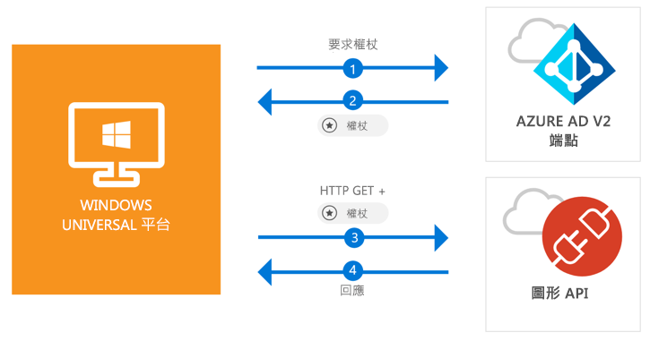

# <a name="call-the-microsoft-graph-api-from-a-universal-windows-platform-uwp-application"></a>從通用 Windows 平台 (UWP) 應用程式呼叫 Microsoft Graph API

[!INCLUDE [active-directory-develop-applies-v2-msal](../../../includes/active-directory-develop-applies-v2-msal.md)]

此快速入門包含能示範通用 Windows 平台 (UWP) 應用程式如何登入個人或公司與學校帳戶的使用者，取得存取權杖，然後呼叫 Microsoft Graph API 之方法的程式碼範例。



> [!div renderon="docs"]
> ## <a name="register-and-download"></a>註冊及下載
> ### <a name="register-and-configure-your-application-and-code-sample"></a>註冊並設定您的應用程式和程式碼範例
> #### <a name="step-1-register-your-application"></a>步驟 1：註冊您的應用程式
> 若要註冊您的應用程式並將應用程式註冊資訊新增到您的解決方案，請執行下列作業：
> 1. 前往 [Microsoft 應用程式註冊入口網站](https://apps.dev.microsoft.com/portal/register-app)註冊應用程式。
> 1. 在 [應用程式名稱] 方塊中，輸入應用程式的名稱。
> 1. 確認已清除 [引導式設定] 核取方塊，然後選取 [建立]。
> 1. 選取 [新增平台]，選取 [原生應用程式]，然後選取 [儲存]。

> [!div renderon="portal" class="sxs-lookup alert alert-info"]
> #### <a name="step-1-configure-your-application"></a>步驟 1：設定您的應用程式
> 若要讓此快速入門中的程式碼範例正確運作，您必須將重新導向 URL 加入為 **urn:ietf:wg:oauth:2.0:oob**。
> > [!div renderon="portal" id="makechanges" class="nextstepaction"]
> > [為我進行此變更]()
>
> > [!div id="appconfigured" class="alert alert-info"]
> >  您的應用程式已設定這些屬性

#### <a name="step-2-download-your-visual-studio-project"></a>步驟 2：下載您的 Visual Studio 專案

 - [下載 Visual Studio 2017 專案](https://github.com/Azure-Samples/active-directory-dotnet-native-uwp-v2/archive/master.zip)

#### <a name="step-3-configure-your-visual-studio-project"></a>步驟 3：設定您的 Visual Studio 專案

1. 將 zip 檔案解壓縮至本機資料夾 (例如 **C:\Azure-Samples**)
1. 在 Visual Studio 中開啟專案
1. 編輯 **App.Xaml.cs** 並將開頭為 `private static string ClientId` 的那一行取代為：

    ```csharp
    private static string ClientId = "Enter_the_Application_Id_here";
    ```

## <a name="more-information"></a>相關資訊

以下為此快速入門的概觀：

### <a name="msalnet"></a>MSAL.NET

MSAL ([Microsoft.Identity.Client](https://www.nuget.org/packages/Microsoft.Identity.Client)) 這個程式庫是用來登入使用者並要求用來存取受 Microsoft Azure Active Directory 保護之 API 的權杖。 您可以在 Visual Studio 的 [套件管理員主控台] 中執行下列命令來安裝它：

```powershell
Install-Package Microsoft.Identity.Client -Pre
```

### <a name="msal-initialization"></a>MSAL 初始化

您可以透過加入下面一行來新增 MSAL 參考：

```csharp
using Microsoft.Identity.Client;
```

接著，使用下面一行來初始化 MSAL：

```csharp
public static PublicClientApplication PublicClientApp = new PublicClientApplication(ClientId);
```

> |其中： ||
> |---------|---------|
> |ClientId | 來自在 *portal.microsoft.com* 中註冊之應用程式的應用程式識別碼 |

### <a name="requesting-tokens"></a>要求權杖

MSAL 有兩種取得權杖的方法：`AcquireTokenAsync` 與 `AcquireTokenSilentAsync`：

#### <a name="get-a-user-token-interactively"></a>以互動方式取得使用者權杖

 有些情況需要強制使用者透過快顯視窗與 Azure Active Directory v2 端點進行互動，以驗證其認證或取得同意，其中一些範例如下：

- 使用者首次登入應用程式
- 使用者可能需要重新輸入其認證，因為密碼已過期
- 您的應用程式要求的資源存取權，需要使用者同意
- 需要雙因素驗證

```csharp
authResult = await App.PublicClientApp.AcquireTokenAsync(scopes);
```

> |其中：||
> |---------|---------|
> |範圍 | 包含所要求的範圍 (即適用於 Microsoft Graph 的 `{ "user.read" }` 或適用於自訂 Web API 的 `{ "api://<Application ID>/access_as_user" }`) |

#### <a name="get-a-user-token-silently"></a>以無訊息方式取得使用者權杖

您不應該要求使用者在每次存取資源時都需要驗證其認證；在大部分的情況下，您應該在無需任何使用者互動的情況下取得或更新權杖，而 `AcquireTokenSilentAsync` 便是經常用來在初始 `AcquireTokenAsync` 之後取得用來存取受保護資源之權杖的方法：

```csharp
var accounts = await App.PublicClientApp.GetAccountsAsync();
authResult = await App.PublicClientApp.AcquireTokenSilentAsync(scopes, accounts.FirstOrDefault());
```

> |其中： ||
> |---------|---------|
> |範圍 | 包含所要求的範圍 (即適用於 Microsoft Graph 的 `{ "user.read" }` 或適用於自訂 Web API 的 `{ "api://<Application ID>/access_as_user" }`) |
> |accounts.FirstOrDefault() | 快取中的第一個使用者 (MSAL 在單一應用程式中支援多個使用者) |

## <a name="next-steps"></a>後續步驟

嘗試 Windows Desktop 教學課程以取得建置應用程式與新功能的完整逐步指南，包括此快速入門的完整說明：

### <a name="learn-the-steps-to-create-the-application-used-in-this-quickstart"></a>了解建立此快速入門中使用之應用程式的步驟

> [!div class="nextstepaction"]
> [UWP - 呼叫圖形 API 教學課程](tutorial-v2-windows-uwp.md)

[!INCLUDE [Help and support](../../../includes/active-directory-develop-help-support-include.md)]