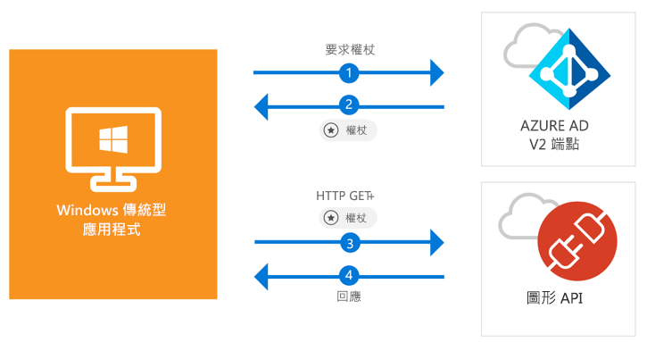

# <a name="quickstart-acquire-a-token-and-call-microsoft-graph-api-from-a-windows-desktop-app"></a>快速入門：取得權杖，並從 Windows 傳統型應用程式呼叫 Microsoft Graph API

[!INCLUDE [active-directory-develop-applies-v2-msal](../../../includes/active-directory-develop-applies-v2-msal.md)]

在此快速入門中，您將了解如何撰寫可登入個人、公司與學校帳戶、取得存取權杖以及呼叫 Microsoft Graph API 的 Windows Desktop .NET (WPF) 應用程式。



> [!div renderon="docs"]
> ## <a name="register-and-download-your-quickstart-app"></a>註冊並下載快速入門應用程式
> 有兩個選項可用來啟動快速入門應用程式：
> * [快速] [選項 1：註冊和自動設定您的應用程式，然後下載程式碼範例](#option-1-register-and-auto-configure-your-app-and-then-download-your-code-sample)
> * [手動] [選項 2：註冊並手動設定您的應用程式和程式碼範例](#option-2-register-and-manually-configure-your-application-and-code-sample)
>
> ### <a name="option-1-register-and-auto-configure-your-app-and-then-download-your-code-sample"></a>選項 1：註冊和自動設定您的應用程式，然後下載程式碼範例
>
> 1. 移至 [Azure 入口網站 - 應用程式註冊 (預覽)](https://portal.azure.com/#blade/Microsoft_AAD_RegisteredApps/applicationsListBlade/quickStartType/WinDesktopQuickstartPage/sourceType/docs)。
> 1. 輸入應用程式的名稱，並選取 [註冊]。
> 1. 依照指示按一下滑鼠，即可下載並自動設定新的應用程式。
>
> ### <a name="option-2-register-and-manually-configure-your-application-and-code-sample"></a>選項 2：註冊並手動設定您的應用程式和程式碼範例
>
> #### <a name="step-1-register-your-application"></a>步驟 1：註冊您的應用程式
> 若要手動註冊您的應用程式，並將應用程式註冊資訊新增到您的解決方案，請執行下列步驟：
>
> 1. 使用公司或學校帳戶或個人的 Microsoft 帳戶登入 [Azure 入口網站](https://portal.azure.com)。
> 1. 如果您的帳戶可讓您存取多個租用戶，請在右上角選取帳戶，然後將您的入口網站工作階段設定為想要的 Azure AD 租用戶。
> 1. 在左側導覽窗格中，選取 [Azure Active Directory] 服務，然後選取 [應用程式註冊 (預覽)] > [新增註冊]。
> 1. 當 [註冊應用程式] 頁面出現時，輸入您應用程式的註冊資訊：
>      - 在 [名稱] 區段中，輸入將對應用程式使用者顯示、且有意義的應用程式名稱，例如 `Win-App-calling-MsGraph`。
>      - 在 [支援的帳戶類型] 區段中，選取 [任何組織目錄中的帳戶及個人的 Microsoft 帳戶]，例如 Skype、Xbox、Outlook.com。
>      - 選取 [註冊] 以建立應用程式。
> 1. 在應用程式頁面清單中，選取 [驗證]。
> 1. 在 [重新導向 URI] 區段中，找出 [建議的公用用戶端 (行動裝置、桌面) 重新導向 URI] 區段，然後選取 **"urn:ietf:wg:oauth:2.0:oob**。
> 1. 選取 [ **儲存**]。

> [!div class="sxs-lookup" renderon="portal"]
> #### <a name="step-1-configure-your-application-in-azure-portal"></a>步驟 1：在 Azure 入口網站中設定您的應用程式
> 若要讓此快速入門中的程式碼範例正確運作，您必須將回覆 URL 加入為 **urn:ietf:wg:oauth:2.0:oob**。
> > [!div renderon="portal" id="makechanges" class="nextstepaction"]
> > [為我進行這項變更]()
>
> > [!div id="appconfigured" class="alert alert-info"]
> >  您的應用程式已設定了這些屬性。

#### <a name="step-2-download-your-visual-studio-project"></a>步驟 2：下載您的 Visual Studio 專案

[下載 Visual Studio 2017 專案](https://github.com/Azure-Samples/active-directory-dotnet-desktop-msgraph-v2/archive/master.zip)

#### <a name="step-3-configure-your-visual-studio-project"></a>步驟 3：設定您的 Visual Studio 專案

1. 將 Zip 檔案解壓縮至磁碟根目錄附近的本機資料夾，例如 **C:\Azure-Samples**。
1. 在 Visual Studio 中開啟專案。
1. 編輯 **App.Xaml.cs**，並將欄位 `ClientId` 和 `Tenant` 的值取代為下列程式碼：

    ```csharp
    private static string ClientId = "Enter_the_Application_Id_here";
    private static string Tenant = "Enter_the_Tenant_Info_Here";
    ```

> [!div renderon="docs"]
> 其中：
> - `Enter_the_Application_Id_here` - 是您註冊的應用程式所具備的**應用程式 (用戶端) 識別碼**。
> - `Enter_the_Tenant_Info_Here` - 會設為下列其中一個選項：
>   - 如果您的應用程式支援 [此組織目錄中的帳戶]，請將此值取代為 [租用戶識別碼] 或 [租用戶名稱] (例如 contoso.microsoft.com)
>   - 如果您的應用程式支援 [任何組織目錄中的帳戶]，請將此值取代為 `organizations`
>   - 如果您的應用程式支援 [任何組織目錄中的帳戶及個人的 Microsoft 帳戶]，請將此值取代為 `common`
>
> > [!TIP]
> > 若要尋找 [應用程式 (用戶端) 識別碼]、[目錄 (租用戶) 識別碼] 和 [支援的帳戶類型] 的值，請在 Azure 入口網站中移至應用程式的 [概觀] 頁面。

## <a name="more-information"></a>詳細資訊

### <a name="msalnet"></a>MSAL.NET

MSAL ([Microsoft.Identity.Client](https://www.nuget.org/packages/Microsoft.Identity.Client)) 是一個程式庫，可用來登入使用者並要求用來存取受 Microsoft Azure Active Directory (Azure AD) 保護之 API 的權杖。 您可以在 Visual Studio 的 [套件管理員主控台] 中，透過執行下列命令來安裝 MSAL：

```powershell
Install-Package Microsoft.Identity.Client
```

### <a name="msal-initialization"></a>MSAL 初始化

您可以透過加入下列程式碼來新增 MSAL 的參考：

```csharp
using Microsoft.Identity.Client;
```

接著，使用下列程式碼將 MSAL 初始化：

```csharp
public static PublicClientApplication PublicClientApp = new PublicClientApplication(ClientId);
```

> |其中： ||
> |---------|---------|
> | `ClientId` | 是註冊於 Azure 入口網站中的應用程式所具備的**應用程式 (用戶端) 識別碼**。 您可以在 Azure 入口網站的應用程式 [概觀] 頁面中找到此值。 |

### <a name="requesting-tokens"></a>要求權杖

MSAL 有兩種取得權杖的方法：`AcquireTokenAsync` 與 `AcquireTokenSilentAsync`。

#### <a name="get-a-user-token-interactively"></a>以互動方式取得使用者權杖

有些情況需要強制使用者透過快顯視窗與 Azure AD v2.0 端點進行互動，以驗證其認證或取得同意。 部分範例包括：

- 使用者首次登入應用程式
- 使用者因為密碼已過期而可能需要重新輸入其認證時
- 您的應用程式要求存取的資源需要使用者同意時
- 需要雙因素驗證時

```csharp
authResult = await App.PublicClientApp.AcquireTokenAsync(_scopes);
```

> |其中：||
> |---------|---------|
> | `_scopes` | 包含所要求的範圍，例如適用於 Microsoft Graph 的 `{ "user.read" }` 或適用於自訂 Web API 的 `{ "api://<Application ID>/access_as_user" }`。 |

#### <a name="get-a-user-token-silently"></a>以無訊息方式取得使用者權杖

您不應該在每次使用者需要存取資源時都要求使用者驗證其認證。 在大部分時間，您會希望權杖取得和更新作業不需要與使用者進行任何互動。 在初始 `AcquireTokenAsync` 方法之後，您可以使用 `AcquireTokenSilentAsync` 方法取得權杖以存取受保護的資源：

```csharp
var accounts = await App.PublicClientApp.GetAccountsAsync();
authResult = await App.PublicClientApp.AcquireTokenSilentAsync(scopes, accounts.FirstOrDefault());
```

> |其中： ||
> |---------|---------|
> | `scopes` | 包含所要求的範圍，例如適用於 Microsoft Graph 的 `{ "user.read" }` 或適用於自訂 Web API 的 `{ "api://<Application ID>/access_as_user" }`。 |
> | `accounts.FirstOrDefault()` | 指定快取中的第一個使用者 (MSAL 在單一應用程式中支援多個使用者)。 |

[!INCLUDE [Help and support](../../../includes/active-directory-develop-help-support-include.md)]

## <a name="next-steps"></a>後續步驟

嘗試 Windows Desktop 教學課程以取得建置應用程式與新功能的完整逐步指南，包括此快速入門的完整說明。

> [!div class="nextstepaction"]
> [呼叫 圖形 API 教學課程](https://docs.microsoft.com/azure/active-directory/develop/guidedsetups/active-directory-windesktop)

