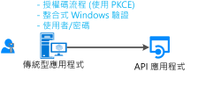
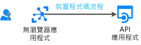

# 案例：傳統型應用程式呼叫 web Api

了解您只需要建置傳統型應用程式呼叫 web Api

## 必要條件

[!INCLUDE [Pre-requisites](../../../includes/active-directory-develop-scenarios-prerequisites.md)]

## 開始使用

如果您還沒有這麼做，請遵循.NET desktop 快速入門或 UWP 快速入門中建立第一個應用程式：

> [!div class="nextstepaction"]
> [快速入門：取得權杖，然後從 Windows 傳統型應用程式呼叫 Microsoft Graph API](./quickstart-v2-windows-desktop.md)

> [!div class="nextstepaction"]
> [快速入門：取得權杖，然後從 UWP 應用程式呼叫 Microsoft Graph API](./quickstart-v2-uwp.md)

## 概觀

撰寫桌面的應用程式，而且想要使用者登入您的應用程式，並呼叫 web Api，例如 Microsoft Graph、 其他 Microsoft Api 或您自己的 web API。 您有幾個可能性：

- 如果您桌面應用程式可執行個體支援圖形化的控制項，如果它是 Windows.Form 應用程式或 WPF 應用程式，您可以使用互動式權杖取得。
- 對於裝載的 Windows 應用程式，此外，也可以加入 Windows 網域的電腦上執行的應用程式或 AAD 加入以使用整合式 Windows 驗證以無訊息模式取得權杖。
- 最後，雖然不建議，您可以使用使用者名稱/密碼公用用戶端應用程式。 仍需要在某些情況下 （例如 DevOps)，但請注意，使用它將會造成您的應用程式的條件約束。 比方說，它無法登入的使用者需要執行多重要素驗證 （條件式存取） 的使用者。 也您的應用程式不會受益於單一登入 (SSO)。

  它也會針對新式驗證的原則，並僅針對因舊版因素而提供。

  

- 如果您正在撰寫可攜式的命令列工具-可能在執行 Linux 或 Mac 上的.NET Core 應用程式-您將無法使用沒有互動式的驗證 (如.NET Core 不會提供[網頁瀏覽器](https://aka.ms/msal-net-uses-web-browser))，或整合式驗證Windows 驗證。 在此情況下最好的選擇是使用裝置程式碼流程。 此流程也可用於沒有瀏覽器中，例如 iOT 應用程式的應用程式

  

## 詳細資料

桌面應用程式有數 specificities，主要取決於您的應用程式是否使用互動式驗證。

## 後續步驟

> [!div class="nextstepaction"]
> [傳統型應用程式-應用程式註冊](scenario-desktop-app-registration.md)
