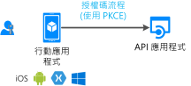

# 案例：呼叫 web Api 的行動應用程式

了解所有您需要知道建置行動應用程式呼叫 web Api。

## 先決條件

[!INCLUDE [Prerequisites](../../../includes/active-directory-develop-scenarios-prerequisites.md)]

## 使用者入門

建立第一個行動應用程式，並試試我們的快速入門 ！

> [!div class="nextstepaction"]
> [快速入門：取得權杖，然後從 Android 應用程式呼叫 Microsoft Graph API](./quickstart-v2-android.md)
>
> [快速入門：取得權杖，然後從 iOS 應用程式呼叫 Microsoft Graph API](./quickstart-v2-ios.md)
>
> [快速入門：取得權杖，然後從 Xamarin iOS 和 Android 應用程式呼叫 Microsoft Graph API](https://github.com/Azure-Samples/active-directory-xamarin-native-v2)

## 總覽

個人化、 順暢的使用者體驗是不可或缺的行動裝置應用程式。  Microsoft 身分識別平台可讓行動裝置開發人員建立適用於 iOS 和 Android 的使用者經驗。 登入 Azure Active Directory (Azure AD) 使用者、 個人的 Microsoft 帳戶使用者和 Azure AD B2C 使用者並取得權杖以呼叫 web API，其代表您的應用程式。 若要實作這些流程，我們將使用 Microsoft Authentication Library (MSAL)，它會實作的業界標準[OAuth2.0 授權碼流程](v2-oauth2-auth-code-flow.md)。

行動裝置應用程式的考量：

- **使用者體驗是關鍵**:允許使用者登入時，要求之前，請先查看您的應用程式的值，並要求的必要權限。
- **支援所有的使用者設定**:許多行動商務使用者會在 條件式存取與裝置合規性政策下。 請務必在支援這些重要的案例。
- **實作單一登入 (SSO)** :MSAL 和 Microsoft 身分識別平台可讓啟用單一登入裝置的瀏覽器或透過 Microsoft Authenticator （在 Android 上的 Intune 公司入口網站） 的簡單。

## 詳細資料

Microsoft 身分識別平台上建置行動應用程式時，請記住這些考量：

- 根據平台，某些使用者互動可能需要使用者登入第一次。 例如，iOS 需要 Microsoft Authenticator （和 Android 上的 Intune 公司入口網站） 在第一次使用 SSO 時，顯示使用者互動的應用程式。
- 在 iOS 和 Android 上，MSAL 可能會使用外部瀏覽器 （這可能會出現在您的應用程式頂端），讓使用者登入。 您可以自訂要改為使用中的應用程式 web 檢視的組態。
- 永遠不會使用行動應用程式中的密碼。 它可讓所有使用者。

## 後續步驟

> [!div class="nextstepaction"]
> [應用程式註冊](scenario-mobile-app-registration.md)
