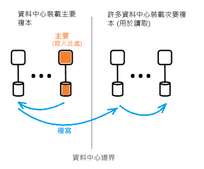

# 什麼是 Azure Active Directory 架構？
Azure Active Directory (Azure AD) 可讓您安全地管理您使用者的 Azure 服務和資源存取權。 Azure AD 隨附一套完整的身分識別管理功能。 如需 Azure AD 功能的詳細資訊，請參閱[什麼是 Azure Active Directory？](active-directory-whatis.md)

您可以使用 Azure AD，建立及管理使用者和群組，並啟用權限以允許和拒絕企業資源存取。 如需身分識別管理的相關資訊，請參閱 [Azure 身分識別管理的基本概念](active-directory-whatis.md)。

## Azure AD 架構
Azure AD 分佈各地的架構結合廣泛監視、自動化重設路徑、容錯移轉和復原功能，可為客戶提供全公司的可用性和效能。

本文涵蓋下列架構元素︰
 *  服務架構設計
 *  延展性
 *  持續可用性
 *  資料中心

### 服務架構設計
若要建置可存取且可使用、資料豐富的系統，最常見的方式就是透過獨立建置組塊或縮放單位。 對於 Azure AD 資料層，縮放單位稱之為「分割區」  。 

資料層有數個可提供讀寫功能的前端服務。 下圖顯示如何將單一目錄分割的元件傳遞整個地理位置分散的資料中心。 

  

Azure AD 架構的元件包括主要複本和次要複本。

**主要複本**

「主要複本」  會接收其所屬資料分割的所有「寫入」  。 所有寫入作業會先立即複寫至不同資料中心內的次要複本，然後將成功傳回給呼叫端，因而確保寫入的地理備援持久性。

**次要複本**

所有的目錄*讀取*由*次要複本*，這是在實際位於不同的地理位置的資料中心。 次要複本有許多個，因為資料會以非同步方式複寫。 目錄讀取，例如驗證要求是從靠近客戶的資料中心服務。 次要複本負責提供讀取延展性。

### 延展性

延展性是擴充服務以符合效能需求的能力。 寫入延展性是由分割資料來達成。 讀取延展性則是由將資料從一個資料分割複寫到分散世界各地的多個次要複本來達成。

來自目錄應用程式之要求會路由傳送至它們實際最接近的資料中心。 寫入會透明地重新導向到主要複本，以提供讀寫一致性。 次要複本會大幅擴充資料分割的規模，因為目錄通常會為讀取提供服務。

目錄應用程式會連接到最接近的資料中心。 此連線可改善效能，因此有可能相應放大。 由於目錄分割可以有許多次要複本，所以次要複本可放置於較接近目錄用戶端的地方。 只有密集寫入的內部目錄服務元件會直接以使用中主要複本為目標。

### 持續可用性

可用性 (或運作時間) 定義系統執行不中斷的能力。 Azure AD 的高可用性的關鍵在於，服務可以快速地將流量轉換多個地理位置分散的資料中心。 每個資料中心是獨立的可使用無關聯性的失敗模式。 透過這項高可用性設計，Azure AD 會要求任何停機時間進行維護活動。

相較於企業 AD 設計，Azure AD 的分割區設計已經過簡化，使用單一主機設計，其中包含仔細協調且具決定性的主要複本容錯移轉程序。

**容錯**

如果可容忍硬體、網路和軟體失敗，則系統的可用性更高。 對於目錄上的每個分割區，有高可用性的主複本存在︰主要複本。 只有對磁碟分割的寫入會在此複本執行。 此複本正受到持續且嚴密的監視，而如果偵測到失敗，寫入即可立即轉換至另一個複本 (會成為新的主要複本）。 在容錯移轉期間，通常可能喪失寫入可用性 1-2 分鐘。 在這段期間，讀取可用性不受影響。

讀取作業 (其數目大幅超出寫入的數量) 只會移至次要複本。 由於次要複本具等冪性，將讀取導向另一個複本 (通常位於相同資料中心) 可輕鬆補償在指定之資料分割中任何一個複本的遺失。

**資料耐久性**

寫入會永久認可之前所認可的至少兩個資料中心。 發生這種情況的第一個認可寫入，在主要伺服器上，並立即將寫入複寫到至少一個其他資料中心。 此寫入動作可確保裝載主要複本的資料中心發生災難性的損失不會導致資料遺失的可能性。

Azure AD 會將[復原時間目標 (RTO)](https://en.wikipedia.org/wiki/Recovery_time_objective) 維持為零，因此在容錯移轉時不會遺失資料。 其中包括：
-  權杖發行和目錄讀取
-  目錄寫入只允許約 5 分鐘的 RTO

### 資料中心

Azure AD 的複本會儲存在位於世界各地的資料中心。 如需詳細資訊，請參閱 < [Azure 的全球基礎結構](https://azure.microsoft.com/global-infrastructure/)。

Azure AD 的運作方式跨資料中心具有下列特性：

 * 驗證、圖表和其他 AD 服務位於閘道服務後方。 閘道會管理這些服務的負載平衡。 如果使用交易健康狀態探查偵測到任何狀況不良的伺服器，它就會自動進行容錯移轉。 根據這些健康狀態探查，閘道以動態方式將流量路由至狀況良好的資料中心。
 * 針對*讀取*，目錄會在多個資料中心運作的主動-主動組態中有 「 次要複本和對應的前端服務。 整個資料中心故障，流量會自動路由到不同的資料中心。
 *  針對*寫入*，目錄時，將會容錯移轉 （主要） 的主要複本上，跨資料中心透過計劃性 （新的主要複本同步處理至舊的主要複本） 或緊急容錯移轉程序。 資料持久性，即可達成任何認可複寫到至少兩個資料中心。

**資料一致性**

目錄模型是其中一項最終一致性。 以非同步方式複寫的分散式系統有一個典型問題，就是從「特定」複本傳回的資料可能不是最新狀態。 

Azure AD 會對以次要複本為目標的應用程式提供讀寫一致性，其做法是將其寫入路由傳送至主要複本，並以同步方式將寫入提取回到次要複本。

使用 Azure AD 圖形 API 的應用程式寫入會為了讀寫一致性，而從維護目錄複本同質性中抽取出來。 Azure AD Graph 服務會維護邏輯工作階段親和性可用於讀取; 的次要複本親和性會擷取 「 複本權杖 」 中的 graph 服務快取使用分散式快取在次要複本的資料中心。 此權杖則會接著用於相同邏輯工作階段中的後續作業。 若要繼續使用相同的邏輯工作階段，後續的要求必須路由傳送至相同的 Azure AD 資料中心。 就無法繼續邏輯工作階段目錄用戶端要求會路由傳送到多個 Azure AD 的資料中心;如果發生這種情況的用戶端就會有多個邏輯工作階段具有獨立的讀寫一致性。

 >[!NOTE]
 >寫入會立即複寫到邏輯工作階段的讀取所發行至的次要複本。
 >

**備份保護**

目錄會對使用者和租用戶實作虛刪除 (而不是實刪除)，以便在遭客戶意外刪除的情況下輕鬆復原。 如果您的租用戶系統管理員不小心刪除使用者，他們可以輕鬆地復原並還原已刪除的使用者。 

Azure AD 會實作所有資料的每日備份，因此可以在任何邏輯刪除或損毀的情況下可靠地還原資料。 資料層會運用錯誤修正碼，以便檢查是否有錯誤並自動更正特定類型的磁碟錯誤。

**計量和監視**

執行高可用性服務需要世界級的計量和監視功能。 Azure AD 會持續分析及報告其每項服務的重要服務健康狀態計量和成功準則。 也會在每項 Azure AD 服務及所有服務內持續開發並微調計量，以及針對每個案例進行監視與警示。

如果任何 Azure AD 服務無法如預期般運作，則會立即採取行動以盡快還原功能。 Azure AD 追蹤的最重要計量是如何快速偵測及緩和客戶的即時網站問題。 我們大舉投入監視和警示，以將偵測時間降至最低 (TTD 目標︰<5 分鐘)，並投入作業整備性以將緩和時間降至最低 (TTM 目標︰<30 分鐘)。

**安全作業**

使用任何作業的作業控制項 (例如 Multi-Factor Authentication (MFA))，以及稽核所有的作業。 此外，使用即時提高權限系統，隨時對任何操作工作授與必要的暫時存取權。 如需詳細資訊，請參閱[受信任的雲端](https://azure.microsoft.com/support/trust-center)。

## 後續步驟
[Azure Active Directory 開發人員指南](https://docs.microsoft.com/azure/active-directory/develop/active-directory-developers-guide)

