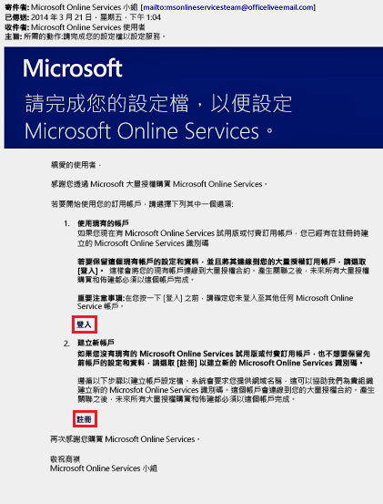
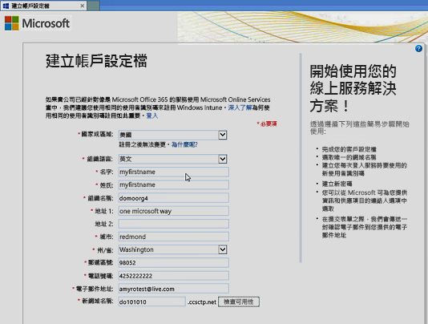
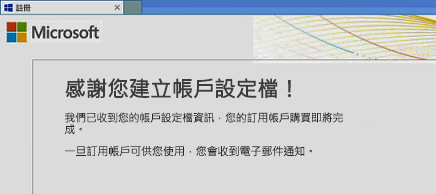
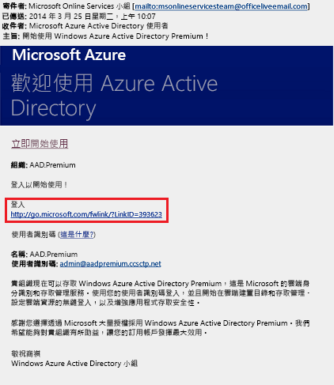
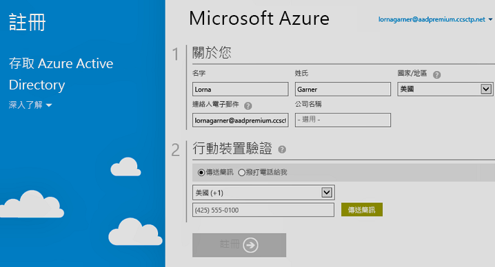

# 如何：註冊 Azure Active Directory Premium
您可以搭配您的 Azure 訂用帳戶購買 Azure Active Directory (Azure AD) Premium 並與其相關聯。 如果您需要建立新的 Azure 訂用帳戶，您也需要啟用授權方案及 Azure AD 服務存取。

> [!NOTE]
>Azure AD Premium 和 Basic 版本適用於使用全球 Azure Active Directory 執行個體的中國客戶。 由 21Vianet 在中國營運的 Azure 服務目前不支援 Azure AD Premium 和 Basic 版本。 如需詳細資訊，請使用 [Azure Active Directory 論壇](https://feedback.azure.com/forums/169401-azure-active-directory/) \(英文\) 與我們連絡。

在註冊 Active Directory Premium 1 或 Premium 2 之前，您必須先決定要使用哪一個現有的訂用帳戶或方案：

- 透過現有的 Azure 或 Office 365 訂用帳戶

- 透過 Enterprise Mobility + Security 授權方案

- 透過 Microsoft 大量授權方案

使用具有先前已購買並啟用之 Azure AD 授權的 Azure 訂用帳戶註冊，將能自動在相同的目錄中啟用授權。 如果沒有自動啟用，您仍必須啟用您的授權方案和 Azure AD 存取。 如需啟用授權方案的詳細資訊，請參閱[啟用您的新授權方案](#activate-your-new-license-plan)。 如需啟用 Azure AD 存取的詳細資訊，請參閱[啟用您的 Azure AD 存取](#activate-your-azure-ad-access)。 

## 使用現有的 Azure 或 Office 365 訂用帳戶註冊
身為 Azure 或 Office 365 訂閱者，您可以在線上購買 Azure Active Directory Premium 版本。 如需詳細步驟，請參閱[如何購買 Azure Active Directory Premium - 現有客戶](https://channel9.msdn.com/Series/Azure-Active-Directory-Videos-Demos/How-to-Purchase-Azure-Active-Directory-Premium-Existing-Customer)或[如何購買 Azure Active Directory Premium - 新客戶](https://channel9.msdn.com/Series/Azure-Active-Directory-Videos-Demos/How-to-Purchase-Azure-Active-Directory-Premium-New-Customers)。

## 使用 Enterprise Mobility + Security 授權方案註冊
Enterprise Mobility + Security 是套件，其包含 Azure AD Premium、Azure 資訊保護，以及 Microsoft Intune。 如果您已經擁有 EMS 授權，則可以利用下列其中一個授權選項開始使用 Azure AD：

如需 EMS 的詳細資訊，請參閱 [Enterprise Mobility + Security 網站](https://www.microsoft.com/cloud-platform/enterprise-mobility-security)。

- 透過免費的 [Enterprise Mobility + Security E5 試用訂用帳戶](https://signup.microsoft.com/Signup?OfferId=87dd2714-d452-48a0-a809-d2f58c4f68b7&ali=1)試用 EMS

- 購買 [Enterprise Mobility + Security E5 授權](https://signup.microsoft.com/Signup?OfferId=e6de2192-536a-4dc3-afdc-9e2602b6c790&ali=1)

- 購買 [Enterprise Mobility + Security E3 授權](https://signup.microsoft.com/Signup?OfferId=4BBA281F-95E8-4136-8B0F-037D6062F54C&ali=1)

## 使用 Microsoft 大量授權方案註冊
透過 Microsoft 大量授權方案，您可以根據自己想要取得的授權數目，使用下列其中一個方案註冊 Azure AD Premium：

- **250 個或以上的授權。** [Microsoft Enterprise 合約](https://www.microsoft.com/en-us/licensing/licensing-programs/enterprise.aspx) \(英文\)

- **5 到 250 個授權。** [Open 大量授權](https://www.microsoft.com/en-us/licensing/licensing-programs/open-license.aspx)

如需大量授權購買選項的詳細資訊，請參閱[如何透過大量授權購買](https://www.microsoft.com/en-us/licensing/how-to-buy/how-to-buy.aspx) \(英文\)。

## 啟用您的新授權方案
如果您是使用新的 Azure AD 授權方案註冊，您必須使用在購買後傳送的確認電子郵件來為您的組織啟用該方案。

### 啟用您的授權方案
- 開啟您在註冊後從 Microsoft 接收到的確認電子郵件，然後按一下 [登入] 或 [註冊]。
   
    

    - **登入**： 如果您有現有的租用戶，請選擇這個連結，然後使用現有的系統管理員帳戶登入。 您必須是要啟用授權之租用戶上的全域系統管理員。

    - **註冊**： 如果您想要開啟 [建立帳戶設定檔] 頁面，並針對授權方案建立新的 Azure AD 租用戶，請選擇這個連結。

        

完成時，您將會看到感謝您為租用戶啟用授權方案的確認方塊。

## 啟用您的 Azure AD 存取
如果您要將新的 Azure AD Premium 授權新增到現有的訂用帳戶中，系統應該已經啟用您的 Azure AD 存取。 否則，您必須在收到**歡迎電子郵件**之後啟用 Azure AD 存取權。  

在系統將您已購買的授權佈建到您的目錄中之後，您將會接收到**歡迎電子郵件**。 此電子郵件會確認您可以開始管理 Azure AD Premium 或 Enterprise Mobility + Security 的授權和功能。 

> [!TIP]
> 在您從歡迎電子郵件中啟用 Azure AD 目錄存取之前，您將無法存取新租用戶的 Azure AD。

### 啟用您的 Azure AD 存取

1. 開啟**歡迎電子郵件**，然後按一下 [登入]。
   
    

2. 成功登入之後，您必須使用行動裝置完成雙步驟驗證。
   
    

啟用程序通常只需花費數分鐘的時間，然後您便能使用 Azure AD 租用戶。 

## 後續步驟
在擁有 Azure AD Premium 之後，您便可以[自訂網域](add-custom-domain.md)、加入[公司品牌](customize-branding.md)、[建立租用戶](active-directory-access-create-new-tenant.md)，以及[新增群組](active-directory-groups-create-azure-portal.md)和[使用者](add-users-azure-active-directory.md)。
