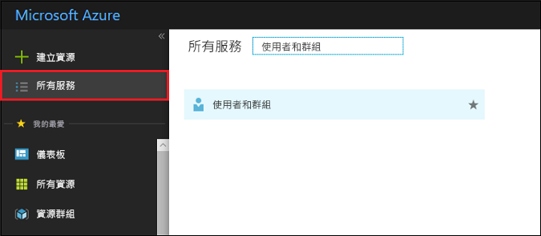
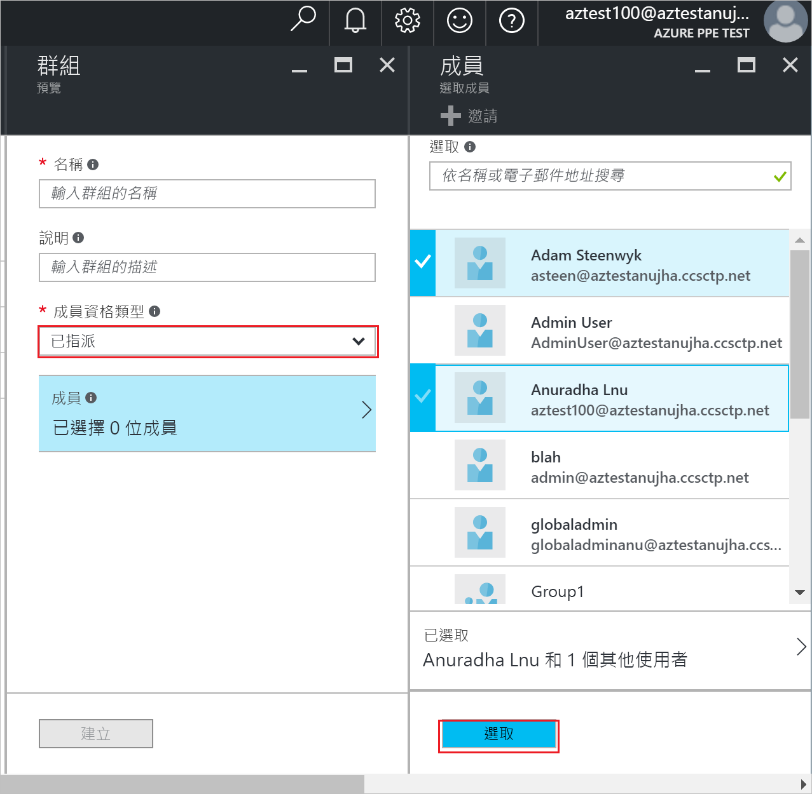
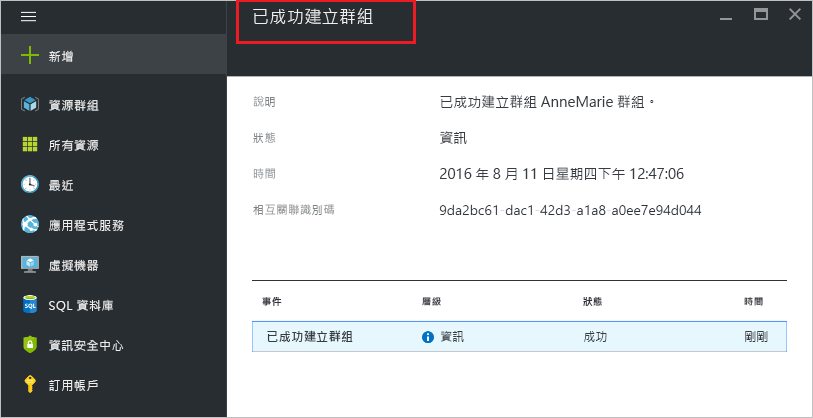

# 在 Azure Active Directory 中建立群組和新增使用者
> [!div class="op_single_selector"]
> * [Azure 入口網站](active-directory-groups-create-azure-portal.md)
> * [PowerShell](../users-groups-roles/groups-settings-v2-cmdlets.md)

本文說明如何在 Azure Active Directory 中建立及填入新群組。 您可以使用群組來執行管理工作，例如將授權或權限一次指派給數個使用者或裝置。

## 如何建立群組？
1. 使用具備目錄全域管理員身分的帳戶來登入 [Azure 入口網站](https://portal.azure.com) 。
2. 選取 [所有服務]，在文字方塊中輸入**使用者和群組**，然後選取 **Enter** 鍵。

   
3. 在 [使用者和群組] 刀鋒視窗上，選取 [所有群組]。

   
4. 在 [使用者和群組 - 所有群組] 刀鋒視窗上，選取 [新增]。

   ![選取 [新增] 命令](./media/active-directory-groups-create-azure-portal/add-group-command.png)
5. 在 [群組]  刀鋒視窗上，輸入群組的名稱和描述。
6. 若要選取要新增到群組中的成員，請在 [成員資格類型] 方塊中選取 [已指派]，然後選取 [成員]。 如需有關如何動態管理群組成員資格的詳細資訊，請參閱 [使用屬性來建立群組成員資格的進階規則](../users-groups-roles/groups-dynamic-membership.md)。

   
7. 在 [成員] 刀鋒視窗上，選取一或多個要新增到群組中的使用者或裝置，然後選取刀鋒視窗底部的 [選取] 按鈕來將它們新增到群組中。 [使用者]  方塊會根據將您的輸入內容與使用者或裝置名稱的任何部分進行比對來篩選顯示。 該方塊中不接受任何萬用字元。
8. 完成將成員新增到群組中時，在 [群組] 刀鋒視窗上選取 [建立]。    

   

## 後續步驟
這些文章提供有關 Azure Active Directory 的其他資訊。

* [查看現有的群組](active-directory-groups-view-azure-portal.md)
* [管理群組的設定](active-directory-groups-settings-azure-portal.md)
* [管理群組的成員](active-directory-groups-members-azure-portal.md)
* [管理群組的成員資格](active-directory-groups-membership-azure-portal.md)
* [管理群組中使用者的動態規則](../users-groups-roles/groups-dynamic-membership.md)
