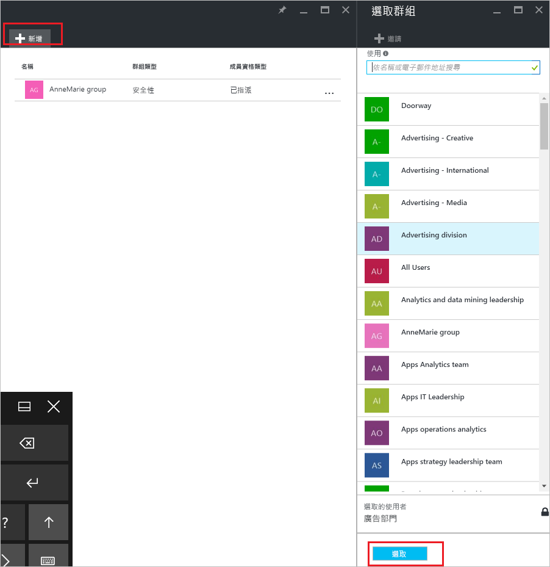

# 使用 Azure Active Directory 從另一個群組新增或移除群組
本文可協助您使用 Azure Active Directory 從另一個群組新增或移除群組。

>[!Note]
>如果您要嘗試刪除父群組，請參閱[如何更新或刪除群組和其成員](active-directory-groups-delete-group.md)。

## 將群組新增至另一個群組
您可以將現有的安全性群組新增到另一個現有安全性群組中 (也稱為巢狀群組)，如此一來會建立一個成員群組 (子群組) 和一個父群組。 成員群組會繼承父群組的屬性與內容，為您省下設定時間。

>[!Important]
>我們目前不支援：<ul><li>將群組新增至與內部部署 Active Directory 同步的群組。</li><li>將安全性群組新增至 Office 365 群組。</li><li>將 Office 365 群組新增至安全性群組或其他 Office 365 群組。</li><li>將應用程式指派給巢狀群組。</li><li>將授權套用至巢狀群組。</li></ul>

### 若要新增群組作為另一個群組的成員

1. 使用目錄的全域系統管理員帳戶登入 [Azure 入口網站](https://portal.azure.com)。

2. 選取 [Azure Active Directory]，然後選取 [群組]。

3. 在 [群組 - 所有群組] 頁面上，搜尋並選取會要成為另一個群組成員的群組。 在本練習中，我們使用 [MDM 原則 - 西部] 群組。

    >[!Note]
    >您一次只能將做為成員的群組新增到一個群組中。 此外，[選取群組] 方塊會根據將您的輸入內容，與使用者或裝置名稱的任何部分進行比對來篩選顯示項目。 但是不支援萬用字元。

    ![[群組 - 所有群組] 頁面上已選取 [MDM 原則 - 西部] 群組](media/active-directory-groups-membership-azure-portal/group-all-groups-screen.png)

4. 在 [MDM 原則 - 西部 - 群組成員資格] 頁面上，選取 [群組成員資格]，選取 [新增]，找出您要加入成員群組的群組，然後選擇 [選取]。 在本練習中，我們使用 [MDM 原則 - 所有組織] 群組。

    [MDM 原則 - 西部] 群組現在是 [MDM 原則 - 所有組織] 群組的成員，繼承了 [MDM 原則 - 所有組織] 群組的所有屬性和設定。

    

5. 檢閱 [MDM 原則 - 西部 - 群組成員資格] 頁面以查看群組和成員資格。

    ![[MDM 原則 - 西部 - 群組成員資格] 頁面顯示父群組](media/active-directory-groups-membership-azure-portal/group-membership-blade.png)

6. 若要更詳細檢視群組和成員關係，請選取群組名稱 ([MDM 原則 - 所有組織]) 並查看 [MDM 原則 - 西部] 頁面詳細資訊。

    ![[群組成員資格] 頁面顯示成員和群組詳細資訊](media/active-directory-groups-membership-azure-portal/group-membership-review.png)

## 從另一個群組中移除群組
您可以從另一個安全性群組中移除現有的安全性群組。 不過，移除群組也會移除其使用者繼承的任何屬性和內容。

### 若要從另一個群組中移除成員群組
1. 在 [群組 - 所有群組] 頁面上，搜尋並選取會要從另一個群組中移除的成員群組。 在本練習中，我們再次使用 [MDM 原則 - 西部] 群組。

2. 在 [MDM 原則 - 西部概觀] 頁面上，選取 [群組成員資格]。

    ![[MDM 原則 - 西部概觀] 頁面](media/active-directory-groups-membership-azure-portal/group-membership-overview.png)

3. 在 [MDM 原則 - 西部 - 群組成員資格] 頁面中選取 [MDM 原則 - 所有組織] 群組，然後再於 [MDM 原則 - 西部] 頁面詳細資訊中選取 [移除]。

    ![[群組成員資格] 頁面顯示成員和群組詳細資訊](media/active-directory-groups-membership-azure-portal/group-membership-remove.png)

## 其他資訊
這些文章提供有關 Azure Active Directory 的其他資訊。

- [檢視群組和成員](active-directory-groups-view-azure-portal.md)

- [建立基本群組並新增成員](active-directory-groups-create-azure-portal.md)

- [從群組中新增或移除成員](active-directory-groups-members-azure-portal.md)

- [編輯群組設定](active-directory-groups-settings-azure-portal.md)

- [使用群組來管理 SaaS 應用程式的存取權](../users-groups-roles/groups-saasapps.md)

- [使用群組來管理 Azure Active Directory 授權的案例、限制及已知問題](../users-groups-roles/licensing-group-advanced.md#limitations-and-known-issues)
