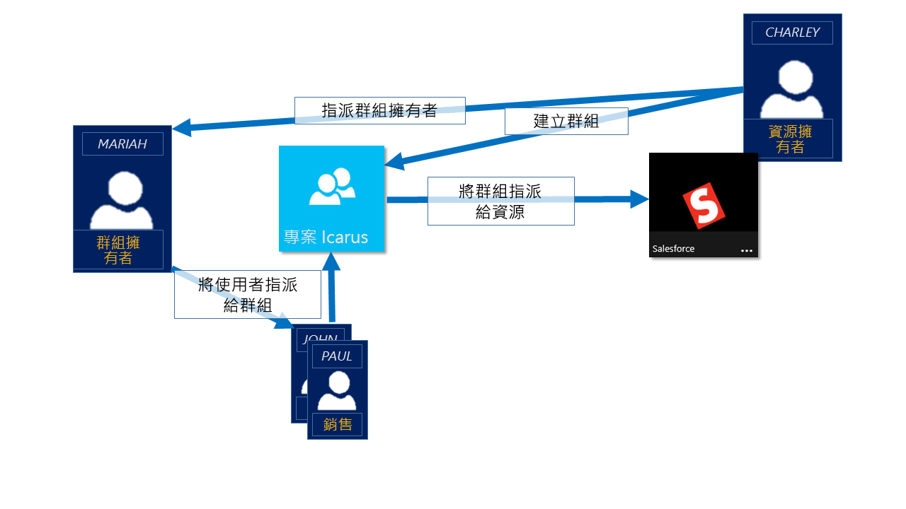
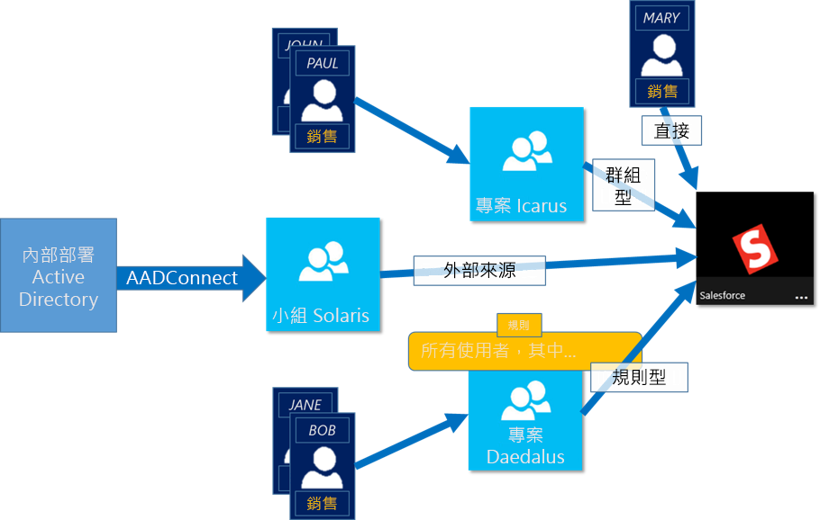

# 使用 Azure Active Directory 群組來管理應用程式和資源的存取權
Azure Active Directory （Azure AD）可讓您使用群組來管理雲端式應用程式、內部部署應用程式和資源的存取權。 您的資源可以是 Azure AD 組織的一部分，例如透過 Azure AD 中的角色管理物件，或組織外部的許可權，例如軟體即服務（SaaS）應用程式、Azure 服務、SharePoint 網站和內部部署資源。

>[!NOTE]
>若要使用 Azure Active Directory，您需要 Azure 帳戶。 如果您沒有帳戶，您可以 [註冊免費的 Azure 帳戶](https://azure.microsoft.com/free/)。
>
> 在 Azure 入口網站中，您可以看到某些群組的成員資格和群組詳細資料在入口網站中無法管理：
>
> - 從內部部署 Active Directory 同步處理的群組只能在內部部署 Active Directory 中進行管理。
> - 其他群組類型（例如通訊群組清單和擁有郵件功能的安全性群組）只會在 Exchange 系統管理中心或 Microsoft 365 系統管理中心進行管理。 您必須登入 Exchange 系統管理中心或 Microsoft 365 系統管理中心，才能管理這些群組。

## Azure AD 中的存取管理運作方式

Azure AD 可協助您藉由對單一使用者或整個 Azure AD 群組提供存取權限，來提供貴組織資源的存取權。 使用群組可讓資源擁有者 (或 Azure AD 目錄的擁有者) 將一組存取權限指派給群組內的所有成員，而不必逐一提供權限。 資源或目錄的擁有者也可以將成員清單的管理權限提供給其他人 (例如，部門經理或服務台系統管理員)，讓該人員新增和移除成員。 如需如何管理群組擁有者的詳細資訊，請參閱[管理群組擁有者](active-directory-accessmanagement-managing-group-owners.md)

## 指派存取權限的方式

有四種方式可以對使用者指派資源的存取權限：

- **直接指派。** 資源擁有者可直接將使用者指派給資源。

- **群組指派。** 資源擁有者可將 Azure AD 群組指派給資源，以自動對所有群組成員提供資源的存取權。 群組成員資格會由群組擁有者和資源擁有者共同管理，讓任一擁有者可以在群組中新增或移除成員。 如需新增或移除群組成員資格的詳細資訊，請參閱[如何：使用 Azure Active Directory 入口網站從某個群組新增或移除另一個群組](active-directory-groups-membership-azure-portal.md)。 

- **以規則為基礎的指派。** 資源擁有者可建立群組，並使用規則來定義要將哪些使用者指派給特定資源。 此規則會以指派給個別使用者的屬性為基礎。 資源擁有者可管理規則，決定需要有哪些屬性和值才能允許存取資源。 如需詳細資訊，請參閱[建立動態群組並檢查狀態](../users-groups-roles/groups-create-rule.md)。

    您也可以觀看下面這段簡短的影片，來快速了解如何建立和使用動態群組：

    >[!VIDEO https://channel9.msdn.com/Series/Azure-Active-Directory-Videos-Demos/Azure-AD--Introduction-to-Dynamic-Memberships-for-Groups/player]

- **外部授權單位指派。** 存取權來自外部來源，例如內部部署目錄或 SaaS 應用程式。 在此情況下，資源擁有者會指派群組以提供資源存取權，然後由外部來源管理群組成員。

   

## 使用者可否不經指派直接加入群組？
群組擁有者可以讓使用者自行尋找群組來加入，而不用由其指派。 擁有者也可以將群組設定為自動接受加入的所有使用者，或需要經過核准。

使用者要求加入群組後，系統會將該要求轉送給群組擁有者。 如有需要，擁有者可以核准要求，使用者便會收到獲得群組成員資格的通知。 不過，如果您有多個擁有者，而且其中之一不同意，使用者會收到通知，但不會新增至該群組。 如需如何讓使用者要求加入群組的詳細資訊和指示，請參閱[設定 Azure AD 讓使用者可以要求加入群組](../users-groups-roles/groups-self-service-management.md)

## 後續步驟
現在您已對如何使用群組來管理存取權有一點了解，接下來您可以開始管理資源和應用程式。

- [使用 Azure Active Directory 建立新的群組](active-directory-groups-create-azure-portal.md)或[使用 PowerShell Cmdlet 建立和管理新的群組](../users-groups-roles/groups-settings-v2-cmdlets.md)

- [使用群組來指派對整合 SaaS 應用程式的存取權](../users-groups-roles/groups-saasapps.md)

- [使用 Azure AD Connect 將內部部署群組同步處理至 Azure](../hybrid/whatis-hybrid-identity.md)
