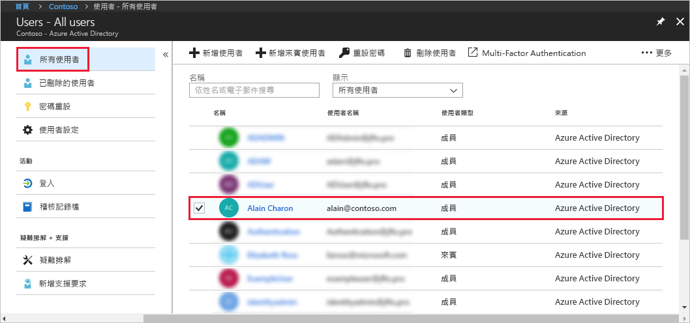
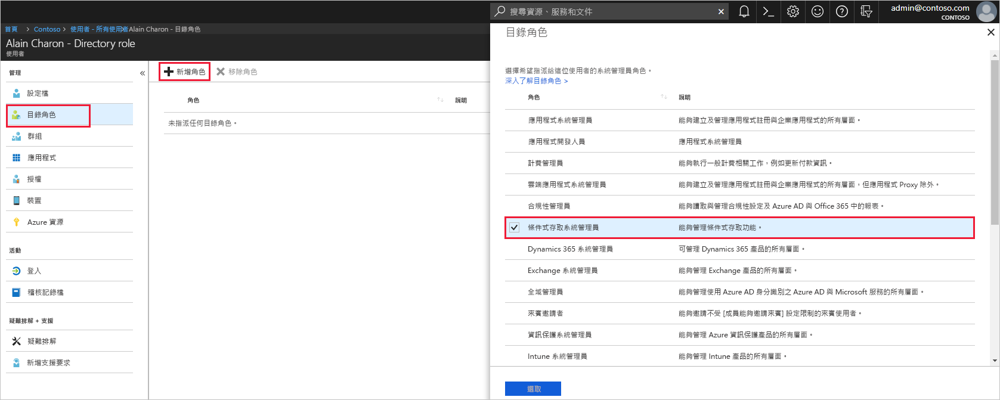

# 在 Azure Active Directory 中將使用者指派給系統管理員角色
本文說明如何在 Azure Active Directory (Azure AD) 中將系統管理角色指派給使用者。 如需有關在您組織中新增新使用者的資訊，請參閱[將新的使用者新增到 Azure Active Directory](../add-users-azure-active-directory.md)。 新增的使用者預設不會有系統管理員權限，但是您可以隨時指派角色給他們。

## 將角色指派給使用者
1. 使用具備目錄全域管理員或特殊權限角色管理員身分的帳戶來登入 [Azure 入口網站](https://portal.azure.com) 。

2. 選取 [Azure Active Directory]、選取 [使用者]，然後從清單中選取特定使用者。

    

3. 針對所選的使用者，選取 [目錄角色]、選取 [新增角色]，然後從 [目錄角色] 清單中挑選適當的系統管理角色，例如 [條件式存取管理員]。 如需有關系統管理角色的詳細資訊，請參閱[在 Azure AD 中指派系統管理員角色](../users-groups-roles/directory-assign-admin-roles.md)。 

    

1. 按 [選取] 進行儲存。

## 後續步驟
* [快速入門：在 Azure Active Directory 中新增或刪除使用者](add-users-azure-active-directory.md)
* [管理使用者設定檔](active-directory-users-profile-azure-portal.md)
* [從另一個目錄中新增來賓使用者](../b2b/what-is-b2b.md) 
* [在 Azure AD 中將使用者指派給角色](active-directory-users-assign-role-azure-portal.md)
* [還原已刪除的使用者](active-directory-users-restore.md)
