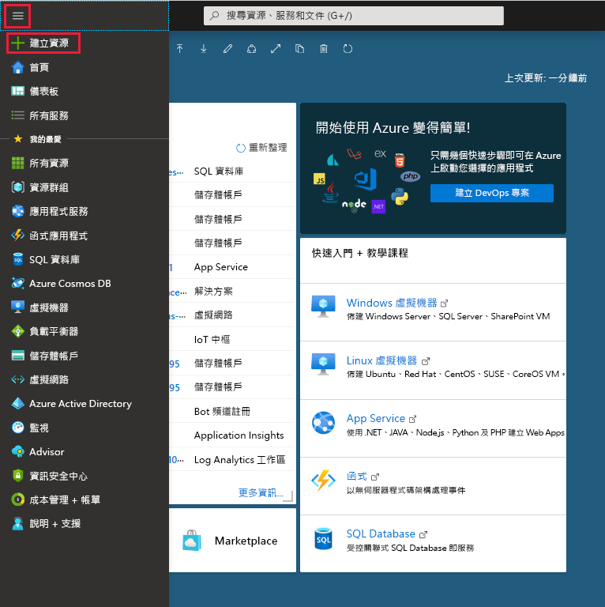

# 如需：使用 Azure Active Directory 入口網站新增自訂網域名稱
每個新的 Azure AD 租用戶皆隨附初始網域名稱 (*domainname*.onmicrosoft.com)。 您無法變更或刪除初始網域名稱，但您可以將貴組織的名稱新增至清單。 新增自訂網域名稱可協助您建立使用者熟悉的使用者名稱，例如 *alain@contoso.com*。

## 開始之前
您必須先向網域註冊機構建立您的網域名稱，才可以新增自訂網域名稱。 如需公認的網域註冊機構，請參閱 [ICANN 認可的註冊機構](https://www.icann.org/registrar-reports/accredited-list.html)。

## 在 Azure AD 中建立您的目錄
取得您的網域名稱之後，您可以建立您的第一個 Azure AD 目錄。

1. 使用此目錄的訂用帳戶擁有者帳戶登入 [Azure 入口網站](https://portal.azure.com/)，然後選取 [Azure Active Directory]。

    

    >[!TIP]
    > 如果您計劃讓內部部署 Windows Server AD 與 Azure AD 同盟，當您執行 Azure AD Connect 工具以同步處理您的目錄時，您必須選取 [我計劃將這個網域設定為可使用我的本機 Active Directory 進行單一登入] 核取方塊。 您也需要註冊相同的網域名稱，您選取該名稱以與精靈中 **Azure AD 網域** 步驟中的內部部署目錄同盟。 您可以[在這些指示中](../hybrid/how-to-connect-install-custom.md#verify-the-azure-ad-domain-selected-for-federation)看到精靈中那些步驟看起來如何。 如果您沒有 Azure AD Connect 工具，您可以 [在這裡下載](http://go.microsoft.com/fwlink/?LinkId=615771)。

2. 遵循[為您的組織建立新的租用戶](active-directory-access-create-new-tenant.md#create-a-new-tenant-for-your-organization)中的步驟，以建立新的目錄。

    >[!Important]
    >建立租用戶的人員會自動成為該租用戶的全域管理員。 全域管理員可以將其他系統管理員新增至租用戶。

## 將自訂網域名稱新增至 Azure AD
建立您的目錄之後，您可以新增自訂網域名稱。

1. 選取 [自訂網域名稱]，然後選取 [新增自訂網域]。

    ![[Fabrikam - 自訂網域名稱] 頁面，已醒目提示 [新增自訂網域] 選項](media/add-custom-domain/add-custom-domain.png)

2. 將貴組織的新網域名稱輸入到 [自訂網域名稱] 方塊中 (例如 _contoso.com_)，然後選取 [新增網域]。

    已新增未驗證的網域，而 **Contoso** 頁面隨即出現，其中顯示您的 DNS 資訊。

    >[!Important]
    >您必須包含 .com、.net 或任何其他最上層擴充功能，才能正常運作。

    ![[Fabrikam - 自訂網域名稱] 頁面，已醒目提示 [新增網域] 按鈕](media/add-custom-domain/add-custom-domain-blade.png)

4. 從 **Contoso** 頁面複製 DNS 資訊。 例如，MS=ms64983159。

    

## 將您的 DNS 資訊新增至網域註冊機構
將自訂網域名稱新增至 Azure AD 之後，您必須回到您的網域註冊機構，並新增從您複製的 TXT 檔案中的 Azure AD DNS 資訊。 為您的網域建立此 TXT 記錄可「確認」網域名稱的擁有權。

-  回到您的網域註冊機構，根據您複製的 DNS 資訊為您的網域建立新 TXT 記錄、將 **TTL** (存留時間) 設定為 60 分鐘，然後儲存資訊。

    >[!Important]
    >您可以註冊您想要的多個網域名稱。 不過，每個網域會從 Azure AD 取得自己的 TXT 記錄。 在網域註冊機構輸入您的 TXT 檔案資訊時，請格外小心。 如果您不小心輸入錯誤或重複的資訊，則必須等到 TTL 會逾時 (60 分鐘)，才能再試一次。

## 驗證自訂網域名稱
註冊您的自訂網域名稱之後，您必須確定它在 Azure AD 中有效。 視您的網域註冊機構而定，從您的網域註冊機構傳播至 Azure AD 可瞬間完成，也可能需要幾天的時間。

### 若要驗證自訂網域名稱
1. 使用目錄的全域系統管理員帳戶登入 [Azure 入口網站](https://portal.azure.com/)。

2. 選取 [Azure Active Directory]，然後選取 [自訂網域名稱]。

3. 在 [Fabrikam - 自訂網域名稱] 頁面上，選取自訂網域名稱 **Contoso**。

    ![[Fabrikam - 自訂網域名稱] 頁面，已醒目提示 contoso](media/add-custom-domain/custom-blade-with-contoso-highlighted.png)

4. 在 [Contoso] 頁面上，選取 [驗證]，確定您的自訂網域已正確註冊，而且在 Azure AD 中有效。

    ![包含 DNS 項目資訊和 [驗證] 按鈕的 Contoso 頁面](media/add-custom-domain/contoso-blade-with-dns-info-verify.png)

### 常見驗證問題
- 如果 Azure AD 無法驗證自訂網域名稱，請嘗試下列建議：
    - **至少等候一小時，然後再試一次**。 DNS 記錄必須在 Azure AD 驗證網域之後傳播，此程序可能需要一小時以上。

    - **確定 DNS 記錄正確無誤。** 返回網域名稱註冊機構網站，並確定此項目存在，而且符合 Azure AD 所提供的 DNS 項目資訊。

    如果您無法更新註冊機構網站上的記錄，則必須與具有正確權限的人員共用此項目，以新增項目並確認它是正確的。

- **確定網域名稱並未在另一個目錄中使用。** 只可以在一個目錄中驗證網域名稱，這表示如果您的網域名稱目前已在另一個目錄中驗證，便無法在新的目錄中驗證。 若要修正此重複問題，您必須從舊的目錄中刪除網域名稱。 如需如何刪除網域名稱的詳細資訊，請參閱 [管理自訂網域名稱](../users-groups-roles/domains-manage.md)。 

## 後續步驟

- 將其他全域管理員新增至您的目錄。 如需詳細資訊，請參閱[如何指派角色和系統管理員](active-directory-users-assign-role-azure-portal.md)

- 將使用者新增至您的網域，請參閱[如何新增或刪除使用者](add-users-azure-active-directory.md)

- 在 Azu e AD 中管理網域名稱資訊。 如需詳細資訊，請參閱[管理自訂網域名稱](../users-groups-roles/domains-manage.md)。

- 如果您有想要與 Azure Active Directory 一起使用的內部部署 Windows Server 版本，請參閱[整合內部部署目錄與 Azure Active Directory](../connect/active-directory-aadconnect.md)。