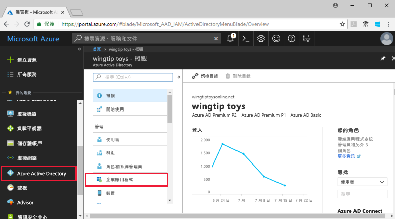
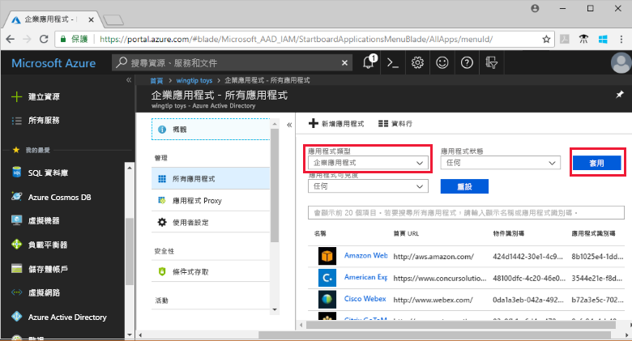
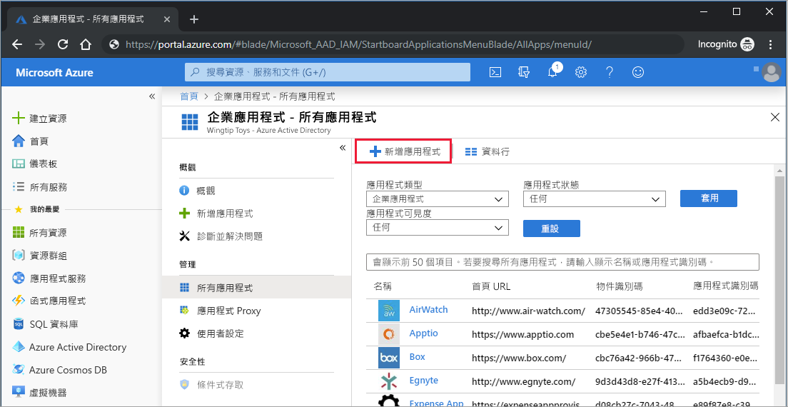
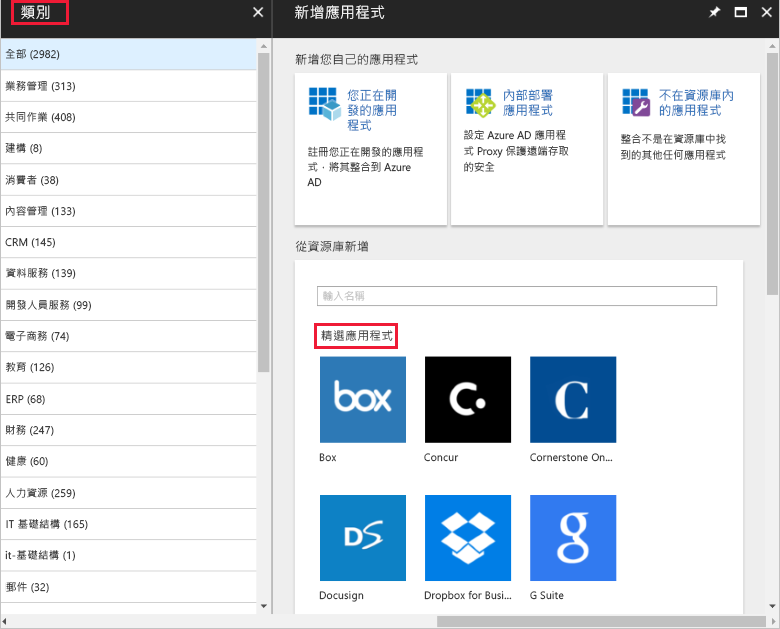
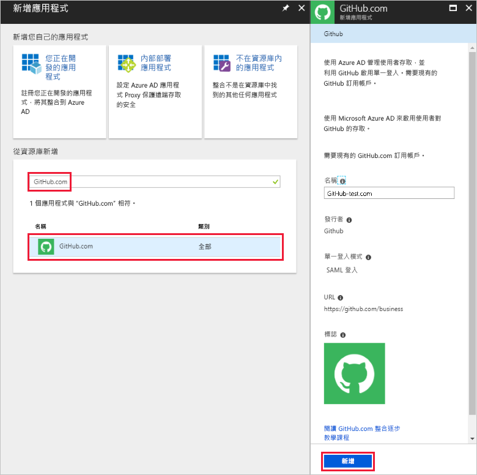
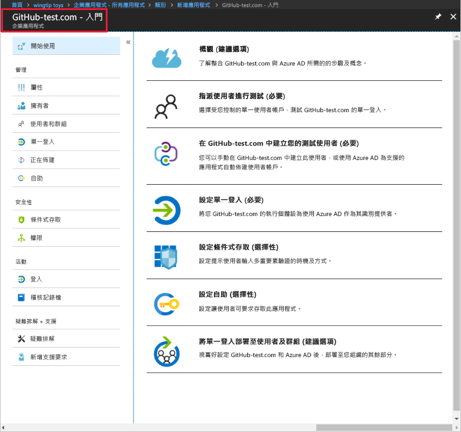
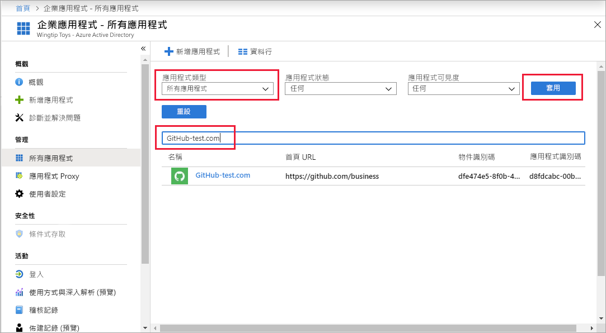
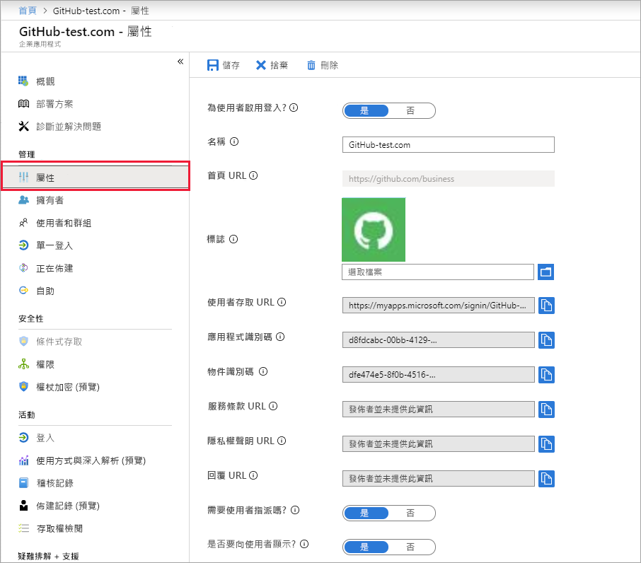
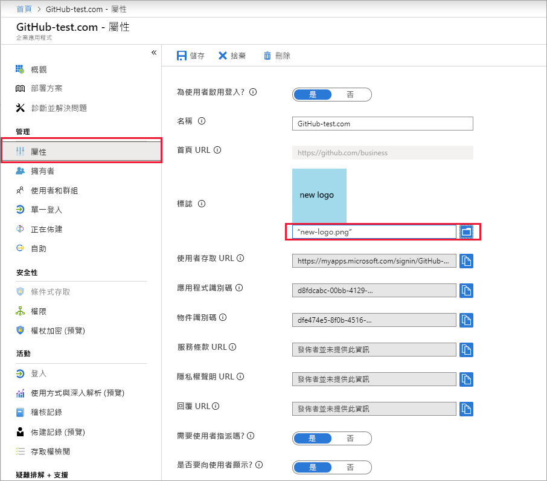

# 快速入門：將應用程式新增至 Azure Active Directory 租用戶

Azure Active Directory (Azure AD) 有一個資源庫，其中包含數千個預先整合的應用程式。 您組織使用的某些應用程式可能就在資源庫中。 本快速入門會使用 Azure 入口網站，將資源庫應用程式新增至 Azure Active Directory (Azure AD) 租用戶。 
 
將應用程式新增至 Azure AD 租用戶之後，您可以：

- 使用條件式存取原則來管理應用程式的使用者存取。
- 設定單一登入功能，讓使用者可以使用他們的 Azure AD 帳戶登入應用程式。

## 開始之前

若要將應用程式新增至您的租用戶，您需要：

- Azure AD 訂用帳戶
- 已針對應用程式啟用單一登入的訂用帳戶

以 Azure AD 租用戶全域管理員、雲端應用程式系統管理員或應用程式系統管理員的身分登入 [Azure 入口網站](https://portal.azure.com)。

若要測試本教學課程中的步驟，我們建議您使用非生產環境。 如果您沒有 Azure AD 的非生產環境，您可以[取得為期一個月的試用版](https://azure.microsoft.com/pricing/free-trial/)。

## 將應用程式新增至 Azure AD 租用戶

將資源庫應用程式新增至 Azure AD 租用戶：

1. 在 [Azure 入口網站](https://portal.azure.com)的左方瀏覽窗格中，按一下 [Azure Active Directory]。 

2. 在 [Azure Active Directory] 刀鋒視窗中，按一下 [企業應用程式]。 

    

3. [所有應用程式] 刀鋒視窗會隨即開啟，並顯示 Azure AD 租用戶中應用程式的隨機樣本。 

    

4. 按一下 [所有應用程式] 刀鋒視窗頂端的 [新增應用程式]。

    

5. 若要查看資源庫中的應用程式清單，最簡單的方式是使用 [類別]，因為在 [精選應用程式] 圖示底下是資源庫應用程式的隨機樣本。 

    

    若要查看更多應用程式，您可以按一下 [顯示更多]。 我們不建議以此方式搜尋，因為資源庫中有數千個應用程式。

6. 若要搜尋應用程式，請在 [從資源庫新增] 下方，輸入您要新增的應用程式名稱。 從結果中選取應用程式，然後按一下 [新增]。 下列範例顯示搜尋 GitHub.com 後出現的 [新增應用程式] 表單。

    

6. 在應用程式專用的表單中，您可以變更屬性資訊。 例如，您可以編輯應用程式名稱，以符合您組織需求。 此範例使用的名稱是 **GitHub-test**。

8. 當您完成屬性變更後，請按一下 [新增]。

9. [開始使用] 頁面會隨即顯示，其中包含可為您組織設定應用程式的選項。 

    

您已完成新增應用程式。 如有需要，可以稍作休息。  下一節我們將示範如何變更應用程式的標誌和其他屬性。

## 尋找 Azure AD 租用戶應用程式

讓我們假設您剛才必須先離開，然後現在回來繼續設定您的應用程式。 您要做的第一件事是尋找應用程式。

1. 在 **[Azure 入口網站](https://portal.azure.com)** 的左方瀏覽窗格中，按一下 [Azure Active Directory]。 

2. 在 [Azure Active Directory] 刀鋒視窗中，按一下 [企業應用程式]。 

3. 從 [應用程式類型] 下拉式清單中，選取 [所有應用程式]，然後按一下 [套用]。 若要深入了解檢視選項，請參閱[檢視租用戶應用程式](view-applications-portal.md)。

4. 您現在可以在您的 Azure AD 租用戶中，看到所有應用程式的清單。  此清單是隨機取樣。 若要查看更多應用程式，請按一或多次 [顯示更多]。 

5. 若要在租用戶中快速尋找應用程式，請在搜尋方塊中輸入應用程式名稱，然後按一下 [套用]。 此範例會尋找我們先前新增的 GitHub-test 應用程式。

    

## 設定使用者登入屬性

現在，您已找到應用程式，您可以開啟它並設定應用程式屬性。

編輯應用程式屬性

1. 按一下應用程式以將其開啟。
2. 按一下 [屬性]，以開啟屬性刀鋒視窗來進行編輯。

    

3. 請花一點時間了解登入選項。 [為使用者啟用登入]、[需要使用者指派] 和 [可讓使用者看見] 的選項組合，可決定已指派或未指派給應用程式的使用者是否可登入。  這些選項也會決定使用者是否可在存取面板中看見應用程式。 

    - [為使用者啟用登入] 可決定指派給應用程式的使用者是否可以登入。
    - [需要使用者指派] 可決定未指派給應用程式的使用者是否可以登入。
    - [可讓使用者看見] 可決定指派給應用程式的使用者是否可以在存取面板和 O365 啟動器中看見應用程式。 

4. 您可以使用下表來協助您選擇最符合需求的選項。 

     - **已指派**的使用者行為：

       | 應用程式屬性設定 | | | 已指派的使用者體驗 | |
       |---|---|---|---|---|
       | 為使用者啟用登入？ | 需要使用者指派？ | 可讓使用者看見？ | 已指派的使用者可以登入？ | 已指派的使用者可以看見應用程式？* |
       | 是 | 是 | 是 | 是 | 是  |
       | 是 | 是 | no  | 是 | no   |
       | 是 | no  | 是 | 是 | 是  |
       | 是 | no  | no  | 是 | no   |
       | no  | 是 | 是 | no  | no   |
       | no  | 是 | no  | no  | no   |
       | no  | no  | 是 | no  | no   |
       | no  | no  | no  | no  | no   |

     - **未指派**的使用者行為：
  
       | 應用程式屬性設定 | | | 未指派的使用者體驗 | |
       |---|---|---|---|---|
       | 為使用者啟用登入？ | 需要使用者指派？ | 可讓使用者看見？ | 未指派的使用者可以登入？ | 未指派的使用者可以看見應用程式？* |
       | 是 | 是 | 是 | no  | no   |
       | 是 | 是 | no  | no  | no   |
       | 是 | no  | 是 | 是 | no   |
       | 是 | no  | no  | 是 | no   |
       | no  | 是 | 是 | no  | no   |
       | no  | 是 | no  | no  | no   |
       | no  | no  | 是 | no  | no   |
       | no  | no  | no  | no  | no   |

    *使用者是否可以在存取面板和 Office 365 應用程式啟動器中看到應用程式？

## 使用自訂標誌

使用自訂標誌：

1. 建立 215 x 215 像素的標誌，並將它儲存為 PNG 格式。
2. 由於您已經找到您的應用程式，請按一下該應用程式。
2. 在左側刀鋒視窗中，按一下 [屬性]。
4. 上傳標誌。
5. 完成時，請按一下 [儲存]。

    

## 後續步驟

在本快速入門中，您已了解如何將資源庫應用程式新增至您的 Azure AD 租用戶。 您已了解如何編輯應用程式的屬性。 

現在，您可以為應用程式設定單一登入。 

> [!div class="nextstepaction"]
> [設定單一登入](configure-single-sign-on-portal.md)

