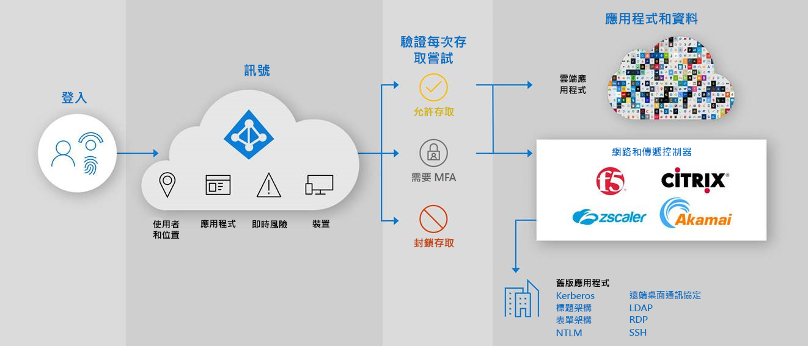

# 安全混合式存取：使用應用程式傳遞控制器和網路保護舊版應用程式

現在，您可以透過現有的應用程式傳遞控制站或網路將內部部署和雲端舊版驗證應用程式連線至 Azure AD，來保護這些應用程式。 如此，您即可透過 Azure AD 條件式存取和 Azure AD Identity Protection 等 Azure AD 功能，在所有應用程式間消弭差異及強化安全性狀態。

您可以使用現有的網路和傳遞控制器，輕鬆地保護對您的商務程序仍具重要性，但過去無法以 Azure AD 保護的舊版應用程式。 您可能已擁有開始保護這些應用程式所需的一切。

下列廠商提供與 Azure AD 整合的預建解決方案和詳細指引。

* [Akamai 企業應用程式存取 (EAA)](../saas-apps/akamai-tutorial.md)
* [Citrix 應用程式傳遞控制器 (ADC)](../saas-apps/citrix-netscaler-tutorial.md)
* [F5 Big-IP APM](https://aka.ms/f5-hybridaccessguide)
* [Zscaler Private Access (ZPA)](https://aka.ms/zscaler-hybridaccessguide)
