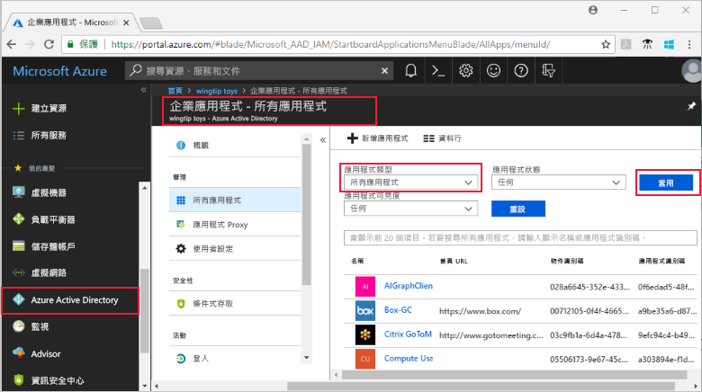
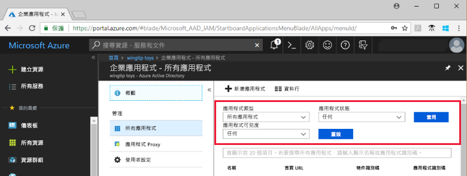
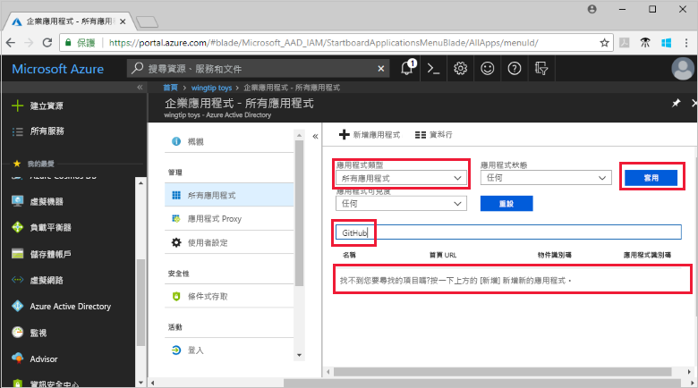
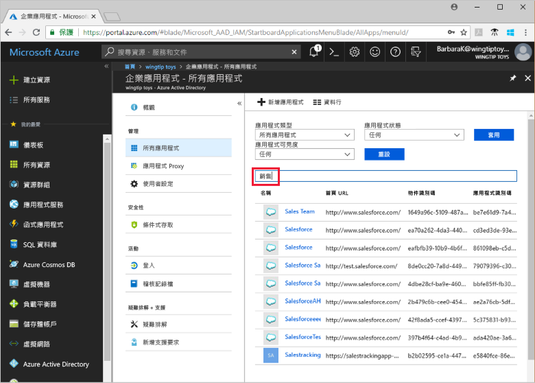

# 檢視您的 Azure Active Directory 租用戶應用程式

本快速入門將使用 Azure 入口網站來檢視 Azure Active Directory (Azure AD) 租用戶中的應用程式。

## 開始之前

若要能看到結果，您的 Azure AD 租用戶中至少要有一個應用程式。 若要新增應用程式，請參閱[新增應用程式](add-application-portal.md)快速入門。

以 Azure AD 租用戶全域管理員、雲端應用程式系統管理員或應用程式系統管理員的身分登入 [Azure 入口網站](https://portal.azure.com)。

## 尋找租用戶應用程式的清單

Azure AD 租用戶應用程式會顯示在 Azure 入口網站的 [企業應用程式] 區段中。

尋找您的租用戶應用程式：

1. 在 **[Azure 入口網站](https://portal.azure.com)** 的左方瀏覽窗格中，按一下 [Azure Active Directory]。 

2. 在 [Azure Active Directory] 刀鋒視窗中，按一下 [企業應用程式]。 

3. 從 [應用程式類型] 下拉式清單中，選取 [所有應用程式]，然後按一下 [套用]。 此時會出現租用戶應用程式的隨機樣本。

    
   
4. 若要檢視更多應用程式，請按一下清單底部的 [顯示更多]。 視您租用戶中的應用程式數目而定，比起捲動清單進行搜尋，[搜尋特定應用程式](#search-for-a-tenant-application)可能是較輕鬆的方式。

## 選取檢視選項

在本節中，您可以根據您要尋找的內容來選取選項。

1. 您可以根據 [應用程式類型]、[應用程式狀態] 和 [應用程式可見度] 的選項來檢視應用程式。 

    

2. 在 [應用程式類型] 下方，選擇其中一個選項：

    - [企業應用程式] 會顯示非 Microsoft 應用程式。
    - [Microsoft 應用程式] 會顯示 Microsoft 應用程式。
    - [所有應用程式] 會顯示非 Microsoft 與 Microsoft 應用程式。

3. 在 [應用程式狀態] 下方，選擇 [任何]、[已停用] 或 [已啟用]。 [任何] 選項會包含已停用和已啟用的應用程式。

4. 在 [應用程式可見度] 下方，選擇 [任何]或 [已隱藏]。 [已隱藏] 選項會顯示存在租用戶中，但不會讓使用者看見的應用程式。

5. 選擇您需要的選項之後，請按一下 [套用]。
 

## 搜尋租用戶應用程式

搜尋特定應用程式：

1. 在 [應用程式類型] 功能表中，選取 [所有應用程式]，然後按一下 [套用]。

2. 輸入您要尋找的應用程式名稱。 如果此應用程式已新增至您的 Azure AD 租用戶，搜尋結果中就會出現此應用程式。 此範例顯示 GitHub 尚未新增至租用戶應用程式。

    

3. 嘗試輸入應用程式名稱的前幾個字母。  此範例顯示以 **Sales** 開頭的所有應用程式。

    

## 後續步驟

在本快速入門中，您已了解如何在 Azure AD 租用戶中檢視應用程式，以及如何依據應用程式類型、狀態及可見性來篩選應用程式清單。 您也已了解如何搜尋特定應用程式。

現在，您已經找到所要的應用程式，您可以繼續[將更多應用程式新增至租用戶](add-application-portal.md)，或按一下應用程式以檢視或編輯屬性和組態選項。 例如，您可以設定單一登入。 

> [!div class="nextstepaction"]
> [設定單一登入](configure-single-sign-on-portal.md)

