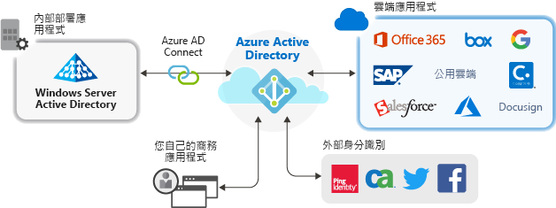

# 搭配 Azure Active Directory 的應用程式管理

Azure Active Directory (Azure AD) 可藉由為雲端和內部部署應用程式提供單一的身分識別系統，來簡化應用程式的管理方式。 您可以在 Azure AD 中新增軟體即服務 (SaaS) 應用程式、內部部署應用程式和企業營運 (LOB) 應用程式。 然後，使用者僅需登入一次，便可以安全且順暢地存取這些應用程式以及 Office 365 和其他來自 Microsoft 的商務應用程式。 您可以藉由[將使用者佈建自動化](user-provisioning.md)來降低管理成本。 您也可以使用多重要素驗證及條件式存取原則來提供安全的應用程式存取。

## 為何要以雲端解決方案來管理應用程式？

組織通常會有使用者完成工作所需的數百個應用程式。 使用者會從許多裝置及位置存取這些應用程式。 每天都有許多應用程式被新增、開發及淘汰。 由於有這麼多的應用程式及存取點，使用雲端式解決方案來管理所有應用程式的使用者存取就變得更加重要。

## 哪些類型的應用程式可與 Azure AD 整合？

可在**企業應用程式**中新增並使用 Azure AD 來管理的應用程式有四大類型：

- **Azure AD 資源庫應用程式** – Azure AD 擁有資源庫，內含數千個已預先整合而能使用 Azure AD 來進行單一登入的應用程式。 您組織使用的某些應用程式可能就在資源庫中。 [請了解如何規劃應用程式整合](plan-an-application-integration.md)，或在 [SaaS 應用程式教學課程](https://docs.microsoft.com/azure/active-directory/saas-apps/)中取得個別應用程式的詳細整合步驟。

- **內部部署應用程式搭配應用程式 Proxy** – 使用 Azure AD 應用程式 Proxy 時，您可以整合內部部署 Web 應用程式與 Azure AD 以支援單一登入。 然後，終端使用者就可以使用和用來存取 Office 365 及其他 SaaS 應用程式的相同方式，來存取內部部署 Web 應用程式。 [了解為何要使用應用程式 Proxy 及其運作方式](what-is-application-proxy.md)。

- **自訂開發的應用程式** – 在建置您自己的企業營運應用程式時，可將其與 Azure AD 進行整合以支援單一登入。 藉由向 Azure AD 註冊應用程式，您便可掌控應用程式的驗證原則。 如需詳細資訊，請參閱[開發人員指導方針](developer-guidance-for-integrating-applications.md)。

- **不在資源庫內的應用程式** – 引進您自己的應用程式！ 支援藉由將其他應用程式新增至 Azure AD 來啟用其單一登入功能。 您可以正和想要的任何網頁連結，或任何會呈現使用者名稱和密碼欄位、支援 SAML 或 OpenID Connect 通訊協定或支援 SCIM 的應用程式。 如需詳細資訊，請參閱[為非資源庫應用程式設定單一登入](configure-single-sign-on-non-gallery-applications.md)。

## 使用條件式存取原則來管理風險

結合 Azure AD 單一登入 (SSO) 及[條件式存取](https://docs.microsoft.com/azure/active-directory/conditional-access/overview)，將能針對應用程式的存取提供高層級的安全性。 安全性功能包括雲端規模的身分識別保護、以風險為基礎的存取控制、原生的多重要素驗證，以及條件式存取原則。 這些功能可提供以應用程式為基礎的細微控制原則，或是針對需要較高安全性層級的群組提供。

## 使用單一登入改善生產力

在應用程式和 Office 365 上啟用單一登入 (SSO)，能透過減少或消除登入提示，來為現有的使用者提供更優異的登入體驗。 透過免除看見多次提示，或是管理多組密碼的需求，使用者的作業環境將會變得更為一致，且較不容易令人分心。 商務群組可透過自助服務及動態成員資格來管理及核准存取權。 透過僅允許公司中的適當人員來管理應用程式的存取權，便能改善身分識別系統的安全性。

SSO 能改善安全性。 「在沒有單一登入的情況下」  ，系統管理員便需要逐一針對個別應用程式建立並更新使用者帳戶，這需要花費許多時間。 此外，使用者必須記住多個認證來存取其應用程式。 如此一來，使用者會傾向將密碼寫下，或使用其他密碼管理解決方案，而這會帶來資料安全性上的風險。 [深入了解單一登入](what-is-single-sign-on.md)。

## 處理治理和合規性

透過 Azure AD，您可以透過能運用安全性事件與事件監視 (SIEM) 工具的報告，來監視應用程式登入。 您可以從入口網站或 API 存取這些報告。 以程式設計方式對存取您應用程式的人員進行稽核，並透過存取權檢閱來移除非使用中使用者的存取權。

## 管理成本

透過移轉至 Azure AD，您可以降低成本並免除自行管理內部部署基礎結構的麻煩。 Azure AD 也能針對應用程式提供自助存取，這能同時為系統管理員和使用者節省寶貴時間。 單一登入可免除應用程式專用密碼的使用。 這種只需登入一次的功能，可省下因重設應用程式密碼，以及擷取密碼時喪失生產力所導致的相關成本。

## 後續步驟

- [什麼是應用程式 Proxy？](what-is-application-proxy.md)
- [快速入門：將資源庫應用程式新增至 Azure AD 租用戶](add-application-portal.md)
