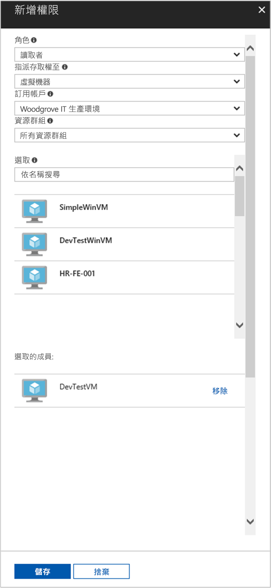

# <a name="use-a-linux-vm-system-assigned-managed-identity-to-access-azure-resource-manager"></a>使用 Linux VM 系統指派的受控識別來存取 Azure Resource Manager

[!INCLUDE [preview-notice](../../../includes/active-directory-msi-preview-notice.md)]

本快速入門說明如何將系統指派的身分識別用於 Linux 虛擬機器 (VM)，以存取 Azure Resource Manager API。 適用於 Azure 資源的受控識別會自動由 Azure 管理，可讓您向支援 Azure AD 驗證的服務進行驗證，而不需要將認證插入程式碼中。 您會了解如何：

> [!div class="checklist"]
> * 在 Azure Resource Manager 中將您的 VM 存取權授與資源群組 
> * 使用 VM 身分識別取得存取權杖，並使用它來呼叫 Azure Resource Manager 

## <a name="prerequisites"></a>必要條件

[!INCLUDE [msi-tut-prereqs](../../../includes/active-directory-msi-tut-prereqs.md)]

## <a name="grant-your-vm-access-to-a-resource-group-in-azure-resource-manager"></a>在 Azure Resource Manager 中將您的 VM 存取權授與資源群組 

您的程式碼可以使用適用於 Azure 資源的受控識別來取得存取權杖，以向支援 Azure AD 驗證的資源進行驗證。 Azure Resource Manager API 支援 Azure AD 驗證。 首先，我們需要在 Azure Resource Manager 中將這個 VM 的身分識別存取權授與資源，此情況下就是包含 VM 的資源群組。  

1. 瀏覽至**資源群組**的索引標籤。
2. 選取您先前建立的特定 [資源群組]。
3. 前往左側面板的 [存取控制 (IAM)]。
4. 按一下以 [新增] VM 的新角色指派。 選擇 [角色] 為 [讀取者]。
5. 在下一個下拉式清單中，將**存取權指派給**資源 [虛擬機器]。
6. 接下來，確認適當的訂用帳戶已列在 [訂用帳戶]下拉式清單中。 針對 [資源群組]，請選取 [所有資源群組]。
7. 最後，在 [選取] 中選擇下拉式清單中您的 Linux 虛擬機器，然後按一下 [儲存]。

    

## <a name="get-an-access-token-using-the-vms-system-assigned-managed-identity-and-use-it-to-call-resource-manager"></a>使用 VM 系統指派的受控識別取得存取權杖，以用來呼叫 Resource Manager 

若要完成這些步驟，您需要 SSH 用戶端。 如果您使用 Windows，您可以在[適用於 Linux 的 Windows 子系統](https://msdn.microsoft.com/commandline/wsl/about)中使用 SSH 用戶端。 如果您需要設定 SSH 用戶端金鑰的協助，請參閱[如何在 Azure 上搭配 Windows 使用 SSH 金鑰](../../virtual-machines/linux/ssh-from-windows.md)，或[如何在 Azure 中建立和使用 Linux VM 的 SSH 公開和私密金鑰組](../../virtual-machines/linux/mac-create-ssh-keys.md)。

1. 在入口網站中，瀏覽至 [Linux VM]，並在 [概觀] 中按一下 [連線]。  
2. 使用您所選擇的 SSH 用戶端來**連線**到 VM。 
3. 在終端機視窗中，使用 CURL 向 Azure 資源端點的本機受控識別提出要求，以取得 Azure Resource Manager 的存取權杖。  
 
    存取權杖的 CURL 要求如下。  
    
    ```bash
    curl 'http://169.254.169.254/metadata/identity/oauth2/token?api-version=2018-02-01&resource=https%3A%2F%2Fmanagement.azure.com%2F' -H Metadata:true   
    ```
    
    > [!NOTE]
    > 「資源」參數的值必須完全符合 Azure AD 的預期。  當使用 Resource Manager 資源 ID 時，必須在 URI 中包含結尾的斜線。 
    
    此回應包含您存取 Azure Resource Manager 所需的存取權杖。 
    
    回應：  

    ```bash
    {"access_token":"eyJ0eXAiOi...",
    "refresh_token":"",
    "expires_in":"3599",
    "expires_on":"1504130527",
    "not_before":"1504126627",
    "resource":"https://management.azure.com",
    "token_type":"Bearer"} 
    ```
    
    您可以使用此存取權杖來存取 Azure Resource Manager，例如讀取您先前授與此 VM 存取的資源群組詳細資料。 將 \<SUBSCRIPTION ID\>、\<RESOURCE GROUP\> 和 \<ACCESS TOKEN\> 的值以您稍早建立的值取代。 
    
    > [!NOTE]
    > URL 區分大小寫，因此請確定您使用的是稍早在命名資源群組時所使用的相同大小寫，而且 “resourceGroup” 中的 “G” 為大寫。  
    
    ```bash 
    curl https://management.azure.com/subscriptions/<SUBSCRIPTION ID>/resourceGroups/<RESOURCE GROUP>?api-version=2016-09-01 -H "Authorization: Bearer <ACCESS TOKEN>" 
    ```
    
    傳回的回應含有特定的資源群組資訊：    
    ```bash
    {"id":"/subscriptions/98f51385-2edc-4b79-bed9-7718de4cb861/resourceGroups/DevTest","name":"DevTest","location":"westus","properties":{"provisioningState":"Succeeded"}} 
    ```     

## Next steps

In this quickstart, you learned how to use a system-assigned managed identity to access the Azure Resource Manager API.  To learn more about Azure Resource Manager see:

> [!div class="nextstepaction"]
>[Azure Resource Manager](/azure/azure-resource-manager/resource-group-overview)