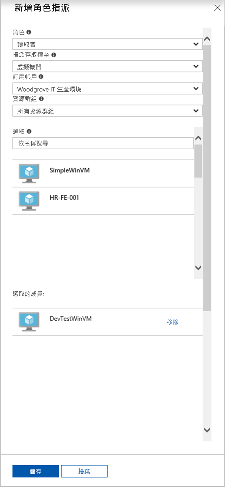

# <a name="use-a-windows-vm-system-assigned-managed-identity-to-access-resource-manager"></a>使用 Windows VM 系統指派的受控識別來存取 Resource Manager

[!INCLUDE [preview-notice](../../../includes/active-directory-msi-preview-notice.md)]

本快速入門說明如何使用已啟用系統所指派受控識別的 Windows 虛擬機器，以存取 Azure Resource Manager API。 適用於 Azure 資源的受控識別會自動由 Azure 管理，可讓您向支援 Azure AD 驗證的服務進行驗證，而不需要將認證插入程式碼中。 您會了解如何：

> [!div class="checklist"] 
> * 在 Azure Resource Manager 中將您的 VM 存取權授與資源群組 
> * 使用 VM 身分識別取得存取權杖，並使用它來呼叫 Azure Resource Manager

## <a name="prerequisites"></a>必要條件

[!INCLUDE [msi-tut-prereqs](../../../includes/active-directory-msi-tut-prereqs.md)]

## <a name="grant-your-vm-access-to-a-resource-group-in-resource-manager"></a>在 Resource Manager 中將您的 VM 存取權授與資源群組
您的程式碼可以使用適用於 Azure 資源的受控識別來取得存取權杖，以向支援 Azure AD 驗證的資源進行驗證。  Azure Resource Manager 支援 Azure AD 驗證。  首先，我們需要在 Resource Manager 中，將資源 (此情況下就是包含 VM 的資源群組) 的存取權利，授予這個 VM 系統指派的受控識別。  

1.  瀏覽至**資源群組**的索引標籤。 
2.  選取您為 **Windows VM**所建立的特定 [資源群組]。 
3.  前往左側面板的 [存取控制 (IAM)]。 
4.  然後 [新增] **Windows VM**的新角色指派。  選擇 [角色] 為 [讀取者]。 
5.  在下一個下拉式清單中，將**存取權指派給**資源 [虛擬機器]。 
6.  接下來，確認適當的訂用帳戶已列在 [訂用帳戶]下拉式清單中。 針對 [資源群組]，請選取 [所有資源群組]。 
7.  最後，在 [選取] 中選擇下拉式清單中您的 Windows VM，然後按一下 [儲存]。

    

## <a name="get-an-access-token-using-the-vms-system-assigned-managed-identity-and-use-it-to-call-azure-resource-manager"></a>使用 VM 系統指派的受控識別來取得存取權杖，以用來呼叫 Azure Resource Manager 

在這裡您必須使用 **PowerShell**。  如果您尚未安裝 **PowerShell**，請在[這裡](https://docs.microsoft.com/powershell/azure/overview?view=azurermps-4.3.1)下載。 

1.  在入口網站中，瀏覽至 [虛擬機器] 並移至您的 Windows 虛擬機器，在 [概觀] 中按一下 [連線]。 
2.  輸入您建立 Windows VM 時新增的**使用者名稱**和**密碼**。 
3.  現在您已經建立虛擬機器的**遠端桌面連線**，請在遠端工作階段中開啟 **PowerShell**。 
4.  使用 Powershell 的 Invoke-WebRequest，向 Azure 資源端點的本機受控識別提出要求，以取得 Azure Resource Manager 的存取權杖。

    ```powershell
       $response = Invoke-WebRequest -Uri 'http://169.254.169.254/metadata/identity/oauth2/token?api-version=2018-02-01&resource=https%3A%2F%2Fmanagement.azure.com%2F' -Method GET -Headers @{Metadata="true"}
    ```
    
    > [!NOTE]
    > 「資源」參數的值必須完全符合 Azure AD 的預期。 當使用 Azure Resource Manager 資源 ID 時，必須在 URI 中包含結尾的斜線。
    
    接下來，擷取完整的回應，它會儲存為 $response 物件中的 JavaScript 物件標記法 (JSON) 格式字串。 
    
    ```powershell
    $content = $response.Content | ConvertFrom-Json
    ```
    再來，從回應中擷取存取權杖。
    
    ```powershell
    $ArmToken = $content.access_token
    ```
    
    最後，使用存取權杖呼叫 Azure Resource Manager。 在此範例中，我們也將使用 PowerShell 的 Invoke-WebRequest 進行呼叫 Azure Resource Manager，並將存取權杖包含在授權標頭中。
    
    ```powershell
    (Invoke-WebRequest -Uri https://management.azure.com/subscriptions/<SUBSCRIPTION ID>/resourceGroups/<RESOURCE GROUP>?api-version=2016-06-01 -Method GET -ContentType "application/json" -Headers @{ Authorization ="Bearer $ArmToken"}).content
    ```
    > [!NOTE] 
    > URL 區分大小寫，因此請確定您使用的是稍早在命名資源群組時，您所使用的相同大小寫，而且 "resourceGroups" 中的 "G" 為大寫。
        
    下列命令會傳回資源群組的詳細資料：

    ```powershell
    {"id":"/subscriptions/98f51385-2edc-4b79-bed9-7718de4cb861/resourceGroups/DevTest","name":"DevTest","location":"westus","properties":{"provisioningState":"Succeeded"}}
    ```

## <a name="next-steps"></a>後續步驟

在本快速入門中，您已了解如何使用系統指派的受控識別，來存取 Azure Resource Manager API。  若要深入了解 Azure Resource Manager，請參閱：

> [!div class="nextstepaction"]
>[Azure Resource Manager](/azure/azure-resource-manager/resource-group-overview)

