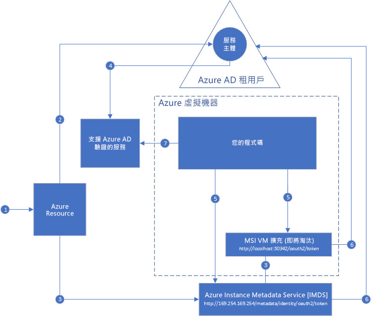

#  什麼是適用於 Azure 資源的受控服務識別？

[!INCLUDE[preview-notice](../../../includes/active-directory-msi-preview-notice.md)]

建置雲端應用程式常見的難題是如何管理程式碼中必須存在的認證，以向雲端服務進行驗證。 保護好這些認證是相當重要的工作。 在理想情況下，這些認證永不會出現在開發人員工作站或簽入原始程式碼控制。 Azure Key Vault 可安全地儲存認證和其他金鑰及密碼，但是您的程式碼必須向 Key Vault 進行驗證，才可取得這些項目。 受控服務識別可以輕易地解決此問題，因為 MSI 可在 Azure Active Directory (Azure AD) 中將自動受控身分識別提供給 Azure 服務。 您可以使用此身分識別來完成任何支援 Azure AD 驗證的服務驗證 (包括 Key Vault)，不需要任何您程式碼中的認證。

「受控服務身分識別」隨附於 Azure Active Directory Free，這是 Azure 訂用帳戶的預設功能。 無須針對「受控服務身分識別」支付其他費用。

## 運作方式

有兩種受控服務識別：「系統指派」和「使用者指派」。

- **系統指派的身分識別**會直接在 Azure 服務執行個體上啟用。 啟用時，Azure 會在服務執行個體的訂用帳戶所信任的 Azure AD 租用戶中，建立服務執行個體的身分識別。 建立身分識別後就會將其認證佈建到服務執行個體。 系統指派的身分識別生命週期會直接繫結至已啟用該 MSI 的 Azure 服務執行個體。 如果服務執行個體已刪除，則 Azure 會自動清除 Azure AD 中的認證和身分識別。
- [使用者指派的身分識別] 會建立為獨立的 Azure 資源。 透過建立程序，Azure 會在所使用訂用帳戶信任的 Azure AD 租用戶中建立身分識別。 建立身分識別之後，即可將它指派給一個或多個 Azure 服務執行個體。 使用者指派的身分識別生命週期，會與其所指派前往的 Azure 服務執行個體生命週期分開管理。

因此，程式碼可以使用系統指派的或使用者指派的身分識別，向支援 Azure AD 驗證的服務要求存取權杖。 在此期間，Azure 會負責更新服務執行個體所使用的認證。

以下範例顯示系統指派的身分識別如何與 Azure 虛擬機器一起運作：

1. Azure Resource Manager 收到一個要求，要在 VM 上啟用系統指派的身分識別。
2. Azure Resource Manager 在 Azure AD 中建立服務主體，代表 VM 的身分識別。 服務主體會建立在此訂用帳戶信任的 Azure AD 租用戶中。
3. Azure Resource Manager 會在 VM 上設定身分識別：
    - 使用服務主體用戶端識別碼和憑證來更新 Azure Instance Metadata Service 身分識別端點。
    - 佈建 VM 擴充功能，並新增服務主體用戶端識別碼和憑證。 (即將淘汰)
4. 現在 VM 已具有身分識別，所以我們會使用其服務主體資訊對 VM 授與 Azure 資源的存取權。 例如，您的程式碼需要呼叫 Azure Resource Manager，您會使用 Azure AD 中的角色型存取控制 (RBAC)，指派適當角色給 VM 的服務主體。 如果您的程式碼需要呼叫 Key Vault，您會將存取權授與程式碼，以取得 Key Vault 中特定的密碼或金鑰。
5. 您在 VM 上執行的程式碼可以向僅可從 VM 內存取的兩個端點要求權杖：

    - Azure Instance Metadata Service (IMDS) 身分識別端點：http://169.254.169.254/metadata/identity/oauth2/token (建議選項)
        - Resource 參數會指定將權杖傳送至哪個服務。 例如，如果您希望程式碼向 Azure Resource Manager 進行驗證，您會使用 resource=https://management.azure.com/。
        - API 版本參數會使用 api-version=2018-02-01 或更高版本來指定 IMDS 版本。
    - VM 擴充功能端點：http://localhost:50342/oauth2/token (即將淘汰)
        - Resource 參數會指定將權杖傳送至哪個服務。 例如，如果您希望程式碼向 Azure Resource Manager 進行驗證，您會使用 resource=https://management.azure.com/。

6. 使用步驟 3 所設定的用戶端識別碼和憑證呼叫 Azure AD，以要求步驟 #5 所指定的存取權杖。 Azure AD 會傳回 JSON Web 權杖 (JWT) 存取權杖。
7. 您的程式碼會在呼叫上傳送存取權杖給支援 Azure AD 驗證的服務。

使用相同的圖表，以下範例顯示使用者指派的受控識別如何與 Azure 虛擬機器一起運作。

1. Azure Resource Manager 收到一個要求，要建立使用者指派的身分識別。
2. Azure Resource Manager 會在 Azure AD 中建立服務主體，以代表使用者指派的身分識別。 服務主體會建立在此訂用帳戶信任的 Azure AD 租用戶中。
3. Azure Resource Manager 收到一個要求，要在 VM 上設定使用者指派的身分識別：
    - 使用使用者指派的身分識別服務主體用戶端識別碼和憑證，來更新 Azure Instance Metadata Service 身分識別端點。
    - 佈建 VM 擴充功能，並新增使用者指派的身分識別服務主體用戶端識別碼和憑證 (即將淘汰)。
4. 現在已建立使用者指派的身分識別，所以我們會使用其服務主體資訊對其授與 Azure 資源的存取權。 例如，您的程式碼需要呼叫 Azure Resource Manager，您會使用 Azure AD 中的角色型存取控制 (RBAC)，指派適當角色給使用者指派的身分識別服務主體。 如果您的程式碼需要呼叫 Key Vault，您會將存取權授與程式碼，以取得 Key Vault 中特定的密碼或金鑰。 請注意：您也可以在步驟 #3 之前執行此步驟。
5. 您在 VM 上執行的程式碼可以向僅可從 VM 內存取的兩個端點要求權杖：

    - Azure Instance Metadata Service (IMDS) 身分識別端點：http://169.254.169.254/metadata/identity/oauth2/token (建議選項)
        - Resource 參數會指定將權杖傳送至哪個服務。 例如，如果您希望程式碼向 Azure Resource Manager 進行驗證，您會使用 resource=https://management.azure.com/。
        - 用戶端識別碼參數會指定為其要求權杖的身分識別。 當單一 VM 上有多個使用者指派的身分識別時，就必須加以釐清。
        - API 版本參數會使用 api-version=2018-02-01 或更高版本來指定 IMDS 版本。

    - VM 擴充功能端點：http://localhost:50342/oauth2/token (即將淘汰)
        - Resource 參數會指定將權杖傳送至哪個服務。 例如，如果您希望程式碼向 Azure Resource Manager 進行驗證，您會使用 resource=https://management.azure.com/。
        - 用戶端識別碼參數會指定為其要求權杖的身分識別。 當單一 VM 上有多個使用者指派的身分識別時，就必須加以釐清。
6. 使用步驟 3 所設定的用戶端識別碼和憑證呼叫 Azure AD，以要求步驟 #5 所指定的存取權杖。 Azure AD 會傳回 JSON Web 權杖 (JWT) 存取權杖。
7. 您的程式碼會在呼叫上傳送存取權杖給支援 Azure AD 驗證的服務。
     
## 試用受控服務身分識別

試用「受控服務身分識別」教學課程，以了解用來存取不同的 Azure 資源的端對端案例：
  
| 從已啟用受控身分識別的資源 | 了解如何 |
| ------- | -------- |
| Azure VM (Windows) | [使用 Windows VM 受控服務識別來存取 Azure Data Lake Store](tutorial-windows-vm-access-datalake.md) |
|                    | [使用 Windows VM 受控服務身分識別存取 Azure Resource Manager](tutorial-windows-vm-access-arm.md) |
|                    | [使用 Windows VM 受控服務身分識別存取 Azure SQL](tutorial-windows-vm-access-sql.md) |
|                    | [透過存取金鑰與 Windows VM 受控服務身分識別存取 Azure 儲存體](tutorial-windows-vm-access-storage.md) |
|                    | [透過 SAS 與 Windows VM 受控服務身分識別存取 Azure 儲存體](tutorial-windows-vm-access-storage-sas.md) |
|                    | [使用 Windows VM 受控服務身分識別和 Azure Key Vault 存取非 Azure AD 資源](tutorial-windows-vm-access-nonaad.md) |
| Azure VM (Linux)   | [使用 Linux VM 受控服務識別來存取 Azure Data Lake Store](tutorial-linux-vm-access-datalake.md) |
|                    | [使用 Linux VM 受控服務身分識別存取 Azure Resource Manager](tutorial-linux-vm-access-arm.md) |
|                    | [透過存取金鑰與 Linux VM 受控服務身分識別存取 Azure 儲存體](tutorial-linux-vm-access-storage.md) |
|                    | [透過 SAS 與 Linux VM 受控服務身分識別存取 Azure 儲存體](tutorial-linux-vm-access-storage-sas.md) |
|                    | [使用 Linux VM 受控服務身分識別和 Azure Key Vault 存取非 Azure AD 資源](tutorial-linux-vm-access-nonaad.md) |
| Azure App Service  | [使用受控服務身分識別與 Azure App Service 或 Azure Functions](/azure/app-service/app-service-managed-service-identity) |
| Azure Functions    | [使用受控服務身分識別與 Azure App Service 或 Azure Functions](/azure/app-service/app-service-managed-service-identity) |
| Azure 服務匯流排  | [搭配使用受控服務身分識別與 Azure 服務匯流排](../../service-bus-messaging/service-bus-managed-service-identity.md) |
| Azure 事件中心   | [搭配使用受控服務身分識別與 Azure 事件中樞](../../event-hubs/event-hubs-managed-service-identity.md) |
| Azure API 管理 | [搭配使用受控服務識別與 Azure API 管理](../../api-management/api-management-howto-use-managed-service-identity.md) |

## 哪些 Azure 服務支援受控服務身分識別？

受控身分識別可用來向支援 Azure AD 驗證的服務進行驗證。 如需支援受控服務識別的 Azure 服務清單，請參閱下列文章：
- [支援受控服務識別的服務](services-support-msi.md)

## 後續步驟

使用下列快速入門，開始使用 Azure 受控服務識別：

* [使用 Windows VM 受控服務身分識別 來存取 Azure Resource Manager - Windows VM](tutorial-windows-vm-access-arm.md)
* [使用 Linux VM 受控服務身分識別來存取 Azure Resource Manager - Linux VM](tutorial-linux-vm-access-arm.md)
