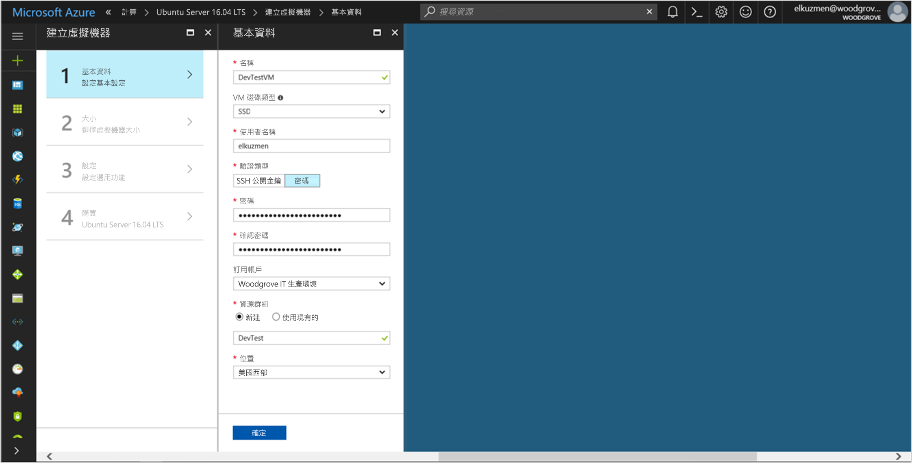
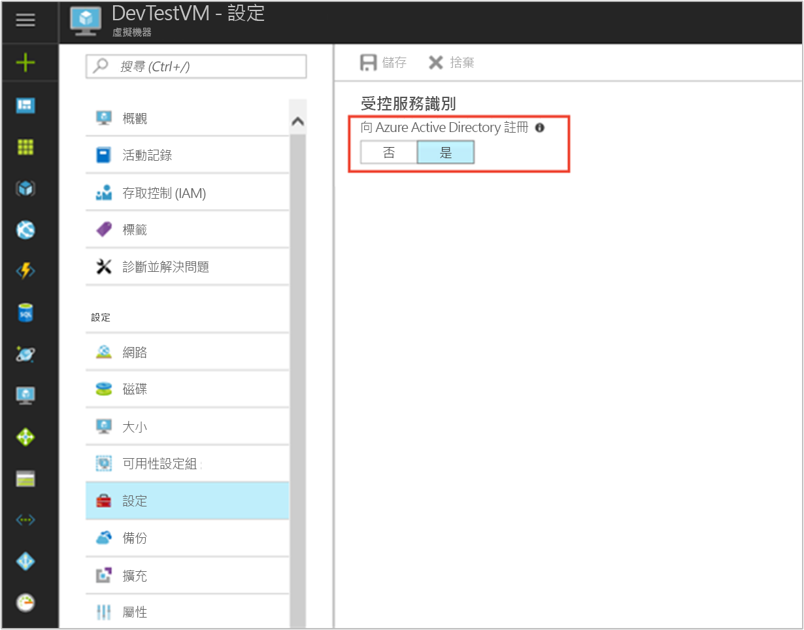

# <a name="tutorial-use-managed-service-identity-for-a-linux-vm-to-access-azure-data-lake-store"></a>教學課程：使用 Linux VM 的受控服務識別來存取 Azure Data Lake Store

[!INCLUDE[preview-notice](../../../includes/active-directory-msi-preview-notice.md)]

本教學課程示範如何使用 Linux 虛擬機器 (VM) 的受控服務身分識別來存取 Azure Data Lake Store。 Azure 會自動管理您透過 MSI 所建立的身分識別。 您可以使用 MSI 向支援 Azure Active Directory (Azure AD) 驗證的服務進行驗證，而不需要將認證插入您的程式碼中。 

在本教學課程中，您了解如何：

> [!div class="checklist"]
> * 在 Linux VM 上啟用 MSI。 
> * 將您的 VM 存取權授與 Azure Data Lake Store。
> * 使用 VM 身分識別取得存取權杖，並使用它來存取 Azure Data Lake Store。

## <a name="prerequisites"></a>先決條件

[!INCLUDE [msi-qs-configure-prereqs](../../../includes/active-directory-msi-qs-configure-prereqs.md)]

[!INCLUDE [msi-tut-prereqs](../../../includes/active-directory-msi-tut-prereqs.md)]

## <a name="sign-in-to-azure"></a>登入 Azure

登入 [Azure 入口網站](https://portal.azure.com)。

## <a name="create-a-linux-virtual-machine-in-a-new-resource-group"></a>在新的資源群組中建立 Linux 虛擬機器

此教學課程中，我們會建立新的 Linux VM。 您也可以在現有的 VM 中啟用 MSI。

1. 選取 Azure 入口網站左上角的 [新增] 按鈕。
2. 選取 [計算]，然後選取 [Ubuntu Server 16.04 LTS]。
3. 輸入虛擬機器資訊。 針對 [驗證類型] 選取 [SSH 公開金鑰] 或 [密碼]。 建立的認證可讓您登入 VM。

   

4. 在 [訂用帳戶] 清單中，選取虛擬機器的訂用帳戶。
5. 若要選取需要在其中建立虛擬機器的新資源群組，請選擇 [資源群組] > [新建]。 完成時，請選取 [確定]。
6. 選取 VM 的大小。 若要查看更多大小，請選取 [檢視全部] 或變更 [支援的磁碟類型] 篩選條件。 在 [設定] 窗格中，保留預設值並選取 [確定]。

## <a name="enable-msi-on-your-vm"></a>在您的 VM 上啟用 MSI

VM MSI 可讓您從 Azure AD 取得存取權杖，而不需要將憑證放入您的程式碼。 在 VM 上啟用受控服務識別可執行兩項工作：在 Azure Active Directory 註冊您的 VM 以建立其受控身分識別，它就會在 VM 上設定身分識別。

1. 在 [虛擬機器] 中，選取您需要在其中啟用 MSI 的虛擬機器。
2. 在左窗格中，選取 [設定]。
3. 您會看到**受控服務識別**。 若要註冊並啟用 MSI，請選取 [是]。 如果您需要將它停用，請選取 [否]。
   
4. 選取 [ **儲存**]。

## <a name="grant-your-vm-access-to-azure-data-lake-store"></a>將您的 VM 存取權授與 Azure Data Lake Store

現在您可以將您的 VM 存取權授與 Azure Data Lake Store 中的檔案和資料夾。 在這個步驟，您可以使用現有的 Data Lake Store 執行個體或建立新的執行個體。 若要使用 Azure 入口網站建立 Data Lake Store 執行個體，請遵循 [Azure Data Lake Store 快速入門](https://docs.microsoft.com/azure/data-lake-store/data-lake-store-get-started-portal)。 在 [Azure Data Lake Store 文件](https://docs.microsoft.com/azure/data-lake-store/data-lake-store-overview)中，也有使用 Azure CLI 和 Azure PowerShell 的快速入門做法。

在 Data Lake Store 中建立新資料夾，並將該資料夾中的讀取、寫入和執行檔案權限授與 MSI：

1. 在 Azure 入口網站中，選取左側窗格的 [Data Lake Store]。
2. 選取您需要使用的 Data Lake Store 執行個體。
3. 選取命令列上的 [資料總管]。
4. 隨即選取 Data Lake Store 執行個體的根資料夾。 在命令列上選取 [存取]。
5. 選取 [新增] 。  在 [選取] 方塊中，輸入 VM 的名稱，例如 **DevTestVM**。 從搜尋結果中選取您的 VM，然後按一下 [選取]。
6. 按一下 [選取權限]。  選取 [讀取] 和 [執行]，加入到 [此資料夾]，然後新增為 [僅存取權限]。 選取 [確定]。  權限應該已成功加入。
7. 關閉 [存取] 窗格。
8. 針對此教學課程，建立一個新資料夾。 選取命令列中的 [新資料夾]，為新資料夾命名，例如 **TestFolder**。  選取 [確定]。
9. 選取您所建立的資料夾，然後選取命令列中的 [存取]。
10. 如同步驟 5，選取 [新增]。 在 [選取] 方塊中，輸入 VM 的名稱。 從搜尋結果中選取您的 VM，然後按一下 [選取]。
11. 如同步驟 6，選取 [選取權限]。 選取 [讀取]、[寫入] 和 [執行]，新增到 [此資料夾]，並新增為 [存取權限項目及預設權限項目]。 選取 [確定]。  權限應該已成功加入。

MSI 現在可以對您所建立之資料夾中的檔案執行所有作業。 如需管理 Data Lake Store 存取權的詳細資訊，請參閱 [Data Lake Store 中的存取控制](https://docs.microsoft.com/azure/data-lake-store/data-lake-store-access-control)一文。

## <a name="get-an-access-token-and-call-the-data-lake-store-file-system"></a>取得存取權杖，並呼叫 Data Lake Store 檔案系統

Azure Data Lake Store 原生支援 Azure AD 驗證，因此可以直接接受透過 MSI 取得的存取權杖。 為了向 Data Lake Store 檔案系統進行驗證，您要將 Azure AD 所簽發的存取權杖傳送至 Data Lake Store 檔案系統端點。 存取權杖位於授權標頭，格式為 "Bearer \<ACCESS_TOKEN_VALUE\>"。  若要深入了解 Data Lake Store 的 Azure AD 驗證支援，請參閱[使用 Azure Active Directory 向 Data Lake Store 進行驗證](https://docs.microsoft.com/azure/data-lake-store/data-lakes-store-authentication-using-azure-active-directory)。

在本教學課程中，您使用 cURL 向 Data Lake Store 檔案系統驗證 REST API，以提出 REST 要求。

> [!NOTE]
> Data Lake Store 檔案系統的用戶端 SDK 尚不支援受控服務識別。

若要完成這些步驟，您需要 SSH 用戶端。 如果您使用 Windows，您可以在[適用於 Linux 的 Windows 子系統](https://msdn.microsoft.com/commandline/wsl/about)中使用 SSH 用戶端。 如果您需要設定 SSH 用戶端金鑰的協助，請參閱[如何在 Azure 上搭配 Windows 使用 SSH 金鑰](../../virtual-machines/linux/ssh-from-windows.md)，或[如何在 Azure 中建立和使用 Linux VM 的 SSH 公開和私密金鑰組](../../virtual-machines/linux/mac-create-ssh-keys.md)。

1. 在入口網站中，瀏覽至您的 Linux VM。 在 [概觀] 中，選取 [連線]。  
2. 使用您所選擇的 SSH 用戶端來連線到 VM。 
3. 在終端機視窗中使用 cURL 向本機 MSI 端點提出要求，來取得 Data Lake Store 檔案系統的存取權杖。 Data Lake Store 的資源識別碼是 "https://datalake.azure.net/"。  請務必包含資源識別項中的結尾斜線。
    
   ```bash
   curl 'http://169.254.169.254/metadata/identity/oauth2/token?api-version=2018-02-01&resource=https%3A%2F%2Fdatalake.azure.net%2F' -H Metadata:true   
   ```
    
   成功的回應會傳回您向 Data Lake Store 驗證時所使用的存取權杖：

   ```bash
   {"access_token":"eyJ0eXAiOiJ...",
    "refresh_token":"",
    "expires_in":"3599",
    "expires_on":"1508119757",
    "not_before":"1508115857",
    "resource":"https://datalake.azure.net/",
    "token_type":"Bearer"}
   ```

4. 使用 cURL 對您 Data Lake Store 檔案系統的 REST 端點提出要求，以列出根資料夾中的資料夾。 這是檢查所有項目皆正確設定的簡單方式。 複製上一個步驟中的存取權杖值。 授權標頭中的字串 "Bearer" 必須是大寫 "B"。 您可以在 Azure 入口網站 [Data Lake Store] 窗格的 [概觀] 區段中，找到您 Data Lake Store 執行個體的名稱。

   ```bash
   curl https://<YOUR_ADLS_NAME>.azuredatalakestore.net/webhdfs/v1/?op=LISTSTATUS -H "Authorization: Bearer <ACCESS_TOKEN>"
   ```
    
   成功的回應看起來會像這樣：

   ```bash
   {"FileStatuses":{"FileStatus":[{"length":0,"pathSuffix":"TestFolder","type":"DIRECTORY","blockSize":0,"accessTime":1507934941392,"modificationTime":1508105430590,"replication":0,"permission":"770","owner":"bd0e76d8-ad45-4fe1-8941-04a7bf27f071","group":"bd0e76d8-ad45-4fe1-8941-04a7bf27f071"}]}}
   ```

5. 現在您可以嘗試將檔案上傳至您的 Data Lake Store 執行個體。 首先，建立要上傳的檔案。

   ```bash
   echo "Test file." > Test1.txt
   ```

6. 使用 cURL 對您的 Data Lake Store 檔案系統 REST 端點提出要求，以將檔案上傳到您先前建立的資料夾。 上傳需要重新導向，cURL 會自動遵循重新導向。 

   ```bash
   curl -i -X PUT -L -T Test1.txt -H "Authorization: Bearer <ACCESS_TOKEN>" 'https://<YOUR_ADLS_NAME>.azuredatalakestore.net/webhdfs/v1/<FOLDER_NAME>/Test1.txt?op=CREATE' 
   ```

    成功的回應看起來會像這樣：

   ```bash
   HTTP/1.1 100 Continue
   HTTP/1.1 307 Temporary Redirect
   Cache-Control: no-cache, no-cache, no-store, max-age=0
   Pragma: no-cache
   Expires: -1
   Location: https://mytestadls.azuredatalakestore.net/webhdfs/v1/TestFolder/Test1.txt?op=CREATE&write=true
   x-ms-request-id: 756f6b24-0cca-47ef-aa12-52c3b45b954c
   ContentLength: 0
   x-ms-webhdfs-version: 17.04.22.00
   Status: 0x0
   X-Content-Type-Options: nosniff
   Strict-Transport-Security: max-age=15724800; includeSubDomains
   Date: Sun, 15 Oct 2017 22:10:30 GMT
   Content-Length: 0
       
   HTTP/1.1 100 Continue
       
   HTTP/1.1 201 Created
   Cache-Control: no-cache, no-cache, no-store, max-age=0
   Pragma: no-cache
   Expires: -1
   Location: https://mytestadls.azuredatalakestore.net/webhdfs/v1/TestFolder/Test1.txt?op=CREATE&write=true
   x-ms-request-id: af5baa07-3c79-43af-a01a-71d63d53e6c4
   ContentLength: 0
   x-ms-webhdfs-version: 17.04.22.00
   Status: 0x0
   X-Content-Type-Options: nosniff
   Strict-Transport-Security: max-age=15724800; includeSubDomains
   Date: Sun, 15 Oct 2017 22:10:30 GMT
   Content-Length: 0
   ```

您可以使用 Data Lake Store 檔案系統的其他 API，來附加至檔案及下載檔案等。

恭喜！ 您已經使用 Linux VM 的 MSI 向 Data Lake Store 檔案系統進行驗證。

## <a name="next-steps"></a>後續步驟

在本教學課程中，您已學習如何使用 Linux 虛擬機器的受控服務識別來存取 Azure Data Lake Store。 若要深入了解 Azure Data Lake Store，請參閱：

> [!div class="nextstepaction"]
>[Azure Data Lake Store](/azure/data-lake-store/data-lake-store-overview)
